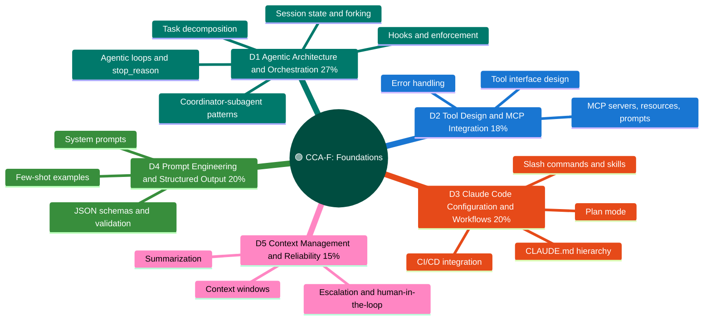

# CCA-F: Claude Certified Architect Foundations

## The whole program at a glance

## Domain chapters

| Chapter | Weight | Covers |
|---|---|---|
| [D1 Agentic Architecture & Orchestration](domains/d1-agentic-architecture.md) | 27% | Agentic loop & stop_reason, coordinator–subagent, Task tool & context passing, hooks, decomposition, sessions/forking |
| [D2 Tool Design & MCP Integration](domains/d2-tool-design-mcp.md) | 18% | Tool descriptions, structured errors (isError), tool_choice & distribution, .mcp.json scoping, built-in tools |
| [D3 Claude Code Config & Workflows](domains/d3-claude-code.md) | 20% | CLAUDE.md hierarchy, commands & skills, path rules, plan mode, refinement, CI/CD (-p, --output-format json) |
| [D4 Prompt Engineering & Structured Output](domains/d4-prompting-structured-output.md) | 20% | Explicit criteria, few-shot, tool_use + JSON schemas, validation-retry, Batches API, multi-pass review |
| [D5 Context Management & Reliability](domains/d5-context-reliability.md) | 15% | Long-context hygiene, escalation, error propagation, codebase exploration, confidence calibration, provenance |

## Scenario bank

Each sitting draws **4 of 6**, and every file has diagrams + sample questions:

1. Customer Support Resolution Agent ([link](scenarios/s1-customer-support-agent.md))
2. Code Generation with Claude Code ([link](scenarios/s2-code-generation.md))
3. Multi-Agent Research System ([link](scenarios/s3-multi-agent-research.md))
4. Developer Productivity with Claude ([link](scenarios/s4-developer-productivity.md))
5. Claude Code for CI/CD ([link](scenarios/s5-ci-cd.md))
6. Structured Data Extraction ([link](scenarios/s6-structured-data-extraction.md))

See which scenarios test which domains ([here](scenarios/README.md)).

## Official docs coverage

[**official-docs-coverage-map.md**](official-docs-coverage-map.md) maps the exam-relevant pages of [code.claude.com/docs](https://code.claude.com/docs) onto these domain chapters — what's distilled, what's a remaining gap, and what's deliberately out of scope for CCA-F.
