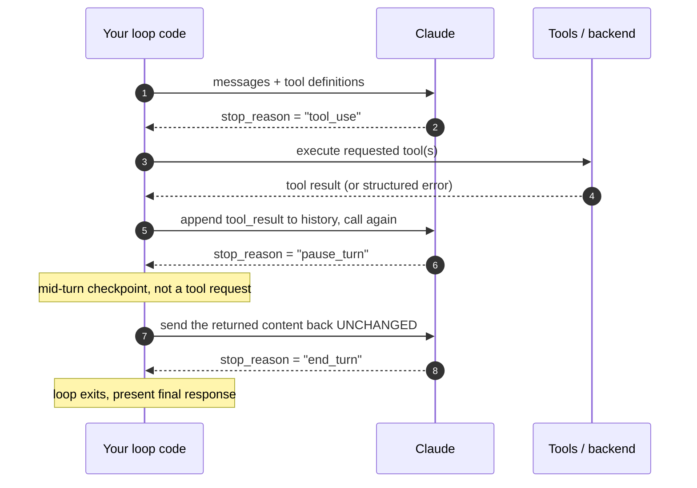
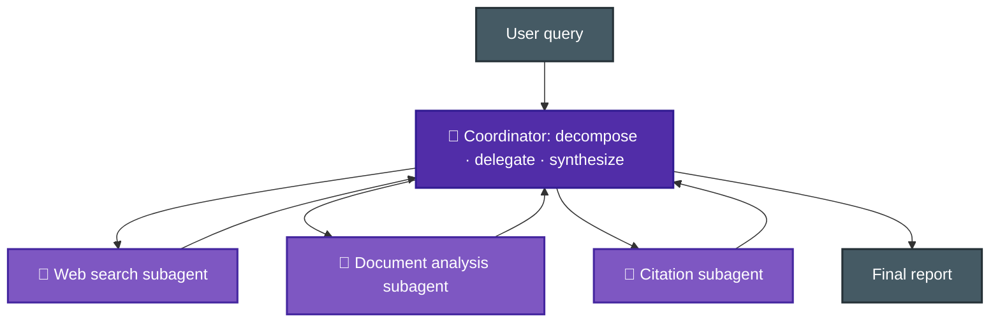
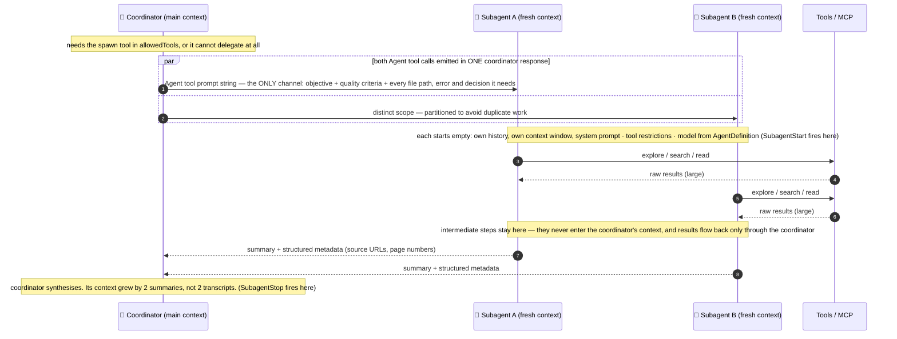
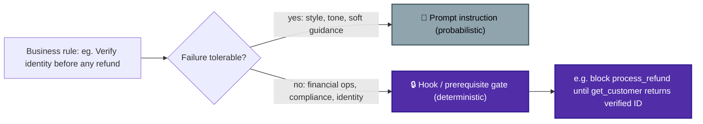
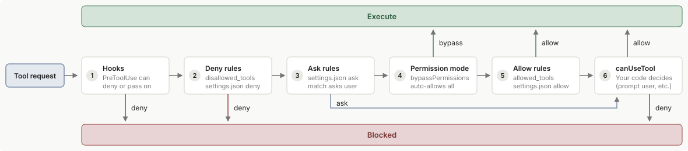
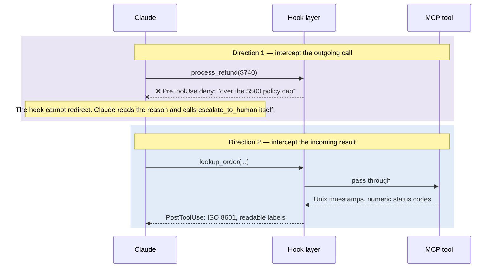
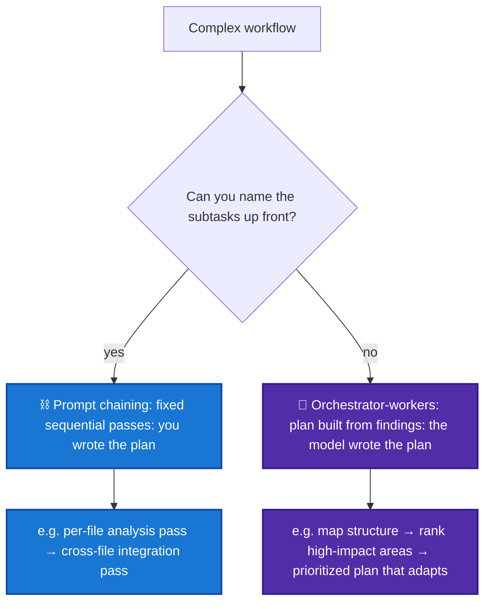
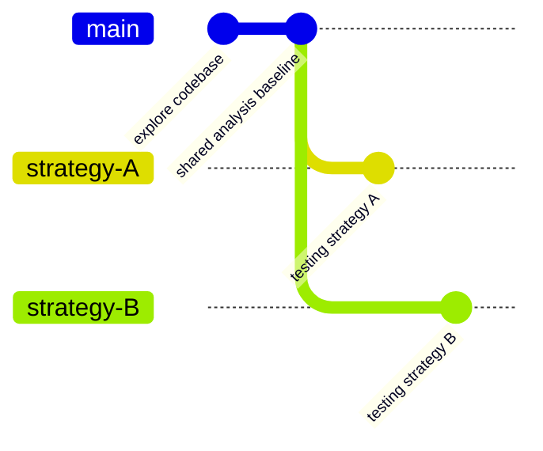
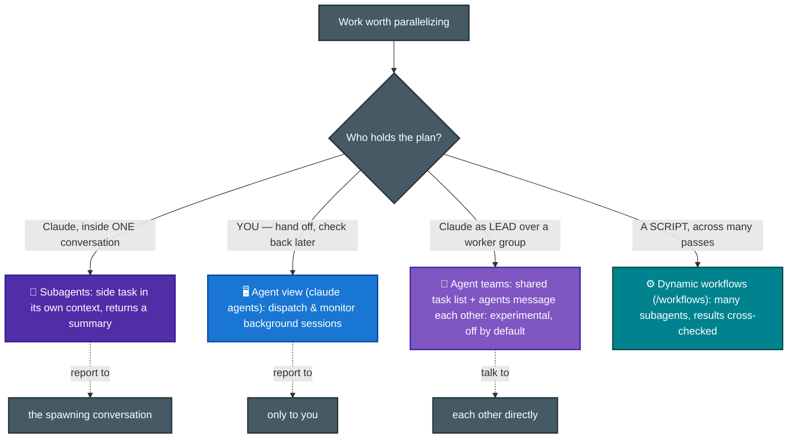

# F-D1 · Agentic Architecture & Orchestration (27%)

The heaviest CCA-F domain (~16 of 60 items): how an agent actually runs (the loop), how multiple agents coordinate, and how you make workflows deterministic when business rules demand it.

**Tested by scenarios:** [① Customer Support](../scenarios/s1-customer-support-agent.md) · [③ Multi-Agent Research](../scenarios/s3-multi-agent-research.md) · [④ Developer Productivity](../scenarios/s4-developer-productivity.md)
**Source:** official [CCA-F Exam Guide](../../official-exam-guides/cca-f-exam-guide.pdf), task statements 1.1–1.7.

---

## 1. The agentic loop
([Doc Ref.](https://code.claude.com/docs/en/agent-sdk/agent-loop))
An agentic loop is a repeating cycle: the AI thinks, calls a tool, checks the result, and decides the next step — over and over until it decides the task is done, instead of following a rigid pre-written sequence of steps.

At the end of one turn, the AI model provides an exit signal: **`stop_reason`**. It tells your code what to do next — run a tool and loop again, or stop and show the final answer.




**Know cold:**
- Continue while `stop_reason == "tool_use"`; terminate when `stop_reason == "end_turn"`.
- Tool results are **appended to conversation history** so the model can reason about the next action with the new information.
- Model-driven decisions (Claude picks the next tool from context) ≠ pre-configured tool sequences.
- **`stop_reason == "pause_turn"`** shows up on long-running agentic turns (e.g. extended server-side tool use). It is **not** a request for a tool result, it's Claude checkpointing mid-turn (to avoid long waiting, timeouts, etc). **Send the returned content back unchanged** as the next request (no tool_result appended, nothing edited) so Claude can resume exactly where it left off. Treating it like `end_turn` (stopping) or like `tool_use` (expecting you to execute something) are both exam traps.
- `Hooks` are callbacks that fire at specific points in the loop: before a tool runs, after it returns, when the agent finishes, and so on. Some commonly used hooks are:
  - `PreToolUse` — before a tool runs
  - `PostToolUse` — after a tool returns
  - `UserPromptSubmit` — when the user submits a prompt
  - `Stop` — when the agent finishes its turn
  - `SubagentStart` / `SubagentStop` — when a subagent starts / finishes
  - `PreCompact` — before context gets compacted

**Anti-patterns the exam punishes:** 
- parsing natural-language text to decide loop termination
- arbitrary iteration caps as the *primary* stop mechanism
- treating the presence of assistant text as "done".

> Note:
> - **You don't generally hand-write this loop.** The sequence above is the **manual loop** (Messages API, full control). The SDK's **[Tool Runner](https://platform.claude.com/docs/en/agents-and-tools/tool-use/tool-runner)** (`client.beta.messages.tool_runner`, beta) automates it — runs the `stop_reason` loop, executes your tools when Claude calls them, manages conversation state, adds type-safe validation — so you write tool functions, not boilerplate code. 
> - Drop to the manual loop when you need human-in-the-loop approval, custom logging, or conditional execution *inside* the loop.

**Keeping a session working *across* turns.**
The `stop_reason` loop above governs a single turn, not the session. To keep a session going across multiple turns, there are three options: **`/goal`**, **`/loop`**, and a custom **Stop hook** ([Doc Ref.](https://code.claude.com/docs/en/goal#compare-ways-to-keep-a-session-running))

| | `/goal` | `/loop` | Stop hook |
|---|---|---|---|
| **Key idea**| Keep looping until the given goal is fully accomplished | trigger task at a specific moment | Decide based on the given condition/script in hook |
| **Next turn starts when** | The previous turn finishes | A time interval elapses (user provides interval, or Claude decides from context) | The previous turn finishes |
| **Stops when** | A model confirms your condition is met | You stop it, or Claude decides the work is done | Your own script or prompt decides |
| **Example** | `/goal all tests in test/auth pass and lint is clean` | `/loop 5m check the deploy` | A script that blocks the turn from stopping until an external queue is empty |

> - Pick based on what should start the next turn.
> - Auto mode on its own approves tool calls within a single turn but doesn’t start a new one.

## 2. Coordinator–subagent orchestration (hub-and-spoke)



**Know cold:**
- **All inter-subagent communication routes through the coordinator**: observability, consistent error handling, controlled information flow. Subagents never talk to each other directly. In the **Managed Agents API** the coordinator can only delegate one level deep — referencing an agent that has its own `multiagent.agents` roster fails the create/update request with a validation error, and the roster caps at 20 unique agents (the coordinator may call multiple copies of each). ([Official Doc Ref.](https://platform.claude.com/docs/en/managed-agents/multiagent-orchestration)) That one-level rule is specific to this surface — see Sec. 3 for how the Agent SDK differs.
- Subagents run with **isolated context**: they do *not* inherit the coordinator's conversation history. Each runs in its own context-isolated thread with its own conversation history.
- The coordinator should **dynamically select** which subagents to invoke based on query complexity, not always run the full pipeline — e.g., 1 subagent for simple fact-finding, 10+ for complex research. ([Official Doc Ref.](https://www.anthropic.com/engineering/multi-agent-research-system))
- Partition scope across subagents (distinct subtopics / source types) to minimize duplication.
- Iterative refinement: coordinator evaluates synthesis output for gaps → re-delegates targeted queries → re-invokes synthesis until coverage is sufficient.
- **Synthesis happens inside the coordinator, not a subagent**: subagents return raw findings only, and the coordinator synthesizes them itself. A dedicated citation subagent may format sources into the final report afterward, but there is no "synthesis subagent" role.
- Risk: **vague or underspecified task descriptions** (not narrow scope) → subagents duplicate work or leave coverage gaps. Give each subagent an objective, output format, tool guidance, and clear task boundaries (classic root-cause question).

## 3. Subagent invocation, context passing, spawning
[Agent SDK based sub-agents ref.](https://code.claude.com/docs/en/agent-sdk/subagents), [Claude-code sub-agents doc-ref.](https://code.claude.com/docs/en/sub-agents), [Script based sub-agents](https://code.claude.com/docs/en/workflows)

Subagents are separate agent instances that your main agent can spawn to handle focused subtasks. They help to:
- isolate context, by keeping exploration and implementation out of your main conversation.
- run multiple analyses in parallel, and 
- apply specialized instructions without adding to the main agent’s prompt.
- Enforce constraints by limiting which tools a subagent can use.
- Control costs by routing tasks to faster, cheaper models like Haiku.

A subagent works like a git branch: it splits off from the main context with its own isolated history, does its work there, then merges back — only the result lands in main, not the intermediate steps.



**Four separate things — don't conflate them:**

| | What it is | Where it lives |
|---|---|---|
| **Definition** | *Who* the subagent is: `description`, `prompt`, `tools`, `model` | `AgentDefinition`, design time |
| **Spawn permission** | *May* the coordinator delegate at all | `allowedTools` must include the spawn tool |
| **Invocation** | *Which* subagent runs, and *when* | Runtime. Claude matches on `description`, or you name the agent in the prompt |
| **Context passing** | *What* the subagent gets to work with | Runtime. The Agent tool's **prompt string**, written by Claude at call time |

`AgentDefinition` covers only the first one. Nothing you put in it passes context — that happens per call.

**Know cold:**
- The main agent/coordinator needs permission to spawn the sub-agents: its `allowedTools` list must include the spawn tool. Without it, invocations fall through to `canUseTool`, or are denied outright in `dontAsk` mode. **Naming trap: the tool was renamed `Task` → `Agent` in Claude Code v2.1.63.** The exam guide (TS 1.3) says `"Task"`; current SDK docs say `"Agent"`. Both still appear — current releases emit `Agent` in `tool_use` blocks but keep `Task` in the `system:init` tools list and in `result.permission_denials[].tool_name`.
- **Context must be passed explicitly in the subagent's prompt**: no automatic inheritance, no shared memory between invocations. Official wording: *"The only content you pass from parent to subagent is the Agent tool's prompt string, so include any file paths, error messages, or decisions the subagent needs directly in that prompt."*
- Fresh ≠ empty. 
    - What a subagent **does** get: its own system prompt (`AgentDefinition.prompt`), the Agent tool's prompt, project `CLAUDE.md` (via `settingSources`), and tool definitions. 
    - What it **doesn't**: the parent's conversation history, the parent's tool results, the parent's system prompt, and preloaded skill content unless listed in `AgentDefinition.skills`.
- **`AgentDefinition`** within the Agent SDK configures each subagent type: `description` and `prompt` are the only required fields. `tools` (omit = inherit all available), `model` (`'haiku'`, `'sonnet'`, `'opus'`, `'inherit'`), `disallowedTools`, `skills`, `maxTurns`, `permissionMode`, `background`.
- **Delegation depth depends on the surface**, and the exam can test either: 
    - the **Managed Agents API** allows exactly one level — an agent that has its own `multiagent.agents` roster fails validation. 
    - The **Agent SDK / Claude Code** lets subagents nest, three layers deep by default, tunable with `CLAUDE_CODE_MAX_SUBAGENT_SPAWN_DEPTH` (set `1` to turn nesting off).
- **Parallel tool execution**: 
    - multiple tool calls in one turn run concurrently if read-only (`Read`, `Glob`, `Grep`, MCP tools marked read-only) but sequentially if they modify state (`Edit`, `Write`, `Bash`) to avoid conflicts. 
    - Custom tools default to sequential — set `readOnlyHint` in the tool's annotations to allow parallel execution (same field name in both the TypeScript and Python SDKs, from the MCP SDK).
- Pass structured data that separates content from metadata (source URLs, doc names, page numbers) to preserve attribution downstream.
- Coordinator prompts should specify **goals and quality criteria**, not step-by-step procedures, so subagents stay adaptable.

## 4. Enforcement & handoff patterns
([SDK hooks](https://code.claude.com/docs/en/agent-sdk/hooks) · [permission evaluation order](https://code.claude.com/docs/en/agent-sdk/permissions#how-permissions-are-evaluated) · [hooks reference](https://code.claude.com/docs/en/hooks))

Prompt instructions have a **non-zero failure rate**. When compliance must be guaranteed (identity verification before refunds), use programmatic enforcement.



### Why the gate is a hook, and not a deny rule or `canUseTool`

The SDK evaluates every tool call in a fixed order:

`hooks → deny rules → ask rules → permission mode → allow rules → canUseTool`



> Diagram from the official docs: [How permissions are evaluated](https://code.claude.com/docs/en/agent-sdk/permissions#how-permissions-are-evaluated).

Read it left to right. A call only executes if it survives every gate to its left. Both exits are terminal: `deny` at any gate blocks the call, and `bypass` or `allow` sends it straight to execution without ever reaching `canUseTool`.

That order decides which of the three candidate gates can actually hold:

| Gate | Can express "only after `get_customer` verified"? | Can it be skipped? |
|---|---|---|
| Deny rule (`disallowedTools`) | No. A static name/arg pattern with no memory of earlier calls | No, but it blocks the tool *always*, not conditionally |
| `canUseTool` callback | Yes, but it runs **last** | **Yes.** Anything that approves earlier skips it — one bare `allowedTools` entry like `"mcp__support__process_refund"` auto-approves every call to that tool |
| **`PreToolUse` hook** | Yes | No. Hooks run before every other step, and a hook `deny` holds even in `bypassPermissions` |

Two traps in that flow:
- A hook returning **`allow` is not final** — deny and ask rules are still evaluated after it. Only `deny` is absolute.
- **Auto-approved tools never reach `canUseTool`**, so a check placed there is silently bypassed for any pre-approved tool.


### Handoff to a human
([Handle approvals and user input](https://code.claude.com/docs/en/agent-sdk/user-input))

Consider a scenario from the section above. The `PreToolUse` hook blocked `process_refund` at \$740 because policy caps refunds at \$500. Claude reads the deny message and calls `escalate_to_human` instead. The case now has to leave the agent and reach a support rep. That transfer is the handoff.

Three **potential problems** come along with this handoff. Each one has its own fix.

**Problem 1 — the representative is not in the conversation.**
They never see the transcript, the tool results, or what the customer said. Whatever the escalation call carries is all they get.

**Fix 1: make the summary a required tool input schema.**

Let's say the representative needs to know the customer ID, root cause, refund amount, and recommended action. Declare all four as required fields on `escalate_to_human`, not as a line in the prompt.
- The handler receives validated arguments. A schema is checked before your code runs. A prompt asking Claude to "include the customer ID" is only hoped for, not assured.

**Problem 2 — the agent does not naturally stop.**
A tool call returns a result and the loop moves to the next turn. A person needs minutes or hours. Nothing in the normal flow waits that long.

**Fix 2: pause the agent with `canUseTool`.**

This callback is the SDK's mechanism for stopping mid-task and waiting on a person for one decision: may this tool call proceed or not ?

- **When it fires?** In contrast to Hooks that are ~23 events spread across the whole agent lifecycle, this callback is the last gate/mechanism that specifically fires **whenever Claude needs user input**, receiving the tool name and input as arguments. Two situations trigger it:
    - A tool needs approval, and nothing earlier in the permission order resolved it.
    - Claude calls `AskUserQuestion` to have the user choose between valid approaches. Explained below.
- **How long it waits.** Execution stays paused until the callback returns. This is the part that makes it a human handoff rather than a policy check.
    - The docs say it "can stay pending indefinitely". The SDK only cancels the wait if the query itself is cancelled.
    - If the rep may take longer than your process can stay alive, return the [`defer` hook decision](https://code.claude.com/docs/en/hooks#defer-a-tool-call-for-later) rather than blocking. The process exits and resumes later from the persisted session. That is the answer for an escalation sitting in a queue overnight.
- **What you return.** Two behaviors, `allow` and `deny`. Each has a plain form and a more useful one:
    - *Allow as-is* — `PermissionResultAllow(updated_input=...)` in Python, `{ behavior: "allow", updatedInput }` in TypeScript.
    - *Allow, rewritten* — return a modified `updatedInput` to sanitize or narrow what Claude asked for. Claude is not told you changed anything.
    - *Deny flat* — `PermissionResultDeny(message=...)` and `{ behavior: "deny", message }`.
    - *Deny with guidance* — Claude reads the message and can change course. The docs call this "suggest alternative". It is the same mechanism that turned the blocked refund into an escalation at the top of this section.
- **One wiring gotcha, Python only.** `can_use_tool` needs streaming mode. A finite message stream closes the input before the callback can fire. A registered hook or an in-process MCP server keeps it open.

**What `AskUserQuestion` is, and why it shares the same callback.**

Claude is not always blocked on permission. Sometimes it is blocked on a *decision* that only the user can make, where two or more approaches are equally valid. Guessing would waste the turn. So Claude calls the built-in `AskUserQuestion` tool, and that call lands in the same `canUseTool` callback with `tool_name == "AskUserQuestion"`. Your app renders the question, the user picks, and the answer goes back as the tool result.

- Claude writes the questions and the options itself. You cannot inject your own questions into this flow. If your app needs to ask the user something, do that separately in your own logic.
- The input is a `questions` array. Each entry has `question`, a `header` of at most 12 characters, 2-4 `options` with a `label` and a `description`, and `multiSelect`.
- You answer with an allow. Pass the original `questions` back in `updatedInput`, plus an `answers` object. Keys are the question text. Values are the selected `label`.
- It is available by default. If you pass a `tools` array to restrict Claude, you must include `AskUserQuestion` or Claude loses the ability to ask.
- It shows up most in plan mode, where Claude gathers requirements before proposing a plan.

**Problem 3 — the escalation can be auto-approved.**
If `escalate_to_human` sits in `allowedTools`, the call runs, the loop continues, and no person is ever asked. This is the trap from the previous section, applied to the escalation tool itself.

**Fix 3: force the prompt, then notify someone.**

A pause only helps if a person is watching.

- An MCP server can set **`_meta["anthropic/requiresUserInteraction"]: true`** on a tool in its `tools/list` entry. That tool then prompts on every call, including in `acceptEdits`, `auto`, and `bypassPermissions`. There is no "don't ask again" option, and allow rules do not skip it. `dontAsk` denies the call instead.
- Three things reach `canUseTool` even when an allow rule matches: `AskUserQuestion`, tools marked `requiresUserInteraction`, and connector tools an organization set to `ask`. Everything else hits the auto-approval trap above. In `dontAsk` all three are denied without the callback running.
- The `PermissionRequest` hook fires an external notification while Claude waits. Slack, email, or push.

**Limits worth remembering.** `AskUserQuestion` carries 1-4 questions with 2-4 options each, and it does not work in subagents spawned via the Agent tool. For richer input than multiple choice, or to file into an existing ticketing system, build a custom tool.

**Practical rule for the exam.** If the rule can be checked in code, use a hook, because it cannot be skipped. If a person has to look at it, use `canUseTool`, and accept that a bare `allowedTools` entry will bypass it.

> **Grounding note.** This section maps to Task Statement 1.4. The handoff-summary field list is close to the exam guide's own wording and appears in no product doc, so treat it as exam vocabulary. The `canUseTool`, `defer`, and `requiresUserInteraction` mechanics come from the SDK docs linked above.

## 5. Agent SDK hooks for tool call interception and data normalization
([SDK hooks guide](https://code.claude.com/docs/en/agent-sdk/hooks) · [Hooks reference](https://code.claude.com/docs/en/hooks) · [Claude Code hooks guide](https://code.claude.com/docs/en/hooks-guide))

An agent wired to real tools has two problems that no amount of prompt writing fixes.

1. **Claude sometimes calls a tool it should not have called.** The refund cap is in the system prompt. Claude still issues the \$740 refund on the run where it does not.
2. **The tool answers in a shape Claude then has to decode.** One tool returns Unix timestamps, another ISO 8601, a third a bare `status: 3`. Every call spends reasoning on formats.

Both problems happen at the same place: the boundary between the model and the tool. A hook is code that runs at that boundary, so it can act in **both directions**. Outgoing, it inspects the call before it runs. Incoming, it inspects the result before the model reads it.



The sub-sections below work through that boundary. 5.1 and 5.2 are what each event can do. 5.3 is why code at the boundary behaves differently from a line in the prompt. 5.4 to 5.6 are the three cases you actually build.

| # | Question it answers | Mechanism |
|---|---|---|
| 5.1 | What can you do to a result after a tool returns? | `PostToolUse` |
| 5.2 | What can you do to a call before it runs? | `PreToolUse` |
| 5.3 | Why is a hook different from an instruction? | where the rule lives |
| 5.4 | Tools disagree on data formats | `updatedToolOutput` |
| 5.5 | A call violates policy | `permissionDecision: "deny"` + reason |
| 5.6 | Which of the two do you reach for? | the decision rule |

### 5.1 · Intercepting the result

**The situation.** A tool runs and returns. By default that result goes straight into the conversation history, and the model reads it verbatim on the next request.

**What breaks.** Whatever shape the tool returns is now the model's problem. Raw output can be verbose, inconsistent, or encoded in a way that costs a reasoning step to decode. That step is where misreads start.

**The mechanism.** `PostToolUse` fires after a tool succeeds, in the gap between the tool returning and the model reading. The callback receives:
- `tool_name` and `tool_input` — what was called.
- `tool_response` — what came back. The schema depends on the tool.
- `tool_use_id` — correlates this event with the `PreToolUse` event for the same call.

Three ways to act on it ([PostToolUse decision control](https://code.claude.com/docs/en/hooks#posttooluse-decision-control)):

| Return | Effect |
|---|---|
| `hookSpecificOutput.updatedToolOutput` | Replaces the result before Claude sees it. Works for any tool, in both SDKs. |
| `hookSpecificOutput.additionalContext` | Appends a string next to the tool result. The original stays. |
| top-level `decision: "block"` + `reason` | Adds the reason next to the result. Claude **still sees the original output**. |

Two neighbouring events complete the pattern:
- `PostToolUseFailure` fires when the tool errored. It carries `tool_error` instead of `tool_response`, and `additionalContext` is its only shaping field. It does **not** fire for calls rejected before execution: an unknown tool name, input that fails schema validation, or a permission denial.
- `PostToolBatch` (TypeScript only) fires once after a batch of parallel calls resolves, before the next model call.

**The limit.** `PostToolUse` runs after the tool already ran, so it cannot undo anything. Files written, commands executed, and network requests sent have already taken effect. The hook changes what Claude sees, not what happened. To stop something from happening, you need 5.2.

### 5.2 · Intercepting the call

**The situation.** Policy caps refunds at \$500. The system prompt says so. Claude calls `process_refund` with \$740.

**What breaks.** The prompt was advice. Claude follows it most of the time. "Most of the time" is not a refund policy.

**The mechanism.** `PreToolUse` fires before the tool executes. It is the one event that returns its decision inside `hookSpecificOutput` rather than as a top-level `decision`, which is what gives it four outcomes plus input rewriting ([PreToolUse decision control](https://code.claude.com/docs/en/hooks#pretooluse-decision-control)):

| Field | Behaviour |
|---|---|
| `permissionDecision` | `"allow"`, `"deny"`, `"ask"`, or `"defer"`. |
| `permissionDecisionReason` | On `"deny"`, shown to Claude. On `"allow"` and `"ask"`, shown to the **user, not Claude**. On `"defer"`, ignored. |
| `updatedInput` | Rewrites the arguments before execution. Replaces the **entire** input object, so re-include the unchanged fields. |
| `additionalContext` | String placed next to the tool result. Ignored on `"defer"`. |

Why this gate holds where the others do not:
- Hooks run **first** in the permission evaluation order from Section 4. A hook `deny` blocks the tool "even in `bypassPermissions` mode or with `--dangerously-skip-permissions`". The docs' own framing is that this "lets you enforce policy that users can't bypass by changing their permission mode."
- Precedence across hooks and rules is `deny` > `defer` > `ask` > `allow`. A single `deny` blocks the call regardless of what the other hooks returned.
- The reverse does not hold. A hook `"allow"` does not skip the deny and ask rules, which are evaluated regardless. **Hooks can tighten restrictions but not loosen them.**

**Scoping the interception.** The `matcher` filters on tool name only, never on arguments. The amount check goes inside the callback, against `tool_input`. The matcher rules that catch people out:
- A matcher of only letters, digits, `_`, `-`, spaces, `,` and `|` is compared as an **exact string**, with `|` or `,` separating alternatives. So `Write|Edit` matches exactly those two tools.
- Anything else is treated as an **unanchored regular expression**. So `^mcp__` matches every MCP tool and `Edit.*` matches both `Edit` and `NotebookEdit`.
- MCP tools are named `mcp__<server>__<tool>`. To match a whole server you must append `.*`, as in `mcp__support__.*`. A bare `mcp__support` is exact-match and matches nothing.
- Omitting the matcher, or using `*` or an empty string, matches every occurrence of the event.

**One trap.** All matching hooks run in parallel and completion order is non-deterministic. If two `PreToolUse` hooks both return `updatedInput` for the same call, the last one to finish wins. Do not let more than one hook rewrite the same tool's input.

### 5.3 · Deterministic guarantee vs probabilistic compliance

**The situation.** One business rule, two places to put it: in the system prompt, or in a hook.

**Why the two are not equivalent.** The docs state it directly. Hooks give "deterministic control: certain actions always happen rather than relying on the LLM to choose to run them."

| | Prompt instruction | `PreToolUse` hook |
|---|---|---|
| Where the rule lives | In the context window, as text | In your code, outside the model |
| Enforced by | The model choosing to comply | The runtime, before the call leaves |
| Failure mode | Silent. The refund goes through and nothing records a violation | The call does not run, and the reason is recorded |
| Can be diluted | Yes. Long context, compaction, a persuasive user turn | No |
| Can be bypassed | Yes | No. `deny` holds through `bypassPermissions` |
| Right for | Tone, formatting, soft preferences, defaults | Money, identity, compliance, anything irreversible |

**A hook is not automatically deterministic.** Claude Code hooks come in types, and only some of them run your code:
- `type: "command"`, `"http"`, `"mcp_tool"` — your code runs and decides. Deterministic.
- `type: "prompt"` — Claude Code sends the hook's input to a model, Haiku by default, which returns `{"ok": true|false}`. The docs recommend it "for decisions that require judgment rather than deterministic rules". The verdict is probabilistic, but the *check* still always runs, which a prompt instruction cannot promise.
- `type: "agent"` — the same idea with a full subagent. Experimental, and the docs say prefer command hooks for production.

So the real axis has two parts: is the check guaranteed to run, and is the verdict computed by code or by a model. A \$500 threshold is arithmetic, so it belongs in a command hook.

### 5.4 · Normalizing heterogeneous formats from different MCP tools

**The situation.** Three MCP tools back the support agent. `get_customer` returns `created: 1721995200`. `lookup_order` returns `placed_at: "2026-07-16T12:00:00Z"`. A third returns `status: 3`.

**What breaks.** Every mismatch is reconciliation work pushed onto the model. It has to track which tool encodes time which way, and what `3` means. That is per-call reasoning spent on formats instead of on the customer's problem, and it is where silent misreads come from.

**The fix.** Convert to one canonical shape inside the hook. Claude only ever sees the normalized form.

```python
from claude_agent_sdk import ClaudeAgentOptions, HookMatcher

STATUS = {1: "pending", 2: "shipped", 3: "delivered", 4: "returned"}

async def normalize(input_data, tool_use_id, context):
    result = dict(input_data["tool_response"])
    for field in ("created", "placed_at", "updated"):
        if field in result:
            result[field] = to_iso8601(result[field])   # your own helper
    if isinstance(result.get("status"), int):
        result["status"] = STATUS[result["status"]]
    return {
        "hookSpecificOutput": {
            "hookEventName": "PostToolUse",
            "updatedToolOutput": result,
        }
    }

options = ClaudeAgentOptions(
    hooks={"PostToolUse": [HookMatcher(matcher="mcp__support__.*", hooks=[normalize])]}
)
```

Details that decide whether this actually works:

- `updatedToolOutput` is the current field, and it works for any tool in both SDKs. `updatedMCPToolOutput` replaces MCP tool output only and is **deprecated**.
- The replacement **must match the tool's output shape**. Built-in tools return structured objects, not strings — `Bash` returns `stdout`, `stderr`, `interrupted` and `isImage`. A value that does not match a built-in tool's schema is silently ignored and the original output is used. MCP tool output is passed through without schema validation, which is why this pattern is easy on MCP tools and fussy on built-ins.
- Use `additionalContext` instead when the raw result has to survive, for audit or citation, and you only want the decoded reading alongside it. Values over 10,000 characters are written to a file, and Claude gets the path plus a short preview.
- Register `PostToolUseFailure` too, or errors reach the model unnormalized. It carries `tool_error` and accepts only `additionalContext`.
- All matching hooks run in parallel with non-deterministic completion order, so write each one to act independently. Two hooks rewriting the same call's output is a bug.
- Normalizing does not rewrite observability. OpenTelemetry tool spans and analytics capture the original output, because they run before the hook.

The prompt-based alternative — a line saying "note that `get_customer` returns Unix timestamps" — is the anti-pattern here. It re-derives the conversion on every call, it spends context, and it is probabilistic.

### 5.5 · Blocking a policy violation and redirecting to a human

**The situation.** `process_refund` is requested at \$740, the cap is \$500, and `escalate_to_human` exists as the alternative path.

**What breaks.** The hook can stop the refund. It cannot start the escalation. A hook returns a decision, and command hooks "can't trigger `/` commands or tool calls". So "redirect to alternative workflows" cannot mean the hook calls the other tool.

**The fix.** Deny, and make the reason name the alternative.

```python
async def refund_cap(input_data, tool_use_id, context):
    amount = input_data["tool_input"].get("amount", 0)
    if amount > 500:
        return {
            "systemMessage": f"Blocked a ${amount} refund: over the $500 policy cap.",
            "hookSpecificOutput": {
                "hookEventName": "PreToolUse",
                "permissionDecision": "deny",
                "permissionDecisionReason": (
                    f"Refunds above $500 require human approval, and this one is "
                    f"${amount}. Call escalate_to_human with the customer ID, root "
                    f"cause, refund amount, and recommended action."
                ),
            },
        }
    return {}

options = ClaudeAgentOptions(
    hooks={"PreToolUse": [
        HookMatcher(matcher="mcp__support__process_refund", hooks=[refund_cap])
    ]}
)
```

- The redirect is Claude's move, not the hook's. `permissionDecisionReason` is shown to Claude on a `deny`. Claude reads it and calls `escalate_to_human` itself. So write the reason as routing instructions, not as a scolding. This is the same escalation that appeared in Section 4.
- `systemMessage` goes to the user, not the model. The SDK only surfaces hook output in the message stream for `SessionStart` and `Setup`, unless you set `includeHookEvents` (`include_hook_events` in Python).
- The matcher is a full tool name of letters, digits and underscores, so it is an exact-string compare. That is correct for a single tool. Use `mcp__support__.*` only if you want every tool from that server.
- Do **not** put this check in `canUseTool`. One bare `allowedTools` entry like `"mcp__support__process_refund"` auto-approves the call and the callback never runs. The docs say it plainly: "For checks that must run on every tool call, use a `PreToolUse` hook."
- Resist `updatedInput` here. Clamping \$740 down to \$500 works mechanically, but Claude is not told the input changed, so it will report a \$740 refund it never issued. Rewriting is for sanitizing paths and narrowing scope, not for money.
- Blocking is only half the workflow. Getting the escalation in front of a person — `canUseTool` to pause, `defer` when the wait outlives the process, `requiresUserInteraction` to force the prompt, `PermissionRequest` to fire the notification — is Section 4's material.

### 5.6 · Choosing between a hook and a prompt

**The situation.** 5.3 explained why the two behave differently. This is the procedure for picking one.

**The decision rule.** One question, the same flowchart as Section 4: is a failure tolerable?
- Tolerable — tone, formatting, phrasing preferences, soft defaults, anything where a false block costs more than a rare miss. Use a prompt instruction.
- Not tolerable — refund caps, identity verification before a payout, PII redaction, regulated writes. Use a `PreToolUse` hook.

How the rule is worded when someone hands it to you is usually the tell. "Must never", "always", "guaranteed", "compliance requires" and "auditable" describe a hook. "Prefer", "generally" and "should try to" describe a prompt instruction.

**Mapping a requirement onto a mechanism.**
- The rule must hold before the action → `PreToolUse` with `permissionDecision: "deny"`, and a reason that names the alternative.
- The result must be reshaped before the model reasons on it → `PostToolUse` with `updatedToolOutput`.
- The action already happened and you only want the model warned → `PostToolUse` with `additionalContext`.
- A person must decide → `canUseTool`, plus a hook to make sure the call actually reaches it.

**Four choices that look right and are not.**
- *Strengthening the system prompt instruction.* Still probabilistic, so it never satisfies a rule stated as a guarantee.
- *Putting the check in `canUseTool`.* Skippable by allow rules and by `bypassPermissions`.
- *Using `disallowedTools`.* A static name or argument pattern with no memory of earlier calls. It cannot express "only after identity was verified", and it blocks the tool always rather than conditionally.
- *Using a `PostToolUse` hook to block the refund.* Too late. The tool already ran.

**What a hook still does not guarantee.** It only covers calls that pass through the agent's tool layer. If the same refund endpoint is reachable by another client, that limit belongs in the service. Hooks also add latency to every matched call: command, HTTP and MCP-tool hooks default to a 10-minute timeout, prompt hooks 30 seconds, agent hooks 60 seconds.

> **Sources.** Field names, decision precedence, matcher rules and the `bypassPermissions` behaviour come from the [hooks reference](https://code.claude.com/docs/en/hooks) and the [SDK hooks guide](https://code.claude.com/docs/en/agent-sdk/hooks). The determinism framing is the docs' own: hooks give "deterministic control: certain actions always happen rather than relying on the LLM to choose to run them" ([Claude Code hooks guide](https://code.claude.com/docs/en/hooks-guide)). The permission evaluation order and the `canUseTool` bypass warning are from [Configure permissions](https://code.claude.com/docs/en/agent-sdk/permissions).

## 6. Task decomposition strategies
([Building effective agents](https://www.anthropic.com/engineering/building-effective-agents) · [Effective context engineering](https://www.anthropic.com/engineering/effective-context-engineering-for-ai-agents) · [Subagents](https://code.claude.com/docs/en/agent-sdk/subagents))

A workflow arrives that is too large for one pass. "Review this 40-file pull request." "Add comprehensive tests to this legacy codebase." Handing either to the model as a single prompt fails, and the reason is architectural rather than stylistic.

A transformer lets every token attend to every other token, so `n` tokens produce n² pairwise relationships. As context grows, "a model's ability to capture these pairwise relationships gets stretched thin." Anthropic names the result **context rot**: "as the number of tokens in the context window increases, the model's ability to accurately recall information from that context decreases." The model has a finite **attention budget**, and one giant prompt spends all of it at once.

So you decompose. That raises the real design question, and it takes exactly one input: **can you name the subtasks before you start?**

- Yes — the sequence is fixed, and you write it in code.
- No — the plan has to be produced at runtime, by the model, from what it finds.

Getting this backwards is the common failure. A fixed pipeline aimed at an unknown problem investigates the wrong things thoroughly. An open-ended agent aimed at a known problem is slower, costlier and less repeatable than the pipeline it replaced.



| # | Question it answers | Pattern |
|---|---|---|
| 6.1 | The subtasks are known | prompt chaining |
| 6.2 | The subtasks emerge as you go | orchestrator-workers |
| 6.3 | How this plays out on a large code review | per-file passes + a cross-file pass |
| 6.4 | How this plays out on a legacy codebase | map → rank → adaptive plan |
| 6.5 | Which one do you reach for? | the decision rule |

### 6.1 · Fixed sequential pipelines (prompt chaining)

**The situation.** The task splits cleanly into steps you can name now, and each step consumes the previous one's output.

**The pattern.** "Prompt chaining decomposes a task into a sequence of steps, where each LLM call processes the output of the previous one." It "is ideal for situations where the task can be easily and cleanly decomposed into fixed subtasks."

**Why it helps.**
- The sequence lives in your code, not in the model's judgment. That is what makes it a **workflow** rather than an agent: workflows are "systems where LLMs and tools are orchestrated through predefined code paths", agents are "systems where LLMs dynamically direct their own processes and tool usage".
- Each call gets a small, focused context. The dilution problem disappears because no single call carries the whole job.
- You can put a programmatic check between any two steps — validate step 1's output before step 2 is allowed to run. That is the Section 4 gate, applied to a pipeline.

**What it costs.** More calls, so more latency. You trade wall-clock time for per-step accuracy. The failure mode is propagation: an error in an early step is taken as given by every step after it, so validate between steps rather than only at the end.

### 6.2 · Dynamic decomposition that adapts to findings

**The situation.** Nobody can list the subtasks, because the subtasks depend on what the first look turns up.

**The pattern.** Orchestrator-workers: "a central LLM dynamically breaks down tasks, delegates them to worker LLMs, and synthesizes their results." It "is well-suited for complex tasks where you can't predict the subtasks needed" precisely because "subtasks aren't pre-defined, but determined by the orchestrator."

**What actually differs from 6.1.** Only one thing: where the plan comes from. In a fixed pipeline you wrote it. Here the model produces it at runtime from what it discovered, and revises it as more comes in.

- The shape is the hub-and-spoke of Section 2. The coordinator decomposes, delegates, and synthesizes. Sections 2 and 3 cover the mechanics: isolated context per subagent, and the Agent tool's prompt string as the only channel into one.
- Delegation protects attention as well as parallelising work. "Rather than one agent attempting to maintain state across an entire project, specialized sub-agents can handle focused tasks with clean context windows."
- The plan is revised, not just produced once. The coordinator checks its synthesis for gaps and re-delegates targeted follow-ups.

**What it costs.** Non-determinism. Two runs on the same input take different routes, cost different amounts, and are harder to debug because you have to reconstruct which plan the model chose. Pick this because the problem genuinely needs it.

### 6.3 · How this plays out on a large code review

**The situation.** A pull request touches 40 files. The obvious move is one prompt containing all of them.

**What breaks.** Two separate things, and they pull in opposite directions.
1. **Attention dilutes.** File 37's subtle bug competes with 39 other files for the same budget. Quality degrades across the whole review, not just at the end.
2. **Some defects live between files.** A renamed function whose callers were never updated is invisible in any single file. Reviewing files one at a time in isolation misses it completely.

**The shape that works.** Two passes with deliberately different scopes.

1. **Per-file local pass.** One call per file, or per small group. The context holds one file. This catches local defects: logic errors, missing null checks, unhandled exceptions, bad naming.
2. **Cross-file integration pass.** A separate call that receives the per-file findings plus the signatures and interfaces that crossed file boundaries — not the 40 files again. This catches broken contracts, inconsistent error handling, and callers left behind by a rename.

Details that make it work:
- The per-file passes are independent, so they run in parallel. That is Anthropic's **sectioning**: "breaking a task into independent subtasks run in parallel".
- The integration pass has to be its own step. Folding it into the last per-file call gives it whatever happened to be in context at that moment, which is arbitrary.
- Feed the integration pass structured findings, not raw files. Re-sending all 40 files rebuilds the exact problem you decomposed to avoid.
- Both passes were knowable before the run started, so this is prompt chaining, not dynamic decomposition.

### 6.4 · How this plays out on a legacy codebase

**The situation.** "Add comprehensive tests to this legacy codebase." Nobody can list the subtasks, including the person who asked for it.

**Why a fixed pipeline cannot work here.** The steps depend on facts you do not have yet: how the modules are laid out, which paths carry real risk, what is already covered, and what seams the untested code needs before it can be tested at all. Any sequence written up front is a guess about all four.

**The shape that works.** Three stages, and only the first is fixed.

1. **Map the structure.** Cheap, broad exploration. Modules, entry points, existing test layout, current coverage.
2. **Identify high-impact areas.** Rank what the map found: complexity, change frequency, absence of coverage, blast radius on failure.
3. **Produce a prioritized plan, then let it adapt.** As dependencies surface, the plan changes. Finding that the payments module cannot be tested without a database seam both reorders the work and adds a refactor task that did not exist at stage 2.

- Stage 3 is the whole point. The plan is a living artifact, not a list handed down at the start.
- Each stage narrows the next, which is what keeps context small at every step even though the overall job is large.
- Delegate stage 1 to subagents. Raw file contents stay in their contexts and only the findings come back, so the coordinator's context grows by summaries rather than transcripts (Section 3).

### 6.5 · Choosing between them

**The decision rule.** One question: can you name the subtasks now?

| | Fixed pipeline (prompt chaining) | Dynamic decomposition (orchestrator-workers) |
|---|---|---|
| Who writes the plan | You, before the run | The model, during the run |
| Subtasks | Known and stable | Derived from intermediate findings |
| Repeatability | Same steps every run | Varies with what it finds |
| Cost and latency | Predictable | Variable, and higher |
| Debugging | "Step 3 failed" | Reconstruct which plan it chose, then find the step |
| Right for | A multi-aspect review of a known artifact | Open-ended investigation |

- **The two compose.** In 6.4, stage 1 is fixed and only stage 3 is adaptive. Most real workflows are a fixed skeleton with an adaptive middle, not one or the other.
- **Two neighbouring patterns** show up in the same discussion and are worth naming. **Routing** "classifies an input and directs it to a specialized followup task", and works "for complex tasks where there are distinct categories that are better handled separately". **Evaluator-optimizer** is where "one LLM call generates a response while another provides evaluation and feedback in a loop", and pays off when you have "clear evaluation criteria, and when iterative refinement provides measurable value".
- **Reach for the least dynamic option that solves the problem.** Anthropic's own guidance across these patterns is to start with the simplest thing and add complexity only when it measurably improves the outcome. Dynamic decomposition is the most expensive tool here in every sense.

> **Sources.** Pattern definitions and their "when to use" guidance are quoted from [Building effective agents](https://www.anthropic.com/engineering/building-effective-agents). Context rot, the attention budget and the n² argument are from [Effective context engineering for AI agents](https://www.anthropic.com/engineering/effective-context-engineering-for-ai-agents), which is also the source for delegating to subagents with clean context windows. Subagent mechanics are in the [Agent SDK subagents doc](https://code.claude.com/docs/en/agent-sdk/subagents) and in Section 3.

## 7. Session state, resumption, forking
([Manage sessions](https://code.claude.com/docs/en/agent-sdk/sessions) · [CLI reference](https://code.claude.com/docs/en/cli-reference) · [File checkpointing](https://code.claude.com/docs/en/agent-sdk/file-checkpointing))

The decomposition in Section 6 produces something expensive. By the time stage 1 finishes, the agent has read files, run greps, and built a working picture of the system. That picture lives in exactly one place — the session's conversation history — and it cost real tokens and real minutes to build.

Three moments put pressure on it.

1. **The work stops and starts again.** You leave for the day, a process restarts, or a run ends on `error_max_turns`. The history is on disk. Can you get back to *that* one, and not the eleven others in the same directory?
2. **You want to try two things.** Two testing strategies, two refactoring approaches. Both need the same analysis underneath them. Rebuilding it twice means paying for it twice, and running both in one session lets each contaminate the other.
3. **The world moved underneath it.** The files the agent read have since changed. The history is now partly wrong, and nothing in it says so.

A session is an append-only transcript on disk. Everything below is a different answer to one question: what do you do with the accumulated history — keep it, copy it, correct it, or throw it away?



| # | Question it answers | Mechanism |
|---|---|---|
| 7.1 | Where does the history actually live? | `~/.claude/projects/<encoded-cwd>/<id>.jsonl` |
| 7.2 | Get back to one specific past session | `--resume <name>` / `resume` |
| 7.3 | Two approaches, one shared baseline | `--fork-session` / `fork_session` |
| 7.4 | The files changed since the analysis | name the changed files on resume |
| 7.5 | The history is stale, or on another machine | fresh session + injected summary |

### 7.1 · What a session actually is

**The mechanism.** An append-only `.jsonl` transcript on the local machine, stored at `~/.claude/projects/<encoded-cwd>/<session-id>.jsonl`. `<encoded-cwd>` is the absolute working directory with every non-alphanumeric character replaced by `-`, so `/Users/me/proj` becomes `-Users-me-proj`. Setting `CLAUDE_CONFIG_DIR` moves the root.

Two consequences follow directly from that path, and both bite in practice.

- **`cwd` is part of the key.** Resume from a different directory and the SDK looks in the wrong place, then hands you a fresh session instead of an error. The docs name a mismatched `cwd` as the most common cause of "resume returned no history".
- **Sessions are local to the machine that created them.** CI workers, ephemeral containers and serverless functions do not share them. That case is 7.5.

**What the transcript holds.** The conversation: prompts, assistant turns, tool calls, and tool results. It does not hold your files, and nothing in it is versioned against the repo. That gap is the whole of 7.4.

In TypeScript, `persistSession: false` keeps a session in memory for the duration of the call and writes nothing. Python always persists.

### 7.2 · Resuming a named session

**The situation.** You investigated auth on Monday. It is now Thursday, and you have run twelve other sessions in that directory since.

**What breaks.** `--continue` (`-c`) loads the *most recent* conversation in the current directory. On Thursday that is not the one you want. The precise alternative is a session ID, which is a UUID that nobody remembers.

**The fix.** Name the session, then resume it by name.

- `claude -n "auth-refactor"` sets a display name. It appears in `/resume` and in the terminal title. `/rename` changes it mid-session and shows it on the prompt bar.
- `claude --resume auth-refactor` resumes by that name. `--resume` (`-r`) also accepts a session ID, and with no argument it opens an interactive picker.
- One asymmetry worth knowing: the picker and the name search include sessions that added this directory with `/add-dir`, but passing a session ID searches only the current project directory and its git worktrees.

**In the SDK there are no names, only IDs.**
- `resume=<session_id>` (Python) / `resume: sessionId` (TypeScript) returns to one specific session. You track the ID yourself.
- `continue_conversation=True` / `continue: true` picks the most recent session in the directory with no ID handling at all. Good for an app that runs one conversation at a time.
- `ClaudeSDKClient` in Python, and `continue: true` in TypeScript, handle multi-turn within a single process automatically. You only reach for IDs across processes.
- Capture the ID from the first run's `ResultMessage` if you intend to come back to it. `list_sessions()` / `listSessions()` enumerate what is on disk, and `rename_session()` and `tag_session()` (`renameSession`, `tagSession`) let you build your own picker.

**Resume is also the recovery path.** A run that ended on `error_max_turns` or `error_max_budget_usd` is resumed with a higher limit rather than restarted.

### 7.3 · Forking from a shared baseline

**The situation.** The session holds an expensive analysis. You want to compare two testing strategies built on top of it.

**What breaks without forking.** Both alternatives are bad. Continue in one session and the two strategies contaminate each other, because strategy B is proposed by a model that just spent ten turns arguing for A. Start two fresh sessions and you pay for the same analysis twice.

**The fix.** Fork. "Forking creates a new session that starts with a copy of the original's history but diverges from that point. The fork gets its own session ID; the original's ID and history stay unchanged."

- **Fork is not a standalone option.** In the SDK you pass `resume` *and* `fork_session` together: `resume` names the history to copy, and `fork_session=True` (Python) / `forkSession: true` (TypeScript) makes it a copy rather than a continuation.
- CLI: `claude --resume abc123 --fork-session`. It works with `--continue` as well.
- The result is two independent sessions with two IDs. You can resume either one separately, and nothing done in the fork touches the original.

**The trap.** Forking branches the conversation history, not the filesystem. The docs are explicit: "If a forked agent edits files, those changes are real and visible to any session working in the same directory." Two forks writing to the same repo overwrite each other's work, and neither transcript will mention it.

- To branch and revert file changes, use [file checkpointing](https://code.claude.com/docs/en/agent-sdk/file-checkpointing). It tracks only `Write`, `Edit` and `NotebookEdit`. Writes made through `Bash` (`echo >`, `sed -i`) are not captured, and neither are edits applied by a subagent.
- So a fork is safe for comparing *analyses* and *plans*, which is what the strategy-comparison case actually needs. For comparing two *implementations*, give each branch its own working tree.

### 7.4 · Resuming after the code changed

**The situation.** You resume Thursday's session. Between Monday and Thursday, three of the files the agent read were refactored.

**What breaks.** The transcript still holds Monday's file contents as tool results, and they read as current. Nothing marks them stale, and nothing re-validates them on resume. So the agent reasons about line numbers, function names and structures that no longer exist — and it has no reason to re-read a file it believes it already has.

**The fix.** Say what changed in the resuming prompt, and name the files.

- "I refactored `auth/session.py` and `auth/tokens.py` since your last analysis. Re-read both before continuing." That buys a targeted re-analysis for the price of two file reads instead of a full re-exploration.
- Being vague is the worst option. "Some things changed" either gets ignored or triggers a full re-read, and you cannot predict which.
- Nothing does this for you. The SDK does not diff the working tree against the transcript, and no hook fires on resume to check.
- If enough has changed that most of the prior analysis is suspect, stop patching it. That is 7.5.

### 7.5 · Starting fresh with a structured summary

**The situation.** The prior tool results are mostly stale, or you need to continue on a different machine.

**The judgment.** Resume when the prior context is mostly still valid and the cheapest correct move is to add to it. Start fresh when it is not, because a transcript full of confidently wrong facts is worse than an empty one.

**The fix.** A new session, with a structured summary injected in the first prompt. Carry the conclusions forward, and leave the raw tool output behind: decisions made, which files matter and why, constraints discovered, open questions.

- **Why this beats a stale resume.** You control exactly what the model believes. A resumed session carries every wrong intermediate result alongside the right conclusions, and there is no way to selectively delete from a transcript.
- **The docs make the same call for the cross-host case.** Rather than shipping transcripts around: "Capture the results you need (analysis output, decisions, file diffs) as application state and pass them into a fresh session's prompt. This is often more robust than shipping transcript files around."
- **It is compaction, run deliberately.** Compaction is "taking a conversation nearing the context window limit, summarizing its contents, and reinitiating a new context window with the summary." The mechanism is identical. Compaction is triggered by a context limit; this is triggered by staleness.
- **The other cross-host option is to move the file.** Persist `~/.claude/projects/<encoded-cwd>/<session-id>.jsonl` and restore it to the same path on the new host, with a matching `cwd`. It works, and it is more machinery than a summary usually justifies.

**The decision, in one table.**

| Situation | Move |
|---|---|
| Same investigation, code unchanged | Resume by name |
| Same investigation, a few known files changed | Resume, and name the changed files |
| Two approaches from one analysis | Fork (`resume` + `fork_session`) |
| Two implementations from one analysis | Fork, plus a separate working tree per branch |
| Prior tool results mostly stale | Fresh session + structured summary |
| Different machine | Fresh session + summary, or move the `.jsonl` and match `cwd` |
| Most recent session, single-threaded app | `--continue` / `continue: true` |

> **Sources.** Session storage paths, the `cwd` caveat, `resume`/`continue`/`fork_session` semantics, the fork-does-not-branch-the-filesystem warning, and the cross-host guidance are from [Manage sessions](https://code.claude.com/docs/en/agent-sdk/sessions). The `-n`, `--resume`, `--continue` and `--fork-session` flag behaviour is from the [CLI reference](https://code.claude.com/docs/en/cli-reference). Checkpointing coverage limits are from [Rewind file changes with checkpointing](https://code.claude.com/docs/en/agent-sdk/file-checkpointing). The compaction definition is from [Effective context engineering for AI agents](https://www.anthropic.com/engineering/effective-context-engineering-for-ai-agents).

---

## Field guide · Claude Code's four ways to run agents in parallel

> Supplementary context (not a numbered task statement). Sections 2–3 describe the coordinator↔subagent pattern **as you build it in the Agent SDK**. This is the same idea packaged as **Claude Code CLI surfaces** — useful for understanding, and for scenario questions that name a specific feature. Source: [code.claude.com/docs/en/agents](https://code.claude.com/docs/en/agents).
>
> **The one question that picks the surface:** *who holds the plan?*



| Surface | Coordinator | Workers talk to… | Isolation | Reach for it when |
|---|---|---|---|---|
| **Subagents** | Claude, in one session | report back to the spawning conversation | each can take a worktree | a side task (searches, logs, file dumps) would flood the main context with output you'll never reread |
| **Agent view** (`claude agents`) | you | report only to you | each dispatched session auto-gets its own worktree | several independent tasks you want to hand off and glance at, stepping in only when one needs you |
| **Agent teams** | Claude as lead | message each other directly | **not** worktree-isolated → **partition files** yourself | you want Claude to split a project, assign pieces, and keep workers in sync |
| **Dynamic workflows** (`/workflows`) | a script (not turn-by-turn judgment) | cross-checked against each other | subagents can be isolated | the job outgrows a handful of subagents or needs verification: codebase-wide audit, 500-file migration, cross-checked research |

**Know cold (the parts most likely to surface in scenarios):**
- **Subagents** are the SDK's coordinator↔subagent pattern (Sec. 2–3): spawned via the **Task tool**, isolated context, return a *summary* not raw output — that summarize-and-return is the whole point (protect the main context budget).
- **Worktrees** are the file-conflict answer for parallel work. Agent view isolates automatically; **agent teams do not**, so you must partition file ownership across teammates.
- **`/subtask`** = a *forked* subagent that inherits your **full conversation context** (vs a normal subagent that starts fresh). **`/fork`** copies the whole session into a parallel background session.
- **`/batch`** is a packaged skill: splits one large change into **5–30 worktree-isolated subagents, each opening its own PR**. It's subagents + worktrees combined, not a separate style.
- Checking on running work: `claude agents` (agent view) · `/tasks` (anything backgrounded in this session, incl. finished subagents) · `/workflows` (workflow runs & phases) · named background subagents show up in `@`-mention typeahead. Note: `/agents` no longer opens a panel — it just points you to the subagent files.
- Every "worker" is itself a **Claude session**. To involve a non-Claude tool, expose it as an **MCP server**.

**Worktrees — the file-isolation primitive underneath all of this** ([worktrees](https://code.claude.com/docs/en/worktrees)): a git worktree is a separate working directory + branch sharing one repo history, so edits in parallel sessions never collide. Start one with `claude --worktree <name>` (`-w`); make a subagent always isolated with **`isolation: worktree`** in its frontmatter. Claude creates them under `.claude/worktrees/`, branches from the default branch (`worktree.baseRef: "head"` to branch from current work), copies gitignored files listed in `.worktreeinclude` (e.g. `.env`), and auto-cleans a worktree that finishes with **no changes** (a dirty one is kept). Remember the division of labor: **worktrees isolate the *files*; subagents / teams coordinate the *work*.**

---

## Field guide · Six ways to automate a Claude Code session

> Supplementary context. 
> Source: [hooks](https://code.claude.com/docs/en/hooks-guide) · [channels](https://code.claude.com/docs/en/channels) · [scheduled tasks](https://code.claude.com/docs/en/scheduled-tasks) · [goal](https://code.claude.com/docs/en/goal) · [programmatic usage](https://code.claude.com/docs/en/headless) · [deep links](https://code.claude.com/docs/en/deep-links).
>

| | Hooks | Channels | `/loop` | `/goal` | Programmatic (`-p` / Agent SDK) | Deep links |
|---|---|---|---|---|---|---|
| **What it does** | Runs a shell command at a fixed point in Claude's lifecycle | Pushes a message from outside (chat, webhook) into a session that's already open | Re-runs a prompt on a repeating interval | Keeps a session working, turn after turn, until a condition holds | Runs Claude non-interactively from a script, CI job, or SDK call | Opens a brand-new session with a prompt pre-filled |
| **Starts when** | A lifecycle event fires — `PreToolUse`, `PostToolUse`, `Stop`, etc. | An external event arrives — a Telegram message, a CI webhook | A time interval elapses (fixed, or Claude picks it) | Each turn finishes; a small model checks your condition against the transcript | You invoke it — a script runs, a CI step fires | A person clicks the link |
| **Where it runs** | Inside the current session, deterministically, every time | Inside a session that must already be open | Inside the current session; session must stay open (or run backgrounded) | Inside the current session | A fresh process each call, no session to keep open | A new local session on whoever clicked |
| **Needs a human there?** | No | No, but the session has to be running | No | No — pair with auto mode for unattended runs | No | Yes — nothing sends until they press Enter |
| **Example** | `PostToolUse` hook runs Prettier after every `Edit`/`Write` | A CI webhook lands and Claude reacts, no polling needed | `/loop 5m check the deploy` | `/goal all tests in test/auth pass and lint is clean` | `claude -p "fix the failing tests" --allowedTools Bash,Read,Edit` | A runbook link that opens the right repo with a diagnostic prompt |

**Know cold:**
- **Hooks are the one deterministic option.** Same event, same command, every time. Every other option routes through a model decision somewhere — Haiku for `/goal`, Claude itself for channels and scheduled prompts.
- **Channels and deep links are the two that cross the Claude Code boundary.** Channels push an external event *in*; deep links pull a person *in* by opening a session for them.
- **`/goal` and `/loop` only differ in what starts the next turn** — condition vs. time interval (Sec. 1 covers both). Swapping one for the other is a common exam trap.
- **Programmatic usage has no persistent session by default.** Each `-p` call is a fresh process, which is why you resume by session ID (`--resume`) rather than by leaving something open.
- **A deep link is inert until a human presses Enter.** Clicking one only pre-fills the prompt box — it never executes on its own.

---

## Exam traps checklist

| Trap | Correct instinct |
|---|---|
| "Add a prompt instruction" for a must-never-fail rule | Hook / programmatic prerequisite |
| Subagents "share" the coordinator's context | They don't; pass context explicitly in the prompt |
| Sequential Task calls for independent subtasks | Parallel Task calls in one response |
| Blame downstream agents for missing coverage | Check the coordinator's decomposition first |
| Iteration cap / text parsing to stop the loop | `stop_reason` is the only loop signal |
| Resume a session with stale tool results | New session + structured summary |
| Agent teams will avoid file conflicts on their own | They aren't worktree-isolated — partition file ownership |
| Parallel sessions editing the same files | Give each a **worktree** |

**Practice:** [avidevelops Q&A bank](https://github.com/avidevelops/claude-architect-exam-prep) (agentic architectures) · [claude-cookbooks `claude_agent_sdk` + `patterns`](https://github.com/anthropics/claude-cookbooks) · Exercise 1 & 4 in the official guide.
