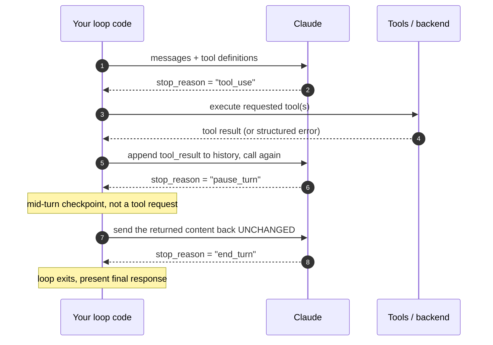
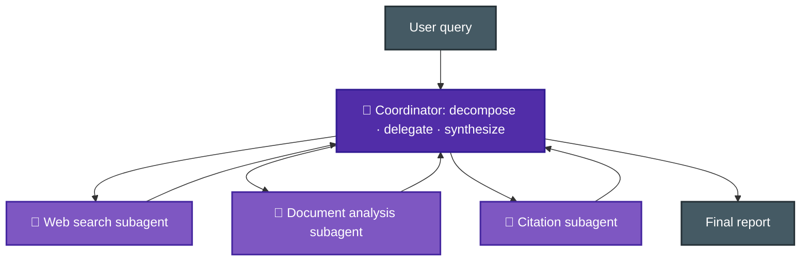
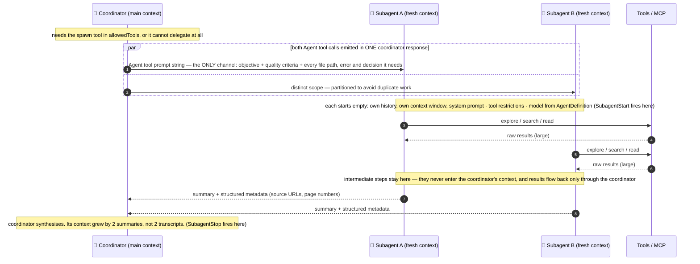
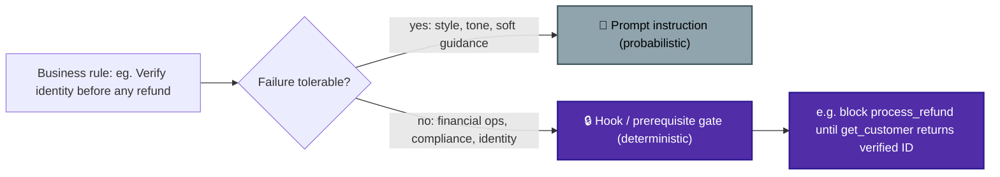
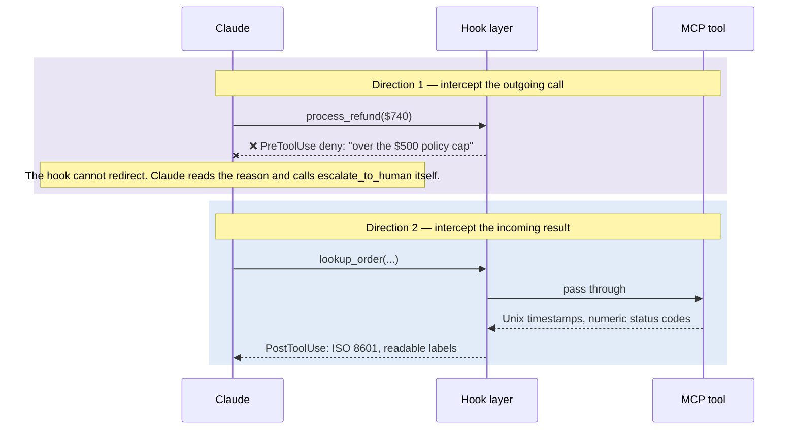
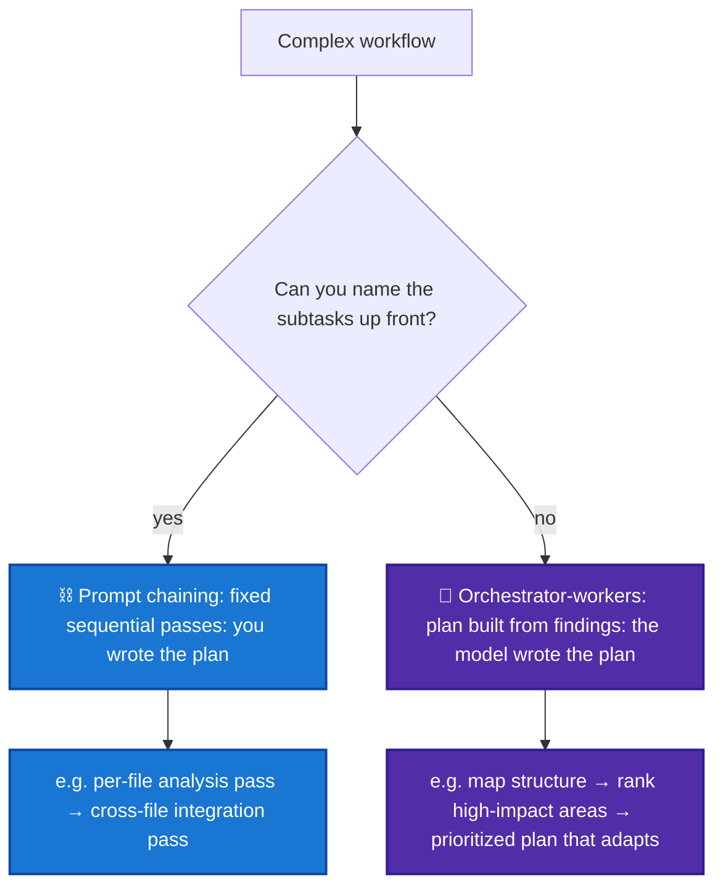
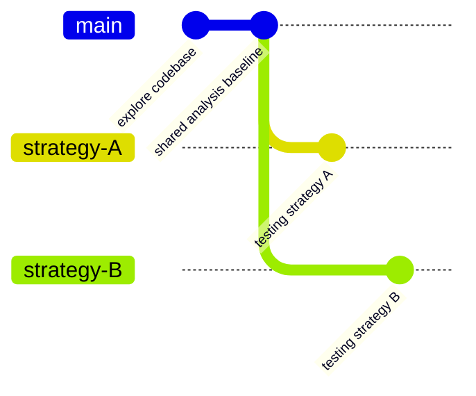
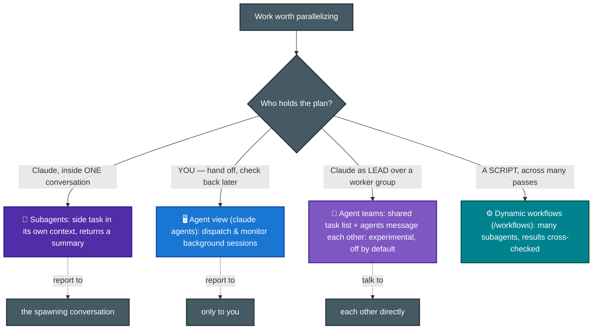

# F-D1 · Agentic Architecture & Orchestration (27%)

The largest CCA-F domain, with about 16 of 60 questions. It covers the agent loop, multi-agent coordination, and reliable enforcement of business rules.

**Tested by scenarios:** [① Customer Support](../scenarios/s1-customer-support-agent.md) · [③ Multi-Agent Research](../scenarios/s3-multi-agent-research.md) · [④ Developer Productivity](../scenarios/s4-developer-productivity.md)
**Source:** official [CCA-F Exam Guide](../../official-exam-guides/cca-f-exam-guide.pdf), task statements 1.1–1.7.

---

## 1. The agentic loop
([Doc Ref.](https://code.claude.com/docs/en/agent-sdk/agent-loop))
An agentic loop repeats four actions: think, call a tool, check the result, and choose the next step. It continues until the model decides the task is complete instead of following a fixed sequence.

At the end of each turn, the model returns **`stop_reason`**. This tells your code whether to run a tool and continue, or stop and show the final answer.




**Key points:**
- Continue while `stop_reason == "tool_use"`; terminate when `stop_reason == "end_turn"`.
- Tool results are **appended to conversation history** so the model can reason about the next action with the new information.
- Claude chooses the next tool from context. This is different from a fixed tool sequence.
- **`stop_reason == "pause_turn"`** appears during long agentic turns, such as extended server-side tool use. It is a mid-turn checkpoint, not a tool request. **Send the returned content back unchanged** in the next request. Do not add `tool_result` or edit the content. Treating it as `end_turn` or `tool_use` is incorrect.
- `Hooks` are callbacks that fire at specific points in the loop: before a tool runs, after it returns, when the agent finishes, and so on. Some commonly used hooks are:
  - `PreToolUse` - before a tool runs
  - `PostToolUse` - after a tool returns
  - `UserPromptSubmit` - when the user submits a prompt
  - `Stop` - when the agent finishes its turn
  - `SubagentStart` / `SubagentStop` - when a subagent starts / finishes
  - `PreCompact` - before context gets compacted

**Avoid these patterns:**
- parsing natural-language text to decide loop termination
- arbitrary iteration caps as the *primary* stop mechanism
- treating the presence of assistant text as "done".

> Note:
> - You usually do not write this loop yourself. The sequence above is the **manual loop** for full control with the Messages API. The SDK's **[Tool Runner](https://platform.claude.com/docs/en/agents-and-tools/tool-use/tool-runner)** (`client.beta.messages.tool_runner`, beta) handles `stop_reason`, runs tools, manages conversation state, and validates types.
> - Use a manual loop when you need human approval, custom logging, or conditional execution inside the loop.

**Keeping a session active across turns.**
The `stop_reason` loop controls one turn, not the whole session. To continue across turns, use **`/goal`**, **`/loop`**, or a custom **Stop hook** ([Doc Ref.](https://code.claude.com/docs/en/goal#compare-ways-to-keep-a-session-running)).

| | `/goal` | `/loop` | Stop hook |
|---|---|---|---|
| **Key idea**| Keep looping until the given goal is fully accomplished | trigger task at a specific moment | Decide based on the given condition/script in hook |
| **Next turn starts when** | The previous turn finishes | A time interval elapses (user provides interval, or Claude decides from context) | The previous turn finishes |
| **Stops when** | A model confirms your condition is met | You stop it, or Claude decides the work is done | Your own script or prompt decides |
| **Example** | `/goal all tests in test/auth pass and lint is clean` | `/loop 5m check the deploy` | A script that blocks the turn from stopping until an external queue is empty |

> - Choose based on what should start the next turn.
> - Auto mode can approve tools within one turn, but it does not start another turn.

## 2. Coordinator–subagent orchestration (hub-and-spoke)



**Key points:**
- **All communication between subagents goes through the coordinator.** This provides visibility, consistent error handling, and controlled information flow. In the **Managed Agents API**, delegation is limited to one level. An agent with its own `multiagent.agents` list cannot be added, and a roster can contain up to 20 unique agents. The coordinator may call several copies of each. ([Official Doc Ref.](https://platform.claude.com/docs/en/managed-agents/multiagent-orchestration)) This limit is specific to the Managed Agents API; section 3 explains the Agent SDK.
- Subagents use **separate contexts** and do not inherit the coordinator's conversation history.
- The coordinator should choose subagents based on task complexity instead of always running every agent. A simple fact check may need one; complex research may need ten or more. ([Official Doc Ref.](https://www.anthropic.com/engineering/multi-agent-research-system))
- Give subagents separate topics or source types to reduce duplicate work.
- The coordinator should review the combined result, identify gaps, and send focused follow-up tasks until coverage is sufficient.
- **The coordinator performs synthesis.** Subagents return findings, while an optional citation subagent may format sources afterward. There is no separate synthesis-subagent role.
- **Vague tasks cause duplicate work and gaps.** Give each subagent a clear objective, output format, tool guidance, and scope.

## 3. Subagent invocation, context passing, spawning
[Agent SDK based sub-agents ref.](https://code.claude.com/docs/en/agent-sdk/subagents), [Claude-code sub-agents doc-ref.](https://code.claude.com/docs/en/sub-agents), [Script based sub-agents](https://code.claude.com/docs/en/workflows)

Subagents are separate agent instances for focused tasks. They can:
- keep exploration and implementation out of the main conversation.
- run several analyses in parallel.
- use specialized instructions without enlarging the main prompt.
- enforce limits through restricted tool access.
- reduce cost by using faster models such as Haiku.

A subagent is like a Git branch for context. It works with a separate history and returns only its result, not every intermediate step.



**Keep these four ideas separate:**

| | What it is | Where it lives |
|---|---|---|
| **Definition** | *Who* the subagent is: `description`, `prompt`, `tools`, `model` | `AgentDefinition`, design time |
| **Spawn permission** | *May* the coordinator delegate at all | `allowedTools` must include the spawn tool |
| **Invocation** | *Which* subagent runs, and *when* | Runtime. Claude matches on `description`, or you name the agent in the prompt |
| **Context passing** | *What* the subagent gets to work with | Runtime. The Agent tool's **prompt string**, written by Claude at call time |

`AgentDefinition` covers only the first item. Context is passed separately with each call.

**Key points:**
- The main agent/coordinator needs permission to spawn the sub-agents: its `allowedTools` list must include the spawn tool. Without it, invocations fall through to `canUseTool`, or are denied outright in `dontAsk` mode. **Naming trap: the tool was renamed `Task` → `Agent` in Claude Code v2.1.63.** The exam guide (TS 1.3) says `"Task"`; current SDK docs say `"Agent"`. Both still appear - current releases emit `Agent` in `tool_use` blocks but keep `Task` in the `system:init` tools list and in `result.permission_denials[].tool_name`.
- **Pass context directly in the subagent prompt.** There is no automatic inheritance or shared memory between calls. Include every needed path, error, and decision in the Agent tool's prompt string.
- Fresh does not mean empty.
    - A subagent receives its own system prompt (`AgentDefinition.prompt`), the Agent tool prompt, project `CLAUDE.md` through `settingSources`, and tool definitions.
    - It does not receive the parent's history, tool results, system prompt, or preloaded skills unless they appear in `AgentDefinition.skills`.
- **`AgentDefinition`** within the Agent SDK configures each subagent type: `description` and `prompt` are the only required fields. `tools` (omit = inherit all available), `model` (`'haiku'`, `'sonnet'`, `'opus'`, `'inherit'`), `disallowedTools`, `skills`, `maxTurns`, `permissionMode`, `background`.
- **Delegation depth depends on the product:**
    - The **Managed Agents API** allows one level only. An agent with its own `multiagent.agents` list fails validation.
    - The **Agent SDK / Claude Code** allows three nested layers by default. Change this with `CLAUDE_CODE_MAX_SUBAGENT_SPAWN_DEPTH`; set it to `1` to disable nesting.
- **Parallel tool execution:**
    - Read-only calls in one turn can run together, including `Read`, `Glob`, `Grep`, and MCP tools marked read-only. State-changing calls such as `Edit`, `Write`, and `Bash` run in sequence to prevent conflicts.
    - Custom tools run in sequence by default. Add `readOnlyHint` to the tool annotations to allow parallel use.
- Pass structured data that separates content from metadata (source URLs, doc names, page numbers) to preserve attribution downstream.
- Coordinator prompts should specify **goals and quality criteria**, not step-by-step procedures, so subagents stay adaptable.

## 4. Enforcement & handoff patterns
([SDK hooks](https://code.claude.com/docs/en/agent-sdk/hooks) · [permission evaluation order](https://code.claude.com/docs/en/agent-sdk/permissions#how-permissions-are-evaluated) · [hooks reference](https://code.claude.com/docs/en/hooks))

Prompt instructions can fail. When a rule must always hold, such as identity checks before refunds, enforce it in code.



### Why the gate is a hook, and not a deny rule or `canUseTool`

The SDK evaluates every tool call in a fixed order:

`hooks → deny rules → ask rules → permission mode → allow rules → canUseTool`


> Diagram from the official docs: [How permissions are evaluated](https://code.claude.com/docs/en/agent-sdk/permissions#how-permissions-are-evaluated).

Read the order from left to right. A call runs only if it passes every earlier gate. A `deny` blocks it. A `bypass` or `allow` sends it directly to execution without reaching `canUseTool`.

That order decides which of the three candidate gates can actually hold:

| Gate | Can express "only after `get_customer` verified"? | Can it be skipped? |
|---|---|---|
| Deny rule (`disallowedTools`) | No. A static name/arg pattern with no memory of earlier calls | No, but it blocks the tool *always*, not conditionally |
| `canUseTool` callback | Yes, but it runs **last** | **Yes.** Anything that approves earlier skips it - one bare `allowedTools` entry like `"mcp__support__process_refund"` auto-approves every call to that tool |
| **`PreToolUse` hook** | Yes | No. Hooks run before every other step, and a hook `deny` holds even in `bypassPermissions` |

Two important points:
- A hook's **`allow` is not final**. Deny and ask rules still run afterward. Only a hook `deny` is absolute.
- **Auto-approved tools do not reach `canUseTool`.** A check there is skipped for any pre-approved tool.


### Handoff to a human
([Handle approvals and user input](https://code.claude.com/docs/en/agent-sdk/user-input))

Suppose a `PreToolUse` hook blocks a \$740 refund because policy allows only \$500. Claude reads the denial and calls `escalate_to_human`. Moving the case from the agent to a support representative is the handoff.

This handoff creates three problems.

**Problem 1: The representative is not in the conversation.**
They cannot see the transcript or tool results. They receive only the escalation call's data.

**Solution 1: Make the summary a required tool input schema.**

If the representative needs the customer ID, cause, refund amount, and recommended action, make all four required fields on `escalate_to_human`. Do not rely on a prompt.
- The handler receives validated arguments because the schema is checked before your code runs. A prompt cannot provide the same guarantee.

**Problem 2: The agent does not stop automatically.**
The loop continues as soon as a tool returns, but a person may need minutes or hours.

**Solution 2: Pause the agent with `canUseTool`.**

This callback pauses a task while a person decides whether a tool call may continue.

- **When it runs:** Unlike hooks across the full lifecycle, this final gate runs **when Claude needs user input**. It receives the tool name and input. Two situations trigger it:
    - A tool needs approval, and nothing earlier in the permission order resolved it.
    - Claude calls `AskUserQuestion` to have the user choose between valid approaches. Explained below.
- **How long it waits:** Execution remains paused until the callback returns. This makes it a human handoff instead of a policy check.
    - The docs say it "can stay pending indefinitely". The SDK only cancels the wait if the query itself is cancelled.
    - If the wait may outlast the process, return the [`defer` hook decision](https://code.claude.com/docs/en/hooks#defer-a-tool-call-for-later). The process exits and later resumes from the saved session. Use this for long queues.
- **What it returns:** The two behaviours are `allow` and `deny`. Each has two forms:
    - *Allow as-is* - `PermissionResultAllow(updated_input=...)` in Python, `{ behavior: "allow", updatedInput }` in TypeScript.
    - *Allow, rewritten* - return a changed `updatedInput` to clean or narrow the request. Claude is not told about the change.
    - *Deny flat* - `PermissionResultDeny(message=...)` and `{ behavior: "deny", message }`.
    - *Deny with guidance* - Claude reads the message and can choose another action. The docs call this "suggest alternative".
- **Python requirement:** `can_use_tool` needs streaming mode. A finite message stream closes before the callback can run. A registered hook or in-process MCP server keeps it open.

**What `AskUserQuestion` is, and why it shares the same callback.**

Sometimes Claude needs a user decision rather than permission. When several approaches are valid, it calls `AskUserQuestion`. That call reaches the same `canUseTool` callback with `tool_name == "AskUserQuestion"`. Your application shows the question and returns the selected answer as the tool result.

- Claude writes the questions and options. Your application cannot add its own questions to this flow; ask them separately.
- The input is a `questions` array. Each entry has `question`, a `header` of at most 12 characters, 2-4 `options` with a `label` and a `description`, and `multiSelect`.
- You answer with an allow. Pass the original `questions` back in `updatedInput`, plus an `answers` object. Keys are the question text. Values are the selected `label`.
- It is available by default. If you pass a `tools` array to restrict Claude, you must include `AskUserQuestion` or Claude loses the ability to ask.
- It shows up most in plan mode, where Claude gathers requirements before proposing a plan.

**Problem 3: The escalation can be auto-approved.**
If `escalate_to_human` is in `allowedTools`, it runs immediately and the loop continues without asking a person.

**Solution 3: Force the prompt and notify someone.**

A pause only helps if a person is watching.

- An MCP server can set **`_meta["anthropic/requiresUserInteraction"]: true`** on a tool in `tools/list`. The tool then prompts on every call, including in `acceptEdits`, `auto`, and `bypassPermissions`. Allow rules cannot skip it, and `dontAsk` denies the call.
- Three things reach `canUseTool` even when an allow rule matches: `AskUserQuestion`, tools marked `requiresUserInteraction`, and connector tools an organization set to `ask`. Everything else hits the auto-approval trap above. In `dontAsk` all three are denied without the callback running.
- The `PermissionRequest` hook fires an external notification while Claude waits. Slack, email, or push.

**Limits:** `AskUserQuestion` supports 1–4 questions with 2–4 options each. It does not work in subagents started through the Agent tool. Build a custom tool for richer input or ticket-system integration.

**Exam rule:** Use a hook for rules that code can check because it cannot be skipped. Use `canUseTool` when a person must decide, but remember that a bare `allowedTools` entry bypasses it.

> **Grounding note.** This section maps to Task Statement 1.4. The handoff-summary field list is close to the exam guide's own wording and appears in no product doc, so treat it as exam vocabulary. The `canUseTool`, `defer`, and `requiresUserInteraction` mechanics come from the SDK docs linked above.

## 5. Agent SDK hooks for tool call interception and data normalization
([SDK hooks guide](https://code.claude.com/docs/en/agent-sdk/hooks) · [Hooks reference](https://code.claude.com/docs/en/hooks) · [Claude Code hooks guide](https://code.claude.com/docs/en/hooks-guide))

An agent connected to real tools has two problems that prompts alone cannot fix.

1. **Claude may call a tool it should not use.** A refund limit in the system prompt does not guarantee that Claude will follow it.
2. **Tools return different formats.** One uses Unix timestamps, another ISO 8601, and another `status: 3`. Claude must decode these differences on every call.

Both problems occur between the model and the tool. A hook runs at this boundary in **both directions**. It can inspect an outgoing call before execution and an incoming result before Claude reads it.



Sections 5.1 and 5.2 explain the two hook events. Section 5.3 compares code enforcement with prompt instructions. Sections 5.4–5.6 show common uses.

| # | Question it answers | Mechanism |
|---|---|---|
| 5.1 | What can you do to a result after a tool returns? | `PostToolUse` |
| 5.2 | What can you do to a call before it runs? | `PreToolUse` |
| 5.3 | Why is a hook different from an instruction? | where the rule lives |
| 5.4 | Tools disagree on data formats | `updatedToolOutput` |
| 5.5 | A call violates policy | `permissionDecision: "deny"` + reason |
| 5.6 | Which of the two do you reach for? | the decision rule |

### 5.1 · Intercepting the result

**The problem:** A tool result enters conversation history unchanged, and Claude reads it in the next request.

**The cause:** Raw output may be long, inconsistent, or encoded. Claude must decode it, which adds work and creates room for mistakes.

**The solution:** `PostToolUse` runs after a tool succeeds but before Claude reads the result. The callback receives:
- `tool_name` and `tool_input` - what was called.
- `tool_response` - what came back. The schema depends on the tool.
- `tool_use_id` - correlates this event with the `PreToolUse` event for the same call.

Three ways to act on it ([PostToolUse decision control](https://code.claude.com/docs/en/hooks#posttooluse-decision-control)):

| Return | Effect |
|---|---|
| `hookSpecificOutput.updatedToolOutput` | Replaces the result before Claude sees it. Works for any tool, in both SDKs. |
| `hookSpecificOutput.additionalContext` | Appends a string next to the tool result. The original stays. |
| top-level `decision: "block"` + `reason` | Adds the reason next to the result. Claude **still sees the original output**. |

Two related events complete the pattern:
- `PostToolUseFailure` fires when the tool errored. It carries `tool_error` instead of `tool_response`, and `additionalContext` is its only shaping field. It does **not** fire for calls rejected before execution: an unknown tool name, input that fails schema validation, or a permission denial.
- `PostToolBatch` (TypeScript only) fires once after a batch of parallel calls resolves, before the next model call.

**The limit:** `PostToolUse` runs after execution and cannot undo anything. Files, commands, and network requests have already changed state. It changes what Claude sees, not what happened. Use section 5.2 to prevent an action.

### 5.2 · Intercepting the call

**The problem:** Policy limits refunds to \$500, but Claude calls `process_refund` with \$740.

**The cause:** A prompt guides behaviour but does not enforce policy.

**The solution:** `PreToolUse` runs before the tool. It returns its decision inside `hookSpecificOutput`, supporting four outcomes and input rewriting ([PreToolUse decision control](https://code.claude.com/docs/en/hooks#pretooluse-decision-control)):

| Field | Behaviour |
|---|---|
| `permissionDecision` | `"allow"`, `"deny"`, `"ask"`, or `"defer"`. |
| `permissionDecisionReason` | On `"deny"`, shown to Claude. On `"allow"` and `"ask"`, shown to the **user, not Claude**. On `"defer"`, ignored. |
| `updatedInput` | Rewrites the arguments before execution. Replaces the **entire** input object, so re-include the unchanged fields. |
| `additionalContext` | String placed next to the tool result. Ignored on `"defer"`. |

Why this gate is reliable:
- Hooks run **first** in the permission evaluation order from Section 4. A hook `deny` blocks the tool "even in `bypassPermissions` mode or with `--dangerously-skip-permissions`". The docs' own framing is that this "lets you enforce policy that users can't bypass by changing their permission mode."
- Precedence across hooks and rules is `deny` > `defer` > `ask` > `allow`. A single `deny` blocks the call regardless of what the other hooks returned.
- The reverse does not hold. A hook `"allow"` does not skip the deny and ask rules, which are evaluated regardless. **Hooks can tighten restrictions but not loosen them.**

**Scoping the hook:** A `matcher` filters only by tool name, not arguments. Check values such as the refund amount inside the callback through `tool_input`. Important matcher rules:
- A matcher of only letters, digits, `_`, `-`, spaces, `,` and `|` is compared as an **exact string**, with `|` or `,` separating alternatives. So `Write|Edit` matches exactly those two tools.
- Anything else is treated as an **unanchored regular expression**. So `^mcp__` matches every MCP tool and `Edit.*` matches both `Edit` and `NotebookEdit`.
- MCP tools are named `mcp__<server>__<tool>`. To match a whole server you must append `.*`, as in `mcp__support__.*`. A bare `mcp__support` is exact-match and matches nothing.
- Omitting the matcher, or using `*` or an empty string, matches every occurrence of the event.

**One risk:** Matching hooks run in parallel, so completion order is not fixed. If two hooks return `updatedInput`, the last one to finish wins. Allow only one hook to rewrite a tool's input.

### 5.3 · Deterministic guarantee vs probabilistic compliance

**The choice:** Put a business rule in the system prompt or enforce it with a hook.

**The difference:** Hooks provide deterministic control because the runtime always performs the check. A prompt depends on the model choosing to comply.

| | Prompt instruction | `PreToolUse` hook |
|---|---|---|
| Where the rule lives | In the context window, as text | In your code, outside the model |
| Enforced by | The model choosing to comply | The runtime, before the call leaves |
| Failure mode | Silent. The refund goes through and nothing records a violation | The call does not run, and the reason is recorded |
| Can be diluted | Yes. Long context, compaction, a persuasive user turn | No |
| Can be bypassed | Yes | No. `deny` holds through `bypassPermissions` |
| Right for | Tone, formatting, soft preferences, defaults | Money, identity, compliance, anything irreversible |

**Not every hook gives a deterministic decision.** Only some hook types run your code:
- `type: "command"`, `"http"`, `"mcp_tool"` - your code runs and decides. Deterministic.
- `type: "prompt"` - Claude Code sends the hook's input to a model, Haiku by default, which returns `{"ok": true|false}`. The docs recommend it "for decisions that require judgment rather than deterministic rules". The verdict is probabilistic, but the *check* still always runs, which a prompt instruction cannot promise.
- `type: "agent"` - the same idea with a full subagent. Experimental, and the docs say prefer command hooks for production.

Ask two questions: Is the check guaranteed to run, and does code or a model decide the result? A \$500 limit is arithmetic, so use a command hook.

### 5.4 · Normalizing heterogeneous formats from different MCP tools

**The problem:** Three MCP tools return different timestamp and status formats.

**The cause:** Claude must remember each format and decode values such as `status: 3` on every call. This uses reasoning and may cause silent mistakes.

**The solution:** Convert every result to one standard format inside the hook. Claude then sees only the normalized form.

```python
from claude_agent_sdk import ClaudeAgentOptions, HookMatcher

STATUS = {1: "pending", 2: "shipped", 3: "delivered", 4: "returned"}

async def normalize(input_data, tool_use_id, context):
    result = dict(input_data["tool_response"])
    for field in ("created", "placed_at", "updated"):
        if field in result:
            result[field] = to_iso8601(result[field])   # your own helper
    if isinstance(result.get("status"), int):
        result["status"] = STATUS[result["status"]]
    return {
        "hookSpecificOutput": {
            "hookEventName": "PostToolUse",
            "updatedToolOutput": result,
        }
    }

options = ClaudeAgentOptions(
    hooks={"PostToolUse": [HookMatcher(matcher="mcp__support__.*", hooks=[normalize])]}
)
```

Important details:

- `updatedToolOutput` is the current field, and it works for any tool in both SDKs. `updatedMCPToolOutput` replaces MCP tool output only and is **deprecated**.
- The replacement **must match the tool's output shape**. Built-in tools return structured objects, not strings - `Bash` returns `stdout`, `stderr`, `interrupted` and `isImage`. A value that does not match a built-in tool's schema is silently ignored and the original output is used. MCP tool output is passed through without schema validation, which is why this pattern is easy on MCP tools and fussy on built-ins.
- Use `additionalContext` instead when the raw result has to survive, for audit or citation, and you only want the decoded reading alongside it. Values over 10,000 characters are written to a file, and Claude gets the path plus a short preview.
- Register `PostToolUseFailure` too, or errors reach the model unnormalized. It carries `tool_error` and accepts only `additionalContext`.
- All matching hooks run in parallel with non-deterministic completion order, so write each one to act independently. Two hooks rewriting the same call's output is a bug.
- Normalizing does not rewrite observability. OpenTelemetry tool spans and analytics capture the original output, because they run before the hook.

Do not place format conversion in a prompt. That uses context, repeats the reasoning on every call, and may fail.

### 5.5 · Blocking a policy violation and redirecting to a human

**The problem:** A \$740 refund exceeds the \$500 limit, and `escalate_to_human` is the alternative.

**The limit:** The hook can block the refund but cannot call the escalation tool. Command hooks return decisions; they cannot start commands or tool calls.

**The solution:** Deny the call and name the alternative in the reason.

```python
async def refund_cap(input_data, tool_use_id, context):
    amount = input_data["tool_input"].get("amount", 0)
    if amount > 500:
        return {
            "systemMessage": f"Blocked a ${amount} refund: over the $500 policy cap.",
            "hookSpecificOutput": {
                "hookEventName": "PreToolUse",
                "permissionDecision": "deny",
                "permissionDecisionReason": (
                    f"Refunds above $500 require human approval, and this one is "
                    f"${amount}. Call escalate_to_human with the customer ID, root "
                    f"cause, refund amount, and recommended action."
                ),
            },
        }
    return {}

options = ClaudeAgentOptions(
    hooks={"PreToolUse": [
        HookMatcher(matcher="mcp__support__process_refund", hooks=[refund_cap])
    ]}
)
```

- Claude performs the redirect, not the hook. On `deny`, Claude sees `permissionDecisionReason` and can call `escalate_to_human`. Write the reason as clear routing instructions.
- `systemMessage` goes to the user, not the model. The SDK only surfaces hook output in the message stream for `SessionStart` and `Setup`, unless you set `includeHookEvents` (`include_hook_events` in Python).
- The matcher is a full tool name of letters, digits and underscores, so it is an exact-string compare. That is correct for a single tool. Use `mcp__support__.*` only if you want every tool from that server.
- Do **not** put this check in `canUseTool`. One bare `allowedTools` entry like `"mcp__support__process_refund"` auto-approves the call and the callback never runs. The docs say it plainly: "For checks that must run on every tool call, use a `PreToolUse` hook."
- Resist `updatedInput` here. Clamping \$740 down to \$500 works mechanically, but Claude is not told the input changed, so it will report a \$740 refund it never issued. Rewriting is for sanitizing paths and narrowing scope, not for money.
- Blocking is only half the workflow. Getting the escalation in front of a person - `canUseTool` to pause, `defer` when the wait outlives the process, `requiresUserInteraction` to force the prompt, `PermissionRequest` to fire the notification - is Section 4's material.

### 5.6 · Choosing between a hook and a prompt

**The choice:** Decide whether a prompt or hook should enforce the requirement.

**The rule:** Ask whether a failure is acceptable.
- Tolerable - tone, formatting, phrasing preferences, soft defaults, anything where a false block costs more than a rare miss. Use a prompt instruction.
- Not tolerable - refund caps, identity verification before a payout, PII redaction, regulated writes. Use a `PreToolUse` hook.

Wording often reveals the answer. "Must never", "always", "guaranteed", "compliance requires", and "auditable" suggest a hook. "Prefer", "generally", and "should try to" suggest a prompt.

**Mapping a requirement onto a mechanism.**
- The rule must hold before the action → `PreToolUse` with `permissionDecision: "deny"`, and a reason that names the alternative.
- The result must be reshaped before the model reasons on it → `PostToolUse` with `updatedToolOutput`.
- The action already happened and you only want the model warned → `PostToolUse` with `additionalContext`.
- A person must decide → `canUseTool`, plus a hook to make sure the call actually reaches it.

**Four choices that look right and are not.**
- *Strengthening the system prompt instruction.* Still probabilistic, so it never satisfies a rule stated as a guarantee.
- *Putting the check in `canUseTool`.* Skippable by allow rules and by `bypassPermissions`.
- *Using `disallowedTools`.* A static name or argument pattern with no memory of earlier calls. It cannot express "only after identity was verified", and it blocks the tool always rather than conditionally.
- *Using a `PostToolUse` hook to block the refund.* Too late. The tool already ran.

**Hook limit:** A hook covers only calls through the agent's tool layer. If other clients can reach the refund service, enforce the limit in that service too. Hooks also add latency. Default timeouts are 10 minutes for command, HTTP, and MCP-tool hooks; 30 seconds for prompt hooks; and 60 seconds for agent hooks.

> **Sources.** Field names, decision precedence, matcher rules and the `bypassPermissions` behaviour come from the [hooks reference](https://code.claude.com/docs/en/hooks) and the [SDK hooks guide](https://code.claude.com/docs/en/agent-sdk/hooks). The determinism framing is the docs' own: hooks give "deterministic control: certain actions always happen rather than relying on the LLM to choose to run them" ([Claude Code hooks guide](https://code.claude.com/docs/en/hooks-guide)). The permission evaluation order and the `canUseTool` bypass warning are from [Configure permissions](https://code.claude.com/docs/en/agent-sdk/permissions).

## 6. Task decomposition strategies
([Building effective agents](https://www.anthropic.com/engineering/building-effective-agents) · [Effective context engineering](https://www.anthropic.com/engineering/effective-context-engineering-for-ai-agents) · [Subagents](https://code.claude.com/docs/en/agent-sdk/subagents))

Some tasks are too large for one pass, such as reviewing a 40-file pull request or adding tests to a legacy codebase. A single prompt handles these poorly because of context limits, not writing style.

A transformer compares tokens with other tokens, so `n` tokens create n² relationships. As context grows, the model handles these relationships less reliably. Anthropic calls this **context rot**: recall becomes less accurate as the context window grows. The model has a limited **attention budget**, and one large prompt spreads it too thin.

Break the task into parts by asking one question: **Can you name the subtasks before starting?**

- Yes - the sequence is fixed, and you write it in code.
- No - the plan has to be produced at runtime, by the model, from what it finds.

Choosing the wrong pattern has a clear cost. A fixed pipeline may explore the wrong areas when the problem is unknown. An open-ended agent is slower, more expensive, and less repeatable when the steps are already known.



| # | Question it answers | Pattern |
|---|---|---|
| 6.1 | The subtasks are known | prompt chaining |
| 6.2 | The subtasks emerge as you go | orchestrator-workers |
| 6.3 | How this plays out on a large code review | per-file passes + a cross-file pass |
| 6.4 | How this plays out on a legacy codebase | map → rank → adaptive plan |
| 6.5 | Which one do you reach for? | the decision rule |

### 6.1 · Fixed sequential pipelines (prompt chaining)

**Use this when:** You can name the steps in advance, and each step uses the previous output.

**The pattern:** Prompt chaining uses a fixed series of LLM calls. Each call processes the previous step's output.

**Why it helps:**
- The sequence lives in code, not model judgment. This makes it a **workflow** with predefined paths, not an agent that chooses its own process.
- Each call receives a small, focused context instead of the whole task.
- You can validate one step before allowing the next step to run.

**The cost:** More calls add delay. Early errors also pass into later steps, so validate between steps rather than only at the end.

### 6.2 · Dynamic decomposition that adapts to findings

**Use this when:** The required subtasks depend on what the first exploration finds.

**The pattern:** In orchestrator-workers, a central model creates tasks, delegates them, and combines the results. The orchestrator decides the subtasks during the run.

**Difference from 6.1:** In a fixed pipeline, you write the plan. Here, the model creates and updates the plan from its findings.

- The shape is the hub-and-spoke of Section 2. The coordinator decomposes, delegates, and synthesizes. Sections 2 and 3 cover the mechanics: isolated context per subagent, and the Agent tool's prompt string as the only channel into one.
- Delegation protects attention as well as parallelising work. "Rather than one agent attempting to maintain state across an entire project, specialized sub-agents can handle focused tasks with clean context windows."
- The plan is revised, not just produced once. The coordinator checks its synthesis for gaps and re-delegates targeted follow-ups.

**The cost:** Runs may follow different paths, cost different amounts, and be harder to debug. Use this only when the task needs an adaptive plan.

### 6.3 · How this plays out on a large code review

**The problem:** A pull request changes 40 files, and one prompt includes them all.

**The cause:** Two different problems appear.
1. **Attention dilutes.** File 37's subtle bug competes with 39 other files for the same budget. Quality degrades across the whole review, not just at the end.
2. **Some defects live between files.** A renamed function whose callers were never updated is invisible in any single file. Reviewing files one at a time in isolation misses it completely.

**The solution:** Use two passes with different scopes.

1. **Per-file local pass.** One call per file, or per small group. The context holds one file. This catches local defects: logic errors, missing null checks, unhandled exceptions, bad naming.
2. **Cross-file integration pass.** A separate call that receives the per-file findings plus the signatures and interfaces that crossed file boundaries - not the 40 files again. This catches broken contracts, inconsistent error handling, and callers left behind by a rename.

Important details:
- The per-file passes are independent, so they run in parallel. That is Anthropic's **sectioning**: "breaking a task into independent subtasks run in parallel".
- The integration pass has to be its own step. Folding it into the last per-file call gives it whatever happened to be in context at that moment, which is arbitrary.
- Feed the integration pass structured findings, not raw files. Re-sending all 40 files rebuilds the exact problem you decomposed to avoid.
- Both passes were knowable before the run started, so this is prompt chaining, not dynamic decomposition.

### 6.4 · How this plays out on a legacy codebase

**The problem:** Nobody can list all steps needed to add broad test coverage to a legacy codebase.

**The cause:** The steps depend on unknown facts: module structure, risky paths, current coverage, and code that needs refactoring before testing. A fixed sequence would guess at all four.

**The solution:** Use three stages. Only the first is fixed.

1. **Map the structure.** Cheap, broad exploration. Modules, entry points, existing test layout, current coverage.
2. **Identify high-impact areas.** Rank what the map found: complexity, change frequency, absence of coverage, blast radius on failure.
3. **Produce a prioritized plan, then let it adapt.** As dependencies surface, the plan changes. Finding that the payments module cannot be tested without a database seam both reorders the work and adds a refactor task that did not exist at stage 2.

- Stage 3 is the reason. The plan is a living artifact, not a list handed down at the start.
- Each stage narrows the next, which is what keeps context small at every step even though the overall job is large.
- Delegate stage 1 to subagents. Raw file contents stay in their contexts and only the findings come back, so the coordinator's context grows by summaries rather than transcripts (Section 3).

### 6.5 · Choosing between them

**The decision rule:** Can you name the subtasks now?

| | Fixed pipeline (prompt chaining) | Dynamic decomposition (orchestrator-workers) |
|---|---|---|
| Who writes the plan | You, before the run | The model, during the run |
| Subtasks | Known and stable | Derived from intermediate findings |
| Repeatability | Same steps every run | Varies with what it finds |
| Cost and latency | Predictable | Variable, and higher |
| Debugging | "Step 3 failed" | Reconstruct which plan it chose, then find the step |
| Right for | A multi-aspect review of a known artifact | Open-ended investigation |

- **The two patterns can work together.** In 6.4, stage 1 is fixed while stage 3 adapts. Many workflows use a fixed structure with an adaptive part.
- **Two neighbouring patterns** show up in the same discussion and are worth naming. **Routing** "classifies an input and directs it to a specialized followup task", and works "for complex tasks where there are distinct categories that are better handled separately". **Evaluator-optimizer** is where "one LLM call generates a response while another provides evaluation and feedback in a loop", and pays off when you have "clear evaluation criteria, and when iterative refinement provides measurable value".
- **Use the least dynamic option that works.** Start simply and add complexity only when it improves the result. Dynamic decomposition costs the most and is hardest to predict.

> **Sources.** Pattern definitions and their "when to use" guidance are quoted from [Building effective agents](https://www.anthropic.com/engineering/building-effective-agents). Context rot, the attention budget and the n² argument are from [Effective context engineering for AI agents](https://www.anthropic.com/engineering/effective-context-engineering-for-ai-agents), which is also the source for delegating to subagents with clean context windows. Subagent mechanics are in the [Agent SDK subagents doc](https://code.claude.com/docs/en/agent-sdk/subagents) and in Section 3.

## 7. Session state, resumption, forking
([Manage sessions](https://code.claude.com/docs/en/agent-sdk/sessions) · [CLI reference](https://code.claude.com/docs/en/cli-reference) · [File checkpointing](https://code.claude.com/docs/en/agent-sdk/file-checkpointing))

Section 6 creates valuable context. After the first stage, the agent has read files, searched the codebase, and built an understanding of the system. That work exists in the session history and took time and tokens to create.

Three situations affect that history.

1. **Work stops and later resumes.** You need the correct saved session, not another session from the same directory.
2. **You want to compare two approaches.** Both need the same analysis, but running them together mixes their reasoning and rebuilding the analysis wastes resources.
3. **The files have changed.** Part of the saved history is now outdated, but the transcript does not mark it as stale.

A session is an append-only transcript stored on disk. You can keep, copy, correct, or replace its history.



| # | Question it answers | Mechanism |
|---|---|---|
| 7.1 | Where does the history actually live? | `~/.claude/projects/<encoded-cwd>/<id>.jsonl` |
| 7.2 | Get back to one specific past session | `--resume <name>` / `resume` |
| 7.3 | Two approaches, one shared baseline | `--fork-session` / `fork_session` |
| 7.4 | The files changed since the analysis | name the changed files on resume |
| 7.5 | The history is stale, or on another machine | fresh session + injected summary |

### 7.1 · What a session actually is

**The mechanism:** Claude stores an append-only `.jsonl` transcript at `~/.claude/projects/<encoded-cwd>/<session-id>.jsonl`. `<encoded-cwd>` replaces non-alphanumeric characters in the absolute path with `-`, so `/Users/me/proj` becomes `-Users-me-proj`. `CLAUDE_CONFIG_DIR` changes the root location.

This path has two important effects.

- **`cwd` is part of the key.** If you resume from another directory, the SDK looks elsewhere and may create a new session instead of returning an error. A mismatched `cwd` is the most common reason a resumed session has no history.
- **Sessions stay on the machine that created them.** CI workers, temporary containers, and serverless functions do not share them. Section 7.5 covers this case.

**What it contains:** Prompts, assistant messages, tool calls, and tool results. It does not contain files or track repository versions. Section 7.4 explains this risk.

In TypeScript, `persistSession: false` keeps a session in memory for the duration of the call and writes nothing. Python always persists.

### 7.2 · Resuming a named session

**The problem:** You need Monday's authentication session after running twelve newer sessions in the same directory.

**The cause:** `--continue` (`-c`) loads only the latest conversation in the current directory. A session ID is precise but difficult to remember.

**The solution:** Name the session and resume it by name.

- `claude -n "auth-refactor"` sets a display name. It appears in `/resume` and in the terminal title. `/rename` changes it mid-session and shows it on the prompt bar.
- `claude --resume auth-refactor` resumes by that name. `--resume` (`-r`) also accepts a session ID, and with no argument it opens an interactive picker.
- One asymmetry worth knowing: the picker and the name search include sessions that added this directory with `/add-dir`, but passing a session ID searches only the current project directory and its git worktrees.

**In the SDK there are no names, only IDs.**
- `resume=<session_id>` (Python) / `resume: sessionId` (TypeScript) returns to one specific session. You track the ID yourself.
- `continue_conversation=True` / `continue: true` picks the most recent session in the directory with no ID handling at all. Good for an app that runs one conversation at a time.
- `ClaudeSDKClient` in Python, and `continue: true` in TypeScript, handle multi-turn within a single process automatically. You only reach for IDs across processes.
- Capture the ID from the first run's `ResultMessage` if you intend to come back to it. `list_sessions()` / `listSessions()` enumerate what is on disk, and `rename_session()` and `tag_session()` (`renameSession`, `tagSession`) let you build your own picker.

**Resume also supports recovery.** If a run ends with `error_max_turns` or `error_max_budget_usd`, resume it with a higher limit instead of starting again.

### 7.3 · Forking from a shared baseline

**The problem:** You want to compare two testing strategies using the same detailed analysis.

**The cause:** One shared session mixes the reasoning for both strategies. Two new sessions repeat the same analysis and cost.

**The solution:** Fork the session. The new session copies the original history, receives its own ID, and then develops independently. The original remains unchanged.

- **Fork is not a standalone option.** In the SDK you pass `resume` *and* `fork_session` together: `resume` names the history to copy, and `fork_session=True` (Python) / `forkSession: true` (TypeScript) makes it a copy rather than a continuation.
- CLI: `claude --resume abc123 --fork-session`. It works with `--continue` as well.
- The result is two independent sessions with two IDs. You can resume either one separately, and nothing done in the fork touches the original.

**The risk:** Forking copies conversation history, not the filesystem. File changes remain visible to every session in the same directory. Two forks can overwrite each other's work without recording the conflict in either transcript.

- To branch and revert file changes, use [file checkpointing](https://code.claude.com/docs/en/agent-sdk/file-checkpointing). It tracks only `Write`, `Edit` and `NotebookEdit`. Writes made through `Bash` (`echo >`, `sed -i`) are not captured, and neither are edits applied by a subagent.
- So a fork is safe for comparing *analyses* and *plans*, which is what the strategy-comparison case actually needs. For comparing two *implementations*, give each branch its own working tree.

### 7.4 · Resuming after the code changed

**The problem:** You resume an older session after several files have changed.

**The cause:** Old file contents remain in tool results and look current. Resume does not mark or revalidate them, so Claude may use outdated line numbers, names, and structures.

**The solution:** In the resume prompt, name the changed files and ask Claude to read them again.

- "I refactored `auth/session.py` and `auth/tokens.py` since your last analysis. Re-read both before continuing." That buys a targeted re-analysis for the price of two file reads instead of a full re-exploration.
- Being vague is the worst option. "Some things changed" either gets ignored or triggers a full re-read, and you cannot predict which.
- Nothing does this for you. The SDK does not diff the working tree against the transcript, and no hook fires on resume to check.
- If enough has changed that most of the prior analysis is suspect, stop patching it. That is 7.5.

### 7.5 · Starting fresh with a structured summary

**The problem:** Most prior tool results are outdated, or the work must continue on another machine.

**The choice:** Resume when most prior context remains valid. Start again when it does not. A transcript containing outdated facts is worse than an empty context.

**The solution:** Start a new session with a structured summary in the first prompt. Include decisions, important files and reasons, discovered limits, and open questions. Leave old raw tool output behind.

- **Why this beats a stale resume.** You control exactly what the model believes. A resumed session carries every wrong intermediate result alongside the right conclusions, and there is no way to selectively delete from a transcript.
- **The docs make the same call for the cross-host case.** Rather than shipping transcripts around: "Capture the results you need (analysis output, decisions, file diffs) as application state and pass them into a fresh session's prompt. This is often more robust than shipping transcript files around."
- **It is compaction, run deliberately.** Compaction is "taking a conversation nearing the context window limit, summarizing its contents, and reinitiating a new context window with the summary." The mechanism is identical. Compaction is triggered by a context limit; this is triggered by staleness.
- **The other cross-host option is to move the file.** Persist `~/.claude/projects/<encoded-cwd>/<session-id>.jsonl` and restore it to the same path on the new host, with a matching `cwd`. It works, and it is more machinery than a summary usually justifies.

**The decision, in one table.**

| Situation | Move |
|---|---|
| Same investigation, code unchanged | Resume by name |
| Same investigation, a few known files changed | Resume, and name the changed files |
| Two approaches from one analysis | Fork (`resume` + `fork_session`) |
| Two implementations from one analysis | Fork, plus a separate working tree per branch |
| Prior tool results mostly stale | Fresh session + structured summary |
| Different machine | Fresh session + summary, or move the `.jsonl` and match `cwd` |
| Most recent session, single-threaded app | `--continue` / `continue: true` |

> **Sources.** Session storage paths, the `cwd` caveat, `resume`/`continue`/`fork_session` semantics, the fork-does-not-branch-the-filesystem warning, and the cross-host guidance are from [Manage sessions](https://code.claude.com/docs/en/agent-sdk/sessions). The `-n`, `--resume`, `--continue` and `--fork-session` flag behaviour is from the [CLI reference](https://code.claude.com/docs/en/cli-reference). Checkpointing coverage limits are from [Rewind file changes with checkpointing](https://code.claude.com/docs/en/agent-sdk/file-checkpointing). The compaction definition is from [Effective context engineering for AI agents](https://www.anthropic.com/engineering/effective-context-engineering-for-ai-agents).

---

## Field guide · Claude Code's four ways to run agents in parallel

> Supplementary context, not a numbered task statement. Sections 2–3 explain how to build coordinator and subagent patterns with the Agent SDK. This section shows the same idea through Claude Code CLI features. Source: [code.claude.com/docs/en/agents](https://code.claude.com/docs/en/agents).
>
> **Choose the feature by asking:** *Who holds the plan?*



| Surface | Coordinator | Workers talk to… | Isolation | Reach for it when |
|---|---|---|---|---|
| **Subagents** | Claude, in one session | report back to the spawning conversation | each can take a worktree | a side task (searches, logs, file dumps) would flood the main context with output you'll never reread |
| **Agent view** (`claude agents`) | you | report only to you | each dispatched session auto-gets its own worktree | several independent tasks you want to hand off and glance at, stepping in only when one needs you |
| **Agent teams** | Claude as lead | message each other directly | **not** worktree-isolated → **partition files** yourself | you want Claude to split a project, assign pieces, and keep workers in sync |
| **Dynamic workflows** (`/workflows`) | a script (not turn-by-turn judgment) | cross-checked against each other | subagents can be isolated | the job outgrows a handful of subagents or needs verification: codebase-wide audit, 500-file migration, cross-checked research |

**Key points:**
- **Subagents** use the coordinator pattern from sections 2–3. They start through the **Task tool**, use separate context, and return a summary instead of raw output. This protects the main context window.
- **Worktrees** are the file-conflict answer for parallel work. Agent view isolates automatically; **agent teams do not**, so you must partition file ownership across teammates.
- **`/subtask`** starts a forked subagent with the **full conversation context**. A normal subagent starts fresh. **`/fork`** copies the whole session into a parallel background session.
- **`/batch`** is a packaged skill that splits a large change among **5–30 worktree-isolated subagents, each creating its own PR**. It combines subagents and worktrees.
- Check work with `claude agents` for agent view, `/tasks` for background work in the current session, and `/workflows` for workflow runs and phases. Named background subagents appear in `@` autocomplete. `/agents` now points to subagent files instead of opening a panel.
- Every "worker" is itself a **Claude session**. To involve a non-Claude tool, expose it as an **MCP server**.

**Worktrees provide file isolation** ([worktrees](https://code.claude.com/docs/en/worktrees)). A Git worktree is a separate directory and branch that shares repository history, so parallel edits do not conflict. Start one with `claude --worktree <name>` (`-w`). Set **`isolation: worktree`** in subagent frontmatter for automatic isolation. Claude stores them under `.claude/worktrees/`, branches from the default branch, and copies ignored files listed in `.worktreeinclude`. Set `worktree.baseRef: "head"` to branch from current work. A worktree with no changes is removed automatically; a changed one remains. **Worktrees isolate files, while subagents and teams coordinate work.**

---

## Field guide · Six ways to automate a Claude Code session

> Supplementary context. 
> Source: [hooks](https://code.claude.com/docs/en/hooks-guide) · [channels](https://code.claude.com/docs/en/channels) · [scheduled tasks](https://code.claude.com/docs/en/scheduled-tasks) · [goal](https://code.claude.com/docs/en/goal) · [programmatic usage](https://code.claude.com/docs/en/headless) · [deep links](https://code.claude.com/docs/en/deep-links).
>

| | Hooks | Channels | `/loop` | `/goal` | Programmatic (`-p` / Agent SDK) | Deep links |
|---|---|---|---|---|---|---|
| **What it does** | Runs a shell command at a fixed point in Claude's lifecycle | Pushes a message from outside (chat, webhook) into a session that's already open | Re-runs a prompt on a repeating interval | Keeps a session working, turn after turn, until a condition holds | Runs Claude non-interactively from a script, CI job, or SDK call | Opens a brand-new session with a prompt pre-filled |
| **Starts when** | A lifecycle event fires - `PreToolUse`, `PostToolUse`, `Stop`, etc. | An external event arrives - a Telegram message, a CI webhook | A time interval elapses (fixed, or Claude picks it) | Each turn finishes; a small model checks your condition against the transcript | You invoke it - a script runs, a CI step fires | A person clicks the link |
| **Where it runs** | Inside the current session, deterministically, every time | Inside a session that must already be open | Inside the current session; session must stay open (or run backgrounded) | Inside the current session | A fresh process each call, no session to keep open | A new local session on whoever clicked |
| **Needs a human there?** | No | No, but the session has to be running | No | No - pair with auto mode for unattended runs | No | Yes - nothing sends until they press Enter |
| **Example** | `PostToolUse` hook runs Prettier after every `Edit`/`Write` | A CI webhook lands and Claude reacts, no polling needed | `/loop 5m check the deploy` | `/goal all tests in test/auth pass and lint is clean` | `claude -p "fix the failing tests" --allowedTools Bash,Read,Edit` | A runbook link that opens the right repo with a diagnostic prompt |

**Key points:**
- **Hooks are deterministic.** The same event runs the same command every time. Other options include a model decision, such as Haiku for `/goal` or Claude for channels and scheduled prompts.
- **Channels and deep links are the two that cross the Claude Code boundary.** Channels push an external event *in*; deep links pull a person *in* by opening a session for them.
- **`/goal` and `/loop` differ by what starts the next turn:** a condition or a time interval. Section 1 covers both.
- **Programmatic usage has no persistent session by default.** Each `-p` call is a fresh process, which is why you resume by session ID (`--resume`) rather than by leaving something open.
- **A deep link does nothing until a person presses Enter.** It only fills the prompt box and never runs automatically.

---

## Exam traps checklist

| Trap | Correct instinct |
|---|---|
| "Add a prompt instruction" for a must-never-fail rule | Hook / programmatic prerequisite |
| Subagents "share" the coordinator's context | They don't; pass context explicitly in the prompt |
| Sequential Task calls for independent subtasks | Parallel Task calls in one response |
| Blame downstream agents for missing coverage | Check the coordinator's decomposition first |
| Iteration cap / text parsing to stop the loop | `stop_reason` is the only loop signal |
| Resume a session with stale tool results | New session + structured summary |
| Agent teams will avoid file conflicts on their own | They aren't worktree-isolated - partition file ownership |
| Parallel sessions editing the same files | Give each a **worktree** |

**Practice:** [avidevelops Q&A bank](https://github.com/avidevelops/claude-architect-exam-prep) (agentic architectures) · [claude-cookbooks `claude_agent_sdk` + `patterns`](https://github.com/anthropics/claude-cookbooks) · Exercise 1 & 4 in the official guide.
