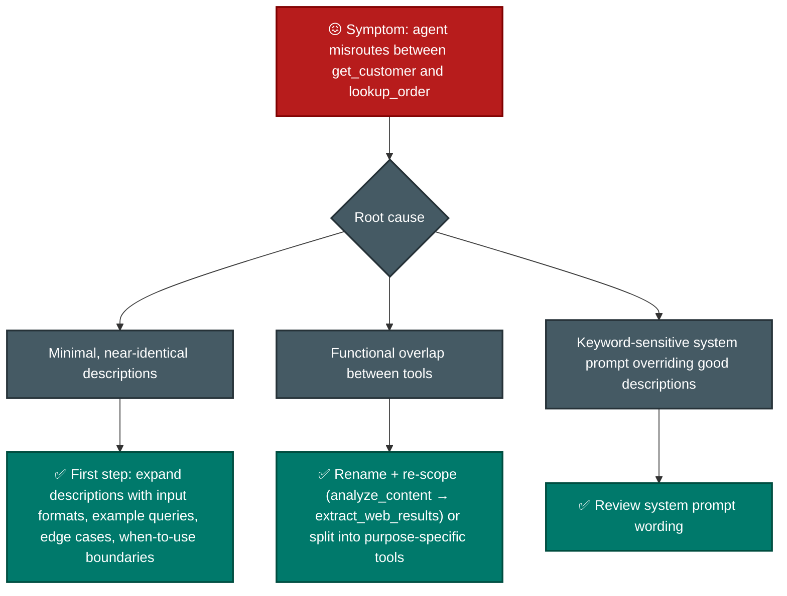
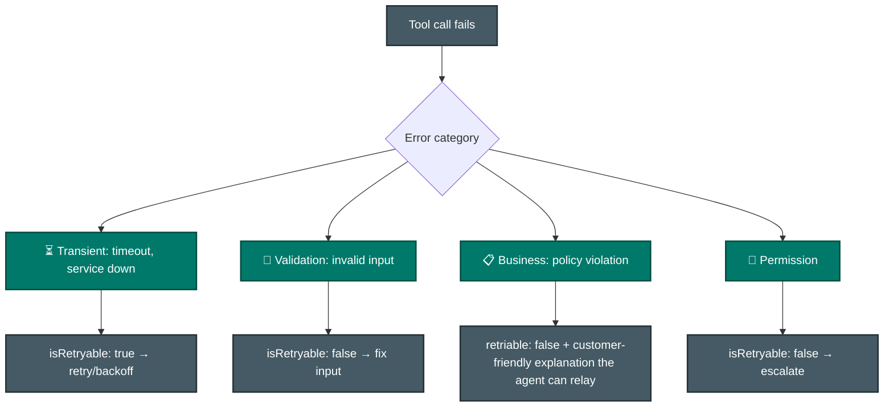
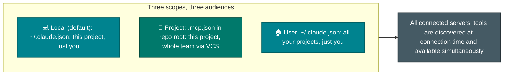
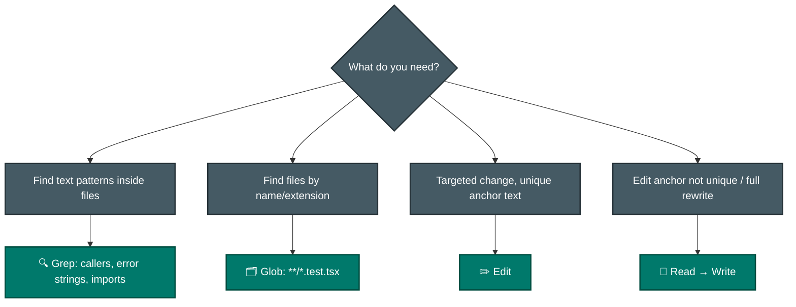
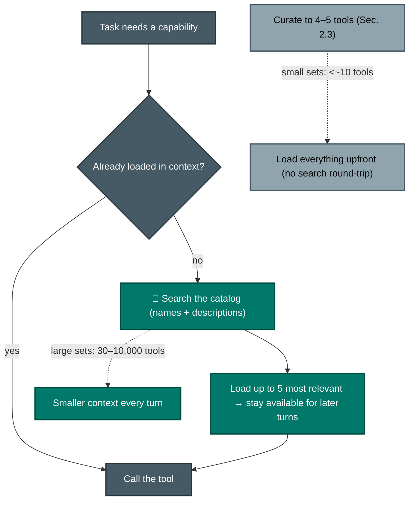
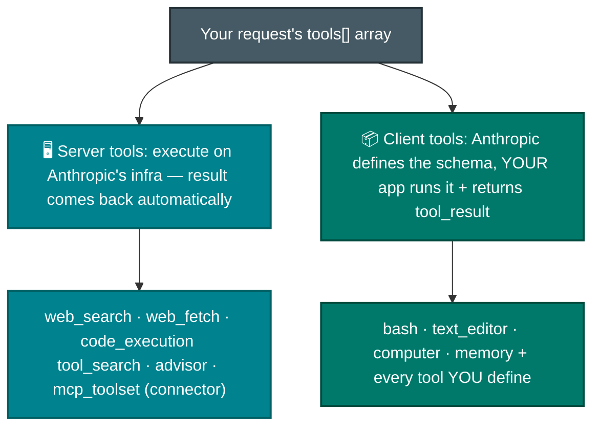

# F-D2 · Tool Design & MCP Integration (18%)

How Claude picks the right tool (descriptions are everything), how tools fail well (structured errors), and how MCP servers plug into Claude Code and agents.

**Tested by scenarios:** [① Customer Support](../scenarios/s1-customer-support-agent.md) · [③ Multi-Agent Research](../scenarios/s3-multi-agent-research.md) · [④ Developer Productivity](../scenarios/s4-developer-productivity.md)
**Source:** official [CCA-F Exam Guide](../../official-exam-guides/cca-f-exam-guide.pdf), task statements 2.1–2.5.

---

## The one fact this domain is built on

Claude cannot see your tool code. It sees only **names, descriptions, and JSON schemas** in the context window and chooses from that text. It learns what a tool actually does only after calling it.

Most failures happen because this text is unclear, incomplete, or crowded by too many tools.

| Symptom | What is actually wrong | Section |
|---|---|---|
| Agent calls the wrong one of two similar tools | The descriptions do not distinguish them | 2.1 |
| Agent retries something that will never work, or gives up on something that would have | The error told it nothing it could act on | 2.2 |
| Agent picks badly once the catalog grows, or uses tools outside its job | Too many descriptions competing for attention | 2.3, 2.6 |
| Agent cannot reach your systems at all | Nothing wired them in | 2.4 |
| Agent burns the context window before it starts working | Wrong built-in for the job, or reading everything upfront | 2.5 |
| "Who runs this tool?" is unclear | Server tools and client tools are different things | 2.7 |

## 2.1 Tool interface design
([Define tools](https://platform.claude.com/docs/en/agents-and-tools/tool-use/define-tools) · [Custom tools in the Agent SDK](https://code.claude.com/docs/en/agent-sdk/custom-tools))

**The problem:** A support agent has `get_customer` and `lookup_order`, but calls `lookup_order` when it needs a customer record.

**The cause:** The model chooses from two names, descriptions, and schemas. If they do not explain the difference, the model has no basis for choosing. This is missing context, not weak reasoning. **Tool descriptions are the main information an LLM uses to select a tool.**

### What a description has to carry

A useful description covers four points. Most people include the purpose but miss the other three.

- **Purpose:** What the tool does.
- **Expected inputs and outputs:** Formats, units, and ID formats. `customer_id` is unclear when several systems use different IDs.
- **When to use it instead of a similar tool:** State the boundary directly. This is the most important missing detail when tools are confused.
- **Edge cases and example queries:** Show how the tool is used in practice.

### When the problem is the tool, not the description

Sometimes the tools truly overlap. Use one of these approaches:

- **Rename and narrow the scope.** `analyze_content` is vague; `extract_web_results` describes one task.
- **Split a general tool into focused tools.** Replace `analyze_document` with `extract_data_points`, `summarize_content`, and `verify_claim_against_source`. Each tool then has a clear input and output contract.

### The order to try things in

Improve descriptions first. This is simpler and often more effective than adding examples, a routing layer, or merging tools. Those options cost more and may only hide a weak description.

## 2.2 Structured error responses (MCP)
([Handle errors in custom tools](https://code.claude.com/docs/en/agent-sdk/custom-tools#handle-errors))

**The problem:** A tool call fails and returns `"Operation failed"`.

**The cause:** The message does not tell the agent whether to retry, fix the input, ask a person, or explain the result. The agent must guess and may retry a permanent failure or abandon a temporary one.

**The solution:** Return the details needed to choose a recovery action. 🧩

### The three fields

- **`errorCategory`:** Transient, validation, business, or permission. The category selects the recovery path.
- **`isRetryable`:** A boolean that removes the need to infer retryability from text.
- **A clear description:** For business-rule failures, write text the agent can show directly to the customer.

### How the failure is signalled

MCP marks a failed call with **`isError`** (`is_error` in Python). A handler error does not stop the agent loop. The reporting method controls what Claude sees.

- **Throw an uncaught exception:** The MCP server returns the raw exception message, so Claude sees a stack trace.
- **Catch it and return `isError: true`:** Claude sees your message, which can explain which request failed and what to try next.

Catch errors when the raw exception does not give Claude enough information to act, which is usually the case.

### The distinction that gets tested

**An access failure is different from a valid empty result.** A timeout means the answer is unknown and may require a retry. A successful query with zero rows means the known answer is "none". Do not report the second case as an error.

**Subagents should recover locally.** They handle temporary failures themselves and send the coordinator only unresolved problems, attempted actions, and partial results.

## 2.3 Tool distribution & `tool_choice`

**The problem:** The catalogue has grown to 18 tools, and a synthesis agent starts doing its own web searches.

**The cause:** Two separate issues can look like bad agent behaviour.

1. **Decision complexity:** Tool selection becomes less reliable as more similar tools are loaded. Choosing among 18 tools is harder than choosing among four.
2. **Scope:** An agent may eventually use any tool it can access, even when that tool is outside its role. A synthesis agent with search access may search.

### Scoping the catalog per role

- Give each role only the 4–5 tools it needs. This applies least privilege and improves selection.
- **Allow a narrow cross-role tool** when sending a common task through the coordinator adds too much overhead. For example, `verify_fact` may handle simple checks while complex cases still go to the coordinator. Do not provide a general search tool.
- **Replace general tools with constrained ones.** Change `fetch_url` to `load_document`, which validates the URL before fetching. Enforce the limit in the tool, not through a prompt.

Curating the list works at small scale. Above roughly 30 tools, use the tool-search method in 2.6 as well.

### Forcing the choice with `tool_choice`

`tool_choice` controls whether the model may answer in text or must call a tool. There are **four** values.

| `tool_choice` | Behavior | Use when |
|---|---|---|
| `"auto"` | Model decides whether to call a tool at all. **Default when `tools` are provided.** | Conversational agents |
| `"any"` | Model **must** call one of the provided tools, but you don't say which | Guarantee structured output when several schemas are valid |
| `{"type": "tool", "name": "…"}` | Model must call **that** tool | Force a specific extraction before other steps |
| `"none"` | Model may not call any tool. **Default when no `tools` are provided.** | Temporarily suppress tool use without rebuilding the request |

Remember these three effects:

- **`any` and `tool` prefill the assistant message** to force a tool call. The model cannot add a text explanation before the `tool_use` block, even if requested.
- **Changing `tool_choice` invalidates cached message blocks.** Tool definitions and system prompts stay cached, but message content is processed again.
- **Manual extended thinking (`thinking: {type: "enabled"}`) does not support `any` or `tool`.** Those combinations return an error; only `auto` and `none` work. Adaptive thinking, including models such as Opus 5 where thinking is on by default, supports forced tool use.

## 2.4 MCP server integration
([MCP in Claude Code](https://code.claude.com/docs/en/mcp) · [Managed MCP](https://code.claude.com/docs/en/managed-mcp))

**The problem:** Claude Code needs access to Jira, GitHub, and a Postgres database outside the repository.

**The solution:** MCP provides one integration standard. The same server can work with Claude Code, the Agent SDK, and the API's MCP connector without three separate implementations.

**The main design question is who should receive the server.** Its scope answers that question.

### Where a server is configured, and who gets it

There are **three** scopes, set with `claude mcp add --scope <local|project|user>`.

| Scope | Loads in | Shared with team | Stored in |
|---|---|---|---|
| **Local** (default) | Current project only | No | `~/.claude.json` |
| **Project** | Current project only | **Yes, via version control** | `.mcp.json` in project root |
| **User** | All your projects | No | `~/.claude.json` |

- **Local and user settings both live in `~/.claude.json`.**
  - They differ by reach, not file location. Local applies to one project path; user applies everywhere.
  - A setting in `~/.claude.json` is not automatically user-scoped. 🧩
- **Project scope is the only shared one.** `.mcp.json` goes into version control, so the whole team gets the same servers.
- **When the same server is defined more than once, precedence is:** local → project → user → plugin → claude.ai connector. The full entry from the highest source wins; fields are **not** merged. Local, project, and user entries match by name. Plugins and connectors match by endpoint.
- **Project servers require approval before use.** This prevents a cloned repository from starting a process without permission. Use `claude mcp reset-project-choices` to clear these decisions.
- **Keep credentials out of the repository** with environment variables. For example, `${GITHUB_TOKEN}` in `.mcp.json` resolves when loaded. Expansion happens in the server's environment, so a project entry should give `${CLAUDE_PROJECT_DIR}` a default such as `${CLAUDE_PROJECT_DIR:-.}`.

### Resources are not tools

An MCP server can provide both **resources** and tools, but they serve different purposes.

- **Tools are actions.** The agent calls one and something happens.
- **Resources provide read-only information**, such as issue summaries, documentation structures, or database schemas. In Claude Code, reference them with `@` mentions. They appear in the same autocomplete list as files.

Resources save turns. An agent that can read the schema does not need several tool calls to discover it.

### Build or adopt

Use an existing MCP server for common integrations such as Jira or GitHub. Build a custom server only for workflows specific to your team.

If the agent chooses built-in `Grep` instead of a better MCP tool, apply section 2.1: **improve the MCP tool's description**. Do not remove the built-in tool.

### Org controls - the governance layer

By default, users can add any server. Administrators can limit this through **managed settings**, which have higher priority than CLI, user, and project settings.

- **`managed-mcp.json`** defines a fixed, exclusive list of servers at a system path. Users cannot add others. 🧩
- **`allowedMcpServers` / `deniedMcpServers`** match `serverUrl`, `serverCommand`, or `serverName`. **Deny always wins.** Do not use `serverName` as a security control because users choose that label.
- **`allowManagedMcpServersOnly: true`** makes the managed allow list final. User and project allow lists are ignored, while deny lists from every scope still merge.

See [P-D5](../../CCA-P/domains/d5-governance-safety-risk.md) for the full least-privilege model.

## 2.5 Built-in tools: Read, Write, Edit, Bash, Grep, Glob

**The problem:** An agent must trace a feature in an unfamiliar codebase.

**The cause:** Reading many files before searching fills the context window with content that may not matter. This is the attention problem from F-D1 §6 applied to files.

**The solution:** Search first, then read only the relevant files.

- **Grep searches file contents. Glob matches file names 🧩.** Use Grep to find calls to `processPayment`. Use Glob to find every `*.test.tsx` file.
- **Edit needs a unique text match.** If the text appears more than once, Edit fails. Use Read followed by Write instead.
- **Build understanding step by step.** Grep for entry points, then Read imports and follow the flow. Do not read everything first.
- **Trace wrapper modules in two passes.** First find every exported name, then search for each name across the codebase. A single pass may miss re-exports.

## 2.6 Tool search - scaling past the "too many tools" wall
([Tool search](https://code.claude.com/docs/en/agent-sdk/tool-search) is a feature of the Agent SDK, that helps tp scale your agent to thousands of tools by discovering and loading only what’s needed, on demand.)

**The problem:** Connecting four MCP servers increases the catalogue from 18 tools to 500.

**The cause:** Context use and selection accuracy both get worse as the catalogue grows.

- **Context cost:** Fifty tool definitions can use 10–20K tokens, leaving less space for the task.
- **Selection accuracy:** Accuracy falls when more than 30–50 tools are loaded together.

For a small catalogue, load only the tools each role needs (2.3). This is not enough for 500 tools that must remain available.

**The solution:** Separate the number of available tools from the number loaded. Tool search keeps definitions out of the initial context, provides a searchable summary, and loads only the tools needed for the task. Loaded tools remain available in later turns.

### The trade, stated plainly

Tool search adds **one extra round trip** when Claude first discovers a tool, but makes later turns smaller. It helps large catalogues. With fewer than about 10 tools, loading everything first is usually faster.

- **Tool search is on by default** for recent Sonnet, Haiku, and Opus models. It is off by default on Google Cloud's Agent Platform and when `ANTHROPIC_BASE_URL` uses a third-party host, because most proxies do not forward `tool_reference` blocks.
- **`ENABLE_TOOL_SEARCH`**: 🧩
    - unset = on (default) 
    - `true` = force on · 
    - `false` = load everything upfront · 
    - **`auto`** = activate only when tool definitions exceed **10%** of the model's context window (`auto:N` sets a custom percentage, so `auto:5` triggers at 5%).
- **Ceiling: 10,000 tools** in the catalog, **five** results returned per search by default.
- After compaction, discovered tools may leave the context. The agent can search for them again.

### It rewards the same thing 2.1 does

Clear names and keyword-rich descriptions appear in more searches. `search_slack_messages` is easier to find than `query_slack`. **Descriptions support both selection and discovery**, so section 2.1 remains important at scale.

Use curation and tool search together. Limit tools by role and defer the larger catalogue. Tool search does not replace clear role design or fix confusion among five poorly described tools.

## 2.7 Anthropic-provided tools & tool-definition properties (API level)
([Tool reference](https://platform.claude.com/docs/en/agents-and-tools/tool-use/tool-reference) · [Programmatic tool calling](https://platform.claude.com/docs/en/agents-and-tools/tool-use/programmatic-tool-calling))

**The problem:** In the Messages API, the `tools` array can include your tools, tools Anthropic defines but your application runs, and tools Anthropic both defines and runs.

**The key question:** **Who runs the tool?** Who wrote the schema does not decide the category.

- **Server tools run on Anthropic's infrastructure** and return results directly to the model. These include web search, web fetch, code execution, tool search, advisor, and the `mcp_toolset` connector.
- **For client tools, Anthropic supplies the schema but your loop runs the tool and returns `tool_result`.** This includes `bash`, `text_editor`, `computer`, `memory`, and every tool you define. [F-D1 §1](d1-agentic-architecture.md) explains the choice between a manual loop and Tool Runner.
- **Anthropic-provided tools use dated versions** such as `web_search_20260318` and `text_editor_20250728`. Older versions remain available to avoid breaking integrations. A new date indicates changed behaviour, schema, or model support. Undated aliases such as `tool_search_tool_regex` point to the latest version. A newer date is not always a direct replacement: text-editor versions may support different models, and the two `tool_search_tool_*` types are separate algorithms.

### Properties that compose on any tool

| Property | What it does | Ties to |
|---|---|---|
| `cache_control` | Set a prompt-cache breakpoint at this tool definition | Caching ([P-D2](../../CCA-P/domains/d2-models-prompting-context.md)) - tools sit first in the prefix, so a tool change busts everything |
| `strict` | Guarantee schema validation on tool name + inputs (not available on `mcp_toolset`) | Reliable structured output ([F-D4 §4.3](d4-prompting-structured-output.md)) |
| `defer_loading` | Keep the tool **out of the initial prompt**; load on demand when tool search returns a `tool_reference` | The API knob behind §2.6 |
| `allowed_callers` | Restrict who may call it (`direct` model call vs from inside code execution) | Least privilege / programmatic tool calling |
| `input_examples` | Example input objects to help Claude call it correctly (user-defined and Anthropic-schema client tools only, never server tools) | Reinforces §2.1 |
| `eager_input_streaming` | Fine-grained input streaming instead of standard buffered streaming (user-defined tools only) | Latency on large tool inputs |

Remember these three effects:

- **`defer_loading: true` preserves the cache.** Deferred tools are removed from the rendered `tools` section before the cache key is calculated, so adding them does not invalidate the cache. When search finds a tool, its full definition appears inside the conversation, not the cached prefix.
- **`strict` guarantees schema matching; descriptions guide selection.** It validates tool inputs but does not help Claude choose the correct tool. Use it with the clear descriptions from §2.1.
- **`allowed_callers` enables programmatic tool calling.** With code execution enabled, `allowed_callers: ["code_execution_20260120"]` lets Claude write sandboxed code that calls your tool. One script can run 20 lookups, filter them, and return only useful rows. This reduces round trips and keeps intermediate results out of context. Anthropic reports about 11% better agentic-search accuracy with about 24% fewer input tokens. `["direct"]` allows normal model calls, and each response block identifies its `caller`. This is guidance, not a security boundary; your loop must still handle direct calls.

> **Sources:** [Define tools](https://platform.claude.com/docs/en/agents-and-tools/tool-use/define-tools) and [Custom tools](https://code.claude.com/docs/en/agent-sdk/custom-tools) cover tool selection, descriptions, and errors. [Implement tool use](https://platform.claude.com/docs/en/agents-and-tools/tool-use/implement-tool-use) covers `tool_choice`, prefilling, and caching. [MCP in Claude Code](https://code.claude.com/docs/en/mcp) covers scopes, precedence, project approval, and resource mentions. [Managed MCP](https://code.claude.com/docs/en/managed-mcp) covers organization controls. [Tool search](https://code.claude.com/docs/en/agent-sdk/tool-search) provides the tool-search limits. [Tool reference](https://platform.claude.com/docs/en/agents-and-tools/tool-use/tool-reference) and [Programmatic tool calling](https://platform.claude.com/docs/en/agents-and-tools/tool-use/programmatic-tool-calling) cover server and client tools, versions, and properties.

---

## Exam traps checklist

| Trap | Correct instinct |
|---|---|
| Fix tool misrouting with few-shot / routing layer / merging tools | Fix the descriptions first |
| Generic error strings | errorCategory + isRetryable + description |
| Empty search result treated as failure | Valid empty result ≠ access failure |
| Give an agent every tool "just in case" | Scoped, role-based tool sets (4–5) |
| "MCP has two scopes: project and user" | Three - local (default), project, user. Local and user both live in `~/.claude.json` |
| Assuming a `.mcp.json` server just works after clone | Project-scoped servers prompt for approval first |
| Secrets hard-coded in .mcp.json | `${ENV_VAR}` expansion |
| Glob to search file contents | That's Grep |
| Forgetting `tool_choice: "none"` exists | Four values: auto, any, tool, none |
| `tool_choice: "any"` with manual extended thinking | Errors - only `auto`/`none` are compatible |
| Enable tool search to fix a 5-tool misrouting | That's a description/curation problem (§2.1/§2.3), not scale |
| Load all 500 tools upfront "so Claude can see them" | Tool search defers; accuracy dies past ~30–50 loaded |
| "Server tools like web_search run in my app" | No - server tools execute on Anthropic infra; *client* tools (incl. yours) run in your loop |
| Adding tools always invalidates the prompt cache | `defer_loading: true` keeps them out of the prefix → cache survives |
| `strict` will make Claude choose the right tool | `strict` validates inputs; *descriptions* drive selection (§2.1) |

**Practice:** [claude-cookbooks `tool_use` + `tool_evaluation`](https://github.com/anthropics/claude-cookbooks) · [MCP docs](https://modelcontextprotocol.io) · Exercise 1 in the official guide (two deliberately-similar tools).
