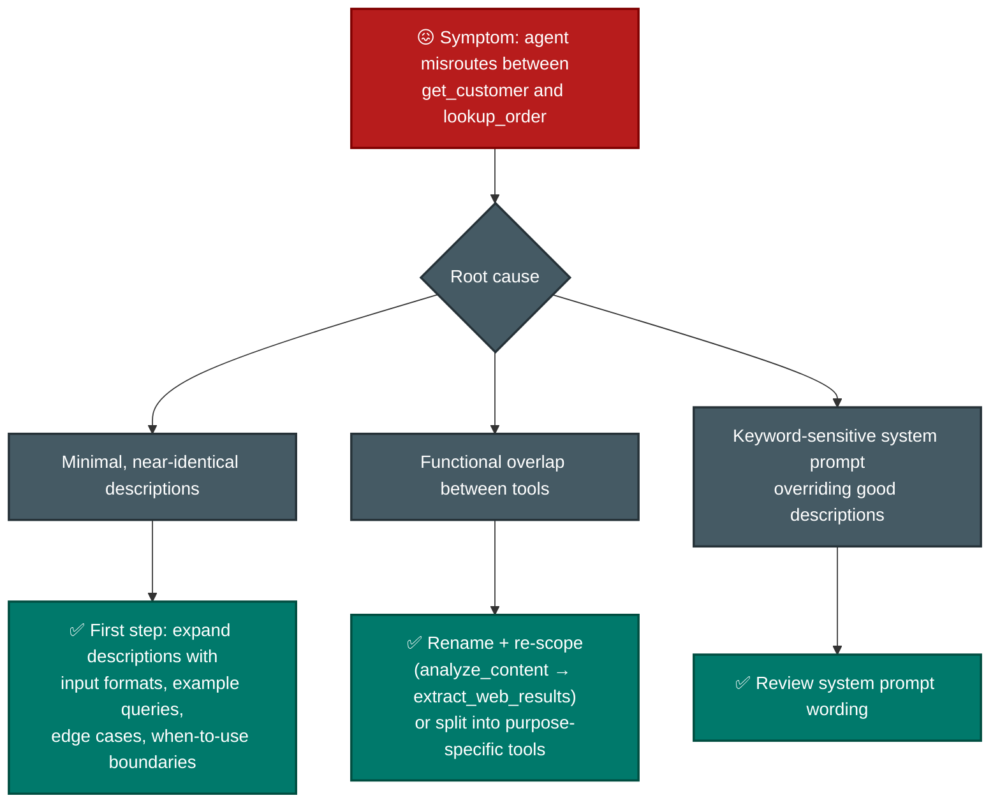
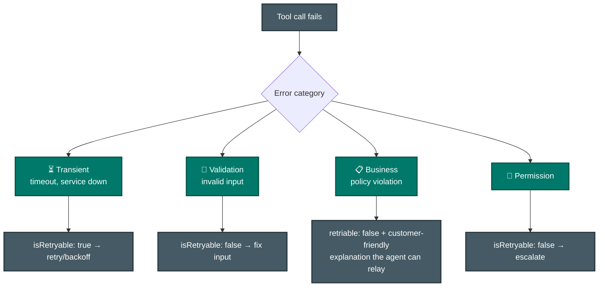
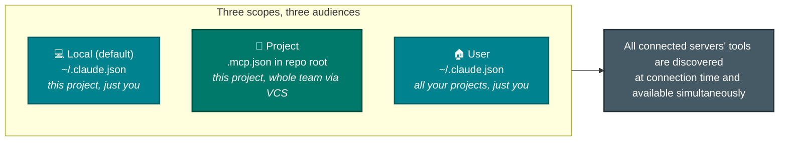
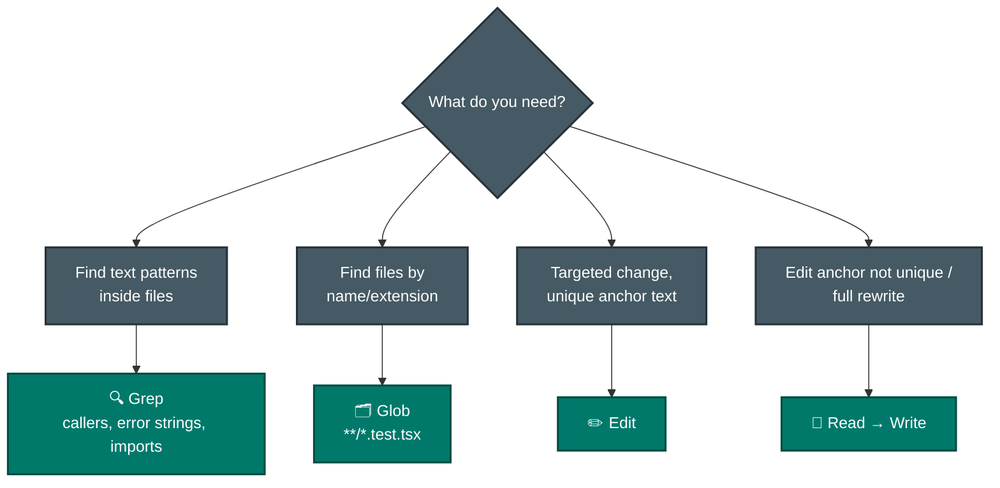
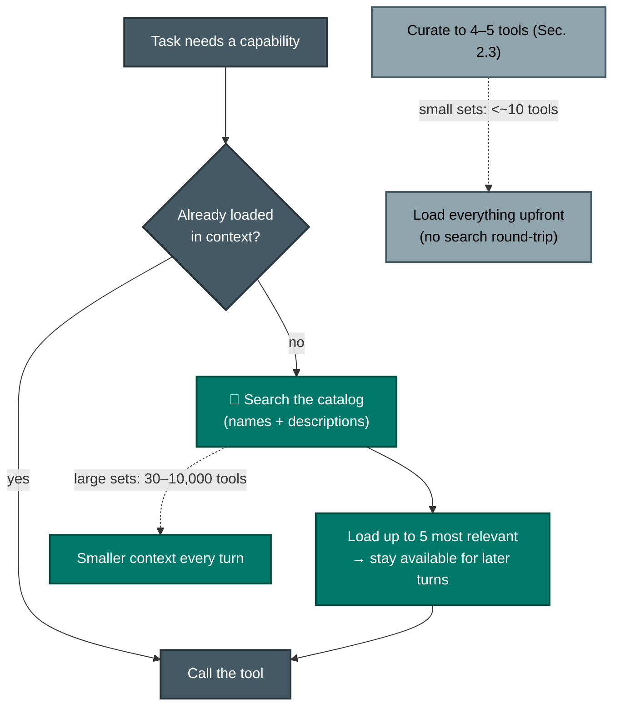
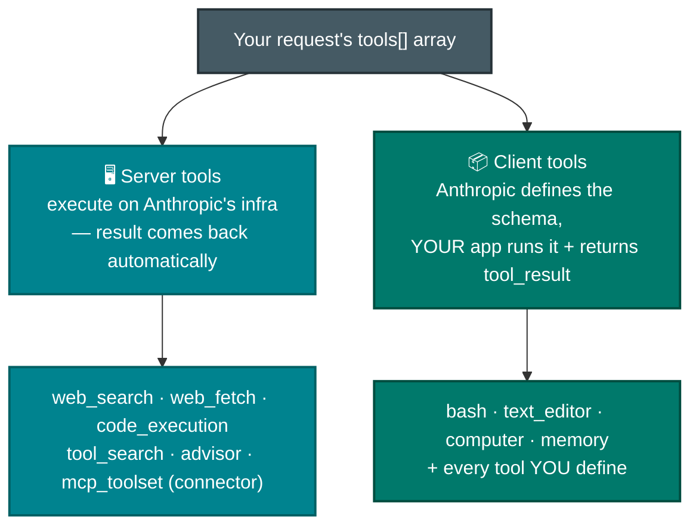

# F-D2 · Tool Design & MCP Integration (18%)

How Claude picks the right tool (descriptions are everything), how tools fail well (structured errors), and how MCP servers plug into Claude Code and agents.

**Tested by scenarios:** [① Customer Support](../scenarios/s1-customer-support-agent.md) · [③ Multi-Agent Research](../scenarios/s3-multi-agent-research.md) · [④ Developer Productivity](../scenarios/s4-developer-productivity.md)
**Source:** official [CCA-F Exam Guide](../../official-exam-guides/cca-f-exam-guide.pdf), task statements 2.1–2.5.

---

## The one fact this domain is built on

Claude cannot see your tools. It sees a list of **names, descriptions and JSON schemas** — text in the context window — and it picks from that text. It never reads your implementation, and it never observes what a tool actually does until it has already called it.

Almost every failure in this domain is that text being wrong, missing, or too crowded to read.

| Symptom | What is actually wrong | Section |
|---|---|---|
| Agent calls the wrong one of two similar tools | The descriptions do not distinguish them | 2.1 |
| Agent retries something that will never work, or gives up on something that would have | The error told it nothing it could act on | 2.2 |
| Agent picks badly once the catalog grows, or uses tools outside its job | Too many descriptions competing for attention | 2.3, 2.6 |
| Agent cannot reach your systems at all | Nothing wired them in | 2.4 |
| Agent burns the context window before it starts working | Wrong built-in for the job, or reading everything upfront | 2.5 |
| "Who runs this tool?" is unclear | Server tools and client tools are different things | 2.7 |

## 2.1 Tool interface design
([Define tools](https://platform.claude.com/docs/en/agents-and-tools/tool-use/define-tools) · [Custom tools in the Agent SDK](https://code.claude.com/docs/en/agent-sdk/custom-tools))

**The situation.** A support agent has `get_customer` and `lookup_order`. It calls `lookup_order` when it needed the customer record.

**What breaks.** At selection time the model has two names, two descriptions and two schemas. If that text does not draw a line between them, there is nothing to select on. This is not a reasoning failure — the information the model needed was never in the context. **Tool descriptions are the primary mechanism an LLM uses for tool selection**, so a thin description is a thin decision.

### What a description has to carry

A description that supports selection covers four things. Purpose is the one everybody writes; the other three are the ones that get skipped.

- **Purpose** — what the tool does.
- **Expected inputs and outputs** — formats, units, ID shapes. `customer_id` is not self-explanatory when three systems issue different ones.
- **When to use it instead of a similar tool** — the explicit boundary. This is the field that fixes misrouting, and it is the field most often absent.
- **Edge cases and example queries** — what a caller looks like in practice.

### When the problem is the tool, not the description

Sometimes the descriptions are fine and the tools genuinely overlap. Two moves:

- **Rename and re-scope.** `analyze_content` describes nothing. `extract_web_results` describes one job.
- **Split a generic tool into purpose-specific ones.** A single `analyze_document` becomes `extract_data_points`, `summarize_content` and `verify_claim_against_source` — three tools with clear input/output contracts instead of one tool with a mode argument.

### The order to try things in

Expanding descriptions is the low-effort, high-leverage first move. Reach for it before few-shot examples, before a routing layer, and before consolidating tools together. The later options cost more and often paper over a description that was one sentence long.

## 2.2 Structured error responses (MCP)
([Handle errors in custom tools](https://code.claude.com/docs/en/agent-sdk/custom-tools#handle-errors))

**The situation.** A tool call fails and returns `"Operation failed"`.

**What breaks.** The agent has one opaque string and four possible responses: retry, fix the input, escalate to a human, or explain the outcome to the customer. Nothing in that string tells it which. So it guesses — usually by retrying a call that will never succeed, or by abandoning one that would have worked on the second attempt.

**The fix.** Make the failure carry the information the recovery decision needs.

### The three fields

- **`errorCategory`** — transient, validation, business, or permission. The category is what selects the recovery path.
- **`isRetryable`** — a boolean, so the agent does not have to infer retryability from prose.
- **A human-readable description** — for business-rule failures this doubles as the text the agent relays to the customer, so write it as something a customer could read.

### How the failure is signalled

MCP marks a failed call with the **`isError`** flag (`is_error` in Python). What matters is that a handler error does not stop the agent loop — "how you report an error determines what Claude reads, not whether the query fails."

- **Throw an uncaught exception** and the MCP server converts it into an error result carrying the raw exception message. Claude sees a stack-trace string.
- **Catch it and return `isError: true`** and Claude sees the message you composed. You can add what the raw exception lacks: which request failed, and what to try instead.

Catch errors yourself whenever the raw exception is not enough for Claude to act on, which is most of the time.

### The distinction that gets tested

**An access failure is not a valid empty result.** A timeout means the agent does not know the answer and needs a retry decision. A successful query that matched zero rows means the agent *does* know the answer, and the answer is "none". Returning the second as an error makes the agent retry a query that will keep returning nothing.

**Subagents recover locally.** A subagent handles transient failures itself rather than bubbling every hiccup to the coordinator. It propagates only what it could not resolve, along with what it attempted and any partial results, so the coordinator can decide whether to re-delegate.

## 2.3 Tool distribution & `tool_choice`

**The situation.** The catalog grew to 18 tools, and a synthesis agent has started attempting its own web searches.

**What breaks.** Two different problems that both look like "the agent is behaving badly".

1. **Decision complexity.** Selection reliability degrades as the number of loaded tools grows. Eighteen near-neighbours is a harder choice than four.
2. **Scope.** A tool the agent can reach is a tool it will eventually use, regardless of whether that is its job. A synthesis agent with search access will search.

### Scoping the catalog per role

- Give each role the 4–5 tools that role actually needs. That is least privilege applied to tool access, and it fixes both problems at once.
- **Grant a scoped cross-role tool** when one need is high-frequency enough that routing it through the coordinator is wasteful. A `verify_fact` tool for the synthesis agent covers the simple 85% of cases; the complex remainder still goes through the coordinator. Narrow tool, narrow grant — not a general search tool.
- **Replace over-general tools with constrained ones.** `fetch_url` becomes `load_document`, which validates the URL before fetching. The constraint lives in the tool, not in a prompt asking the agent to be careful.

Curation is the answer at small scale. Past roughly 30 tools it stops being enough on its own, and 2.6 is the mechanism that takes over.

### Forcing the choice with `tool_choice`

`tool_choice` controls whether the model may answer in text or must call a tool. There are **four** values.

| `tool_choice` | Behavior | Use when |
|---|---|---|
| `"auto"` | Model decides whether to call a tool at all. **Default when `tools` are provided.** | Conversational agents |
| `"any"` | Model **must** call one of the provided tools, but you don't say which | Guarantee structured output when several schemas are valid |
| `{"type": "tool", "name": "…"}` | Model must call **that** tool | Force a specific extraction before other steps |
| `"none"` | Model may not call any tool. **Default when no `tools` are provided.** | Temporarily suppress tool use without rebuilding the request |

Three consequences worth knowing:

- **`any` and `tool` prefill the assistant message** to force a tool call. The model will not emit a natural-language explanation before the `tool_use` block, even if you explicitly ask it to.
- **Changing `tool_choice` invalidates cached message blocks.** Tool definitions and system prompts stay cached, but message content is reprocessed.
- **Manual extended thinking (`thinking: {type: "enabled"}`) does not support `any` or `tool`** — they error. Only `auto` and `none` work. Adaptive thinking, including models where thinking is on by default such as Opus 5, does support forced tool use.

## 2.4 MCP server integration
([MCP in Claude Code](https://code.claude.com/docs/en/mcp) · [Managed MCP](https://code.claude.com/docs/en/managed-mcp))

**The situation.** Claude Code needs to reach Jira, GitHub and a Postgres database that live outside the repo.

**What breaks without a standard.** Every integration becomes bespoke glue. MCP is the wiring standard that makes one server usable by Claude Code, the Agent SDK, and the API's MCP connector without rewriting it three times.

**The design question is not "how do I connect" but "who should get this server".** That is what scope decides.

### Where a server is configured, and who gets it

There are **three** scopes, set with `claude mcp add --scope <local|project|user>`.

| Scope | Loads in | Shared with team | Stored in |
|---|---|---|---|
| **Local** (default) | Current project only | No | `~/.claude.json` |
| **Project** | Current project only | **Yes, via version control** | `.mcp.json` in project root |
| **User** | All your projects | No | `~/.claude.json` |

- **Local and user both live in `~/.claude.json`.** They differ in reach, not in file. Local is scoped to one project's path inside that file; user applies everywhere. Do not treat `~/.claude.json` as meaning "user scope".
- **Project scope is the only shared one.** `.mcp.json` goes into version control, so the whole team gets the same servers.
- **Precedence when the same server is defined twice:** local → project → user → plugin-provided → claude.ai connectors. The entire entry from the highest-precedence source wins; fields are **not** merged across scopes. The three scopes match duplicates by name, while plugins and connectors match by endpoint.
- **Project servers need approval before they run.** Claude Code prompts before using a server from `.mcp.json`, because a repo you cloned should not be able to start processes on your machine unasked. `claude mcp reset-project-choices` clears those decisions.
- **Keep credentials out of the repo** with environment-variable expansion: `${GITHUB_TOKEN}` in `.mcp.json` resolves at load time. Expansion happens in the *server's* environment, so `${CLAUDE_PROJECT_DIR}` needs a default like `${CLAUDE_PROJECT_DIR:-.}` in a project-scoped entry.

### Resources are not tools

An MCP server can expose **resources** as well as tools, and they answer different questions.

- **Tools are actions.** The agent calls one and something happens.
- **Resources are read-only visibility** — content catalogs like issue summaries, documentation hierarchies, or database schemas. In Claude Code you reference them with `@` mentions, the same way you reference files, and they appear in the `@` autocomplete alongside them.

The payoff is turns saved. An agent that can see the schema does not need three exploratory tool calls to discover it.

### Build or adopt

Prefer an existing community MCP server for a standard integration such as Jira or GitHub. Build a custom server only for workflows specific to your team — the ones no public server can know about.

If the agent keeps reaching for built-in `Grep` instead of your more capable MCP tool, that is 2.1's problem in a new costume. **Improve the MCP tool's description**; do not remove the built-in.

### Org controls — the governance layer

By default any user can add any server. Administrators clamp that down from **managed settings**, which sit above CLI, user and project config.

- **`managed-mcp.json`** defines a fixed, *exclusive* server set at a system path. Users cannot add others.
- **`allowedMcpServers` / `deniedMcpServers`** are allow and deny lists matching on `serverUrl`, `serverCommand` or `serverName`. **Deny always wins.** Matching on `serverName` is not a security control, because the user picks the label.
- **`allowManagedMcpServersOnly: true`** makes the managed allowlist authoritative. User and project allowlists are ignored; denylists still merge in from every scope.

This is the F-D2 glimpse of the least-privilege story told in full in [P-D5](../../CCA-P/domains/d5-governance-safety-risk.md).

## 2.5 Built-in tools: Read, Write, Edit, Bash, Grep, Glob

**The situation.** An agent is dropped into an unfamiliar codebase and asked to trace how a feature works.

**What breaks.** The instinct is to read a lot of files. That fills the context window with material the agent has not yet decided is relevant, and by the time it knows what matters, the budget is gone. This is F-D1 §6's attention problem arriving through the file system.

**The fix.** Search before reading, and read only what the search pointed at.

- **Grep searches file contents. Glob matches file names.** "Find every call site of `processPayment`" is Grep. "Find every `*.test.tsx`" is Glob. This pair is a standing distractor because both feel like "search".
- **Edit requires a unique text match.** If the anchor text appears more than once the edit fails, and the fallback is Read followed by Write.
- **Build understanding incrementally.** Grep for entry points, then Read to follow imports and trace the flow. Reading everything upfront is the anti-pattern.
- **Tracing usage across wrapper modules** takes two passes: first identify every exported name, then search each one across the codebase. One pass misses re-exports.

## 2.6 Tool search — scaling past the "too many tools" wall
([Tool search](https://code.claude.com/docs/en/agent-sdk/tool-search))

**The situation.** The catalog is no longer 18 tools. It is 500, because you connected four MCP servers.

**What breaks.** Two things scale badly at once, and the docs quantify both.

- **Context cost.** "Tool definitions can consume large portions of the context window (50 tools can use 10-20K tokens), leaving less room for actual work."
- **Selection accuracy.** It "degrades with more than 30-50 tools loaded at once."

Curation (2.3) is the answer while a catalog is small. It cannot be the answer at 500, because those tools genuinely need to exist.

**The fix.** Break the link between *how many tools exist* and *how many are loaded*. Tool search withholds the definitions, gives the model a searchable summary, and loads only what a task needs — where they stay available for later turns.

### The trade, stated plainly

Tool search costs **one extra round-trip** the first time Claude discovers a tool, and buys **smaller context on every turn afterwards**. That is a clear win for large catalogs and a clear loss for small ones — "with fewer than ~10 tools, loading everything upfront is typically faster."

- **On by default**, on recent Sonnet, Haiku and Opus models. It is off by default on Google Cloud's Agent Platform, and off when `ANTHROPIC_BASE_URL` points at a non-first-party host, because most proxies do not forward `tool_reference` blocks.
- **`ENABLE_TOOL_SEARCH`**: unset = on · `true` = force on · `false` = load everything upfront · **`auto`** = activate only when tool definitions exceed **10%** of the model's context window (`auto:N` sets a custom percentage, so `auto:5` triggers at 5%).
- **Ceiling: 10,000 tools** in the catalog, **five** results returned per search by default.
- If the conversation is compacted, previously discovered tools may be dropped from context and the agent simply searches again.

### It rewards the same thing 2.1 does

Searchable names and keyword-rich descriptions surface for more queries. `search_slack_messages` is findable; `query_slack` is not. **Descriptions drive both selection and discovery**, so 2.1's lesson does not get superseded at scale — it gets a second job.

Curation and tool search are complementary, not alternatives. Scope tools per role *and* defer the long tail. "Just enable tool search" is not a substitute for coherent per-role tool design, and it is not the fix for a five-tool misrouting problem.

## 2.7 Anthropic-provided tools & tool-definition properties (API level)
([Tool reference](https://platform.claude.com/docs/en/agents-and-tools/tool-use/tool-reference) · [Programmatic tool calling](https://platform.claude.com/docs/en/agents-and-tools/tool-use/programmatic-tool-calling))

**The situation.** You are on the Messages API rather than in Claude Code, and the `tools` array can hold three different kinds of thing at once: tools you wrote, tools Anthropic defined for you to run, and tools Anthropic both defines *and* runs.

**The question that sorts them.** Not "who wrote the schema" but **"who executes it"**.

- **Server tools run on Anthropic's infrastructure** and return their result to the model with no round-trip to your code: web search, web fetch, code execution, tool search, advisor, and the `mcp_toolset` MCP connector.
- **Client tools** mean Anthropic supplies the schema but **your loop executes them and returns the `tool_result`**. That covers `bash`, `text_editor`, `computer` and `memory` — and *every* tool you define yourself. Whether you hand-write that loop is the manual-vs-Tool-Runner choice from [F-D1 §1](d1-agentic-architecture.md).
- **Anthropic-provided tools are date-versioned** (`web_search_20260318`, `text_editor_20250728`). Older versions stay live so integrations do not break, and a new date drops when behaviour, schema or model support changes. Undated aliases such as `tool_search_tool_regex` resolve to the latest. Versions are not always a straight upgrade: `text_editor_20250728` versus `text_editor_20250124` is model-keyed, and the two `tool_search_tool_*` types are two algorithms released together where neither supersedes the other.

### Properties that compose on any tool

| Property | What it does | Ties to |
|---|---|---|
| `cache_control` | Set a prompt-cache breakpoint at this tool definition | Caching ([P-D2](../../CCA-P/domains/d2-models-prompting-context.md)) — tools sit first in the prefix, so a tool change busts everything |
| `strict` | Guarantee schema validation on tool name + inputs (not available on `mcp_toolset`) | Reliable structured output ([F-D4 §4.3](d4-prompting-structured-output.md)) |
| `defer_loading` | Keep the tool **out of the initial prompt**; load on demand when tool search returns a `tool_reference` | The API knob behind §2.6 |
| `allowed_callers` | Restrict who may call it (`direct` model call vs from inside code execution) | Least privilege / programmatic tool calling |
| `input_examples` | Example input objects to help Claude call it correctly (user-defined and Anthropic-schema client tools only, never server tools) | Reinforces §2.1 |
| `eager_input_streaming` | Fine-grained input streaming instead of standard buffered streaming (user-defined tools only) | Latency on large tool inputs |

Three consequences worth carrying:

- **`defer_loading: true` preserves the cache.** Deferred tools are stripped from the rendered `tools` section *before* the cache key is computed, so adding them does not invalidate an existing cache. That is the API-level reason tool search scales without a caching penalty. When search discovers one, its full definition expands **inline in the conversation body**, not in the prefix.
- **`strict` is the guarantee; good descriptions are the guidance.** `strict` enforces that inputs *match* the schema. It does nothing to help Claude *pick* the right tool — that is still §2.1's job. Use both.
- **`allowed_callers` unlocks programmatic tool calling.** With the code execution tool enabled, tagging a tool `allowed_callers: ["code_execution_20260120"]` lets Claude **write code that calls your tool inside the sandbox** instead of spending one model round-trip per call. One script can fan out 20 lookups, filter, and return only the rows that matter — cutting latency and keeping bulk intermediate results out of the model's context. Anthropic reports roughly 11% better agentic-search accuracy at about 24% fewer input tokens. `["direct"]` means ordinary model-issued calls, and each response block tags its `caller`. It is guidance, not a security boundary: your loop must still handle a `direct` call for any tool it defines.

> **Sources.** Tool selection, descriptions and error handling: [Define tools](https://platform.claude.com/docs/en/agents-and-tools/tool-use/define-tools) and [Custom tools](https://code.claude.com/docs/en/agent-sdk/custom-tools). `tool_choice` semantics, including the four values and the prefill and caching consequences: [Implement tool use](https://platform.claude.com/docs/en/agents-and-tools/tool-use/implement-tool-use). MCP scopes, precedence, project-server approval and resource `@` mentions: [MCP in Claude Code](https://code.claude.com/docs/en/mcp); org controls from [Managed MCP](https://code.claude.com/docs/en/managed-mcp). Tool search figures are quoted from [Tool search](https://code.claude.com/docs/en/agent-sdk/tool-search). Server-vs-client split, versioning and tool properties: [Tool reference](https://platform.claude.com/docs/en/agents-and-tools/tool-use/tool-reference) and [Programmatic tool calling](https://platform.claude.com/docs/en/agents-and-tools/tool-use/programmatic-tool-calling).

---

## Exam traps checklist

| Trap | Correct instinct |
|---|---|
| Fix tool misrouting with few-shot / routing layer / merging tools | Fix the descriptions first |
| Generic error strings | errorCategory + isRetryable + description |
| Empty search result treated as failure | Valid empty result ≠ access failure |
| Give an agent every tool "just in case" | Scoped, role-based tool sets (4–5) |
| "MCP has two scopes: project and user" | Three — local (default), project, user. Local and user both live in `~/.claude.json` |
| Assuming a `.mcp.json` server just works after clone | Project-scoped servers prompt for approval first |
| Secrets hard-coded in .mcp.json | `${ENV_VAR}` expansion |
| Glob to search file contents | That's Grep |
| Forgetting `tool_choice: "none"` exists | Four values: auto, any, tool, none |
| `tool_choice: "any"` with manual extended thinking | Errors — only `auto`/`none` are compatible |
| Enable tool search to fix a 5-tool misrouting | That's a description/curation problem (§2.1/§2.3), not scale |
| Load all 500 tools upfront "so Claude can see them" | Tool search defers; accuracy dies past ~30–50 loaded |
| "Server tools like web_search run in my app" | No — server tools execute on Anthropic infra; *client* tools (incl. yours) run in your loop |
| Adding tools always invalidates the prompt cache | `defer_loading: true` keeps them out of the prefix → cache survives |
| `strict` will make Claude choose the right tool | `strict` validates inputs; *descriptions* drive selection (§2.1) |

**Practice:** [claude-cookbooks `tool_use` + `tool_evaluation`](https://github.com/anthropics/claude-cookbooks) · [MCP docs](https://modelcontextprotocol.io) · Exercise 1 in the official guide (two deliberately-similar tools).
