# F-D3 · Claude Code Configuration & Workflows (20%)

Configuring Claude Code for teams: memory hierarchy, commands/skills, path rules, plan mode, refinement technique, and CI/CD.

**Tested by scenarios:** [② Code Generation](../scenarios/s2-code-generation.md) · [④ Developer Productivity](../scenarios/s4-developer-productivity.md) · [⑤ CI/CD](../scenarios/s5-ci-cd.md)
**Source:** official [CCA-F Exam Guide](../../official-exam-guides/cca-f-exam-guide.pdf), task statements 3.1–3.6.

---

## The shape of this domain

Claude Code starts with no knowledge of your project. This domain answers two questions: **what should Claude know**, and **what should Claude be allowed to do**.

Keep these questions separate. The exam often tests one by giving an answer for the other.

| | Mechanism | Enforced by |
|---|---|---|
| **What Claude knows** | CLAUDE.md (3.1), skills and commands (3.2), path rules (3.3) | Nothing. It's context - it shapes what Claude *tries* |
| **What Claude may do** | Permission rules and modes (3.8), hooks (3.7), sandboxing (3.11) | Claude Code itself, deterministically |
| **How you work with it** | Plan mode (3.4), refinement (3.5), CI/CD (3.6) | You |
| **How you ship it to others** | Plugins (3.9), settings precedence (3.10) | Config distribution |

A line in CLAUDE.md that says "never run `terraform apply`" is only an instruction. A **deny rule** is enforced by Claude Code for each tool call. Section 3.8 explains deny rules.

**How the sections connect.** Sections 3.1–3.3 cover knowledge at narrower scopes: always-loaded conventions, on-demand procedures, and rules for matching files. Sections 3.4–3.6 cover how you work with Claude, including unattended CI. Sections 3.7 and 3.8 describe the same control system from two sides: hooks run code at fixed points, while permission rules declare what is allowed. Sections 3.9–3.11 cover distribution, settings, and runtime isolation.

## 3.1 CLAUDE.md hierarchy & modularity
([Memory](https://code.claude.com/docs/en/memory))

**The problem:** Your team repeats the same project conventions in every session, such as the test runner, error format, and migration location.

**The solution:** Put these conventions in a CLAUDE.md file. It loads automatically. Choose the correct file because the four scopes reach different people.

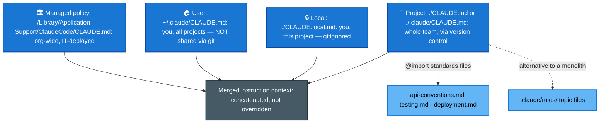

### The four scopes

| Scope | Location | Shared with |
|---|---|---|
| **Managed policy** | `/Library/Application Support/ClaudeCode/CLAUDE.md` (macOS), `/etc/claude-code/CLAUDE.md` (Linux/WSL), `C:\Program Files\ClaudeCode\CLAUDE.md` | Everyone in the organization |
| **User** | `~/.claude/CLAUDE.md` | Just you, across all projects |
| **Project** | `./CLAUDE.md` or `./.claude/CLAUDE.md` | The team, via source control |
| **Local** | `./CLAUDE.local.md` | Just you, this project - gitignore it |

**Common problem:** A new teammate does not get the instructions. They were probably saved at **user** level or in `CLAUDE.local.md`, not at **project** level. Only the project file is shared through version control.

### How the files combine

- All discovered files are **combined in context, not overridden**. Both user and project instructions apply.
- Claude reads from the filesystem root down to the working directory. Instructions closer to the working directory load **last**. In the same directory, `CLAUDE.local.md` loads after `CLAUDE.md`.
- Files **above** the working directory load fully at startup. Files in **subdirectories** load when Claude reads a file in that subtree.

### Keeping it from becoming a monolith

- **`@import`** includes separate standards files, keeping `CLAUDE.md` short and easy to scan.
- **`.claude/rules/`** holds topic files such as `testing.md` and `api-conventions.md`. They load as instruction context like CLAUDE.md. Use separate rules when CLAUDE.md becomes too long. A rule can also use a `paths:` filter to load only for matching files, as explained in 3.3.
- Do not put multi-step or location-specific instructions in CLAUDE.md. Use skills for multi-step procedures (3.2) and path-specific rules for location-specific conventions (3.3).

### Diagnosing "it's ignoring my instructions"

These two commands have different purposes:

- **`/memory`** lists memory file *locations* at user and project scope, including files that do not exist yet. It also opens them for editing.
- **`/context`** shows which files **actually loaded** in the current session. If a file is not in its **Memory files** list, Claude cannot see it.

Use `/context` first when behaviour changes between sessions. Use `/memory` to edit files, not to verify what loaded.

## 3.2 Slash commands & skills
([Skills](https://code.claude.com/docs/en/skills) · [Slash commands](https://code.claude.com/docs/en/commands))

**The problem:** You have a procedure, such as a release checklist or review process, that you do not want to type again. It does not apply to every session.

**The cause:** CLAUDE.md always loads. A long deployment procedure would use context even during unrelated work.

**The solution:** Use a slash command or skill. Both load only when needed. The main difference is who starts them.

- A **slash command** is a Markdown file added to the conversation when *you* type `/its-name`. It is a saved prompt.
- A **skill** is a folder with a `SKILL.md` that explains when to use it. *Claude* can start the skill when a task matches, even if you do not name it.

| | Commands | Skills |
|---|---|---|
| Location (project) | `.claude/commands/` (shared via VCS) | `.claude/skills/` + `SKILL.md` |
| Location (personal) | `~/.claude/commands/` | `~/.claude/skills/` (rename to avoid clobbering team skills) |
| Loading | On invocation | On demand - Claude decides from the description |
| Invoked by | You, by typing `/name` | You *or* Claude, when the task matches |

### SKILL.md frontmatter worth memorizing

- **`context: fork`** runs the skill in a separate subagent context. Long exploration stays out of the main conversation. This uses the isolation described in F-D1 §3.
- **`allowed-tools`** limits tool access while the skill runs. For example, an analysis skill can block writes.
- **`argument-hint`** asks for required parameters when the skill starts without them.

**The choice:** Use CLAUDE.md for standards that apply to every session. Use a skill for task-specific procedures.

## 3.3 Path-specific rules
([Path-specific rules](https://code.claude.com/docs/en/memory#path-specific-rules))

**The problem:** Some conventions apply to a file type, but those files are spread across many directories. For example, test files may appear throughout the project.

**The cause:** A directory-level `CLAUDE.md` only helps when a convention belongs to one directory. A root CLAUDE.md works, but loads the testing rules in every session.

**The solution:** Add a file to `.claude/rules/` with a `paths:` glob in its YAML frontmatter. It loads **only when Claude reads a matching file**.

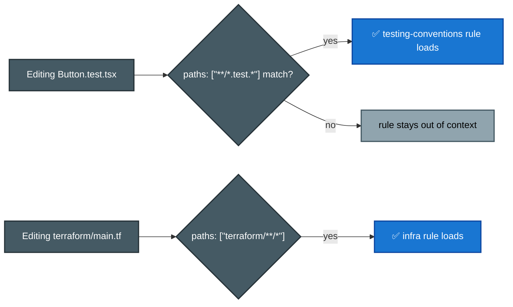

- **Use glob rules when a convention covers files in different directories.**
- **A rule without a `paths` field always loads** and applies everywhere.
- **The rule loads when Claude reads a matching file**, not on every tool call.
- Brace groups expand into several patterns. `src/*.{ts,tsx}` becomes two patterns, while `{a,b}/{c,d}/*.{ts,tsx}` becomes eight. Each rule has a limit of 1,000 expanded patterns across its `paths` list. Patterns above that limit stay unexpanded, so their literal braces match nothing.

## 3.4 Plan mode vs direct execution
([Permission modes](https://code.claude.com/docs/en/permission-modes))

**The choice:** After setting up Claude's context, decide whether it should edit now or explore and propose a plan first.

**The risk:** Direct execution can take the wrong approach across many files. Plan mode avoids that rework. For a clear one-line fix, however, planning adds little value.

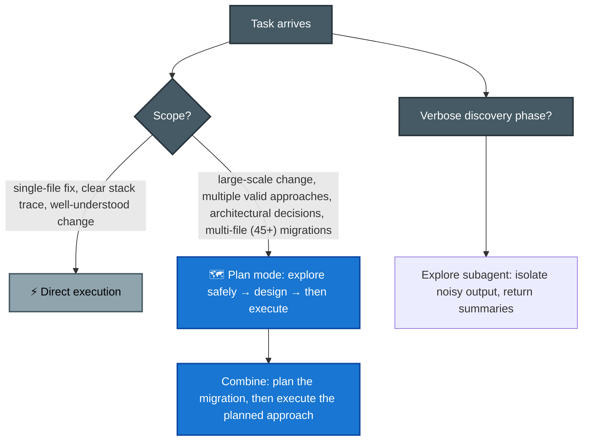

- **Plan mode lets Claude explore before making changes.** It never auto-approves file edits, even when an allow rule matches. You must approve them.
- **You can combine both modes.** Plan a large migration, approve the approach, then execute it.
- **The Explore subagent** is a built-in read-only agent that searches the codebase in its own context ([F-D1 §3](d1-agentic-architecture.md)). Its many searches and file reads stay out of the main conversation; only the summary returns. Use it when exploration is long but the answer is short.

## 3.5 Iterative refinement techniques

**The problem:** Claude produced code that is close but not right. Re-prompting with "no, do it properly" does not help.

**The cause:** Unclear descriptions of a change can be interpreted differently each time. Remove that ambiguity.

- **Give clear input/output examples.** Two or three examples define a change more clearly than a long description.
- **Use test-driven iteration.** Write the tests first, then share each failure. Tests define the expected result, and failures give exact feedback.
- **Use the interview pattern.** Ask Claude to question you before it starts. In an unfamiliar area, this can reveal missing details such as cache invalidation, failure modes, or backfill order.
- **Group related issues.** Put connected issues in one detailed message so each fix considers the others. Send unrelated issues one at a time to keep the focus clear.

## 3.6 Claude Code in CI/CD
([Headless mode](https://code.claude.com/docs/en/headless))

**The problem:** You want Claude to review every pull request automatically, with no one at the terminal.

**The cause:** Claude Code is interactive by default. In CI, it waits for input until the job times out. Its normal prose output is also difficult for an automated step to use as inline comments.

**The solution:** Use one flag for non-interactive execution and another for structured output.

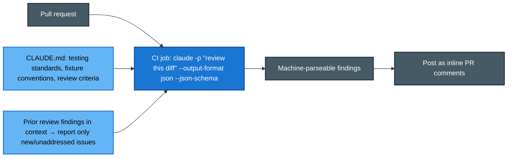

- **`-p` / `--print` enables non-interactive mode.** Use it when a pipeline waits for input. There is no `--batch` flag, and an environment variable or `< /dev/null` is not a replacement.
- **`--output-format`** accepts `text` (default), `json`, or `stream-json` for newline-delimited streaming. JSON output includes `total_cost_usd` and a cost breakdown by model, so scripts can track each run's cost.
- **`--json-schema`** with `--output-format json` enforces an output shape. The result appears in **`structured_output`**. An invalid schema causes a hard error: `Error: --json-schema is not a valid JSON Schema`. It does not fall back to prose. The `format` keyword is accepted as an annotation but is not enforced.

### What to feed it

- **CLAUDE.md provides project context** such as test standards, fixture conventions, and review criteria.
- **Include earlier findings and current test files in the context** so the run reports only new or unresolved issues.
- **Review in a fresh session.** A separate instance gives a more independent review than the session that generated the code.

## 3.7 Hooks - deterministic control over the Claude Code lifecycle
([Hooks guide](https://code.claude.com/docs/en/hooks-guide) · [Hooks reference](https://code.claude.com/docs/en/hooks))

**The problem:** In an unattended pipeline, some rules must always apply. For example: format every edit, never access `.env`, restore context after compaction, or send a notification when Claude needs input.

**The cause:** Instructions in sections 3.1–3.3 only guide the model. The model may not follow them every time.

**The solution:** Use a hook. A hook is a **shell command that Claude Code runs at a fixed point in its lifecycle**. Claude Code starts it every time; the model does not choose. Hooks are configured in JSON.

This is the Claude Code `settings.json` version of the Agent SDK hooks in [F-D1 §5](d1-agentic-architecture.md). Hooks enforce fixed behaviour, while prompts only guide behaviour.

> **Important term:** Claude Code also has **allow, ask, and deny rules** for tool calls. Section 3.8 explains them. For now, remember that **a deny rule is an absolute block in a settings file**. Hooks work with these rules, not instead of them. This is why hooks can tighten access but cannot loosen it.

### Where hooks fire in a turn

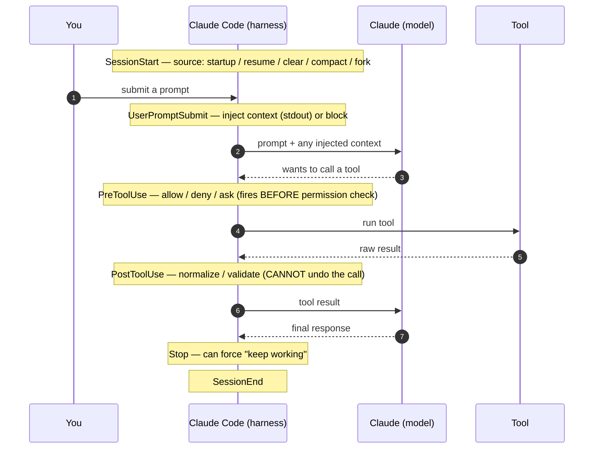

The reference lists around 30 events. These are the main ones:

| Event | Fires… | What it lets you do |
|---|---|---|
| `SessionStart` | session begins/resumes | stdout is **added to context**; the `compact` matcher **re-injects context after compaction** |
| `UserPromptSubmit` | you submit, before Claude sees it | inject context (`additionalContext`) or block the prompt |
| `PreToolUse` | **before** a tool runs | **block / approve** the call - the gate |
| `PostToolUse` | **after** a tool succeeds | **normalize heterogeneous results** (Unix→ISO timestamps, codes→labels) before the model reads them; cannot undo |
| `Notification` | Claude needs input/permission | desktop alerts; matchers like `permission_prompt`, `idle_prompt` |
| `Stop` | Claude finishes responding | force continuation ("tasks not done, keep going") |
| `SubagentStart` / `SubagentStop` | a subagent spawns / finishes | per-subagent policy; matcher is the agent type |
| `PreCompact` / `PostCompact` | around context compaction | save and restore state around summarization |
| `SessionEnd` | session terminates | cleanup; matcher is the reason (`clear`, `logout`, …) |

### The PreToolUse gate

Use this mechanism to block `process_refund` until identity is verified. A hook can respond in two ways. **Do not mix them.**

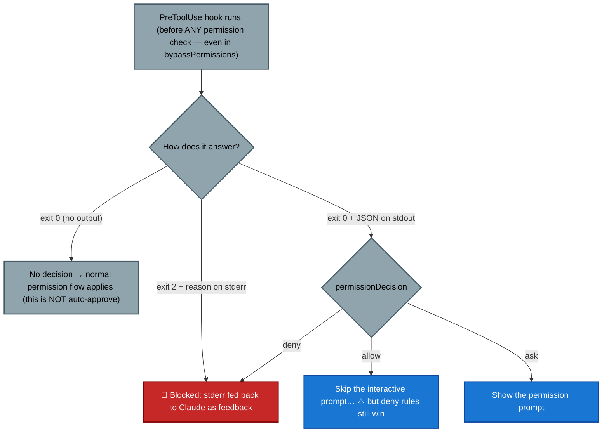

- **Exit `0`** means no objection. The normal permission flow still runs, so this is *not* an approval. **Exit `2`** blocks the call, and stderr becomes feedback for Claude. **Any other exit code** appears as an error notice.
- For structured control, exit `0` and print JSON with `permissionDecision`: `allow`, `deny`, or `ask`. The `defer` value is available only in headless `-p` mode.
- **An exit-2 block overrides allow rules.** It stops the call before permission rules are checked. To run most Bash commands without prompts, put `"Bash"` on the allow list and use a `PreToolUse` hook to reject specific commands.
- **Hooks can tighten access but cannot loosen it.** A hook's `allow` cannot override a deny rule, and managed deny rules always win. A hook's `deny` still works in `bypassPermissions` and with `--dangerously-skip-permissions` because `PreToolUse` runs before the permission-mode check.

### Input, output, and the deterministic↔judgment spectrum

Hooks communicate with Claude Code through **stdin, stdout, stderr, and exit codes**. They receive event JSON on stdin, including fields such as `session_id`, `cwd`, `hook_event_name`, `tool_name`, and `tool_input`. A Bash `PreToolUse` hook receives the command in `tool_input.command`.

There are five hook `type`s. They follow the rule-based versus judgment-based split from F-D1 §5.3:

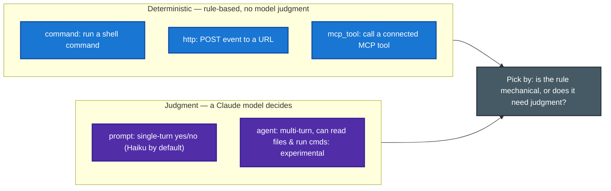

- `command`, `http`, and `mcp_tool` apply fixed rules. `prompt` makes a single judgment and returns `{"ok": true|false, "reason": …}`. `agent` handles multi-step judgment and should **verify the real codebase state**, such as blocking `Stop` until tests pass.
- **For `SessionStart` and `UserPromptSubmit`, stdout is added to Claude's context.** Use this to provide dynamic context. For other events, stdout is read as a decision.

### Configuration & scope

Hooks live in a `hooks` block in a settings file. The structure is event → `matcher` → an array of `{ type, command }`. A `matcher` can select tool names such as `"Edit|Write"`, `"Bash"`, or `"mcp__.*"`, or event-specific values. An empty matcher runs every time the event occurs.

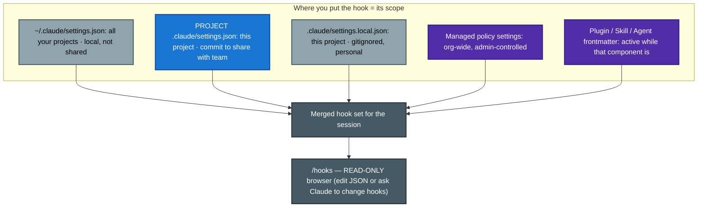

The team and personal scopes match CLAUDE.md in 3.1. **Project `.claude/settings.json` is shared through VCS**, while `~/.claude/settings.json` is personal. `/hooks` only shows the configuration, like `/memory`. Edit the JSON yourself or ask Claude to edit it. `disableAllHooks: true` disables hooks, but managed hooks still run unless they are also disabled in managed settings.

### What goes wrong

- **Hooks run with your credentials and shell.** Review them as carefully as any code you are about to run.
- **`PostToolUse` cannot undo an action** because the tool has already run. Use `PreToolUse` to prevent an action. Use `PostToolUse` to react to or normalize its result.
- **`Stop` hooks run whenever Claude finishes a response**, not only when the task is complete. Claude Code limits a repeated `Stop` block to **8 consecutive blocks**. Check `stop_hook_active` to stop the loop.
- **`PermissionRequest` hooks run before Claude Code asks you for permission.** They can send the request elsewhere, such as Slack. They **do not run in headless `-p` mode** (3.6) because there is no user prompt. Use `PreToolUse` for automated CI decisions.

## 3.8 Permission modes & permission rules
([Permission modes](https://code.claude.com/docs/en/permission-modes) · [Permissions](https://code.claude.com/docs/en/permissions))

**The problem:** You want fewer permission prompts for normal work without allowing a dangerous command such as `terraform apply`.

**The solution has two controls:** A **mode** sets the default level of access and how often Claude pauses. **Rules** add fixed exceptions for individual tools in every mode. Do not confuse them. Use **`Shift+Tab`** to change modes. The UI calls `default` mode **Manual**.

```mermaid
flowchart LR
    D["default / Manual: reads only, prompts for the rest"] --> AE["acceptEdits: + file edits &amp; common fs cmds"]
    AE --> PL["plan: reads/explores, NO edits until you approve"]
    PL --> AU["auto: everything, with a classifier safety-net"]
    AU --> DA["dontAsk: only pre-approved tools; auto-DENY the rest"]
    DA --> BP["bypassPermissions: skip all checks — containers/VMs only"]
    classDef safe fill:#1976D2,color:#fff,stroke:#0D47A1,stroke-width:2px
    classDef mid fill:#F9A825,color:#000,stroke:#F57F17,stroke-width:2px
    classDef danger fill:#C62828,color:#fff,stroke:#7f0000,stroke-width:2px
    class D,PL safe
    class AE,AU,DA mid
    class BP danger
```

| Mode | Runs without asking | Reach for it |
|---|---|---|
| `default` (**Manual**) | reads only | sensitive work, getting started |
| `acceptEdits` | reads + edits + `mkdir`/`touch`/`mv`/`cp`… in scope | iterating on code you'll review via `git diff` |
| `plan` | reads only, **no source edits** | explore and design before changing (3.4) |
| `auto` | everything, with a **classifier** blocking escalations | long tasks, prompt fatigue (needs an eligible plan/model) |
| `dontAsk` | only `allow`-listed + read-only Bash | **CI and scripts** - never waits for input |
| `bypassPermissions` | everything, including protected paths | **isolated containers/VMs only** |

### Rules and their precedence

Manage rules with `/permissions`. The syntax is `Tool` or `Tool(specifier)`, for example: `Bash(git *)`, `Edit(*.ts)`, `Read(./.env)`, `WebFetch(domain:example.com)`, or `mcp__server__tool`.

Claude Code checks rules in a **fixed order: deny, ask, then allow. The first match wins. A more specific rule does not change this order.**

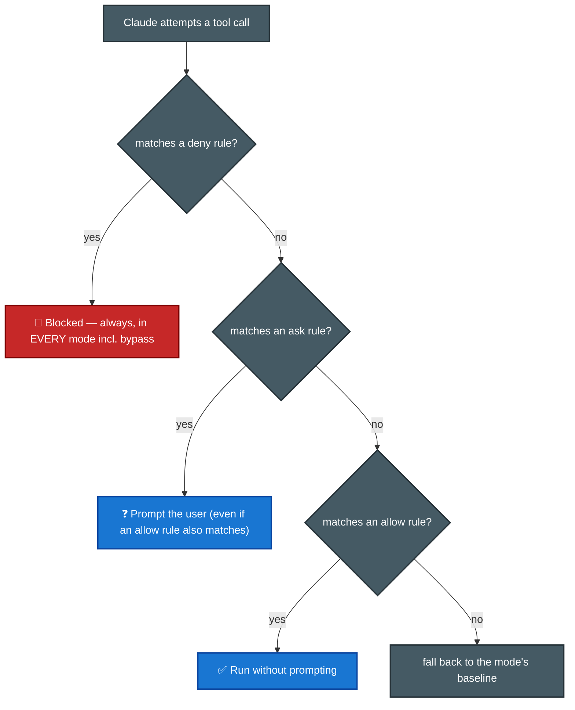

- **A broad deny overrides a narrow allow.** `deny Bash(aws *)` blocks `Bash(aws s3 ls)` even if that exact command has an allow rule. You cannot add allow-list exceptions inside a deny rule. The same applies to ask and allow: a matching ask rule prompts even when a more specific allow rule also matches.
- **A bare deny and a scoped deny work differently.** A bare `Bash` removes the tool from Claude's context. A scoped `Bash(rm *)` keeps Bash available but blocks matching commands.
- **Deny and ask rules can match an input parameter** with `Tool(param:value)`, such as `Agent(model:opus)`, `Agent(isolation:worktree)`, or `Bash(run_in_background:true)`. Allow rules use each tool's normal specifier syntax because one safe parameter does not make the whole call safe.
- **Protected paths** such as `.git`, `.claude`, `.env`-style files, and `.mcp.json` are never auto-approved except in `bypassPermissions`. Even `allow Edit(.claude/**)` cannot pre-approve them because the safety check runs before allow rules.
- **Claude Code enforces rules, not the model.** CLAUDE.md and prompts guide what Claude tries to do. They do not control what it may do. Use a rule, mode, or `PreToolUse` hook to enforce access.
- **Scope precedence matches hooks and CLAUDE.md:** `~/.claude/settings.json` (personal) < project `.claude/settings.json` (team, VCS) < managed policy settings. Managed policy wins and cannot be overridden. Choosing "yes, don't ask again" for a Bash command saves the rule in `.claude/settings.local.json`.

**For CI:** Use `dontAsk` with an explicit allow list. The session never waits for input and runs only pre-approved tools. This is safer than `bypassPermissions`.

## 3.9 Plugins & marketplaces - packaging config for distribution
([Plugins](https://code.claude.com/docs/en/plugins) · [Plugin marketplaces](https://code.claude.com/docs/en/plugin-marketplaces))

**The problem:** Your `.claude/` configuration works in one repository, and several other repositories need the same setup.

**The cause:** `.claude/` is project-specific. If you copy it to every repository, you must repeat every update. The copies are not versioned together, and commands with the same name can conflict.

**The solution:** Package the components as a portable, versioned, namespaced plugin.

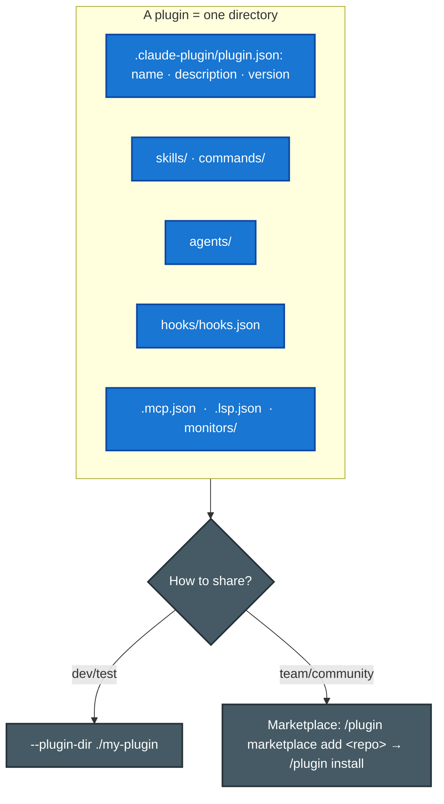

- **A plugin can include** skills and commands (3.2), agents, hooks (3.7), MCP servers ([F-D2 §2.4](d2-tool-design-mcp.md)), **LSP servers**, and **background monitors**. LSP servers provide symbol lookup and language diagnostics. Background monitors watch long-running tasks and report their state to the session. Without a plugin, these parts would be spread across `.claude/` and `settings.json`.
- **Use standalone `.claude/` configuration** for personal or single-project work with short names such as `/deploy`. Use a plugin when the setup must be shared, versioned, and reused. Plugin commands are **namespaced**, such as `/my-plugin:deploy`, to prevent name conflicts.
- **The manifest is `.claude-plugin/plugin.json`.** Its `name` defines the namespace, and its `version` controls updates. **Only `plugin.json` belongs inside `.claude-plugin/`.** Put `skills/`, `hooks/`, and other components at the plugin **root**.
- **Use a marketplace to distribute plugins.** A marketplace is a Git repository and can be private for internal use. Install a plugin with `/plugin install`. During development, use `--plugin-dir` to load a local copy.

**The choice:** Use a plugin for distribution, reuse across repositories, or versioned updates. Use `.claude/` configuration for one project.

## 3.10 Settings files & precedence - the config backbone
([Settings](https://code.claude.com/docs/en/settings))

**The problem:** Hooks, permissions, and many plugin settings use `settings.json`, but this file exists at several scopes. The same key may appear in several files, and a setting may not behave as expected.

**The rule:** The scope with the highest precedence wins, except for permission rules. From highest to lowest:

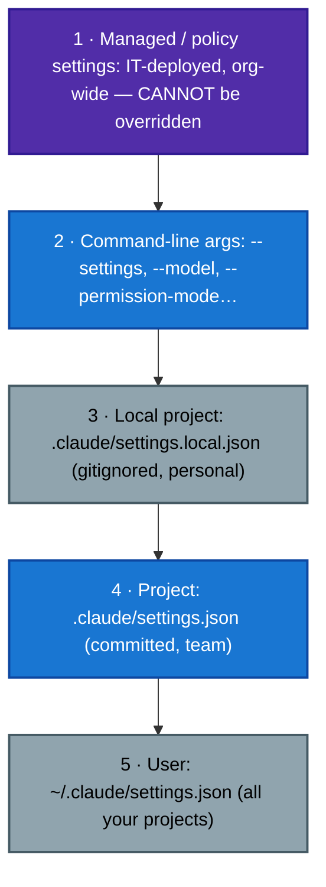

- **Important exception:** Most keys use normal precedence, but **permission rules merge across all scopes, and any `deny` wins** (3.8). A user-level allow cannot override a project-level deny, and a managed deny wins over all other rules. `fallbackModel` does not merge.
- **Managed settings have higher precedence than command-line arguments.** A user cannot override organization policy with a flag. The locations are `/Library/Application Support/ClaudeCode/managed-settings.json` on macOS, `/etc/claude-code/managed-settings.json` on Linux, and Windows registry policy. See [P-D5](../../CCA-P/domains/d5-governance-safety-risk.md) for more about governance.
- **Other important keys:** `env` sets session environment variables and overrides the shell, while CLI flags override `env`; `model`; `outputStyle`; `cleanupPeriodDays`, which defaults to **30** and removes old sessions and orphaned worktrees; `autoCompactEnabled`, which defaults to true; `fileCheckpointingEnabled`, which defaults to true and supports `/rewind`; and `disableAllHooks`.

### When a change actually applies

- **`permissions`, `hooks`, and `env` reload immediately** after you edit them.
- **`model` and `outputStyle` need a restart or `/clear`.** Claude reads them only at session start. Changes to CLAUDE.md during a session also do not apply until then.

### Diagnosing a setting that is being ignored

- **`/status`** shows the **"Setting sources"** line with the files that actually loaded. Check this first.
- **`/doctor`** reports invalid managed entries. **`/config`** edits a setting. Add `"$schema"` to enable editor autocomplete.

### Two display surfaces that also live here

- **Output styles** (`outputStyle`) change the system prompt's role, tone, and format. Built-in styles are **Default / Proactive / Explanatory / Learning**. You can create a style in `.claude/output-styles/*.md`; set `keep-coding-instructions: true` to keep the coding prompt. Like `model`, output styles load once at session start, so changes need `/clear` or a restart. See [F-D4 §4.7](d4-prompting-structured-output.md) for the SDK version.
- **The status line** (`statusLine`) is a shell script that receives session JSON on stdin. It only displays context, cost, and Git state. It does not change behaviour.

## 3.11 Sandboxing & isolation - OS-level limits on what Bash can touch
([Sandboxing](https://code.claude.com/docs/en/sandboxing) · [Sandbox environments](https://code.claude.com/docs/en/sandbox-environments))

**The problem:** You want fewer Bash permission prompts without giving Bash access to everything.

**The key difference:** Permission rules and modes decide *whether* a tool call runs. The sandbox limits *what a Bash command can access after it starts*. These layers work together; one does not replace the other.

- **The sandboxed Bash tool** (`/sandbox`, `sandbox.enabled`) uses OS controls: **Seatbelt** on macOS and **bubblewrap** on Linux and WSL2. It limits Bash commands and their child processes. By default, commands can write only to the working directory and session temporary directory, and can connect only to allowed domains. In **auto-allow mode**, sandboxed commands run without a prompt. Deny rules and protected-path checks still apply.
- **Use both filesystem and network isolation.** Filesystem settings include `sandbox.filesystem.allow/denyWrite`, `denyRead`, and `credentials`; network isolation uses `allowedDomains`. Without both, a compromised command may read sensitive files such as `~/.ssh` or change files in `$PATH` and `.bashrc`. Organizations can enforce these limits with managed settings: `sandbox.enabled`, `failIfUnavailable`, `allowUnsandboxedCommands: false`, and `allowManagedDomainsOnly`.
- **The Bash sandbox covers only Bash and its child processes.** Built-in file tools, MCP servers, and hooks still run on the host without this sandbox. To isolate the whole process, use a **sandbox runtime**, a **development or custom container**, a **VM**, or **Claude Code on the web**. Use `--dangerously-skip-permissions` only inside one of those isolated environments, not with the Bash sandbox alone.
- **The sandbox is not a complete security boundary.** A broad allowed domain such as `github.com` may create a path for data theft, and the default proxy does not inspect TLS. Add domains carefully.

> **Sources:** [Memory](https://code.claude.com/docs/en/memory) covers memory scopes, load order, `/memory` versus `/context`, and path-specific rules. [Headless mode](https://code.claude.com/docs/en/headless) covers headless flags, `--output-format`, and `structured_output`. [Hooks guide](https://code.claude.com/docs/en/hooks-guide) and [hooks reference](https://code.claude.com/docs/en/hooks) cover hook events, exit codes, and hook types. [Permissions](https://code.claude.com/docs/en/permissions) and [Permission modes](https://code.claude.com/docs/en/permission-modes) cover rule precedence, parameter matching, and hook interactions. [Settings](https://code.claude.com/docs/en/settings) covers settings precedence and behaviour. [Plugins](https://code.claude.com/docs/en/plugins) and [Plugin marketplaces](https://code.claude.com/docs/en/plugin-marketplaces) cover plugin layout and distribution. [Sandboxing](https://code.claude.com/docs/en/sandboxing) and [Sandbox environments](https://code.claude.com/docs/en/sandbox-environments) cover sandbox behaviour.

---

## Exam traps checklist

| Trap | Correct instinct |
|---|---|
| Team command in `~/.claude/commands/` | Project `.claude/commands/` for VCS sharing (sample Q4) |
| "CLAUDE.md has three levels" | Four: managed policy, user, project, and `CLAUDE.local.md` |
| `/memory` to check what loaded | `/memory` lists and edits locations; **`/context`** shows what actually loaded |
| Directory CLAUDE.md for scattered file types | `.claude/rules/` with glob paths |
| Direct execution for architectural restructuring | Plan mode first |
| `CLAUDE_HEADLESS=true`, `--batch`, `< /dev/null` in CI | Only `-p` exists |
| Expecting `--json-schema` to silently fall back | Invalid schema is a hard error |
| Self-review in the generating session | Independent review instance |
| Monolithic CLAUDE.md with every convention | `@import` / rules files / skills by scope |
| Prompt instruction for a must-always-happen rule | `PreToolUse`/`PostToolUse` **hook** (deterministic) |
| Hook `allow` to bypass an organization deny rule | Impossible: hooks tighten access but cannot loosen it; deny rules win |
| `PostToolUse` to *prevent* a bad tool call | `PreToolUse` (Post can't undo) |
| Narrow allow beats a broad deny | No. The order is deny → ask → allow, regardless of specificity |
| `bypassPermissions` for CI | `dontAsk` + allow-list (never waits, stays gated) |
| CLAUDE.md instruction to "never run X" | Not enforced. Use a deny rule, mode, or hook |
| Copy `.claude/` into every repo to share config | Package as a versioned **plugin** + marketplace |
| `skills/` inside `.claude-plugin/` | Only `plugin.json` goes there; everything else at plugin root |
| User settings override managed policy | No. Managed settings have higher priority than CLI arguments and cannot be overridden |
| "New teammate's `model`/`outputStyle` change won't apply" | Those need restart/`/clear`; only perms/hooks/env hot-reload |
| Setting silently ignored across sessions | `/status` → check the "Setting sources" line |
| Bash sandbox makes `--dangerously-skip-permissions` safe | No. It covers only Bash; isolate the whole process in a runtime, container, or VM |
| Sandbox replaces permission rules | Complementary: rules gate *whether* it runs, sandbox limits *what it reaches* |
| Editing `outputStyle` mid-session takes effect now | Read once at start; applies after `/clear`/restart (like `model`) |

**Practice:** [Claude Code docs](https://platform.claude.com/docs) · Exercise 2 in the official guide (full team-workflow config) · [vkorost guide](https://github.com/vkorost/claude-certified-architect-guide) for CLAUDE.md-hierarchy drills.
