# F-D3 · Claude Code Configuration & Workflows (20%)

Configuring Claude Code for teams: memory hierarchy, commands/skills, path rules, plan mode, refinement technique, and CI/CD.

**Tested by scenarios:** [② Code Generation](../scenarios/s2-code-generation.md) · [④ Developer Productivity](../scenarios/s4-developer-productivity.md) · [⑤ CI/CD](../scenarios/s5-ci-cd.md)
**Source:** official [CCA-F Exam Guide](../../official-exam-guides/cca-f-exam-guide.pdf), task statements 3.1–3.6.

---

## The shape of this domain

Claude Code out of the box knows nothing about your project. Everything in this domain is a different answer to two questions: **what should Claude know**, and **what should Claude be allowed to do**.

The two split cleanly, and the split is worth holding onto because the exam's favourite distractor is answering one with the other.

| | Mechanism | Enforced by |
|---|---|---|
| **What Claude knows** | CLAUDE.md (3.1), skills and commands (3.2), path rules (3.3) | Nothing. It's context — it shapes what Claude *tries* |
| **What Claude may do** | Permission rules and modes (3.8), hooks (3.7), sandboxing (3.11) | Claude Code itself, deterministically |
| **How you work with it** | Plan mode (3.4), refinement (3.5), CI/CD (3.6) | You |
| **How you ship it to others** | Plugins (3.9), settings precedence (3.10) | Config distribution |

A line in CLAUDE.md saying "never run `terraform apply`" is a wish. A **deny rule** — a per-tool block enforced by Claude Code itself, covered in 3.8 — is a fact. Keep that boundary clear and half the domain answers itself.

**How the sections build.** 3.1–3.3 are the *knowledge* half, each one a narrower scope than the last: always-loaded conventions, then on-demand procedures, then rules that fire only for matching files. 3.4–3.6 are how you drive it, ending in CI where nobody is watching — which is exactly where guarantees start to matter. So 3.7 and 3.8 pick up there, and they are **one system seen from two sides**: 3.8 is the declarative rule list, 3.7 is the code that runs before it. Read them as a pair. 3.9–3.11 then ask how you ship all of it to other people, and what still holds when a command actually runs.

## 3.1 CLAUDE.md hierarchy & modularity
([Memory](https://code.claude.com/docs/en/memory))

**The situation.** Your team keeps re-explaining the same conventions to Claude in every session: which test runner, how errors are wrapped, where migrations live.

**The fix.** Put them in a CLAUDE.md, which loads into context automatically. The design question is *which* CLAUDE.md, because there are four scopes and they reach different people.

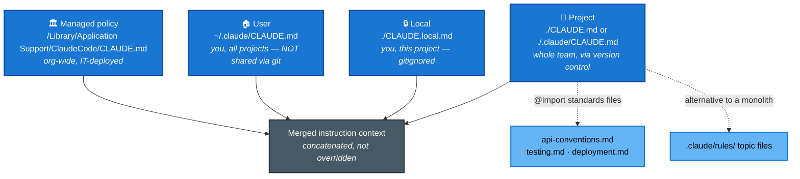

### The four scopes

| Scope | Location | Shared with |
|---|---|---|
| **Managed policy** | `/Library/Application Support/ClaudeCode/CLAUDE.md` (macOS), `/etc/claude-code/CLAUDE.md` (Linux/WSL), `C:\Program Files\ClaudeCode\CLAUDE.md` | Everyone in the organization |
| **User** | `~/.claude/CLAUDE.md` | Just you, across all projects |
| **Project** | `./CLAUDE.md` or `./.claude/CLAUDE.md` | The team, via source control |
| **Local** | `./CLAUDE.local.md` | Just you, this project — gitignore it |

**The classic diagnosis.** "A new teammate doesn't get the instructions" means they were written at **user** level (or in `CLAUDE.local.md`) instead of **project** level. Only the project file travels through version control.

### How the files combine

- All discovered files are **concatenated into context, not overridden**. A user instruction and a project instruction both apply.
- Order runs from the filesystem root down to your working directory, so instructions closer to where you launched Claude are read **last**. Within a directory, `CLAUDE.local.md` is appended after `CLAUDE.md`.
- Files **above** your working directory load in full at launch. Files in **subdirectories** load on demand, when Claude actually reads a file in that subtree.

### Keeping it from becoming a monolith

- **`@import`** pulls in separate standards files, so `CLAUDE.md` stays an index rather than a wall.
- **`.claude/rules/`** is a directory of topic files (`testing.md`, `api-conventions.md`) that load as instruction context the same way CLAUDE.md does. Splitting a long CLAUDE.md into rules is the better shape once the file is long enough that nobody reads it. Rules can also carry a `paths:` filter so they load only for matching files — that is 3.3, and it is the main reason to prefer them.
- If an entry is a multi-step procedure, or only matters in one part of the codebase, it does not belong in CLAUDE.md at all. Multi-step procedures are skills (3.2); location-specific conventions are path-scoped rules (3.3).

### Diagnosing "it's ignoring my instructions"

Two commands, and they do different things. This distinction gets tested.

- **`/memory`** lists your memory file *locations* across user and project scope, including files that do not exist yet, and opens them for editing.
- **`/context`** shows which files **actually loaded** into the current session. If a file is missing from the **Memory files** list there, Claude cannot see it.

Reach for `/context` first when behaviour is inconsistent across sessions. `/memory` is for editing, not for verification.

## 3.2 Slash commands & skills
([Skills](https://code.claude.com/docs/en/skills) · [Slash commands](https://code.claude.com/docs/en/commands))

**The situation.** 3.1 gave you a place for facts that apply to every session. Now you have a *procedure* — release checklist, migration runbook, review protocol — that you do not want to retype.

**What breaks if you put it in CLAUDE.md.** CLAUDE.md is always loaded. A twelve-step deployment runbook occupies context in every session, including the ones about CSS.

**The fix.** Two mechanisms that load only when needed, and the difference between them is who pulls the trigger.

- A **slash command** is a markdown file whose contents are dropped into the conversation when *you* type `/its-name`. It is a saved prompt.
- A **skill** is a folder with a `SKILL.md` describing when it applies. *Claude* reads that description and invokes the skill itself when a task matches, so a skill can fire without you naming it.

| | Commands | Skills |
|---|---|---|
| Location (project) | `.claude/commands/` (shared via VCS) | `.claude/skills/` + `SKILL.md` |
| Location (personal) | `~/.claude/commands/` | `~/.claude/skills/` (rename to avoid clobbering team skills) |
| Loading | On invocation | On demand — Claude decides from the description |
| Invoked by | You, by typing `/name` | You *or* Claude, when the task matches |

### SKILL.md frontmatter worth memorizing

- **`context: fork`** runs the skill in an isolated subagent context, so verbose or exploratory output never lands in the main conversation. This is F-D1 §3's isolation, packaged.
- **`allowed-tools`** restricts tool access for the duration of the skill — block writes for an analysis skill, for instance.
- **`argument-hint`** prompts for required parameters when the skill is invoked bare.

**The choice.** Skills are on-demand, task-specific procedures. CLAUDE.md is always-loaded universal standards. If it applies to every session, it is CLAUDE.md; if it applies to some tasks, it is a skill.

## 3.3 Path-specific rules
([Path-specific rules](https://code.claude.com/docs/en/memory#path-specific-rules))

**The situation.** 3.1 scoped instructions by *directory* and 3.2 scoped procedures by *task*. Neither helps here. Your testing conventions apply to test files, and test files are scattered across the whole tree, so no single directory contains them.

**What breaks.** A per-directory `CLAUDE.md` only works when the convention maps onto a directory. It does not help for a file type that appears everywhere. Putting the conventions in the root CLAUDE.md works, but then every session carries testing rules whether or not it touches a test.

**The fix.** A file in `.claude/rules/` with a `paths:` glob in its YAML frontmatter loads **only when Claude reads a file matching the pattern**.

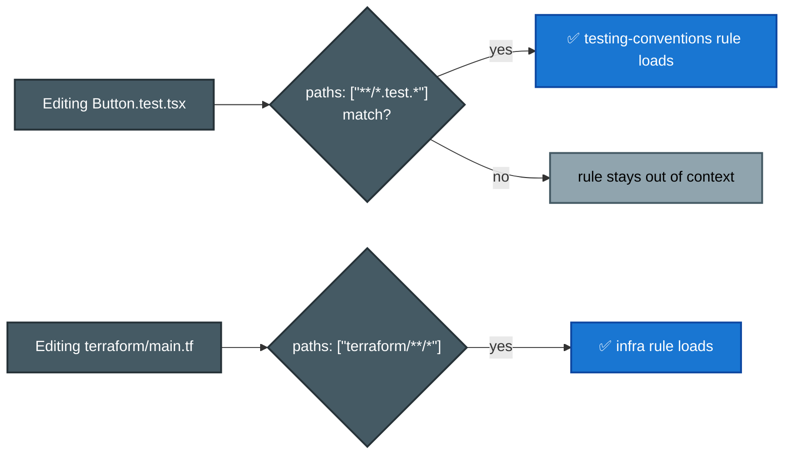

- **Glob rules beat per-directory CLAUDE.md when a convention spans scattered files.** That is the whole reason they exist.
- **A rule with no `paths` field loads unconditionally** and applies everywhere. Omitting `paths` is how you say "always".
- **The trigger is Claude reading a matching file**, not every tool call. The rule arrives when it becomes relevant.
- Brace groups multiply: `src/*.{ts,tsx}` expands to two patterns, and `{a,b}/{c,d}/*.{ts,tsx}` to eight. A rule's whole `paths` list shares a budget of 1,000 expanded patterns, and anything over budget is used unexpanded, where its literal braces match nothing.

## 3.4 Plan mode vs direct execution
([Permission modes](https://code.claude.com/docs/en/permission-modes))

**The situation.** 3.1–3.3 set up what Claude knows before a task starts. This is the first decision you make once one arrives: let Claude start editing immediately, or make it explore and propose first.

**What breaks with the wrong choice.** Direct execution on a large or ambiguous change means discovering the wrong approach after 45 files have been touched — rework that costs far more than the planning would have. Plan mode on a one-line fix with a clear stack trace is ceremony for its own sake.

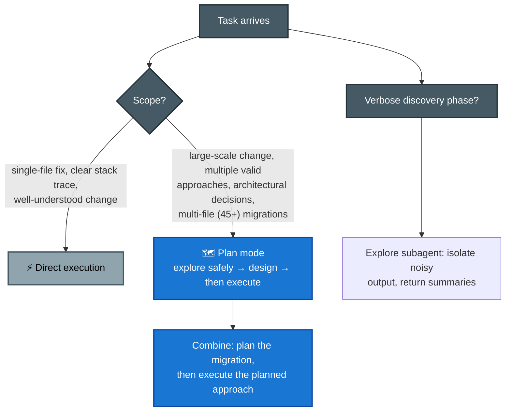

- **Plan mode is safe exploration before committing to changes.** File edits are never auto-approved in it, even when an allow rule matches — they prompt through your approval instead.
- **The two combine.** Plan the migration, approve the approach, then execute it. "Plan mode *or* direct execution" is a false choice on any large task.
- **The Explore subagent** is a built-in, read-only agent that Claude can dispatch to search the codebase on its own. Because it runs in its own context ([F-D1 §3](d1-agentic-architecture.md)), a noisy discovery phase — dozens of greps and file reads — never enters your main conversation. Only its summary comes back. Reach for it whenever the *finding* is verbose but the *answer* is short.

## 3.5 Iterative refinement techniques

**The situation.** You picked plan mode or direct execution, Claude produced something, and it is close but not right. Re-prompting with "no, do it properly" is not converging.

**What breaks.** Prose descriptions of a transformation get interpreted differently each time, because prose leaves room. The fix in every case below is to remove that room.

- **Concrete input/output examples beat prose.** Two or three worked examples pin down a transformation that a paragraph of description leaves ambiguous.
- **Test-driven iteration.** Write the test suite first, then iterate by sharing the failures. The tests are an unambiguous specification, and the failure output is unambiguous feedback.
- **The interview pattern.** Ask Claude to ask *you* questions before it starts. In an unfamiliar domain this surfaces considerations you had not thought to specify — cache invalidation, failure modes, backfill order.
- **Batch or sequence by coupling.** Interacting issues go in one detailed message, because fixing them separately means each fix ignores the others. Independent issues go one at a time, because batching them dilutes attention across unrelated problems.

## 3.6 Claude Code in CI/CD
([Headless mode](https://code.claude.com/docs/en/headless))

**The situation.** Everything so far assumed you were sitting at the terminal, iterating. Now you want Claude to review every pull request automatically, with nobody watching.

**What breaks.** Claude Code is interactive by default. Dropped into a CI job it waits for input that will never come, and the job hangs until it times out. Its output is also prose, which no automated step can post as inline comments.

**The fix.** Two flags, one for each problem.

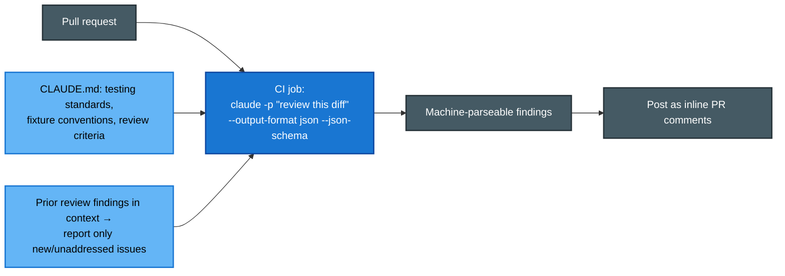

- **`-p` / `--print` is non-interactive mode.** When a pipeline hangs waiting for input, this is the answer. Not an environment variable, not `< /dev/null`, not a `--batch` flag — those do not exist.
- **`--output-format`** takes `text` (default), `json`, or `stream-json` for newline-delimited streaming. The `json` payload also carries `total_cost_usd` and a per-model cost breakdown, so a script can track spend per invocation.
- **`--json-schema`** with `--output-format json` enforces a shape. The structured result lands in the response's **`structured_output`** field. An invalid schema is a hard failure — `Error: --json-schema is not a valid JSON Schema` — rather than a silent fallback to prose. The `format` keyword is accepted but treated as an annotation and not enforced.

### What to feed it

- **CLAUDE.md provides the project context** the CI-invoked Claude has no other way to learn: test standards, fixture conventions, review criteria.
- **Feed prior findings and existing test files into context** so the run reports only new or unaddressed issues instead of re-raising what was already commented on.
- **Session context isolation matters.** The session that generated the code is worse at reviewing it than an independent instance, because it is checking its own reasoning against itself. Review in a fresh session.

## 3.7 Hooks — deterministic control over the Claude Code lifecycle
([Hooks guide](https://code.claude.com/docs/en/hooks-guide) · [Hooks reference](https://code.claude.com/docs/en/hooks))

**The situation.** 3.6 put Claude in a pipeline with nobody watching. That is the moment "it usually does the right thing" stops being good enough. A rule must now *always* hold: format after every edit, never touch `.env`, re-inject project context after the conversation is compacted, notify someone when Claude needs input.

**What breaks if you write it as an instruction.** Everything in 3.1–3.3 is context. Context shapes what Claude *tries*, and it has a non-zero failure rate by construction, because compliance is the model's choice.

**The fix.** A hook is a **shell command that Claude Code runs itself at a fixed point in its lifecycle**. The model never decides whether to run it — the harness does, every time. You *configure* hooks in JSON; you do not *ask* for them.

This is the Claude Code (settings.json) side of what [F-D1 §5](d1-agentic-architecture.md) covers for the Agent SDK. Same principle both places: hooks give deterministic guarantees, prompts give probabilistic compliance.

> **One term you need before this section makes sense.** Claude Code also has a separate, declarative permission system — **allow, ask and deny rules**, one per tool pattern, checked on every tool call. 3.8 covers it properly. For now, all you need is that **a deny rule is an absolute block written in a settings file**, and that hooks are evaluated *alongside* those rules rather than instead of them. That is what makes the "hooks tighten but never loosen" result below meaningful.

### Where hooks fire in a turn

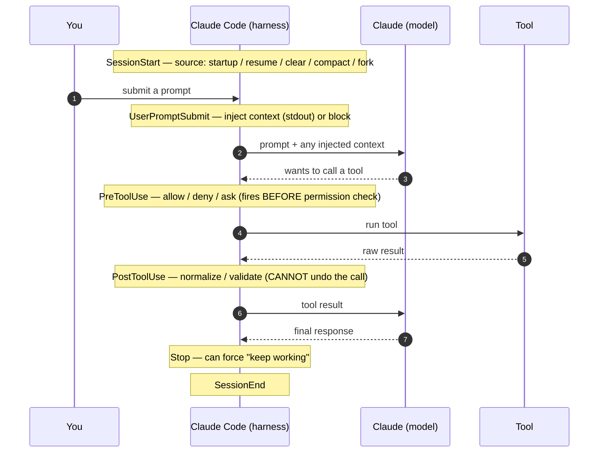

The reference lists around 30 events. These are the load-bearing ones:

| Event | Fires… | What it lets you do |
|---|---|---|
| `SessionStart` | session begins/resumes | stdout is **added to context**; the `compact` matcher **re-injects context after compaction** |
| `UserPromptSubmit` | you submit, before Claude sees it | inject context (`additionalContext`) or block the prompt |
| `PreToolUse` | **before** a tool runs | **block / approve** the call — the gate |
| `PostToolUse` | **after** a tool succeeds | **normalize heterogeneous results** (Unix→ISO timestamps, codes→labels) before the model reads them; cannot undo |
| `Notification` | Claude needs input/permission | desktop alerts; matchers like `permission_prompt`, `idle_prompt` |
| `Stop` | Claude finishes responding | force continuation ("tasks not done, keep going") |
| `SubagentStart` / `SubagentStop` | a subagent spawns / finishes | per-subagent policy; matcher is the agent type |
| `PreCompact` / `PostCompact` | around context compaction | save and restore state around summarization |
| `SessionEnd` | session terminates | cleanup; matcher is the reason (`clear`, `logout`, …) |

### The PreToolUse gate

This is the mechanism behind "block `process_refund` until identity is verified". There are two ways to answer, and **you must not mix them**.

- **Exit `0`** means no objection, and the normal permission flow still runs. It is *not* an approval. **Exit `2`** blocks, and stderr becomes Claude's feedback so it can adjust. **Any other code** passes through as an error notice.
- For structured control, exit `0` and print JSON with `permissionDecision`: `allow`, `deny` or `ask`. (`defer` exists only in headless `-p` mode.)
- **An exit-2 block beats allow rules.** It stops the call *before* permission rules are evaluated. So the clean recipe for "run all Bash without prompts except these few" is `"Bash"` on the allow list plus a `PreToolUse` hook that rejects the exceptions.
- **Hooks tighten but never loosen.** A hook's `allow` cannot override a deny rule from settings, and managed deny lists always win. But a hook's `deny` works even in `bypassPermissions` and with `--dangerously-skip-permissions`, because `PreToolUse` fires before the permission-mode check. That asymmetry is the entire reason hooks can enforce policy users cannot bypass.

### Input, output, and the deterministic↔judgment spectrum

Hooks talk to Claude Code over **stdin, stdout, stderr and exit codes** only. Input is event JSON on stdin (`session_id`, `cwd`, `hook_event_name`, `tool_name`, `tool_input`, …); a `PreToolUse` for Bash gets `tool_input.command`.

Five hook `type`s exist, and they line up exactly with the deterministic-vs-probabilistic axis from F-D1 §5.3:

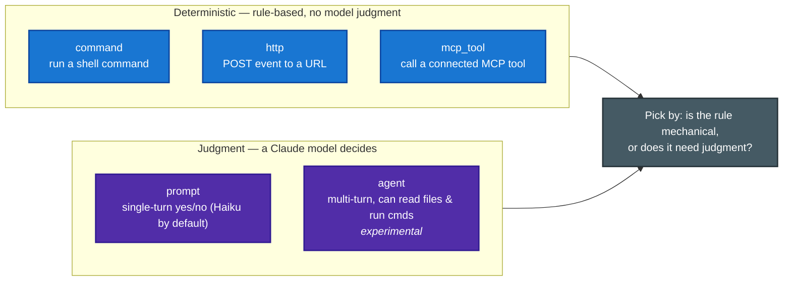

- `command`, `http` and `mcp_tool` are mechanical rules. `prompt` answers "does this need a judgment call?" and returns `{"ok": true|false, "reason": …}`. `agent` is judgment that must **verify against real codebase state** — "block Stop until the tests actually pass".
- **For `SessionStart` and `UserPromptSubmit`, stdout is injected into Claude's context.** That is how you feed dynamic context in. For every other event, stdout is parsed as a decision.

### Configuration & scope

Hooks live in a `hooks` block in a settings file, keyed by event → `matcher` → an array of `{ type, command }`. The `matcher` narrows by tool name (`"Edit|Write"`, `"Bash"`, `"mcp__.*"`) or by event-specific values, and an empty matcher fires on every occurrence.

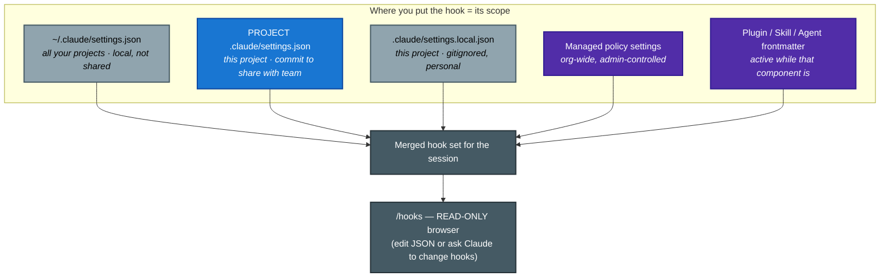

The team-versus-personal split is the same as CLAUDE.md in 3.1: **project `.claude/settings.json` is shared via VCS**, `~/.claude/settings.json` is personal. `/hooks` only *browses*, the way `/memory` does — you edit the JSON yourself or ask Claude to. `disableAllHooks: true` turns them off, but managed-settings hooks still run unless they are disabled there too.

### What goes wrong

- **Hooks run with your credentials and your shell.** Review any hook before trusting it, and treat one you were sent like code you are about to execute.
- **`PostToolUse` cannot undo an action.** The tool already ran. Use `PreToolUse` to prevent and `PostToolUse` to react or normalize.
- **`Stop` hooks fire whenever Claude finishes**, not only at task completion. A runaway `Stop` block is capped at **8 consecutive blocks**; check `stop_hook_active` to bail out.
- **`PermissionRequest` hooks fire when Claude Code is about to prompt *you* for permission** — useful for routing that prompt somewhere else, like Slack. They **do not fire in headless `-p` mode** (3.6), because there is no prompt to intercept. Use `PreToolUse` for automated permission decisions in CI.

## 3.8 Permission modes & permission rules
([Permission modes](https://code.claude.com/docs/en/permission-modes) · [Permissions](https://code.claude.com/docs/en/permissions))

**The situation.** This is the system 3.7's hooks plug into, now covered on its own terms. Concretely: you want Claude to stop asking permission for every file read, without letting it run `terraform apply`.

**Two independent controls, and conflating them is the trap.** A **mode** is a dial that sets the baseline — how often Claude pauses at all. **Rules** are fixed per-tool exceptions that hold *in every mode*, regardless of where the dial is. You cycle modes with **`Shift+Tab`**; `default` is labelled **Manual** in the UI.

```mermaid
flowchart LR
    D["default / Manual<br/>reads only, prompts for the rest"] --> AE["acceptEdits<br/>+ file edits &amp; common fs cmds"]
    AE --> PL["plan<br/>reads/explores, NO edits until you approve"]
    PL --> AU["auto<br/>everything, with a classifier safety-net"]
    AU --> DA["dontAsk<br/>only pre-approved tools; auto-DENY the rest"]
    DA --> BP["bypassPermissions<br/>skip all checks — containers/VMs only"]
    classDef safe fill:#1976D2,color:#fff,stroke:#0D47A1,stroke-width:2px
    classDef mid fill:#F9A825,color:#000,stroke:#F57F17,stroke-width:2px
    classDef danger fill:#C62828,color:#fff,stroke:#7f0000,stroke-width:2px
    class D,PL safe
    class AE,AU,DA mid
    class BP danger
```

| Mode | Runs without asking | Reach for it |
|---|---|---|
| `default` (**Manual**) | reads only | sensitive work, getting started |
| `acceptEdits` | reads + edits + `mkdir`/`touch`/`mv`/`cp`… in scope | iterating on code you'll review via `git diff` |
| `plan` | reads only, **no source edits** | explore and design before changing (3.4) |
| `auto` | everything, with a **classifier** blocking escalations | long tasks, prompt fatigue (needs an eligible plan/model) |
| `dontAsk` | only `allow`-listed + read-only Bash | **CI and scripts** — never waits for input |
| `bypassPermissions` | everything, including protected paths | **isolated containers/VMs only** |

### Rules and their precedence

Rules are managed with `/permissions`. The syntax is `Tool` or `Tool(specifier)`: `Bash(git *)`, `Edit(*.ts)`, `Read(./.env)`, `WebFetch(domain:example.com)`, `mcp__server__tool`.

They are evaluated in a **fixed order — deny, then ask, then allow. The first match wins, and rule specificity does not change the order.**

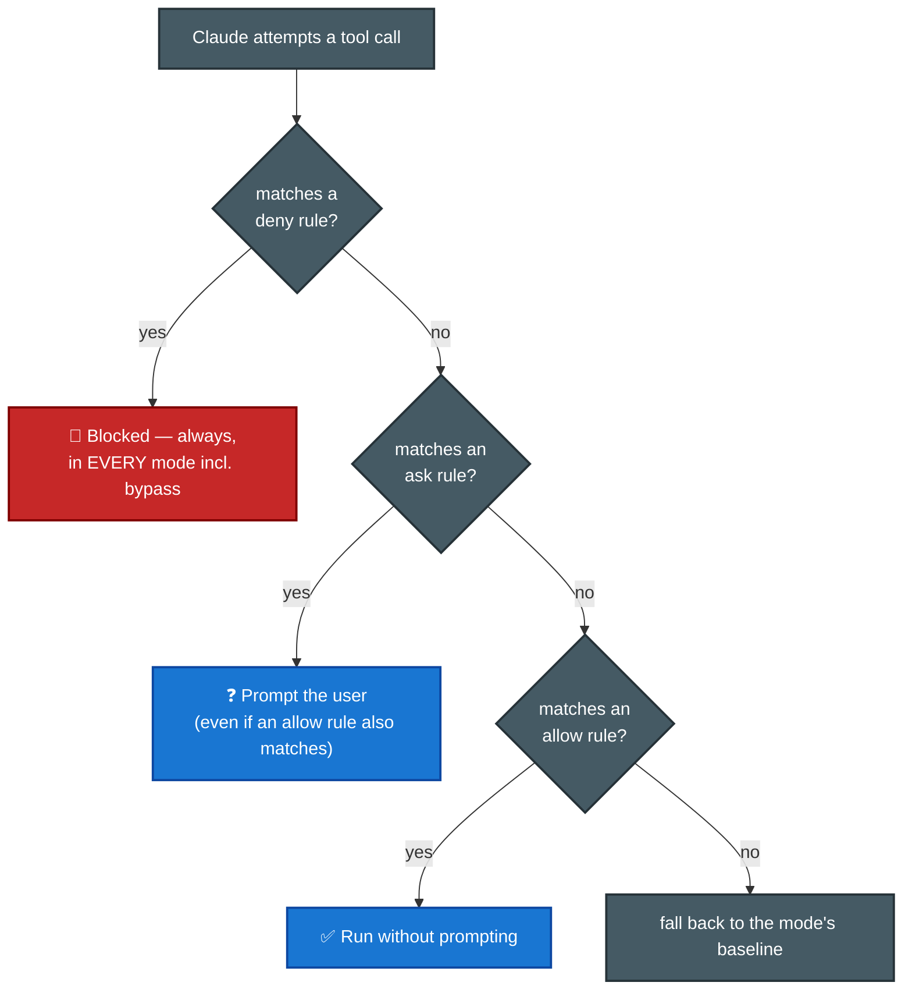

- **A broad deny beats a narrow allow.** `deny Bash(aws *)` blocks `Bash(aws s3 ls)` even with an explicit allow rule for it, so **deny rules cannot carry allowlist exceptions**. The same holds between ask and allow: a matching ask rule prompts even when a more specific allow also matches.
- **Bare versus scoped deny.** A bare `Bash` removes the tool from Claude's context entirely, so Claude never sees it. A scoped `Bash(rm *)` leaves the tool available and blocks only matching calls.
- **Deny and ask rules can match an input parameter** with `Tool(param:value)` — `Agent(model:opus)`, `Agent(isolation:worktree)`, `Bash(run_in_background:true)`. Allow rules keep each tool's own specifier syntax, because matching one parameter would not establish that the whole call is safe.
- **Protected paths** (`.git`, `.claude`, `.env`-style dotfiles, `.mcp.json`) are never auto-approved except in `bypassPermissions`. Even `allow Edit(.claude/**)` does not pre-approve them, because the safety check runs *before* allow rules.
- **Rules are enforced by Claude Code, not by the model.** CLAUDE.md and prompt text shape what Claude *tries*, never what is *allowed*. To actually gate access you need a rule, a mode, or a `PreToolUse` hook.
- **Scope precedence mirrors hooks and CLAUDE.md:** `~/.claude/settings.json` (personal) < project `.claude/settings.json` (team, VCS) < managed policy settings, which win over everything and cannot be overridden. Answering "yes, don't ask again" for a Bash command saves the rule to `.claude/settings.local.json`.

**The CI recipe.** `dontAsk` plus an explicit allow list gives a session that never blocks on input and runs only what you pre-authorized. Cleaner than `bypassPermissions` for pipelines, and far safer.

## 3.9 Plugins & marketplaces — packaging config for distribution
([Plugins](https://code.claude.com/docs/en/plugins) · [Plugin marketplaces](https://code.claude.com/docs/en/plugin-marketplaces))

**The situation.** Everything from 3.1 through 3.8 lives in one repo's `.claude/` directory. It works, and now four other repos want the same setup.

**What breaks.** `.claude/` is per-project. Copying it into every repo means every fix has to be copied again, nothing is versioned, and two teams' `/deploy` commands collide.

**The fix.** A plugin is a portable, versioned, namespaced bundle of exactly those components.

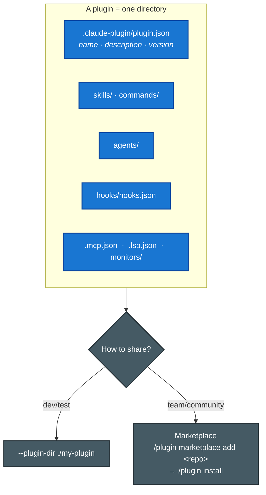

- **A plugin bundles** any of: skills and commands (3.2), agents, hooks (3.7), MCP servers ([F-D2 §2.4](d2-tool-design-mcp.md)), **LSP servers** (Language Server Protocol backends that give Claude real symbol lookup and diagnostics for a language) and **background monitors** (long-running watchers that report state back into the session) — the same components you would otherwise scatter across `.claude/` and `settings.json`.
- **Standalone `.claude/` versus a plugin.** Standalone is personal or single-project with short names (`/deploy`). A plugin is shareable, versioned, reusable across projects, and **namespaced** (`/my-plugin:deploy`) so two plugins cannot clash.
- **The manifest is `.claude-plugin/plugin.json`** — `name` is the namespace and `version` gates updates. **Only `plugin.json` goes inside `.claude-plugin/`.** `skills/`, `hooks/` and the rest sit at the plugin **root**. Putting them inside `.claude-plugin/` is the classic mistake.
- **Distribute through a marketplace**, which is just a git repo. Keep it private to stay internal. Install with `/plugin install`; `--plugin-dir` loads a local copy while you are developing it.

**The choice.** Reach for a plugin when the driver is distribution, reuse across repos, or versioned updates. Reach for `.claude/` config when it is one project.

## 3.10 Settings files & precedence — the config backbone
([Settings](https://code.claude.com/docs/en/settings))

**The situation.** Hooks (3.7), permissions (3.8) and most of what plugins (3.9) install all land in the same place: `settings.json`. And that file exists at several scopes at once. So a setting is not doing what you expect, and the same key appears in three files.

**The rule.** The highest-precedence scope wins — with one exception the exam loves. Highest to lowest:

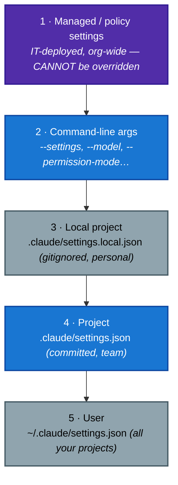

- **The exception that matters.** Most keys **override** by precedence, but **permission rules MERGE across all scopes, and any `deny` wins** (3.8). A user-level allow cannot undo a project-level deny, and a managed deny beats everything. (`fallbackModel` is the opposite — it does not merge.)
- **Managed settings sit above command-line arguments**, so a user cannot override org policy by passing a flag. Paths: macOS `/Library/Application Support/ClaudeCode/managed-settings.json`, Linux `/etc/claude-code/managed-settings.json`, Windows registry policy. This is the F-D3 glimpse of the governance story in [P-D5](../../CCA-P/domains/d5-governance-safety-risk.md).
- **Key buckets beyond permissions and hooks:** `env` (session environment variables — **overrides your shell**, and CLI flags override it), `model`, `outputStyle`, `cleanupPeriodDays` (default **30**, deletes old sessions and orphaned worktrees), `autoCompactEnabled` (default true), `fileCheckpointingEnabled` (default true, powers `/rewind`), `disableAllHooks`.

### When a change actually applies

- **`permissions`, `hooks` and `env` hot-reload.** Edit and they take effect.
- **`model` and `outputStyle` need a restart or `/clear`.** They are read once at session start — the same reason editing CLAUDE.md mid-session does not apply.

### Diagnosing a setting that is being ignored

- **`/status`** shows the **"Setting sources"** line: which files actually loaded. First stop, every time.
- **`/doctor`** flags invalid managed entries. **`/config`** edits a key. Adding `"$schema"` turns on editor autocomplete.

### Two display surfaces that also live here

- **Output styles** (`outputStyle`) swap the *system prompt's* role, tone and format. Built-ins are **Default / Proactive / Explanatory / Learning**, or write your own in `.claude/output-styles/*.md` (set `keep-coding-instructions: true` to keep the coding prompt on top). Like `model`, they are read once at session start, so a change applies after `/clear` or a restart. The SDK-side treatment is in [F-D4 §4.7](d4-prompting-structured-output.md).
- **The status line** (`statusLine`, a shell script fed session JSON on stdin) is a read-only display of context, cost and git state. It never changes behaviour.

## 3.11 Sandboxing & isolation — OS-level limits on what Bash can touch
([Sandboxing](https://code.claude.com/docs/en/sandboxing) · [Sandbox environments](https://code.claude.com/docs/en/sandbox-environments))

**The situation.** 3.8 gated *whether* a tool call happens. This is the layer below it: once a Bash command is running, what can it actually touch? Concretely, you want fewer permission prompts on Bash without simply approving everything.

**The distinction that gets tested.** Permission rules and modes decide *whether* a tool call runs. The sandbox decides *what a Bash command can reach once it runs*. They are complementary layers, and treating one as a substitute for the other is the standing distractor.

- **The sandboxed Bash tool** (`/sandbox`, `sandbox.enabled`) uses OS primitives — macOS **Seatbelt**, Linux and WSL2 **bubblewrap** — to confine every Bash command and its child processes. By default: **write** access only to the working directory and session temp, **network** egress only to allowed domains. In **auto-allow mode** sandboxed commands then run **without a prompt**, which is the whole point — fewer prompts, safely. Deny rules and protected-path checks still hold.
- **Two layers, and you need both.** Filesystem isolation (`sandbox.filesystem.allow/denyWrite`, `denyRead`, `credentials`) **and** network isolation (`allowedDomains`). Drop either and a compromised command can exfiltrate (`~/.ssh`) or backdoor (`$PATH`, `.bashrc`). Enterprises enforce it through managed settings: `sandbox.enabled`, `failIfUnavailable`, `allowUnsandboxedCommands: false`, `allowManagedDomainsOnly`.
- **The scope trap.** The Bash sandbox covers **only Bash and its children**. Built-in file tools, MCP servers and hooks still run unconstrained on the host. To box the whole process you escalate the environment instead: **sandbox runtime** (wraps everything, no Docker) → **dev or custom container** → **VM** → **Claude Code on the web**. `--dangerously-skip-permissions` belongs *only* inside one of those boundaries, never on the bare Bash sandbox.
- **It is not a hard boundary.** A broad `allowedDomains` entry such as `github.com` can open an exfiltration path, and the default proxy does not inspect TLS. Widen the defaults deliberately.

> **Sources.** Memory scopes, load order and the `/memory` versus `/context` distinction: [Memory](https://code.claude.com/docs/en/memory), which is also the source for path-scoped rules. Headless flags, `--output-format` values and `structured_output`: [Headless mode](https://code.claude.com/docs/en/headless). Hook events, exit-code semantics and hook types: [Hooks guide](https://code.claude.com/docs/en/hooks-guide) and the [hooks reference](https://code.claude.com/docs/en/hooks). Rule precedence, parameter matching and the hook/rule interaction: [Permissions](https://code.claude.com/docs/en/permissions) and [Permission modes](https://code.claude.com/docs/en/permission-modes). Settings precedence and key behaviour: [Settings](https://code.claude.com/docs/en/settings). Plugin layout and distribution: [Plugins](https://code.claude.com/docs/en/plugins) and [Plugin marketplaces](https://code.claude.com/docs/en/plugin-marketplaces). Sandbox mechanics: [Sandboxing](https://code.claude.com/docs/en/sandboxing) and [Sandbox environments](https://code.claude.com/docs/en/sandbox-environments).

---

## Exam traps checklist

| Trap | Correct instinct |
|---|---|
| Team command in `~/.claude/commands/` | Project `.claude/commands/` for VCS sharing (sample Q4) |
| "CLAUDE.md has three levels" | Four — managed policy, user, project, and `CLAUDE.local.md` |
| `/memory` to check what loaded | `/memory` lists and edits locations; **`/context`** shows what actually loaded |
| Directory CLAUDE.md for scattered file types | `.claude/rules/` with glob paths |
| Direct execution for architectural restructuring | Plan mode first |
| `CLAUDE_HEADLESS=true`, `--batch`, `< /dev/null` in CI | Only `-p` exists |
| Expecting `--json-schema` to silently fall back | Invalid schema is a hard error |
| Self-review in the generating session | Independent review instance |
| Monolithic CLAUDE.md with every convention | `@import` / rules files / skills by scope |
| Prompt instruction for a must-always-happen rule | `PreToolUse`/`PostToolUse` **hook** (deterministic) |
| Hook `allow` to bypass an org deny rule | Impossible — hooks tighten, never loosen; deny rules win |
| `PostToolUse` to *prevent* a bad tool call | `PreToolUse` (Post can't undo) |
| Narrow allow beats a broad deny | No — deny → ask → allow, specificity ignored |
| `bypassPermissions` for CI | `dontAsk` + allow-list (never waits, stays gated) |
| CLAUDE.md instruction to "never run X" | Not enforced — use a deny rule / mode / hook |
| Copy `.claude/` into every repo to share config | Package as a versioned **plugin** + marketplace |
| `skills/` inside `.claude-plugin/` | Only `plugin.json` goes there; everything else at plugin root |
| User settings override the org's managed policy | No — managed settings sit above CLI args, can't be overridden |
| "New teammate's `model`/`outputStyle` change won't apply" | Those need restart/`/clear`; only perms/hooks/env hot-reload |
| Setting silently ignored across sessions | `/status` → check the "Setting sources" line |
| Bash sandbox makes `--dangerously-skip-permissions` safe | No — it covers only Bash; box the whole process (runtime/container/VM) |
| Sandbox replaces permission rules | Complementary: rules gate *whether* it runs, sandbox limits *what it reaches* |
| Editing `outputStyle` mid-session takes effect now | Read once at start; applies after `/clear`/restart (like `model`) |

**Practice:** [Claude Code docs](https://platform.claude.com/docs) · Exercise 2 in the official guide (full team-workflow config) · [vkorost guide](https://github.com/vkorost/claude-certified-architect-guide) for CLAUDE.md-hierarchy drills.
