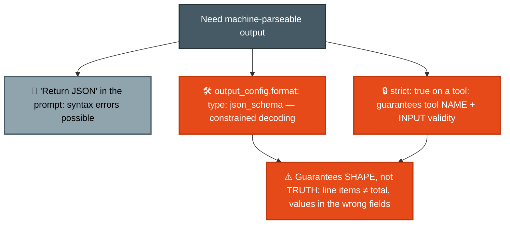
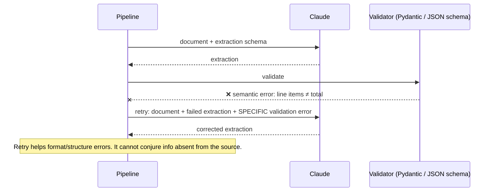
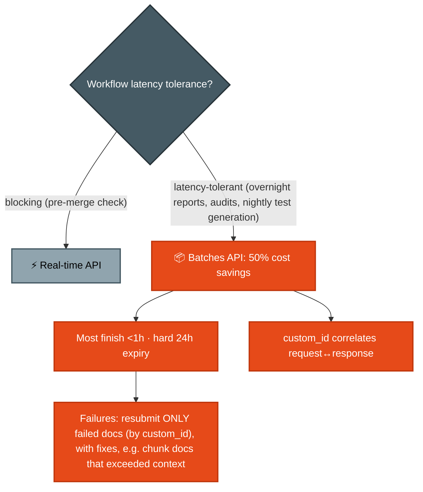
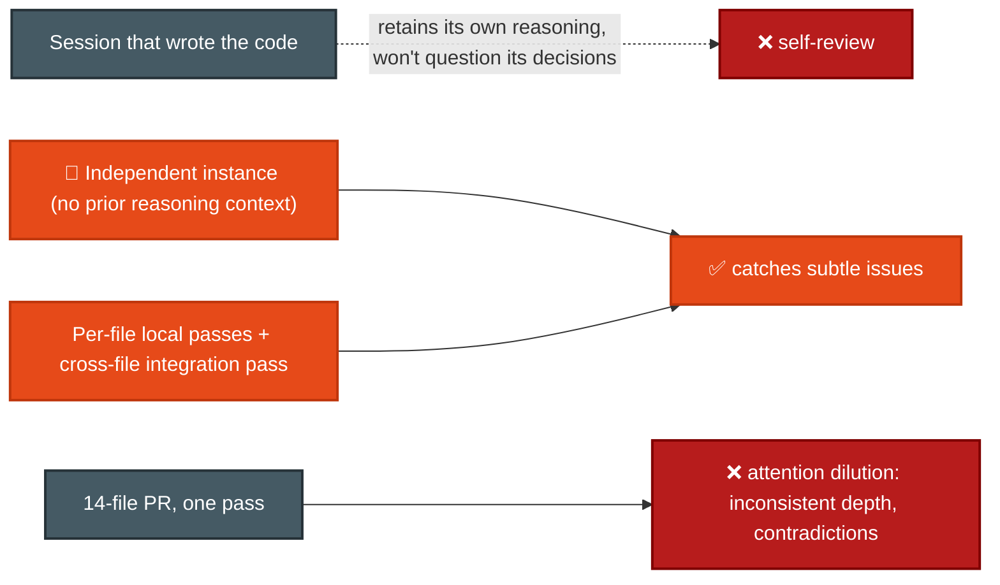

# F-D4 · Prompt Engineering & Structured Output (20%)

Precision prompting (explicit criteria, few-shot), guaranteed-schema output, validation-retry loops, batch processing, and review architectures.

**Tested by scenarios:** [⑤ CI/CD](../scenarios/s5-ci-cd.md) · [⑥ Structured Data Extraction](../scenarios/s6-structured-data-extraction.md)
**Source:** official [CCA-F Exam Guide](../../official-exam-guides/cca-f-exam-guide.pdf), task statements 4.1–4.6.

---

## The shape of this domain

Two different problems live here, and the fixes do not transfer between them.

- **Is the output the right shape?** That is mechanical, and you can guarantee it (4.3).
- **Is the output right?** That is judgment, and no schema can enforce it. It comes from criteria, examples, validation and review architecture (4.1, 4.2, 4.4, 4.6).

The standing trap is answering the second question with the first. A schema-valid extraction where the line items do not sum to the stated total is still wrong.

**How the sections build.** 4.1 and 4.2 tighten what you ask for — first by replacing vague adjectives with testable criteria, then by showing examples where words run out. 4.3 locks down the *shape* of what comes back, which immediately exposes the gap those guarantees do not cover, so 4.4 adds the validation loop that catches it. 4.5 asks where all this runs when the volume is large, and 4.6 asks who checks the result. 4.7 closes by moving from *what* you write to *where it lives* once you build on the SDK.

## 4.1 Explicit criteria over vague instructions

**The situation.** A review agent flags too much. The instinct is to tell it to be more careful.

**Why that fails.** "Be conservative" and "only report high-confidence findings" give the model no new information. It has to invent a threshold, and it invents a different one each run. Precision does not come from asking for precision.

**The fix.** Replace the adjective with a test the model can apply.

- ✅ "Flag comments only when claimed behavior contradicts actual code behavior."
- ❌ "Check that comments are accurate."
- **Consistent severity classification needs explicit criteria plus a concrete code example per level.** A definition alone still leaves the boundary to interpretation.
- **A noisy category poisons the accurate ones.** Once developers learn to ignore one class of finding, they discount the rest. Disable the noisy category while you fix its prompt rather than letting it erode trust in the whole tool.

## 4.2 Few-shot prompting
([Multishot prompting](https://platform.claude.com/docs/en/build-with-claude/prompt-engineering/multishot-prompting))

**The situation.** You did 4.1 — the criteria are explicit and categorical — and the output is *still* formatted inconsistently. Explicit criteria fixed *what* gets flagged; they did not pin down *how it comes back*.

**The fix.** Show the model examples. Where instructions describe, examples demonstrate — and this is the most effective single technique for consistently formatted, actionable output.

- **Aim examples at the ambiguous cases**, not the obvious ones. Two to four is the useful range.
- **Show the reasoning**, not just the answer. An example that explains why one action beat a plausible alternative teaches a rule; an example that shows only the output teaches a pattern match.
- **They generalize.** Well-chosen examples let the model extend its judgment to novel cases, which is why they also reduce hallucination in extraction from varied document structures and informal phrasing.
- **Show the output shape you want** — location, issue, severity, suggested fix.

## 4.3 Structured output
([Structured outputs](https://platform.claude.com/docs/en/build-with-claude/structured-outputs))

**The situation.** 4.2's examples got the format consistent enough for a human. Now a downstream system has to *parse* it, and "return JSON" in the prompt produces valid JSON most of the time.

**What breaks.** Most of the time is not a parser contract. You get occasional syntax errors, missing fields, and drifting types — each one an exception path in code that should not need one. Examples make good output *likely*; a parser needs it *certain*.

**The fix.** **Constrained decoding** — as Claude generates, the API restricts each next token to ones that keep the output valid against your schema. A violation is not caught and retried; it is never generated. Two features use it, independently or together.

- **JSON outputs** — set `output_config.format` to `{ "type": "json_schema", "schema": {…} }`. Claude's response is guaranteed to match. Generally available for Claude 4.5 and later. (The beta spelling was a top-level `output_format` with a `structured-outputs-2025-11-13` header; both still work during the transition.)
- **Strict tool use** — set `strict: true` on a tool definition to guarantee schema validation on the tool name and its inputs. This is the right lever when the structure you need *is* a tool call.
- **Schema support is a subset of JSON Schema.** Not supported: recursive schemas, external `$ref`, numeric constraints (`minimum`, `maximum`, `multipleOf`), string length constraints, array constraints beyond `minItems` of 0 or 1, and `additionalProperties` set to anything but `false`. An unsupported feature returns a 400 with details rather than degrading silently.

### Schema design that avoids fabrication

- **Make a field optional or nullable when the source document may not contain it.** A required field pressures the model to produce *something*, and something is a fabricated value.
- **Give enums an escape hatch:** `"unclear"` for genuinely ambiguous cases, and `"other"` plus a detail string for categories that will grow.
- **Put format-normalization rules in the prompt** alongside the schema when sources are messy. The schema constrains the shape; the prompt tells the model how to get there.

**The limit worth carrying.** Constrained decoding guarantees the output parses and matches the schema. It says nothing about whether the values are correct, which is why 4.4 exists.

## 4.4 Validation, retry & feedback loops

**The situation.** This is the gap 4.3 just opened. The extraction is schema-valid — guaranteed — and the line items do not sum to the stated total.

**What breaks.** Constrained decoding checks the output against a *shape*. Nothing in that path checks arithmetic or cross-field consistency, because no schema can express "these numbers must agree". That check has to be yours, which means a validation step outside the model.

In the diagram below, the validator is whatever enforces that check in your language — a Pydantic model in Python, a JSON Schema validator elsewhere. The mechanism does not matter; running it before you trust the output does.

- **Retry with the specific error.** Send the document, the failed extraction, and the exact validation message. "That was wrong, try again" gives the model nothing to correct against.
- **Retries fix format and structural errors. They cannot invent missing information.** If the field is not in the document, no number of retries will produce it — that is a nullable-field problem (4.3), not a retry problem.
- **Build the check into the schema where you can.** Extract `calculated_total` alongside `stated_total` so the discrepancy is visible in the output rather than inferred later. A `conflict_detected` boolean does the same job for inconsistent sources.
- **A `detected_pattern` field on each finding** turns dismissed findings into data. Over time it gives you a false-positive taxonomy instead of anecdotes.

## 4.5 Batch processing (Message Batches API)
([Batch processing](https://platform.claude.com/docs/en/build-with-claude/batch-processing))

**The situation.** The extract-validate-retry pipeline from 4.3 and 4.4 now works. The question is where it runs. You have 40,000 documents to process, and separately a pre-merge check that blocks a developer while it runs.

**The fix.** Those are different workloads and they belong on different APIs. The **Message Batches API** is a second endpoint that takes many Messages requests at once and processes them asynchronously, trading immediate delivery for half the price. Forcing one API on both workloads is the mistake.

- **All batch usage is charged at 50% of standard prices.** That is the reason to use it.
- **No latency SLA.** Most batches finish in under an hour, but results are available when everything completes *or* after 24 hours, whichever comes first — and a batch that has not finished in 24 hours **expires**. Plan against the 24-hour ceiling, not the typical hour. With a 30-hour downstream SLA, that means submitting on roughly 4-hour windows.
- **`custom_id` correlates each response to its request.** It must be 1–64 characters matching `^[a-zA-Z0-9_-]{1,64}$`. Results do not come back in order, so this is not optional bookkeeping.
- **A batch caps at 100,000 requests or 256 MB**, whichever comes first.
- **Tool use works in batches**, including server tools such as web search and code execution. The unsupported parameters are `stream`, `speed`, `store`, `previous_thread_event_id`, `cache_hint`, `context_hint`, `max_tokens: 0`, and `research_preview_2026_02`.
- **Refine the prompt on a sample first.** First-pass success rate is what you are buying; discovering a prompt bug after 40,000 documents costs the full run.

## 4.6 Multi-instance & multi-pass review

**The situation.** 4.4 validated output mechanically — arithmetic, cross-field consistency, anything a validator can express. Some quality checks need judgment instead, and the obvious move is to ask Claude. So you ask the session that just wrote the code to review it.

**What breaks.** That session holds the reasoning that produced the code. It will re-derive the same justifications rather than question them, because to it the decisions still look correct. This is not a capability gap — an independent instance beats self-review *and* beats giving the same session extended thinking.

- **Review in an independent instance**, with no prior reasoning context.
- **Split large reviews into per-file passes plus a separate integration pass.** This is [F-D1 §6.3](d1-agentic-architecture.md) applied to review. **A bigger context window does not fix attention quality** — it just lets you dilute attention across more material.
- **Per-finding confidence self-reports** are useful for routing, not for filtering. Route the uncertain ones to a human rather than dropping them.

## 4.7 Shaping the system prompt (Agent SDK)
([Modifying system prompts](https://code.claude.com/docs/en/agent-sdk/modifying-system-prompts))

**The situation.** 4.1 through 4.6 were all about the *content* of what you write. This section is about *where it lives* once you stop typing prompts and start building an agent on the Agent SDK ([F-D1 §1](d1-agentic-architecture.md)).

**Why it matters here.** The **system prompt** is the instruction block that sits ahead of the whole conversation and applies to every turn. Claude Code ships a long one of its own — tool guidance, safety rules, coding conventions. When you build on the SDK you inherit it, replace it, or extend it, and that choice decides how much of 4.1's work you have to redo yourself.

**The deciding question:** how close is your agent to Claude Code — a coding agent in a repo with a human watching? The further away, the more you write yourself.

| Starting point | `systemPrompt` value | Keeps Claude Code's tool guidance + safety rules? |
|---|---|---|
| Minimal default | *(unset)* | No — tool-calling support only |
| `claude_code` preset | `{ type: "preset", preset: "claude_code" }` | Yes — the full CLI prompt |
| Preset **+ `append`** | `…preset, append: "…"` | Yes, plus your additions — **lowest-risk customization** |
| Custom string | `"You are…"` | No — you re-add any safety and tool guidance yourself |

- **CLAUDE.md is not the system prompt.** The SDK injects it into the **conversation** (loaded when `settingSources` / `setting_sources` includes `project` or `user`), so it composes with whichever system prompt you chose and never touches the cache-sensitive system prefix.
- **Output styles** (`.claude/output-styles/*.md`, the `outputStyle` setting) **replace** the preset's software-engineering instructions unless you set `keep-coding-instructions: true`. Built-ins are Default, Proactive, Explanatory and Learning. They work across CLI and SDK, and apply after `/clear` or a restart.
- **Cache tie-in.** The preset embeds per-session context (cwd, git flag, OS, shell) **ahead of** your `append`, so sessions launched from different directories miss the cache. `excludeDynamicSections: true` moves that context into the first user message so one cached system prefix is shared across machines. The CLI flag is `--exclude-dynamic-system-prompt-sections`. Ties to [F-D5 §5.8](d5-context-reliability.md).

> **Sources.** `output_config.format`, `strict`, and the JSON Schema subset: [Structured outputs](https://platform.claude.com/docs/en/build-with-claude/structured-outputs). Batch pricing, the 24-hour expiry, `custom_id` format and batch limits: [Batch processing](https://platform.claude.com/docs/en/build-with-claude/batch-processing). Example-driven prompting: [Multishot prompting](https://platform.claude.com/docs/en/build-with-claude/prompt-engineering/multishot-prompting). System prompt presets, output styles and `excludeDynamicSections`: [Modifying system prompts](https://code.claude.com/docs/en/agent-sdk/modifying-system-prompts).

---

## Exam traps checklist

| Trap | Correct instinct |
|---|---|
| "Be more careful" style instructions | Explicit categorical criteria |
| Required schema fields for possibly-absent data | Nullable/optional fields (else fabrication) |
| "Schema-valid means correct" | Constrained decoding guarantees shape, never truth — validate semantics (4.4) |
| Reaching for tool_use as the only way to get JSON | `output_config.format` is the direct route; `strict: true` covers tool inputs |
| Retry until absent data appears | Retry only fixes format/structure errors |
| Batch API for blocking pre-merge checks | Real-time for blocking; batch for overnight |
| "Batch results can't be matched to requests" | `custom_id` exists for exactly that |
| "Batches can't use tools" | Tool use works, including server tools |
| Planning against "most batches finish in an hour" | 24h is the hard expiry — plan against that |
| Bigger model/context to fix diluted review | Multi-pass architecture |
| Consensus voting across runs to cut false positives | Suppresses real intermittent findings (sample Q12, option D) |

**Practice:** [claude-cookbooks `evals` + extraction recipes](https://github.com/anthropics/claude-cookbooks) · [anthropics/courses prompt-evaluations](https://github.com/anthropics/courses) · Exercise 3 in the official guide (full extraction pipeline).
