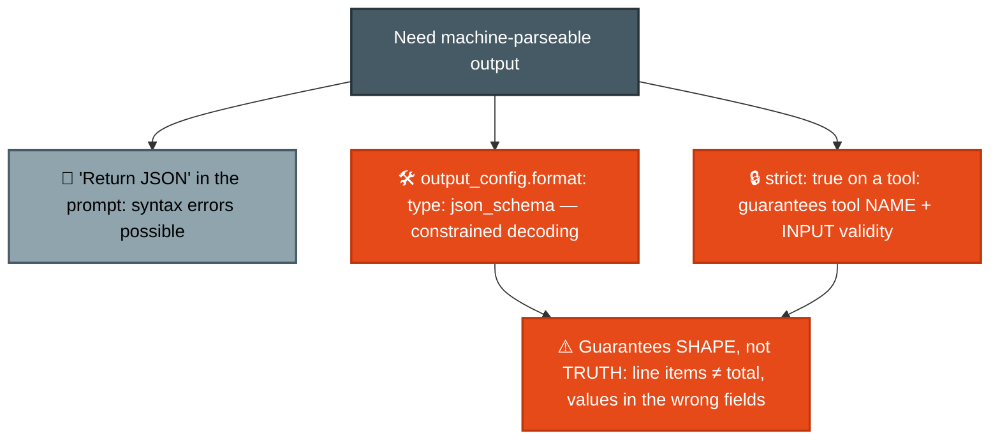
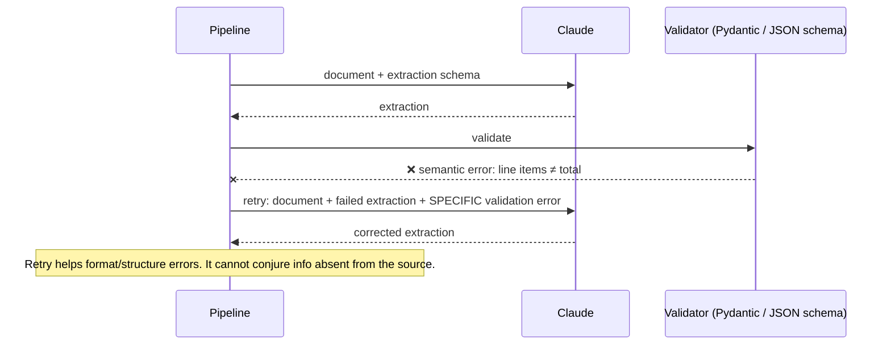
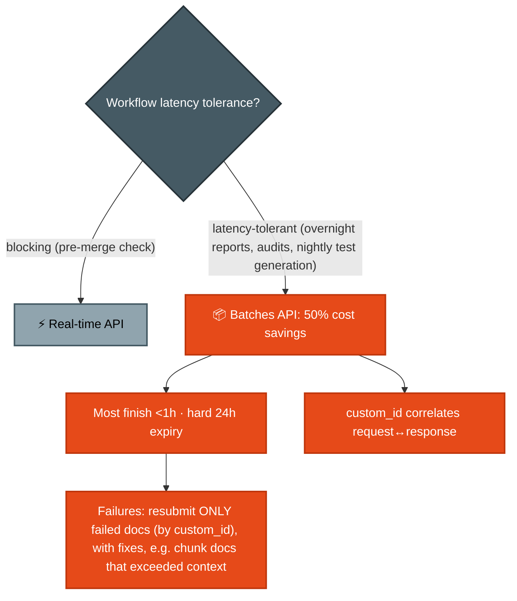
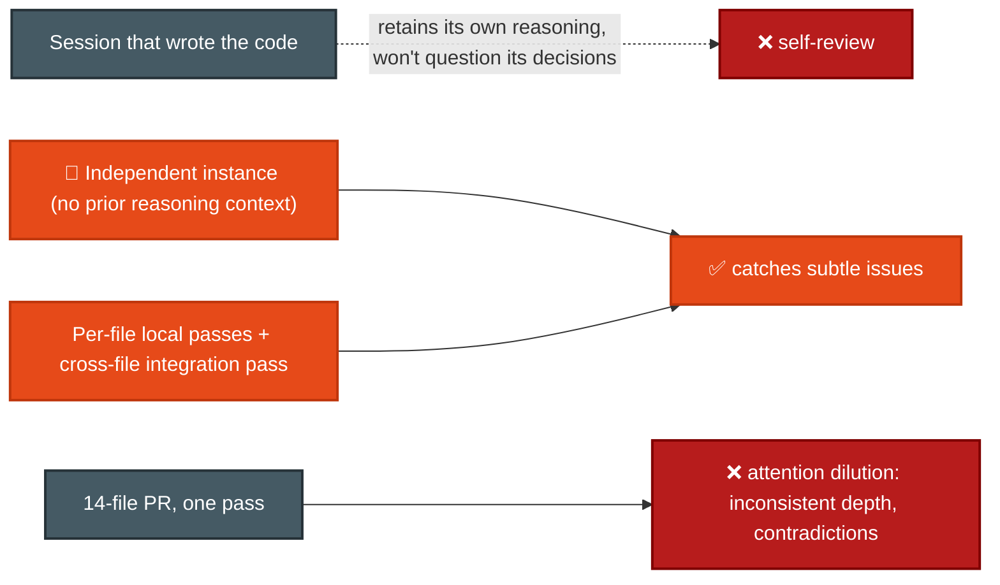

# F-D4 · Prompt Engineering & Structured Output (20%)

Precision prompting (explicit criteria, few-shot), guaranteed-schema output, validation-retry loops, batch processing, and review architectures.

**Tested by scenarios:** [⑤ CI/CD](../scenarios/s5-ci-cd.md) · [⑥ Structured Data Extraction](../scenarios/s6-structured-data-extraction.md)
**Source:** official [CCA-F Exam Guide](../../official-exam-guides/cca-f-exam-guide.pdf), task statements 4.1–4.6.

---

## The shape of this domain

This domain covers two different problems. Each needs a different solution.

- **Is the output the right shape?** That is mechanical, and you can guarantee it (4.3).
- **Is the output right?** That is judgment, and no schema can enforce it. It comes from criteria, examples, validation and review architecture (4.1, 4.2, 4.4, 4.6).

Do not use the first answer for the second problem. An extraction can match its schema and still be wrong, such as when its line items do not match the stated total.

**How the sections connect.** Sections 4.1 and 4.2 replace vague requests with clear criteria and examples. Section 4.3 guarantees the output *shape*, while 4.4 validates what the schema cannot check. Section 4.5 covers large workloads, and 4.6 covers review. Section 4.7 explains where these instructions belong when using the SDK.

## 4.1 Explicit criteria over vague instructions

**The problem:** A review agent reports too many issues. You tell it to be more careful.

**The cause:** Instructions such as "be conservative" and "only report high-confidence findings" do not define a threshold. The model must create one, and it may change between runs.

**The solution:** Replace vague descriptions with a test the model can apply.

- ✅ "Flag comments only when claimed behavior contradicts actual code behavior."
- ❌ "Check that comments are accurate."
- **For consistent severity levels, give clear criteria and one code example per level.** A definition alone leaves the boundary open to interpretation.
- **One noisy category reduces trust in all results.** Disable it while improving its prompt so developers do not learn to ignore the whole tool.

## 4.2 Few-shot prompting
([Multishot prompting](https://platform.claude.com/docs/en/build-with-claude/prompt-engineering/multishot-prompting))

**The problem:** Your criteria are clear, but the output format still changes. The criteria define *what* to report, not *how* to report it.

**The solution:** Show the model examples. Instructions describe the result; examples demonstrate it. This is one of the best ways to get consistent, useful output.

- **Use examples for unclear cases**, not obvious ones. Two to four examples usually work well.
- **Show the reasoning**, not only the answer. Explain why one action was better than a reasonable alternative. This teaches a rule instead of a simple pattern.
- **Good examples apply to new cases.** They also reduce invented details when documents use different structures or informal wording.
- **Show the required output shape**, such as location, issue, severity, and suggested fix.

## 4.3 Structured output
([Structured outputs](https://platform.claude.com/docs/en/build-with-claude/structured-outputs))

**The problem:** Examples make the format consistent enough for people, but another system must now parse it. Asking for JSON in the prompt works only most of the time.

**The cause:** A parser needs a guarantee. Occasional syntax errors, missing fields, or changing types create unnecessary error handling. Examples make valid output likely, not certain.

**The solution:** Use **constrained decoding**. While Claude generates the response, the API allows only tokens that keep it valid against the schema. Invalid output is prevented, not generated and retried. Two features use this method, separately or together.

- **JSON outputs:** Set `output_config.format` to `{ "type": "json_schema", "schema": {…} }`. The response is guaranteed to match. This is generally available for Claude 4.5 and later. The earlier beta used top-level `output_format` with a `structured-outputs-2025-11-13` header; both forms still work during the transition.
- **Strict tool use:** Set `strict: true` on a tool definition to validate the tool name and inputs against the schema. Use this when the required structure is a tool call.
- **Only part of JSON Schema is supported.** Unsupported features include recursive schemas, external `$ref`, numeric constraints (`minimum`, `maximum`, `multipleOf`), string-length constraints, array constraints beyond `minItems` of 0 or 1, and any `additionalProperties` value except `false`. Unsupported features return a detailed 400 error instead of silently using weaker validation.

### Schema design that avoids fabrication

- **Make a field optional or nullable if the source may not contain it.** A required field can push the model to invent a value.
- **Give enums a fallback:** Use `"unclear"` for ambiguous cases, and `"other"` with a detail field for categories that may grow.
- **Add format-normalization rules to the prompt** when sources are inconsistent. The schema controls the shape; the prompt explains how to normalize the data.

**The limit:** Constrained decoding guarantees valid, schema-matching output. It does not guarantee correct values. Section 4.4 covers that problem.

## 4.4 Validation, retry & feedback loops

**The problem:** The extraction matches its schema, but its line items do not match the stated total.

**The cause:** Constrained decoding checks only the output *shape*. It does not check arithmetic or consistency between fields. Add a validation step outside the model.

The validator can be a Pydantic model in Python or a JSON Schema validator in another language. The specific tool matters less than running it before trusting the output.

- **Retry with the exact error.** Send the document, failed extraction, and validation message. "That was wrong, try again" does not explain what to fix.
- **Retries can fix format and structure, but cannot create missing information.** If a field is absent from the document, make it nullable (4.3) instead of retrying.
- **Put checks in the schema when possible.** Extract `calculated_total` beside `stated_total` to show differences directly. Use a `conflict_detected` boolean for inconsistent sources.
- **Add `detected_pattern` to each finding** so dismissed findings become useful data. Over time, this creates a clear list of false-positive patterns.

## 4.5 Batch processing (Message Batches API)
([Batch processing](https://platform.claude.com/docs/en/build-with-claude/batch-processing))

**The problem:** You need to process 40,000 documents, while a separate pre-merge check must return quickly to a waiting developer.

**The solution:** Use different APIs for different workloads. The **Message Batches API** processes many Messages requests asynchronously at half the standard price. Use it when immediate results are not required.

- **Batch usage costs 50% of standard prices.**
- **There is no latency SLA.** Most batches finish within an hour, but unfinished batches **expire after 24 hours**. Plan for the 24-hour limit, not the common one-hour result. For a 30-hour downstream SLA, submit work in roughly four-hour windows.
- **`custom_id` connects each response to its request.** It must be 1–64 characters and match `^[a-zA-Z0-9_-]{1,64}$`. Results may arrive out of order, so every request needs one.
- **A batch caps at 100,000 requests or 256 MB**, whichever comes first.
- **Tools work in batches**, including server tools such as web search and code execution. Unsupported parameters are `stream`, `speed`, `store`, `previous_thread_event_id`, `cache_hint`, `context_hint`, `max_tokens: 0`, and `research_preview_2026_02`.
- **Test the prompt on a sample first.** Finding a prompt problem after processing 40,000 documents wastes the full run.

## 4.6 Multi-instance & multi-pass review

**The problem:** A validator can check arithmetic and field consistency, but some quality checks need judgment. You ask the same session that wrote the code to review it.

**The cause:** The session still holds the reasoning that produced the code. It is likely to repeat the same justification instead of questioning it. A separate instance reviews more effectively than the original session, even with more thinking time.

- **Review in a separate instance** without the original reasoning context.
- **Split large reviews into one pass per file and a separate integration pass.** This applies [F-D1 §6.3](d1-agentic-architecture.md) to review. **A larger context window does not improve attention quality**; it only allows more material in one pass.
- **Use confidence reports for routing, not filtering.** Send uncertain findings to a person instead of removing them.

## 4.7 Shaping the system prompt (Agent SDK)
([Modifying system prompts](https://code.claude.com/docs/en/agent-sdk/modifying-system-prompts))

**The problem:** Sections 4.1–4.6 explain *what* to write. When building an agent with the Agent SDK ([F-D1 §1](d1-agentic-architecture.md)), you must also decide *where* those instructions belong.

**Why it matters:** The **system prompt** appears before the conversation and applies to every turn. Claude Code includes tool guidance, safety rules, and coding conventions in its system prompt. With the SDK, you can use, replace, or extend it. Your choice decides which instructions you must provide yourself.

**The deciding question:** How similar is your agent to Claude Code, where a person watches a coding agent in a repository? The less similar it is, the more instructions you should write yourself.

| Starting point | `systemPrompt` value | Keeps Claude Code's tool guidance + safety rules? |
|---|---|---|
| Minimal default | *(unset)* | No - tool-calling support only |
| `claude_code` preset | `{ type: "preset", preset: "claude_code" }` | Yes - the full CLI prompt |
| Preset **+ `append`** | `…preset, append: "…"` | Yes, plus your additions - **lowest-risk customization** |
| Custom string | `"You are…"` | No - you re-add any safety and tool guidance yourself |

- **CLAUDE.md is not the system prompt.** The SDK adds it to the **conversation** when `settingSources` / `setting_sources` includes `project` or `user`. It works with any system prompt and does not change the cache-sensitive system prefix.
- **Output styles** (`.claude/output-styles/*.md` and `outputStyle`) **replace** the preset's software-engineering instructions unless `keep-coding-instructions: true` is set. Built-in styles are Default, Proactive, Explanatory, and Learning. They work in the CLI and SDK, and changes apply after `/clear` or a restart.
- **Caching:** The preset places session-specific context such as cwd, Git state, OS, and shell before your `append`. Sessions from different directories therefore miss the cache. `excludeDynamicSections: true` moves this context to the first user message, allowing machines to share one cached system prefix. The CLI flag is `--exclude-dynamic-system-prompt-sections`. See [F-D5 §5.8](d5-context-reliability.md).

> **Sources:** [Structured outputs](https://platform.claude.com/docs/en/build-with-claude/structured-outputs) covers `output_config.format`, `strict`, and the supported JSON Schema features. [Batch processing](https://platform.claude.com/docs/en/build-with-claude/batch-processing) covers pricing, the 24-hour expiry, `custom_id`, and batch limits. [Multishot prompting](https://platform.claude.com/docs/en/build-with-claude/prompt-engineering/multishot-prompting) covers example-based prompting. [Modifying system prompts](https://code.claude.com/docs/en/agent-sdk/modifying-system-prompts) covers presets, output styles, and `excludeDynamicSections`.

---

## Exam traps checklist

| Trap | Correct instinct |
|---|---|
| "Be more careful" style instructions | Explicit categorical criteria |
| Required schema fields for possibly-absent data | Nullable/optional fields (else fabrication) |
| "Schema-valid means correct" | Constrained decoding guarantees shape, never truth - validate semantics (4.4) |
| Reaching for tool_use as the only way to get JSON | `output_config.format` is the direct route; `strict: true` covers tool inputs |
| Retry until absent data appears | Retry only fixes format/structure errors |
| Batch API for blocking pre-merge checks | Real-time for blocking; batch for overnight |
| "Batch results can't be matched to requests" | `custom_id` exists for exactly that |
| "Batches can't use tools" | Tool use works, including server tools |
| Planning against "most batches finish in an hour" | 24h is the hard expiry - plan against that |
| Bigger model/context to fix diluted review | Multi-pass architecture |
| Consensus voting across runs to cut false positives | Suppresses real intermittent findings (sample Q12, option D) |

**Practice:** [claude-cookbooks `evals` + extraction recipes](https://github.com/anthropics/claude-cookbooks) · [anthropics/courses prompt-evaluations](https://github.com/anthropics/courses) · Exercise 3 in the official guide (full extraction pipeline).
