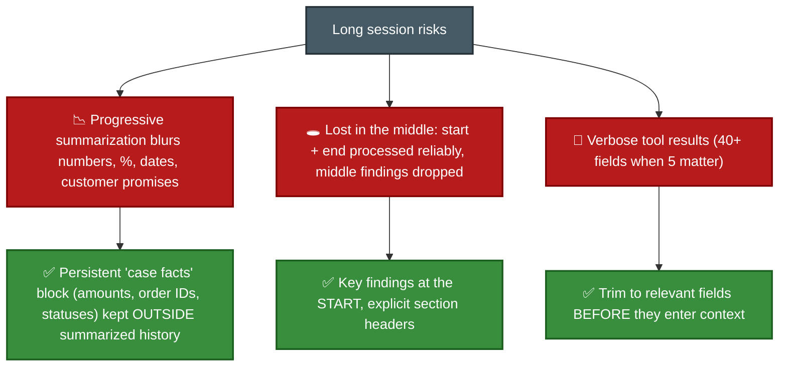
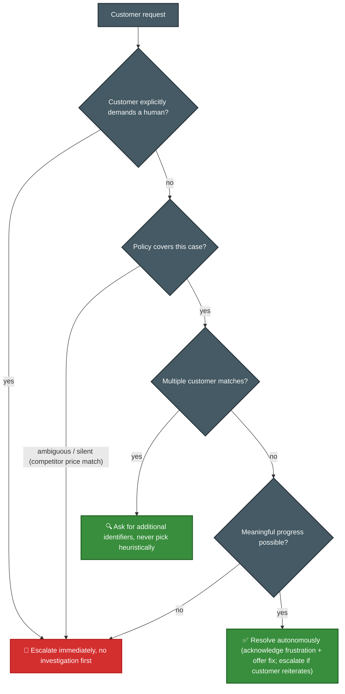
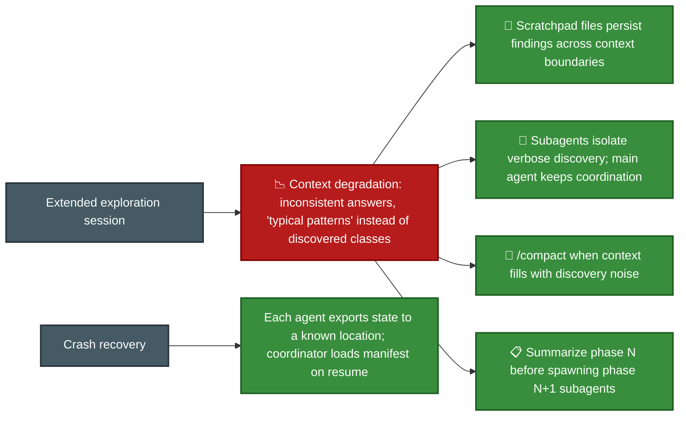
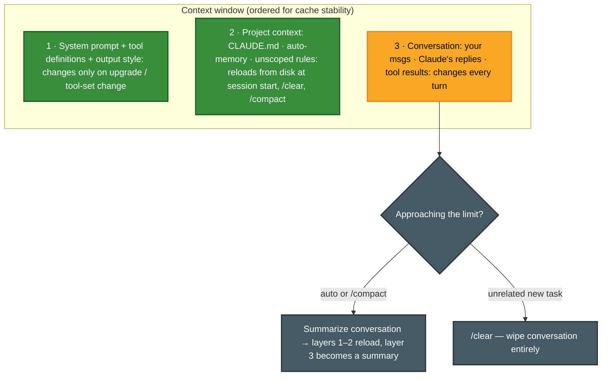
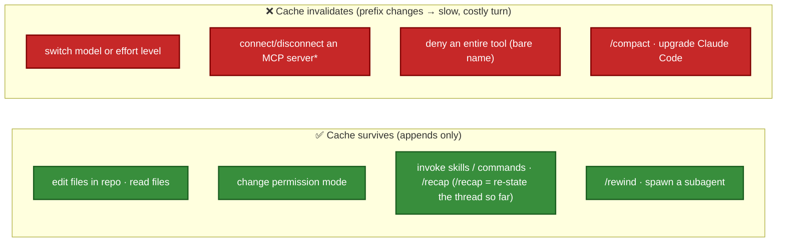

# F-D5 · Context Management & Reliability (15%)

This domain appears in **4 of the 6 scenarios** despite having the lowest weight. It covers context management, escalation decisions, error handling, and human-review calibration.

**Tested by scenarios:** [① Customer Support](../scenarios/s1-customer-support-agent.md) · [② Code Generation](../scenarios/s2-code-generation.md) · [③ Multi-Agent Research](../scenarios/s3-multi-agent-research.md) · [⑥ Structured Data Extraction](../scenarios/s6-structured-data-extraction.md)
**Source:** official [CCA-F Exam Guide](../../official-exam-guides/cca-f-exam-guide.pdf), task statements 5.1–5.6.

---

## The shape of this domain

A long-running agent faces two problems: **more context than it can keep**, and **failures it must handle**.

Neither problem is solved by using a smarter agent. Context is limited, so decide what stays in the window and what moves outside it (5.1, 5.4, 5.7–5.8). Reliability depends on what a failed component tells the next one (5.2, 5.3, 5.5, 5.6).

**How the sections connect.** Section 5.1 covers information lost during summarization. Sections 5.2 and 5.3 cover handoffs to a person or coordinator. Section 5.4 applies context management to large codebases. Sections 5.5 and 5.6 cover review and source tracking. Sections 5.7–5.11 explain the mechanics: window contents, caching costs, undo, API context management, and usage tracking.

## 5.1 Conversation context over long interactions

**The problem:** A support session has reached forty turns and includes three issues, two refunds, and a promised callback date.

**The risks:** Three different problems need three different solutions.

- **Pass the full conversation history** in later API requests. The server does not remember the thread for you.
- **Keep structured case data separate** from prose that may be summarized. Order IDs, amounts, and statuses should remain available after summarization.
- **Trim tool results before adding them to context.** A response with 40 fields uses attention even when only 5 fields matter.
- **Give downstream agents structured data, not long reasoning chains.** Upstream agents should return key facts, citations, relevance scores, dates, and source locations.

## 5.2 Escalation & ambiguity resolution

**The problem:** During a conversation, the agent decides it should stop and hand the case to a person.

**The cause:** The agent uses the wrong escalation signals. An angry customer may have a simple case, while a calm customer may describe something outside the policy.

- **Use only three triggers:** a direct request for a person, a policy gap or exception, or no way to make progress. Complexity alone is not a trigger.
- **Sentiment and self-reported confidence do not reliably show complexity.** Using them routes cases by tone rather than actual difficulty.
- **Never guess between several customer matches.** Ask for another identifier. A slow correct match is better than a fast wrong one.
- **Improve escalation with clear criteria and few-shot examples first** (4.1, 4.2). Add a classifier or new infrastructure only if needed later.

## 5.3 Error propagation in multi-agent systems

**The problem:** A search subagent fails while the coordinator ([F-D1 §2](d1-agentic-architecture.md)) waits for its result.

**The cause:** "Search unavailable" gives the coordinator no useful details. It cannot decide whether to retry, change the query, use another approach, or continue with partial results.

**The solution:** Return structured error details: failure type, attempted query, partial results, and possible alternatives. The coordinator can then retry with a new query, change approach, or continue with partial coverage.

- **Recover locally first.** A subagent should retry temporary failures and report only what it could not resolve. This applies the error categories from [F-D2 §2.2](d2-tool-design-mcp.md) at the next level.
- **Avoid two anti-patterns.** Do not hide an error by returning an empty successful result. Do not stop the whole workflow because one subagent failed.
- **Add coverage notes to the final output.** Mark well-supported findings and gaps caused by unavailable sources. This prevents a confident report from hiding incomplete data.

## 5.4 Context in large-codebase exploration

**The problem:** During a long codebase exploration, the agent starts describing "typical patterns" instead of the classes it actually found.

**The cause:** Important discoveries were summarized away, so the model falls back on general knowledge.

Every solution moves findings **out of the conversation**: into a file, a subagent's separate context, or a focused summary between phases. This keeps the main window focused on coordination instead of raw exploration.

## 5.5 Human review & confidence calibration

**The problem:** A pipeline reports 97% accuracy and believes it succeeded, but reviewer time is limited.

**The cause:** Overall accuracy can hide failure in a small segment. A 97% total can still include one document type that fails almost every time.

- **Validate each document type and field group** before automating. Check the overall number last.
- **Calibrate field-level confidence against a labelled validation set.** Raw self-reported confidence is not a probability and does not support a meaningful threshold.
- **Randomly sample high-confidence results from each segment.** This measures error over time and finds new failure patterns. Reviewing only low-confidence results misses silent errors.
- **Send low-confidence results and source conflicts to people.** This is the best use of limited review time.

## 5.6 Provenance & uncertainty in synthesis

**The problem:** Three subagents return findings that are merged into one report. You must preserve where each claim came from.

**The cause:** Summarization may remove attribution unless sources are stored as structured data that must be preserved. Once a claim is separated from its source, the link cannot be recovered reliably.

- **Store claim→source links as structured data** that the synthesis step must preserve and merge. Do not leave them in prose that may be reworded.
- **When reliable sources conflict, record both with attribution.** The coordinator needs both values to decide how to reconcile them.
- **Include publication or collection dates** so values from different times are not treated as contradictions.
- **Choose a format that fits the content.** Use tables for financial data, prose for news, and lists for technical findings. Separate established findings from disputed ones.

## 5.7 Context window mechanics - what loads, and what compaction keeps
([Context window](https://code.claude.com/docs/en/context-window))

**The focus:** Sections 5.1–5.6 covered decisions. This section explains what fills the context window and what remains after compaction.

**Compaction** happens when a conversation approaches the context limit. Claude Code summarizes the conversation and continues from that summary, freeing space. It runs automatically near the limit or when you use `/compact`. The important question is what the summary keeps.

**The structure:** The window has three layers, from most stable to most changeable. This order supports caching (5.8) and affects what compaction can keep efficiently.

Layer 2 includes **auto-memory**, Claude Code's notes about the project from earlier sessions. These notes are stored on disk and reload like CLAUDE.md, so they return after compaction.

**What survives compaction:**

| Survives (re-injected from disk) | Lost until re-triggered |
|---|---|
| System prompt & output style (never in history) | **`paths:`-scoped rules** → until a matching file is read again |
| **Project-root CLAUDE.md** + unscoped rules | **Nested subdirectory CLAUDE.md** → until a file there is read |
| Auto-memory | Skill bodies beyond the cap (5K per skill, 25K total; oldest dropped) |

The rule is simple: **content reloaded from disk returns; content stored only in the conversation does not.**

- **`/compact` keeps the task but summarizes the thread. `/clear` removes the thread** when you switch to unrelated work. Use `/compact <focus>` to tell the summary which details to keep.
- **`/context`** shows what uses the window, including loaded CLAUDE.md and memory files. **`/memory`** edits those files. Use `/context` to investigate context degradation.
- **Auto-compaction runs near the limit.** A separate case-facts block (5.1) or focused `/compact` at a task boundary is safer than hoping the automatic summary keeps the correct details.
- **A rule that must survive compaction cannot use `paths:` scope.** Put it in the project-root CLAUDE.md. Path rules save tokens ([F-D3 §3.3](d3-claude-code.md)) but disappear after compaction until triggered again.

## 5.8 Prompt caching - the cost/latency layer under long sessions
([Prompt caching](https://code.claude.com/docs/en/prompt-caching))

**The problem:** Every turn sends the full conversation history again, which increases cost and delay.

**The solution:** **Prompt caching** stores a processed request prefix so later requests can reuse it. Claude Code manages the cache, but your changes can invalidate it. The API requires an **exact prefix match** from the start. A change anywhere in the prefix recomputes everything after it; files are not cached separately. This is why stable content comes first and changing conversation content comes last.

- **Check two token counters.** `cache_creation_input_tokens` measures writes. `cache_read_input_tokens` measures reads, billed at about 10% of the input rate. A high read-to-write ratio means the cache works. Repeatedly high creation means the prefix keeps changing.
- **Choose the model and effort level at session start.** Effort level controls reasoning per turn. Both model and effort are part of the cache key, so changing either reprocesses the full history. The `opusplan` setting uses Opus in plan mode and Sonnet afterward, but every switch causes a cache miss.
- **`/compact` invalidates the conversation cache; `/rewind` does not.** Rewind returns to an already cached prefix, so prefer it when abandoning an approach.
- **Editing CLAUDE.md or the output style during a session has no immediate effect and does not invalidate the cache.** Claude reads both at startup. Changes apply after `/clear`, `/compact`, or restart.
- **Each subagent has its own cache** with a five-minute TTL, even on a subscription. A **fork** inherits the parent's prefix and can read its cache.
- **\*** Connecting or disconnecting MCP invalidates the cache only when its tools are loaded into the prefix. When **tool search defers them** ([F-D2 §2.6](d2-tool-design-mcp.md)), the cache remains valid.

## 5.9 Checkpointing & rewind - session-level recovery
([Checkpointing](https://code.claude.com/docs/en/checkpointing))

**The problem:** Claude took the wrong approach four prompts ago and changed nine files.

**The solution:** **Checkpointing** saves file state before each prompt, so you can undo a wrong approach from one menu. It is enabled by default through `fileCheckpointingEnabled` ([F-D3 §3.10](d3-claude-code.md)).

- **Claude keeps the latest 100 checkpoints** with the conversation, so a resumed session can still rewind. Open the menu with **`/rewind`** or **`Esc` `Esc`** on an empty prompt.
- **Choose one of three restore scopes:** code and conversation, conversation only, or code only. You can also summarize from or up to a selected point, which is more focused and cheaper than full `/compact`.
- **Checkpointing tracks only changes made through Claude's file-editing tools.** It does not capture Bash side effects (`rm`, `mv`, `cp`), external edits, or changes from other sessions. It is a local undo feature, not a replacement for Git.
- **To branch instead of reverting**, use **`/branch`** or `claude --continue --fork-session`. As in [F-D1 §7.3](d1-agentic-architecture.md), this branches the conversation, not the filesystem.

## 5.10 API-level context management - compaction, context editing, memory
([Compaction](https://platform.claude.com/docs/en/build-with-claude/compaction) · [Context editing](https://platform.claude.com/docs/en/build-with-claude/context-editing) · [Memory tool](https://platform.claude.com/docs/en/agents-and-tools/tool-use/memory-tool))

**The problem:** Claude Code handles sections 5.7–5.9 for you. With the Messages API, you must configure context management yourself. The API provides three features that can work together. Two use the request's server-side `context_management` parameter, while your application implements the third as a tool.

| Primitive | What it does | Configure with |
|---|---|---|
| **Compaction** (server) | Summarizes older turns into a `compaction` block at a token threshold; later requests drop everything before it | `edits: [{ type: "compact_…", trigger: { input_tokens: 150000 } }]` |
| **Context editing** (server) | Clears *old tool results* rather than the whole thread past a threshold, leaving placeholders | `clear_tool_uses_…` with `keep`, `clear_at_least`, `exclude_tools` |
| **Memory tool** (client) | Claude reads and writes files under `/memories` that **persist across conversations**; your app executes each operation | tool `{ type: "memory_20250818", name: "memory" }` |

- **Compaction summarizes, context editing removes old content, and memory persists.** They work together. Before context editing clears results, it warns Claude so important details can be written to memory and read later. This lets a long task continue beyond one context window.
- **The memory tool runs on the client.** Your application performs the file operations and must prevent path traversal outside `/memories`. It is an Anthropic-schema client tool from [F-D2 §2.7](d2-tool-design-mcp.md), like `bash` and `text_editor`. When the tool is present, the API adds a system instruction to check memory first.

## 5.11 Cost & usage tracking - the economic readout
([Costs](https://code.claude.com/docs/en/costs) · [SDK cost tracking](https://code.claude.com/docs/en/agent-sdk/cost-tracking))

**The focus:** Context management and caching affect cost. This section explains how to measure it.

- **CLI:** `/usage` shows session tokens, a **local cost estimate** rather than the final bill, and plan-limit usage by skill, subagent, and MCP server. It flags long-context or cache-miss usage above 10% of recent usage.
- **SDK:** The `result` message includes **`total_cost_usd`**, which estimates subagent costs, and **`modelUsage` / `model_usage`**, which reports each model across the full agent tree. Per-step usage appears on assistant messages. **Deduplicate by message `id`** because parallel tool calls share one message. The plain `usage` field undercounts nested subagents, so use `modelUsage` for full-tree totals. Compare `cache_creation_input_tokens` with `cache_read_input_tokens` to measure caching.
- **The main ways to reduce cost are:** use `/clear` between unrelated tasks, match the model to the work, delegate long operations to subagents, and prefer CLI tools over MCP servers. Use Sonnet by default, Opus for difficult reasoning, and Haiku for simple subagents.
- **Agent teams use about 7× more tokens than a standard session when teammates use plan mode.** Each teammate is a separate Claude instance with its own context window. Agent teams are disabled by default and require `CLAUDE_CODE_EXPERIMENTAL_AGENT_TEAMS=1`. Keep their tasks small and independent.

> **Sources:** [Context window](https://code.claude.com/docs/en/context-window) covers window layers and compaction. [Prompt caching](https://code.claude.com/docs/en/prompt-caching) covers prefix matching and cache keys. [Checkpointing](https://code.claude.com/docs/en/checkpointing) covers checkpoint count, restore scopes, and file-tool limits. [Compaction](https://platform.claude.com/docs/en/build-with-claude/compaction), [Context editing](https://platform.claude.com/docs/en/build-with-claude/context-editing), and [Memory tool](https://platform.claude.com/docs/en/agents-and-tools/tool-use/memory-tool) cover the API features. [Costs](https://code.claude.com/docs/en/costs) and [SDK cost tracking](https://code.claude.com/docs/en/agent-sdk/cost-tracking) cover cost fields and agent-team usage.

---

## Exam traps checklist

| Trap | Correct instinct |
|---|---|
| Summarize everything to save tokens | Case-facts block outside summarized history |
| Sentiment/confidence-threshold escalation | Explicit criteria + few-shot |
| Investigate before honoring "give me a human" | Escalate immediately |
| Pick the most likely customer among matches | Request additional identifiers |
| "Search unavailable" from a subagent | Structured error context with partials |
| Trust 97% aggregate accuracy | Segment by doc type + field |
| Sample only low-confidence extractions | Stratified sampling of high-confidence ones finds silent errors |
| Pick one of two conflicting stats | Preserve both + attribution + dates |
| `/compact` to switch to an unrelated task | `/clear` (compact keeps the thread) |
| Path-scoped rule expected to persist compaction | It's lost - move to project-root CLAUDE.md |
| Switch model mid-task, expect no cost | Model is a cache key → full reprocess |
| Rely on `/rewind` to undo a Bash `rm` | Only file-tool edits are tracked; use git |
| `total_cost_usd` / `usage` covers subagent tokens | `usage` undercounts; use `modelUsage` for whole-tree |
| Sum per-step tokens across parallel tool calls | They share a message `id` - dedupe or you double-count |

**Practice:** [claude-cookbooks `observability` + RAG recipes](https://github.com/anthropics/claude-cookbooks) · Exercise 4 in the official guide (error propagation + provenance) · [SpillwaveSolutions scenario notebooks](https://github.com/SpillwaveSolutions/cca-exam-prep-customer-support).
