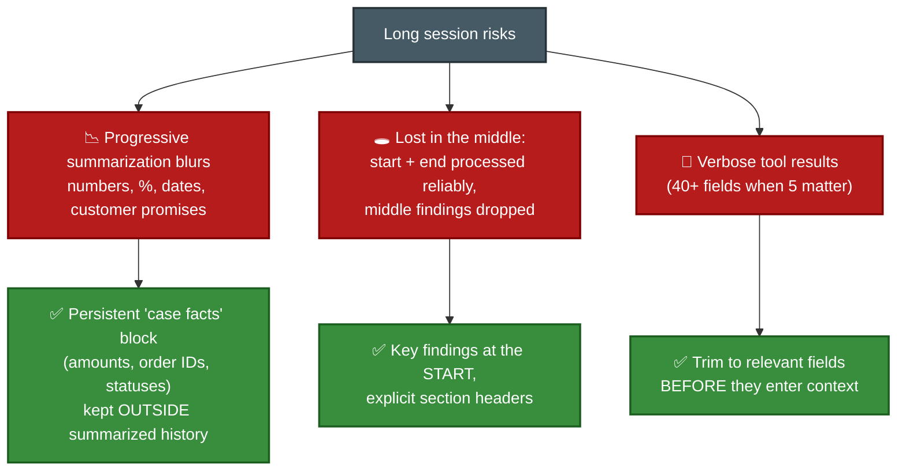
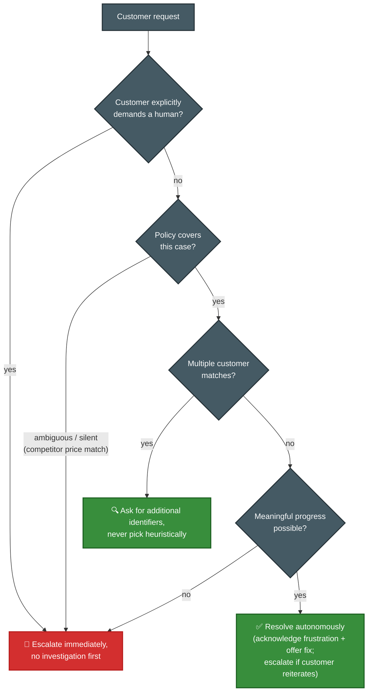
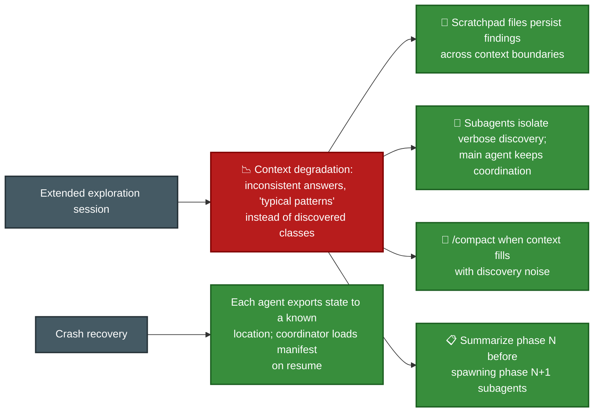
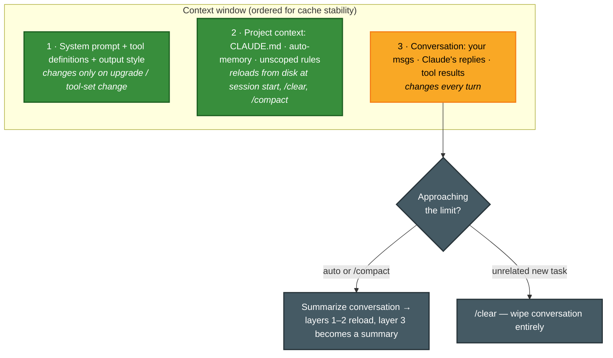
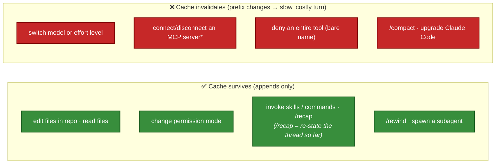

# F-D5 · Context Management & Reliability (15%)

The connective-tissue domain: it appears in **4 of the 6 scenarios** despite the lowest weight. Covers context hygiene over long interactions, escalation judgment, error propagation, and human-review calibration.

**Tested by scenarios:** [① Customer Support](../scenarios/s1-customer-support-agent.md) · [② Code Generation](../scenarios/s2-code-generation.md) · [③ Multi-Agent Research](../scenarios/s3-multi-agent-research.md) · [⑥ Structured Data Extraction](../scenarios/s6-structured-data-extraction.md)
**Source:** official [CCA-F Exam Guide](../../official-exam-guides/cca-f-exam-guide.pdf), task statements 5.1–5.6.

---

## The shape of this domain

A long-running agent accumulates two things: **context it cannot keep**, and **failures it has to survive**.

Neither is solved by making the agent smarter. Context is a budget, so the answer is always deciding what to keep and what to move outside the window (5.1, 5.4, 5.7–5.8). Failures are a design question, so the answer is always deciding what a failing component tells the next one (5.2, 5.3, 5.5, 5.6).

**How the sections build.** The two threads alternate deliberately. 5.1 loses information to summarization; 5.2 and 5.3 are what to do when a component cannot continue — first a single agent handing off to a human, then a subagent handing back to a coordinator. 5.4 returns to context at a larger scale, and 5.5 and 5.6 close the reliability thread by asking who checks the output and whether its sources survived. Then 5.7 onward stops describing judgment and starts describing **machinery**: what literally occupies the window (5.7), what that costs (5.8), how to undo (5.9), the same problems on the raw API (5.10), and how to read the bill (5.11).

## 5.1 Conversation context over long interactions

**The situation.** A support session has run for forty turns. Three issues, two refunds, one promised callback date.

**What breaks.** Three distinct things, and each has its own fix.

- **Pass the complete conversation history** in subsequent API requests. Coherence depends on it — there is no server-side memory of the thread.
- **Put structured case data in a separate layer**, not in the prose that gets summarized. Order IDs, amounts and statuses should survive a summary because they were never subject to one.
- **Trim tool results before they enter context**, not after. A 40-field response where 5 fields matter costs the same attention as anything else in the window.
- **Downstream agents on tight budgets need structured data, not reasoning chains.** An upstream agent should return key facts, citations and relevance scores, with metadata such as dates and source locations attached.

## 5.2 Escalation & ambiguity resolution

**The situation.** 5.1 kept the session coherent. This is the other outcome: the agent decides, mid-conversation, that it should not continue at all and hands off to a human.

**What breaks.** Escalation triggers get inferred from the wrong signals. An angry customer is not necessarily a hard case, and a calm one may be describing something the policy does not cover.

- **Three triggers, and only three:** an explicit request for a human, a policy gap or exception, and an inability to make progress. "Complex" on its own is not one of them.
- **Sentiment and self-reported confidence are unreliable proxies for complexity.** This is the domain's favourite distractor. Routing on either produces escalations that correlate with tone rather than difficulty.
- **Never pick heuristically between multiple customer matches.** Ask for another identifier. A wrong match is worse than a slower one.
- **Fix mis-calibrated escalation with explicit criteria and few-shot examples first** (4.1, 4.2), before reaching for a classifier or new infrastructure.

## 5.3 Error propagation in multi-agent systems

**The situation.** 5.2 was one agent handing off to a person. This is the same judgment one layer down, between machines: a search subagent fails, and the coordinator ([F-D1 §2](d1-agentic-architecture.md)) is waiting on it.

**What breaks.** "Search unavailable" tells the coordinator nothing it can act on. It cannot judge whether to retry, reformulate, switch approach, or proceed with what it has — so it either gives up or retries blindly.

**The fix.** A failing subagent returns structured error context: failure type, the query it attempted, any partial results, and possible alternatives. That is enough for the coordinator to choose between retrying a modified query, switching approach, and proceeding with partial coverage.

- **Recover locally first.** Subagents retry their own transient failures and propagate only what they could not resolve. This is [F-D2 §2.2](d2-tool-design-mcp.md)'s error categories doing their job one level up.
- **Two named anti-patterns.** Silently suppressing an error — returning an empty result marked as success — makes a gap invisible. Terminating the whole workflow on one subagent failure discards the work that succeeded.
- **Synthesis output carries coverage annotations:** which findings are well supported, and which topics have gaps because a source was unavailable. A confident report over partial data is the failure mode this prevents.

## 5.4 Context in large-codebase exploration

**The situation.** Back to the context thread from 5.1, at a larger scale. There the risk was a summary blurring specific facts. Here an exploration session has run long enough that answers are drifting outright — the agent describes "typical patterns" instead of the classes it actually found.

**What breaks.** That drift is the observable symptom of context degradation. The discovered detail has been summarized away, and the model falls back on priors.

The common thread in every fix: move findings **out of the conversation** — to a file, to a subagent's isolated context, or into a deliberate summary at a phase boundary — so the window holds coordination rather than raw discovery.

## 5.5 Human review & confidence calibration

**The situation.** 5.3 made failures visible when a component knew it had failed. This is the harder case: the pipeline believes it succeeded. It reports 97% accuracy, and you have limited reviewer capacity to check.

**What breaks.** Aggregate accuracy hides segment failure. 97% overall is consistent with one document type failing almost completely, because it is a small share of the volume.

- **Validate by document type and by field segment** before automating anything. The aggregate number is the last thing to look at, not the first.
- **Field-level confidence scores are only useful after calibration against a labeled validation set.** Raw self-reported confidence is not a probability, and treating it as one gives you a threshold that means nothing.
- **Stratified random sampling of high-confidence extractions** is what keeps the error rate measured over time and surfaces novel patterns. Sampling only the low-confidence ones tells you nothing about what the pipeline is silently getting wrong.
- **Route low-confidence and contradictory-source extractions to humans.** That is where limited reviewer capacity buys the most.

## 5.6 Provenance & uncertainty in synthesis

**The situation.** 5.5 asked whether the output is *accurate*. This asks whether you can still tell *where it came from*. Three subagents return findings and a synthesis step merges them into one report.

**What breaks.** This is 5.1's summarization problem again, now applied to attribution rather than to case facts. Summarization drops the source unless the source is structured data the synthesis step is required to carry. Once a claim and its origin are separated, they cannot be reunited.

- **Claim→source mappings travel as structured data** that synthesis must preserve and merge, not as prose it may paraphrase.
- **When credible sources conflict, annotate the conflict with attribution.** Do not arbitrarily pick one. Reconciliation is the coordinator's decision, and it needs both numbers to make it.
- **Require publication or collection dates** in structured outputs, so a temporal difference is not misread as a contradiction.
- **Match format to content type.** Separate well-established findings from contested ones. Financial data reads as a table, news as prose, technical findings as a list. Flattening everything to one format loses information that the format itself was carrying.

## 5.7 Context window mechanics — what loads, and what compaction keeps
([Context window](https://code.claude.com/docs/en/context-window))

**The situation.** 5.1 through 5.6 were judgment calls. From here the domain switches to machinery, and this section is the foundation the rest of it stands on: what actually occupies the window, and what survives a compaction.

**One term first.** **Compaction** is what happens when the conversation approaches the context limit — Claude Code summarizes the conversation so far and continues from the summary, freeing space. It runs automatically near the limit, or on demand with `/compact`. It is the mechanism behind 5.1's "progressive summarization blurs the numbers I cared about", so the practical question is always *what does it keep*.

**The structure.** The window fills in three layers, ordered most-stable to most-volatile. That order is not cosmetic — it is what makes caching (5.8) work, and it dictates what compaction can cheaply keep.

Layer 2's **auto-memory** is Claude Code's own notes file — facts it recorded about the project in earlier sessions, stored on disk and reloaded like CLAUDE.md. It matters here for one reason: because it lives on disk rather than in the conversation, it comes back after a compaction.

**What survives compaction:**

| Survives (re-injected from disk) | Lost until re-triggered |
|---|---|
| System prompt & output style (never in history) | **`paths:`-scoped rules** → until a matching file is read again |
| **Project-root CLAUDE.md** + unscoped rules | **Nested subdirectory CLAUDE.md** → until a file there is read |
| Auto-memory | Skill bodies beyond the cap (5K per skill, 25K total; oldest dropped) |

The pattern is one rule: **anything re-read from disk comes back, anything that was only in the conversation does not.**

- **`/compact` versus `/clear`.** Compact summarizes but keeps the thread — same task, freeing space. Clear wipes it — you are switching to unrelated work. `/compact <focus>` steers the summary, which is the direct fix for 5.1's "summarization blurs the numbers I cared about".
- **`/context`** gives a live breakdown of what is occupying the window, including which CLAUDE.md and memory files loaded. **`/memory`** edits them. `/context` is the inspection tool behind 5.4's degradation symptoms.
- **Auto-compaction fires automatically near the limit**, and its guess at what matters is exactly why a deliberate case-facts block (5.1) or a focused `/compact` at a task boundary beats hoping the summary keeps the right thing.
- **If a rule must survive compaction it cannot be `paths:`-scoped.** Move it to project-root CLAUDE.md. Path rules are excellent token economy ([F-D3 §3.3](d3-claude-code.md)) and they evaporate on compaction.

## 5.8 Prompt caching — the cost/latency layer under long sessions
([Prompt caching](https://code.claude.com/docs/en/prompt-caching))

**The situation.** 5.7 explained why the layers are ordered the way they are and promised caching as the reason. This is that reason. Every turn re-sends the whole history, and you are paying for it.

**The mechanism.** **Prompt caching** stores the processed form of a request prefix so the next request can reuse it instead of paying to process those tokens again. Claude Code manages it for you; what you control is whether you keep breaking it. The API caches by **exact prefix match** from the start. A change **anywhere** in the prefix recomputes everything after it — there is no per-file caching. That is the entire reason the layer order in 5.7 exists: keep the stable material first so the volatile turn is all that is new.

- **Two token counters tell the story.** `cache_creation_input_tokens` is a write; `cache_read_input_tokens` is a read, billed at roughly 10% of the input rate. A high read-to-write ratio means caching is working. Persistently high creation means something keeps changing your prefix.
- **Pick model and effort level at session start.** *Effort level* is the dial controlling how much reasoning Claude spends per turn; like the model name, it is part of the cache key, so switching either mid-session reprocesses the whole history. (`opusplan` is a model setting that runs Opus while you are in plan mode and Sonnet once you leave it — convenient, but every transition is a cache miss by construction.)
- **`/compact` invalidates the conversation layer by design; `/rewind` does not** — rewind truncates back to an already-cached prefix. Prefer rewind when abandoning a path.
- **Editing CLAUDE.md or the output style mid-session neither applies nor invalidates.** Both are read once at start; changes land on the next `/clear`, `/compact` or restart.
- **Subagents build their own separate cache** (5-minute TTL even on subscription). A **fork** inherits the parent's prefix and reads its cache — subagent isolation holds at the cache level too.
- **\*** MCP connect and disconnect only invalidate when the tools are loaded into the prefix. With **tool search deferring them** ([F-D2 §2.6](d2-tool-design-mcp.md)) the cache survives, which is another reason deferral scales.

## 5.9 Checkpointing & rewind — session-level recovery
([Checkpointing](https://code.claude.com/docs/en/checkpointing))

**The situation.** 5.7 and 5.8 were about managing the conversation going forward. This is going backward: Claude took a wrong turn four prompts ago and edited nine files along the way.

**The fix.** **Checkpointing** snapshots the state of your files before every prompt, so a wrong turn is one menu away from undone. It is on by default (`fileCheckpointingEnabled`, [F-D3 §3.10](d3-claude-code.md)).

- **The last 100 checkpoints are kept**, saved alongside the conversation so a **resumed** session can still rewind. Open the menu with **`/rewind`** or **`Esc` `Esc`** on an empty prompt.
- **Three restore scopes:** code and conversation, conversation only, or code only. The menu also offers **summarize from here / up to here**, which is targeted compaction and cheaper than a full `/compact`.
- **The limitation that matters.** Checkpointing tracks only edits made through Claude's **file-editing tools**. Bash side effects (`rm`, `mv`, `cp`), external edits and other sessions are **not** captured. It is local undo, not permanent history — it does not replace git.
- **To branch rather than revert**, use **`/branch`** or `claude --continue --fork-session`. That is the CLI counterpart to [F-D1 §7.3](d1-agentic-architecture.md), and the same warning applies: it branches the conversation, not the filesystem.

## 5.10 API-level context management — compaction, context editing, memory
([Compaction](https://platform.claude.com/docs/en/build-with-claude/compaction) · [Context editing](https://platform.claude.com/docs/en/build-with-claude/context-editing) · [Memory tool](https://platform.claude.com/docs/en/agents-and-tools/tool-use/memory-tool))

**The situation.** Everything from 5.7 to 5.9 was Claude Code doing this for you. If you build directly on the Messages API instead, none of it is automatic — you configure it yourself. The same problem has three composable primitives: two set server-side through a `context_management` parameter on the request, and one that is an ordinary tool your app implements.

| Primitive | What it does | Configure with |
|---|---|---|
| **Compaction** (server) | Summarizes older turns into a `compaction` block at a token threshold; later requests drop everything before it | `edits: [{ type: "compact_…", trigger: { input_tokens: 150000 } }]` |
| **Context editing** (server) | Clears *old tool results* rather than the whole thread past a threshold, leaving placeholders | `clear_tool_uses_…` with `keep`, `clear_at_least`, `exclude_tools` |
| **Memory tool** (client) | Claude reads and writes files under `/memories` that **persist across conversations**; your app executes each operation | tool `{ type: "memory_20250818", name: "memory" }` |

- **Compaction summarizes, context editing prunes, memory persists** — and they compose. Context editing warns Claude before it clears, so Claude can **write what matters to memory first** and read it back later. That is how an agentic task outruns the window without losing the thread, and it is 5.1's case-facts judgment applied at the API layer.
- **The memory tool is client-side.** You implement the file operations, which means you enforce `/memories` path-traversal protection. It is one of the Anthropic-schema *client tools* from [F-D2 §2.7](d2-tool-design-mcp.md), alongside `bash` and `text_editor`. The API auto-injects a "check memory first" system instruction whenever the tool is present.

## 5.11 Cost & usage tracking — the economic readout
([Costs](https://code.claude.com/docs/en/costs) · [SDK cost tracking](https://code.claude.com/docs/en/agent-sdk/cost-tracking))

**The situation.** 5.7's context hygiene and 5.8's caching save real money, and 5.10's primitives cost or save it too. This section closes the loop: how you actually see any of it.

- **CLI: `/usage`** shows this session's tokens and a **local cost estimate** — not the bill — plus a plan-limit breakdown by skill, subagent and MCP server. It flags long-context or cache-miss usage when either exceeds 10% of recent usage.
- **SDK:** the `result` message carries **`total_cost_usd`** (an estimate that **includes subagents**) and **`modelUsage` / `model_usage`** (per-model, whole tree). Per-step usage sits on assistant messages, so **dedupe by message `id`** — parallel tool calls share one. The plain `usage` field **undercounts once subagents nest**; use `modelUsage` for whole-tree accounting. `cache_creation_input_tokens` versus `cache_read_input_tokens` exposes the caching payoff from 5.8.
- **The biggest levers**, in order: `/clear` between unrelated tasks, match the model to the task (Sonnet by default, Opus for hard reasoning, Haiku for simple subagents), delegate verbose operations to subagents, and prefer CLI tools over MCP servers.
- **Agent teams use roughly 7× the tokens of a standard session when teammates run in plan mode**, because each teammate is a separate Claude instance with its own context window. They are disabled by default and need `CLAUDE_CODE_EXPERIMENTAL_AGENT_TEAMS=1`. Keep team tasks small and self-contained.

> **Sources.** Window layers and compaction behaviour: [Context window](https://code.claude.com/docs/en/context-window). Prefix matching and cache keys: [Prompt caching](https://code.claude.com/docs/en/prompt-caching). Checkpoint count, restore scopes and the file-tools-only limitation: [Checkpointing](https://code.claude.com/docs/en/checkpointing). API primitives: [Compaction](https://platform.claude.com/docs/en/build-with-claude/compaction), [Context editing](https://platform.claude.com/docs/en/build-with-claude/context-editing) and [Memory tool](https://platform.claude.com/docs/en/agents-and-tools/tool-use/memory-tool). Cost fields and the agent-team multiplier: [Costs](https://code.claude.com/docs/en/costs) and [SDK cost tracking](https://code.claude.com/docs/en/agent-sdk/cost-tracking).

---

## Exam traps checklist

| Trap | Correct instinct |
|---|---|
| Summarize everything to save tokens | Case-facts block outside summarized history |
| Sentiment/confidence-threshold escalation | Explicit criteria + few-shot |
| Investigate before honoring "give me a human" | Escalate immediately |
| Pick the most likely customer among matches | Request additional identifiers |
| "Search unavailable" from a subagent | Structured error context with partials |
| Trust 97% aggregate accuracy | Segment by doc type + field |
| Sample only low-confidence extractions | Stratified sampling of high-confidence ones finds silent errors |
| Pick one of two conflicting stats | Preserve both + attribution + dates |
| `/compact` to switch to an unrelated task | `/clear` (compact keeps the thread) |
| Path-scoped rule expected to persist compaction | It's lost — move to project-root CLAUDE.md |
| Switch model mid-task, expect no cost | Model is a cache key → full reprocess |
| Rely on `/rewind` to undo a Bash `rm` | Only file-tool edits are tracked; use git |
| `total_cost_usd` / `usage` covers subagent tokens | `usage` undercounts; use `modelUsage` for whole-tree |
| Sum per-step tokens across parallel tool calls | They share a message `id` — dedupe or you double-count |

**Practice:** [claude-cookbooks `observability` + RAG recipes](https://github.com/anthropics/claude-cookbooks) · Exercise 4 in the official guide (error propagation + provenance) · [SpillwaveSolutions scenario notebooks](https://github.com/SpillwaveSolutions/cca-exam-prep-customer-support).
