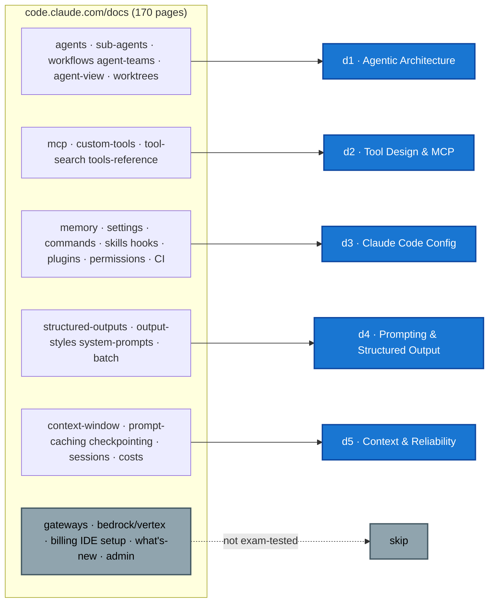

# Official docs → domain coverage map

A working index that maps the **exam-relevant** pages of the official Claude Code / Agent SDK docs ([code.claude.com/docs](https://code.claude.com/docs), full index at [`/docs/llms.txt`](https://code.claude.com/docs/llms.txt)) onto this repo's CCA-F domain files. It exists so I can see, at a glance, which doc page is distilled where.

## D1 · Agentic Architecture & Orchestration
| Doc page | Maps to |
|---|---|
| `agents` (run agents in parallel) | Sec. Field guide (4 surfaces) |
| `sub-agents` | Sec. 1.2–1.3, Sec. Field guide |
| `workflows` (dynamic workflows) | Sec. Field guide |
| `agent-teams` | Sec. Field guide |
| `agent-view` | Sec. Field guide |
| `worktrees` | Sec. Field guide → worktrees |
| `agent-sdk/subagents`, `agent-sdk/sessions` | Sec. 1.3, Sec. 1.7 |
| `agent-sdk/agent-loop` | Sec. 1.1 |
| `goal` (keep Claude working toward a goal) | Sec. 1.1 (cross-turn Stop hook) |

## D2 · Tool Design & MCP Integration
| Doc page | Maps to |
|---|---|
| `mcp`, `mcp-quickstart` | Sec. 2.4 |
| `agent-sdk/custom-tools` | Sec. 2.1 |
| `agent-sdk/tool-search` | Sec. 2.6 |
| `tools-reference` | Sec. 2.5 (built-ins) |
| `managed-mcp` (org controls on connectors) | Sec. 2.4 |

## D3 · Claude Code Configuration & Workflows
| Doc page | Maps to |
|---|---|
| `memory` (CLAUDE.md, auto-memory) | Sec. 3.1 |
| `commands`, `skills` | Sec. 3.2 |
| path-scoped rules (`memory#path-specific-rules`) | Sec. 3.3 |
| `permission-modes` (`plan` etc.) | Sec. 3.4, Sec. 3.8 |
| `permissions` (allow/ask/deny rules) | Sec. 3.8 |
| `hooks-guide`, `hooks` | Sec. 3.7 |
| `plugins`, `plugin-marketplaces`, `discover-plugins` | Sec. 3.9 |
| `headless` (`-p`), `github-actions`, `gitlab-ci-cd` | Sec. 3.6 |
| `settings` (settings.json hierarchy & precedence) | Sec. 3.10 |
| `env-vars` (env block, `ANTHROPIC_*`, timeouts) | Sec. 3.10 (env) |
| `cli-reference` (`-p`, `--output-format`, `--json-schema`…) | Sec. 3.6, Sec. 3.10 |
| `output-styles`, `statusline` | Sec. 3.10 note · Sec. 4.7 (SDK) |
| `sandboxing`, `sandbox-environments` | Sec. 3.11 |

## D4 · Prompt Engineering & Structured Output
| Doc page | Maps to |
|---|---|
| `agent-sdk/structured-outputs` | Sec. 4.3 |
| tool_use + JSON schema | Sec. 4.3 |
| Message Batches API | Sec. 4.5 |
| `agent-sdk/modifying-system-prompts` | Sec. 4.7 |
| `output-styles` | Sec. 4.7 |

## D5 · Context Management & Reliability
| Doc page | Maps to |
|---|---|
| `context-window` (what loads, `/context`, compaction) | Sec. 5.7 |
| `prompt-caching` | Sec. 5.8 |
| `checkpointing` (`/rewind`) | Sec. 5.9 |
| `sessions` (resume, `/branch`, fork) | Sec. 5.4, d1 Sec. 1.7 |
| `costs`, `agent-sdk/cost-tracking` | Sec. 5.11 |
| error propagation / provenance (exam-guide) | Sec. 5.3, Sec. 5.6 |

## Out of scope (not exam-tested — deliberately skipped)
Deployment & providers (`amazon-bedrock`, `google-vertex-ai`, `microsoft-foundry`, `claude-apps-gateway*`, `llm-gateway*`, `corporate-launcher`, `network-config`) · billing/admin (`costs` detail, `analytics`, `admin-setup`, `monitoring-usage`) · IDE & platform setup (`vs-code`, `jetbrains`, `desktop*`, `mobile`, `chrome`, `terminal-config`) · `whats-new/*` weeklies · `changelog` · `champion-kit`, `communications-kit`, `accessibility`, `legal-and-compliance`, `zero-data-retention`.

> These may matter for **CCA-P** (governance, integration, deployment topologies) — see the CCA-P domain files. This map is scoped to **CCA-F**.

## Pages that fed CCA-P (governance / model judgment)
The settings sweep also pushed material into CCA-P, where it fits better than CCA-F:
- `model-config` (aliases, `opusplan`, effort levels, extended context, fallback) → **[P-D2 · Models](../CCA-P/domains/d2-models-prompting-context.md)** "How the tiers map to Claude Code".
- `settings` + `model-config` **enterprise controls** (managed settings, `availableModels`/`enforceAvailableModels`, MCP allow/deny, `disable*` lockdown flags, login enforcement) → **[P-D5 · Governance](../CCA-P/domains/d5-governance-safety-risk.md)** "Enforcing policy in Claude Code: managed settings".
- `managed-mcp` (org allow/deny lists, `managed-mcp.json`, `allowManagedMcpServersOnly`) → **[F-D2 Sec. 2.4](domains/d2-tool-design-mcp.md)** with a governance cross-ref to **[P-D5](../CCA-P/domains/d5-governance-safety-risk.md)**.
- `managed-agents/permission-policies` + `vaults` (server-hosted least-privilege: `always_ask` defaults, per-user credential vaults) → **[P-D5 · Governance](../CCA-P/domains/d5-governance-safety-risk.md)** "Least privilege for server-hosted agents".

---

## Platform-docs sweep ([platform.claude.com/docs](https://platform.claude.com/docs), the API side — full index at [`/docs/llms.txt`](https://platform.claude.com/docs/llms.txt))

A separate doc site from code.claude.com. It's the **Developer Platform / Messages API** surface, so it feeds **CCA-P** (the Platform exam) far more than CCA-F. This table records where the platform sweep landed.

| Doc page | Distilled into |
|---|---|
| `agents-and-tools/tool-use/tool-runner` | primer Sec. 2 (3-rung harness ladder) · [F-D1 Sec. 1.1](domains/d1-agentic-architecture.md) |
| `agents-and-tools/tool-use/tool-reference` | [F-D2 Sec. 2.7](domains/d2-tool-design-mcp.md) (server vs client tools, tool props) |
| `agents-and-tools/tool-use/programmatic-tool-calling` | [F-D2 Sec. 2.7](domains/d2-tool-design-mcp.md) (`allowed_callers`, code-execution calls your tools) |
| `build-with-claude/thinking-steering-and-cost`, `effort` | [P-D2 · Models](../CCA-P/domains/d2-models-prompting-context.md) "Thinking & effort at the API level" |
| `build-with-claude/prompt-caching` | [P-D2 · Models](../CCA-P/domains/d2-models-prompting-context.md) "The API-level numbers" · cross-ref [F-D5 Sec. 5.8](domains/d5-context-reliability.md) |
| `build-with-claude/compaction`, `context-editing` | [F-D5 Sec. 5.10](domains/d5-context-reliability.md) (API-level context management, cf. Sec. 5.7) |
| `agents-and-tools/tool-use/memory-tool` | [F-D5 Sec. 5.10](domains/d5-context-reliability.md) (client-side memory tool) · cross-ref [F-D2 Sec. 2.7](domains/d2-tool-design-mcp.md) |
| `build-with-claude/files` | [P-D3 · Integration](../CCA-P/domains/d3-integration.md) "Files API" |
| `build-with-claude/citations` | [P-D3 · Integration](../CCA-P/domains/d3-integration.md) RAG note · cross-ref [P-D5](../CCA-P/domains/d5-governance-safety-risk.md) |
| `build-with-claude/embeddings` | [P-D3 · Integration](../CCA-P/domains/d3-integration.md) RAG note (no first-party model → Voyage) |
| `managed-agents/overview` (+ sessions, sandboxes, scheduled-deployments, multiagent) | [P-D3 · Integration](../CCA-P/domains/d3-integration.md) "Managed Agents" |
| `managed-agents/webhooks` | [P-D3 · Integration](../CCA-P/domains/d3-integration.md) "Webhooks" |
| `managed-agents/permission-policies`, `vaults` | [P-D5 · Governance](../CCA-P/domains/d5-governance-safety-risk.md) "Least privilege for server-hosted agents" |
| `agents-and-tools/mcp-tunnels/concepts` | [P-D3 · Integration](../CCA-P/domains/d3-integration.md) "MCP tunnels" |
| `agents-and-tools/tool-use/tool-search-tool` | [F-D2 Sec. 2.6](domains/d2-tool-design-mcp.md) (from the SDK page) |
| `build-with-claude/batch-processing`, `structured-outputs` | [F-D4](domains/d4-prompting-structured-output.md) |

**Deliberately skipped (—):** `manage-claude/*` admin/compliance/WIF-provider detail, cloud-platform deploy pages, per-SDK reference — operational, not concept-tested.
