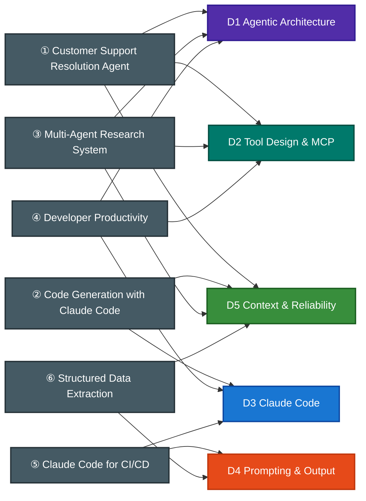

# CCA-F Scenario Bank ➜ Domains Tested

Each exam uses **4 of these 6 scenarios**. A scenario can test two or three domains.

D5 appears in four scenarios despite its 15% weight, so study it across several contexts.

## Scenario deep-dives

Each file contains the official brief, a reference architecture, tested patterns, and practice questions.

| Scenario | Official sample questions |
|---|---|
| [① Customer Support Resolution Agent](s1-customer-support-agent.md) | Q1–Q3 |
| [② Code Generation with Claude Code](s2-code-generation.md) | Q4–Q6 |
| [③ Multi-Agent Research System](s3-multi-agent-research.md) | Q7–Q9 |
| [④ Developer Productivity with Claude](s4-developer-productivity.md) | none (practice only) |
| [⑤ Claude Code for CI/CD](s5-ci-cd.md) | Q10–Q12 |
| [⑥ Structured Data Extraction](s6-structured-data-extraction.md) | none (practice only) |
