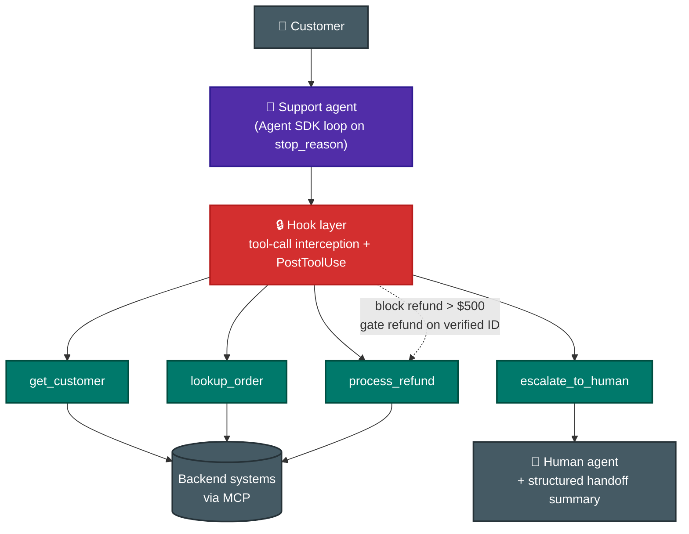
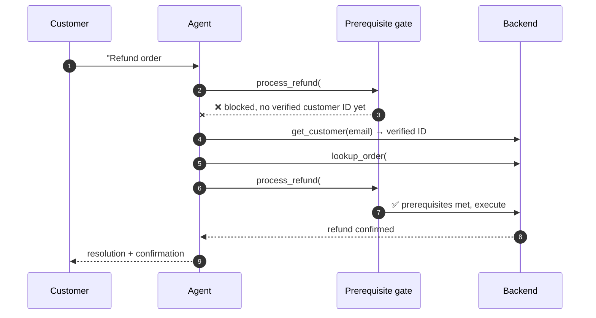

# Scenario ① · Customer Support Resolution Agent

> **Official brief:** You are building a customer support resolution agent using the Claude Agent SDK. The agent handles high-ambiguity requests like returns, billing disputes, and account issues. It has access to your backend systems through custom MCP tools (`get_customer`, `lookup_order`, `process_refund`, `escalate_to_human`). Your target is **80%+ first-contact resolution while knowing when to escalate**.

**Primary domains:** [D1 Agentic Architecture](../domains/d1-agentic-architecture.md) · [D2 Tool Design & MCP](../domains/d2-tool-design-mcp.md) · [D5 Context & Reliability](../domains/d5-context-reliability.md)

## Reference architecture

## The refund flow the exam expects

**Why programmatic, not prompt-based:** identity-verification-before-refund has financial consequences; prompt instructions have a non-zero failure rate. The gate blocks `process_refund` until `get_customer` returns a verified ID.

## Patterns this scenario tests

| Pattern | Chapter |
|---|---|
| Agentic loop on `stop_reason`, tool results appended to history | [D1 Sec. 1.1](../domains/d1-agentic-architecture.md) |
| Hooks: refund threshold blocks, data normalization | [D1 Sec. 1.5](../domains/d1-agentic-architecture.md) |
| Multi-concern requests → decompose, investigate in parallel, unified resolution | [D1 Sec. 1.4](../domains/d1-agentic-architecture.md) |
| Tool descriptions that differentiate `get_customer` vs `lookup_order` | [D2 Sec. 2.1](../domains/d2-tool-design-mcp.md) |
| Structured errors: business vs transient, customer-friendly explanations | [D2 Sec. 2.2](../domains/d2-tool-design-mcp.md) |
| Escalation triggers: explicit request, policy gaps, no progress | [D5 Sec. 5.2](../domains/d5-context-reliability.md) |
| Case-facts block: amounts, order IDs survive summarization | [D5 Sec. 5.1](../domains/d5-context-reliability.md) |
| Handoff summary for humans without transcript access | [D1 Sec. 1.4](../domains/d1-agentic-architecture.md) |

## Official sample questions

*From the [CCA-F Exam Guide](../../official-exam-guides/cca-f-exam-guide.pdf), Sec. 9 (drawn from the official practice test).*

**Q1.** Production data shows that in 12% of cases, your agent skips `get_customer` entirely and calls `lookup_order` using only the customer's stated name, occasionally leading to misidentified accounts and incorrect refunds. What change would most effectively address this reliability issue?

- **A.** Add a programmatic prerequisite that blocks `lookup_order` and `process_refund` calls until `get_customer` has returned a verified customer ID.
- **B.** Enhance the system prompt to state that customer verification via `get_customer` is mandatory before any order operations.
- **C.** Add few-shot examples showing the agent always calling `get_customer` first, even when customers volunteer order details.
- **D.** Implement a routing classifier that analyzes each request and enables only the subset of tools appropriate for that request type.

Answer & rationale

**A.** When a specific tool sequence is required for critical business logic, programmatic enforcement provides deterministic guarantees that prompt-based approaches cannot. B and C rely on probabilistic LLM compliance, which isn't enough when errors have financial consequences. D addresses tool *availability*, not tool *ordering*.

**Q2.** Production logs show the agent frequently calls `get_customer` when users ask about orders (e.g., "check my order #12345"), instead of calling `lookup_order`. Both tools have minimal descriptions ("Retrieves customer information" / "Retrieves order details") and accept similar identifier formats. What's the most effective first step to improve tool selection reliability?

- **A.** Add few-shot examples to the system prompt demonstrating correct tool selection patterns, with 5-8 examples showing order-related queries routing to `lookup_order`.
- **B.** Expand each tool's description to include input formats it handles, example queries, edge cases, and boundaries explaining when to use it versus similar tools.
- **C.** Implement a routing layer that parses user input before each turn and pre-selects the appropriate tool based on detected keywords and identifier patterns.
- **D.** Consolidate both tools into a single `lookup_entity` tool that accepts any identifier and internally determines which backend to query.

Answer & rationale

**B.** Tool descriptions are the primary mechanism LLMs use for tool selection; minimal descriptions are the root cause here, and expanding them is the low-effort, high-leverage fix. Few-shot (A) adds token overhead without fixing the underlying issue; a routing layer (C) is over-engineered and bypasses the LLM's language understanding; consolidation (D) is more effort than a "first step" warrants.

**Q3.** Your agent achieves 55% first-contact resolution, well below the 80% target. Logs show it escalates straightforward cases (standard damage replacements with photo evidence) while attempting to autonomously handle complex situations requiring policy exceptions. What's the most effective way to improve escalation calibration?

- **A.** Add explicit escalation criteria to your system prompt with few-shot examples demonstrating when to escalate versus resolve autonomously.
- **B.** Have the agent self-report a confidence score (1-10) before each response and automatically route requests to humans when confidence falls below a threshold.
- **C.** Deploy a separate classifier model trained on historical tickets to predict which requests need escalation before the main agent begins processing.
- **D.** Implement sentiment analysis to detect customer frustration levels and automatically escalate when negative sentiment exceeds a threshold.

Answer & rationale

**A.** The root cause is unclear decision boundaries; explicit criteria + few-shot examples is the proportionate first response. LLM self-reported confidence (B) is poorly calibrated; the agent is *already* wrongly confident on hard cases. A classifier (C) is over-engineered before prompt optimization is tried. Sentiment (D) doesn't correlate with case complexity.

## Extra practice (unofficial, written for this repo against the official task statements)

**P1.** Your MCP tools return timestamps in three formats (Unix epoch, ISO 8601, `MM/DD/YYYY`), and the agent occasionally computes wrong refund-eligibility windows. What's the cleanest fix?

- **A.** Add a system-prompt instruction listing all three formats and how to convert them.
- **B.** A PostToolUse hook that normalizes all timestamps to one format before the model processes results.
- **C.** Few-shot examples of correct date arithmetic across formats.
- **D.** Ask the backend teams to standardize their APIs.

Answer

**B.** Data normalization is exactly what PostToolUse hooks are for: deterministic transformation of heterogeneous tool results before model processing (task statement 1.5). A and C are probabilistic; D may be right long-term but isn't the architecture answer available today.

**P2.** A customer writes: "Your last agent was useless. I want a person, now." The issue looks like a routine damaged-item replacement the agent could resolve. What should the agent do?

- **A.** Resolve the replacement first, then offer escalation if the customer is still unhappy.
- **B.** Escalate immediately without attempting investigation.
- **C.** Acknowledge frustration and continue autonomously since the case is straightforward.
- **D.** Ask the customer why they want a human before deciding.

Answer

**B.** Explicit customer requests for a human are honored **immediately, without first attempting investigation** (task statement 5.2). The acknowledge-and-offer-resolution pattern applies when the customer *hasn't* explicitly demanded a human.

**More drills:** [SpillwaveSolutions/cca-exam-prep-customer-support](https://github.com/SpillwaveSolutions/cca-exam-prep-customer-support) (9 notebooks building this exact scenario) · [G3Ram/customer-support-agent](https://github.com/G3Ram/customer-support-agent) (full reference implementation).
