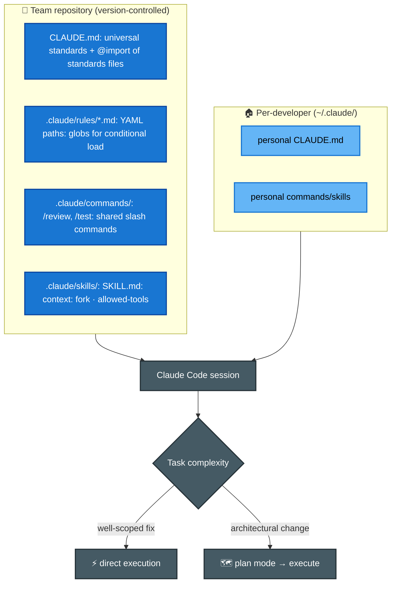
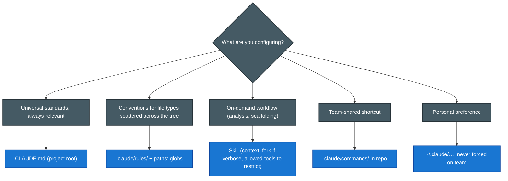

# Scenario ② · Code Generation with Claude Code

> **Official brief:** You are using Claude Code to accelerate software development. Your team uses it for code generation, refactoring, debugging, and documentation. You need to integrate it into your development workflow with custom slash commands, CLAUDE.md configurations, and understand when to use plan mode vs direct execution.

**Primary domains:** [D3 Claude Code Config & Workflows](../domains/d3-claude-code.md) · [D5 Context & Reliability](../domains/d5-context-reliability.md)

## Reference setup

## Configuration decision map

## Patterns this scenario tests

| Pattern | Chapter |
|---|---|
| CLAUDE.md hierarchy; user-level ≠ shared; `/memory` diagnosis | [D3 Sec. 3.1](../domains/d3-claude-code.md) |
| Commands vs skills; `context: fork`, `allowed-tools`, `argument-hint` | [D3 Sec. 3.2](../domains/d3-claude-code.md) |
| Path-scoped rules beat directory CLAUDE.md for scattered conventions | [D3 Sec. 3.3](../domains/d3-claude-code.md) |
| Plan mode for architectural work; Explore subagent for discovery | [D3 Sec. 3.4](../domains/d3-claude-code.md) |
| Iterative refinement: I/O examples, test-driven, interview pattern | [D3 Sec. 3.5](../domains/d3-claude-code.md) |
| Scratchpads, /compact, session resume vs fresh summary | [D5 Sec. 5.4](../domains/d5-context-reliability.md) |

## Official sample questions

*From the [CCA-F Exam Guide](../../official-exam-guides/cca-f-exam-guide.pdf), Sec. 9.*

**Q4.** You want to create a custom `/review` slash command that runs your team's standard code review checklist. This command should be available to every developer when they clone or pull the repository. Where should you create this command file?

- **A.** In the `.claude/commands/` directory in the project repository
- **B.** In `~/.claude/commands/` in each developer's home directory
- **C.** In the CLAUDE.md file at the project root
- **D.** In a `.claude/config.json` file with a commands array

Answer & rationale

**A.** Project-scoped commands live in `.claude/commands/`: version-controlled, automatically available on clone/pull. B is personal-only; C is for instructions/context, not command definitions; D describes a mechanism that doesn't exist.

**Q5.** You've been assigned to restructure the team's monolithic application into microservices. This will involve changes across dozens of files and requires decisions about service boundaries and module dependencies. Which approach should you take?

- **A.** Enter plan mode to explore the codebase, understand dependencies, and design an implementation approach before making changes.
- **B.** Start with direct execution and make changes incrementally, letting the implementation reveal the natural service boundaries.
- **C.** Use direct execution with comprehensive upfront instructions detailing exactly how each service should be structured.
- **D.** Begin in direct execution mode and only switch to plan mode if you encounter unexpected complexity during implementation.

Answer & rationale

**A.** Large-scale changes + multiple valid approaches + architectural decisions = exactly what plan mode is for: safe exploration and design before committing. B risks costly rework; C assumes you already know the right structure; D ignores that the complexity is knowable upfront.

**Q6.** Your codebase has distinct areas with different coding conventions (React hooks style, API async/await patterns, repository-pattern models). Test files are spread throughout the codebase alongside the code they test, and you want all tests to follow the same conventions regardless of location. What's the most maintainable way to ensure Claude automatically applies the correct conventions?

- **A.** Create rule files in `.claude/rules/` with YAML frontmatter specifying glob patterns to conditionally apply conventions based on file paths.
- **B.** Consolidate all conventions in the root CLAUDE.md under headers, relying on Claude to infer which section applies.
- **C.** Create skills in `.claude/skills/` for each code type that include the relevant conventions.
- **D.** Place a separate CLAUDE.md in each subdirectory containing that area's specific conventions.

Answer & rationale

**A.** Glob patterns (`**/*.test.tsx`) apply conventions by file *type* regardless of directory, which is essential when tests are scattered. B relies on inference; C requires manual invocation; D fails because CLAUDE.md files are directory-bound.

## Extra practice (unofficial, written for this repo against the official task statements)

**P1.** You wrote a codebase-analysis skill that dumps ~3,000 lines of findings, and after running it your main session's answers get noticeably worse. Which frontmatter change addresses this?

- **A.** `argument-hint: <path>`
- **B.** `context: fork`
- **C.** `allowed-tools: [Read, Grep]`
- **D.** Move the skill to `~/.claude/skills/`

Answer

**B.** `context: fork` runs the skill in an isolated sub-agent context so verbose output doesn't pollute (and degrade) the main conversation (task statement 3.2). C restricts tools but not output location; A and D are unrelated.

**P2.** Claude keeps producing inconsistent results for a data-format conversion despite a detailed prose description of the transformation. What's the highest-leverage next step?

- **A.** Provide 2–3 concrete input/output example pairs.
- **B.** Rewrite the prose description with stricter language.
- **C.** Switch to plan mode.
- **D.** Raise max_tokens so the model can think longer.

Answer

**A.** Concrete I/O examples are the most effective way to communicate transformations when prose is interpreted inconsistently (task statement 3.5).

**More drills:** [vkorost/claude-certified-architect-guide](https://github.com/vkorost/claude-certified-architect-guide) (CLAUDE.md hierarchy, plan mode, slash commands) · [hueanmy/cca-f-roadmap](https://github.com/hueanmy/cca-f-roadmap) (working examples).
