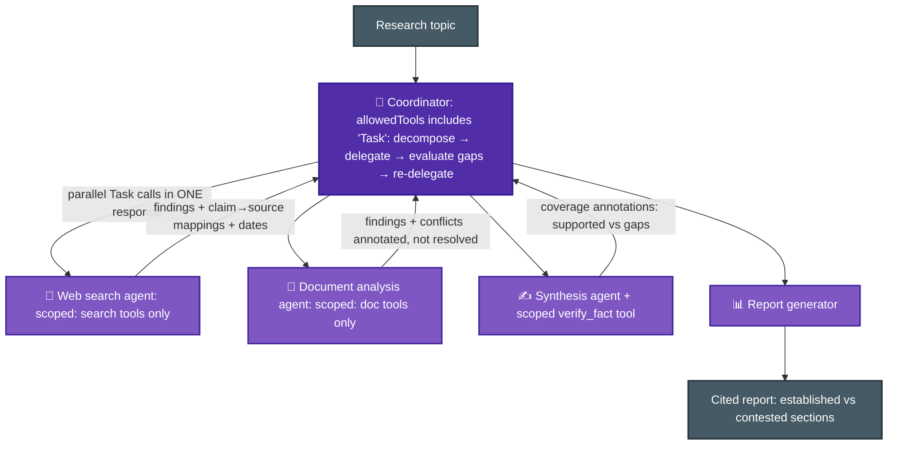
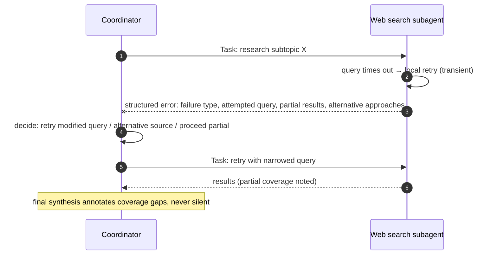

# Scenario ③ · Multi-Agent Research System

> **Official brief:** You are building a multi-agent research system using the Claude Agent SDK. A coordinator agent delegates to specialized subagents: one searches the web, one analyzes documents, one synthesizes findings, and one generates reports. The system researches topics and produces comprehensive, **cited** reports.

**Primary domains:** [D1 Agentic Architecture](../domains/d1-agentic-architecture.md) · [D2 Tool Design & MCP](../domains/d2-tool-design-mcp.md) · [D5 Context & Reliability](../domains/d5-context-reliability.md)

## Reference architecture

## Error propagation the exam expects

## Patterns this scenario tests

| Pattern | Chapter |
|---|---|
| Hub-and-spoke: all communication through the coordinator | [D1 Sec. 1.2](../domains/d1-agentic-architecture.md) |
| Decomposition breadth: narrow subtasks = missing coverage | [D1 Sec. 1.2](../domains/d1-agentic-architecture.md) |
| Explicit context passing; parallel Task spawning; AgentDefinition | [D1 Sec. 1.3](../domains/d1-agentic-architecture.md) |
| Scoped tool sets per role; scoped cross-role tools (verify_fact) | [D2 Sec. 2.3](../domains/d2-tool-design-mcp.md) |
| Structured error context; local recovery; no silent suppression | [D5 Sec. 5.3](../domains/d5-context-reliability.md) |
| Claim→source mappings survive synthesis; conflict annotation; dates | [D5 Sec. 5.6](../domains/d5-context-reliability.md) |
| Structured outputs (facts, citations, scores), not reasoning dumps | [D5 Sec. 5.1](../domains/d5-context-reliability.md) |

## Official sample questions

*From the [CCA-F Exam Guide](../../official-exam-guides/cca-f-exam-guide.pdf), Sec. 9.*

**Q7.** After running the system on the topic "impact of AI on creative industries," each subagent completes successfully, yet the final reports cover only visual arts, completely missing music, writing, and film production. The coordinator's logs show it decomposed the topic into three subtasks: "AI in digital art creation," "AI in graphic design," and "AI in photography." What is the most likely root cause?

- **A.** The synthesis agent lacks instructions for identifying coverage gaps in the findings it receives from other agents.
- **B.** The coordinator agent's task decomposition is too narrow, resulting in subagent assignments that don't cover all relevant domains of the topic.
- **C.** The web search agent's queries are not comprehensive enough and need to be expanded to cover more creative industry sectors.
- **D.** The document analysis agent is filtering out sources related to non-visual creative industries due to overly restrictive relevance criteria.

Answer & rationale

**B.** The logs reveal it directly: the coordinator decomposed "creative industries" into only visual-arts subtasks. The subagents executed their assignments correctly; the problem is *what they were assigned*. A, C, D blame downstream agents working correctly within scope.

**Q8.** The web search subagent times out while researching a complex topic. You need to design how this failure information flows back to the coordinator agent. Which error propagation approach best enables intelligent recovery?

- **A.** Return structured error context to the coordinator including the failure type, the attempted query, any partial results, and potential alternative approaches.
- **B.** Implement automatic retry logic with exponential backoff within the subagent, returning a generic "search unavailable" status only after all retries are exhausted.
- **C.** Catch the timeout within the subagent and return an empty result set marked as successful.
- **D.** Propagate the timeout exception directly to a top-level handler that terminates the entire research workflow.

Answer & rationale

**A.** Structured error context lets the coordinator retry with a modified query, switch approach, or proceed with partial results. B's generic status hides context; C suppresses the error (risking incomplete research passed off as complete); D kills recoverable workflows.

**Q9.** The synthesis agent frequently needs to verify specific claims while combining findings. Currently verification round-trips through the coordinator to the web search agent, adding 2-3 round trips and +40% latency. Evaluation shows 85% of verifications are simple fact-checks while 15% require deeper investigation. What's the most effective approach?

- **A.** Give the synthesis agent a scoped `verify_fact` tool for simple lookups, while complex verifications continue delegating to the web search agent through the coordinator.
- **B.** Have the synthesis agent accumulate all verification needs and return them as a batch to the coordinator at the end of its pass.
- **C.** Give the synthesis agent access to all web search tools so it can handle any verification need directly.
- **D.** Have the web search agent proactively cache extra context around each source during initial research.

Answer & rationale

**A.** Least privilege: a scoped tool covers the 85% common case; the coordination pattern is preserved for complex cases. B creates blocking dependencies; C over-provisions and violates separation of concerns; D is speculative caching that can't predict verification needs.

## Extra practice (unofficial, written for this repo against the official task statements)

**P1.** Two credible sources report different market-size figures for the same industry. How should the document-analysis subagent handle this before passing findings to synthesis?

- **A.** Select the figure from the more authoritative source.
- **B.** Average the two figures.
- **C.** Include both values, explicitly annotated with source attribution, and let the coordinator decide reconciliation.
- **D.** Discard both and search for a third source as tie-breaker.

Answer

**C.** Conflicting statistics from credible sources are annotated with attribution, never arbitrarily resolved downstream (task statement 5.6). Publication dates should also be captured, since "conflicts" are often just different collection dates.

**P2.** Your coordinator prompt contains step-by-step procedural instructions for each subagent's work. Research quality is fine on typical topics but collapses on unusual ones. What's the design flaw?

- **A.** The coordinator should specify research goals and quality criteria, letting subagents adapt their approach.
- **B.** The subagents need more tools.
- **C.** The coordinator needs a larger context window.
- **D.** Step-by-step instructions should move into each AgentDefinition system prompt instead.

Answer

**A.** Coordinator prompts should specify goals + quality criteria rather than procedures, enabling subagent adaptability (task statement 1.3). Moving rigid procedures elsewhere (D) keeps the rigidity.

**More drills:** [SpillwaveSolutions/cca-exam-prep-multi-agent-researcher](https://github.com/SpillwaveSolutions/cca-exam-prep-multi-agent-researcher) (hands-on build of this scenario) · Exercise 4 in the official guide.
