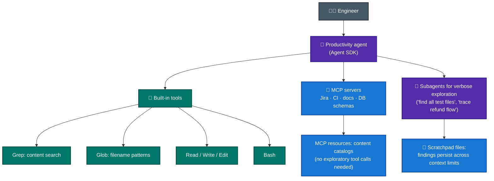
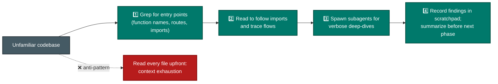

# Scenario ④ · Developer Productivity with Claude

> **Official brief:** You are building developer productivity tools using the Claude Agent SDK. The agent helps engineers explore unfamiliar codebases, understand legacy systems, generate boilerplate code, and automate repetitive tasks. It uses the built-in tools (**Read, Write, Bash, Grep, Glob**) and integrates with MCP servers.

**Primary domains:** [D2 Tool Design & MCP](../domains/d2-tool-design-mcp.md) · [D3 Claude Code Config & Workflows](../domains/d3-claude-code.md) · [D1 Agentic Architecture](../domains/d1-agentic-architecture.md)

*No official sample questions exist for this scenario; the exam guide's 12 samples cover scenarios ①②③⑤. Practice questions below are unofficial, written against the official task statements.*

## Reference architecture

## Codebase exploration flow the exam expects

## Patterns this scenario tests

| Pattern | Chapter |
|---|---|
| Grep vs Glob vs Read/Edit selection; Edit's unique-match constraint | [D2 Sec. 2.5](../domains/d2-tool-design-mcp.md) |
| Incremental exploration (Grep → Read), not read-everything | [D2 Sec. 2.5](../domains/d2-tool-design-mcp.md) |
| MCP resources as catalogs; description quality vs built-in tool preference | [D2 Sec. 2.4](../domains/d2-tool-design-mcp.md) |
| Project vs user MCP scoping; env-var expansion | [D2 Sec. 2.4](../domains/d2-tool-design-mcp.md) |
| Session resumption vs fresh session + summary; fork_session | [D1 Sec. 1.7](../domains/d1-agentic-architecture.md) |
| Scratchpads, subagent isolation, /compact, crash-recovery manifests | [D5 Sec. 5.4](../domains/d5-context-reliability.md) |
| Dynamic decomposition for open-ended tasks ("add tests to legacy code") | [D1 Sec. 1.6](../domains/d1-agentic-architecture.md) |

## Practice questions (unofficial)

**P1.** An engineer asks the agent to find every caller of `calculateDiscount` across a large monorepo. Which tool should the agent reach for first?

- **A.** Glob with pattern `**/calculateDiscount*`
- **B.** Grep for `calculateDiscount` across file contents
- **C.** Read on each file in `src/`
- **D.** Bash `find . -name "*.ts"`

Answer

**B.** Callers are text occurrences *inside* files, and content search is Grep (task statement 2.5). Glob (A) matches file *names*. C exhausts context; D just lists files.

**P2.** Your agent's Edit calls intermittently fail with "text matches multiple locations" on a large generated file. What's the documented fallback?

- **A.** Retry Edit with a longer anchor string until it works.
- **B.** Use Read to load the file, then Write the full modified content.
- **C.** Use Bash with `sed`.
- **D.** Split the file first.

Answer

**B.** When Edit can't find a unique match, Read + Write is the reliable fallback for file modification (task statement 2.5).

**P3.** You built a `search_docs` MCP tool backed by your internal docs index, but the agent keeps using built-in Grep against the checked-out docs folder instead. What's the most effective fix?

- **A.** Remove Grep from allowedTools.
- **B.** Enhance the MCP tool's description to explain its capabilities and outputs in detail.
- **C.** Add a system-prompt rule: "always prefer search_docs".
- **D.** Rename the tool to `grep_docs`.

Answer

**B.** The named fix in the guide: enhance MCP tool descriptions so the agent stops preferring less-capable built-ins (task statement 2.4). A breaks other workflows; C is probabilistic; D invites more confusion with Grep.

**P4.** After a 2-hour legacy-system exploration, the agent starts describing "typical repository patterns" instead of the specific classes it discovered earlier, and answers become inconsistent. Which two responses directly address this? *(pick 2)*

- **A.** Have the agent maintain a scratchpad file of key findings and reference it for subsequent questions.
- **B.** Increase max_tokens.
- **C.** Use /compact to reduce context consumed by verbose discovery output.
- **D.** Switch to a model with a larger context window and re-run the whole exploration.

Answer

**A + C.** Classic context degradation (task statement 5.4): scratchpads persist findings across context boundaries; /compact reclaims budget from discovery noise. B is unrelated; D re-pays the entire cost without changing the failure mode.

**P5.** An engineer wants to compare two refactoring strategies that both build on the same expensive codebase analysis. What's the right session pattern?

- **A.** Run two fresh sessions, one per strategy.
- **B.** One session: try strategy A, then ask the agent to forget it and try B.
- **C.** `fork_session` from the shared analysis baseline into two independent branches.
- **D.** `--resume` the analysis session twice in parallel.

Answer

**C.** fork_session exists precisely for exploring divergent approaches from a shared baseline (task statement 1.7). A repeats the expensive analysis; B contaminates; D isn't parallel-safe branching.

**More drills:** [avidevelops Q&A bank](https://github.com/avidevelops/claude-architect-exam-prep) · [hueanmy/cca-f-roadmap](https://github.com/hueanmy/cca-f-roadmap) (13 working Python examples).
