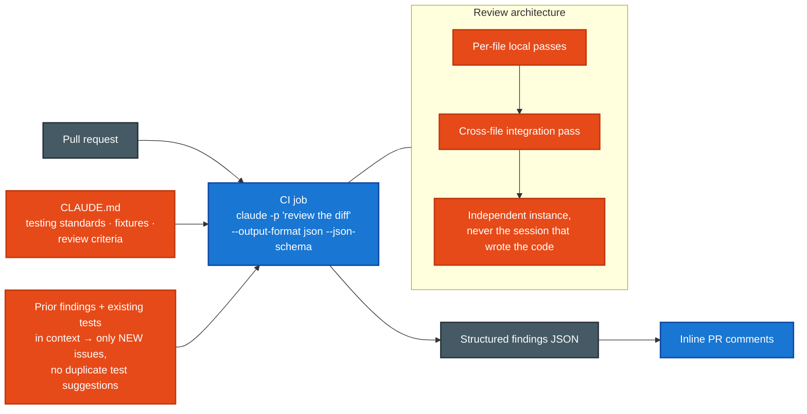
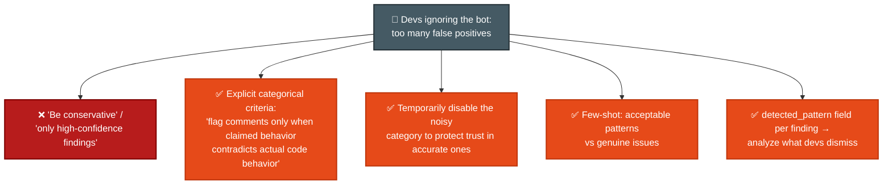

# Scenario ⑤ · Claude Code for Continuous Integration

> **Official brief:** You are integrating Claude Code into your CI/CD pipeline. The system runs automated code reviews, generates test cases, and provides feedback on pull requests. You need to design prompts that provide **actionable feedback and minimize false positives**.

**Primary domains:** [D3 Claude Code Config & Workflows](../domains/d3-claude-code.md) · [D4 Prompt Engineering & Structured Output](../domains/d4-prompting-structured-output.md)

## Reference pipeline

## False-positive control the exam expects

## Patterns this scenario tests

| Pattern | Chapter |
|---|---|
| `-p` non-interactive; `--output-format json` + `--json-schema` | [D3 Sec. 3.6](../domains/d3-claude-code.md) |
| CLAUDE.md as CI context (standards, fixtures, criteria) | [D3 Sec. 3.6](../domains/d3-claude-code.md) |
| Explicit criteria > vague instructions; severity via code examples | [D4 Sec. 4.1](../domains/d4-prompting-structured-output.md) |
| Few-shot for ambiguous cases + output-format consistency | [D4 Sec. 4.2](../domains/d4-prompting-structured-output.md) |
| Batch vs real-time by latency tolerance; custom_id | [D4 Sec. 4.5](../domains/d4-prompting-structured-output.md) |
| Multi-pass review; independent instance; no consensus-voting | [D4 Sec. 4.6](../domains/d4-prompting-structured-output.md) |

## Official sample questions

*From the [CCA-F Exam Guide](../../official-exam-guides/cca-f-exam-guide.pdf), Sec. 9.*

**Q10.** Your pipeline script runs `claude "Analyze this pull request for security issues"` but the job hangs indefinitely; logs indicate Claude Code is waiting for interactive input. What's the correct approach to run Claude Code in an automated pipeline?

- **A.** Add the `-p` flag: `claude -p "Analyze this pull request for security issues"`
- **B.** Set the environment variable `CLAUDE_HEADLESS=true` before running the command
- **C.** Redirect stdin from /dev/null: `claude "Analyze this pull request for security issues" < /dev/null`
- **D.** Add the `--batch` flag: `claude --batch "Analyze this pull request for security issues"`

Answer & rationale

**A.** `-p` (`--print`) is the documented non-interactive mode: process the prompt, print to stdout, exit. `CLAUDE_HEADLESS` and `--batch` don't exist; stdin redirection doesn't address the command syntax.

**Q11.** Real-time Claude calls power two workflows: (1) a blocking pre-merge check, and (2) a technical-debt report generated overnight. Your manager proposes switching both to the Message Batches API for its 50% cost savings. How should you evaluate this?

- **A.** Use batch processing for the technical debt reports only; keep real-time calls for pre-merge checks.
- **B.** Switch both workflows to batch processing with status polling to check for completion.
- **C.** Keep real-time calls for both workflows to avoid batch result ordering issues.
- **D.** Switch both to batch processing with a timeout fallback to real-time if batches take too long.

Answer & rationale

**A.** Batch = up to 24h, no latency SLA → unsuitable for blocking checks, ideal for overnight jobs. B gambles on "often faster"; C cites a non-issue (custom_id correlates results); D adds complexity where matching each API to its use case is simpler.

**Q12.** A PR modifies 14 files in the stock-tracking module. Your single-pass review produces inconsistent depth, misses obvious bugs, and contradicts itself (flagging a pattern in one file while approving identical code in another). How should you restructure the review?

- **A.** Split into focused passes: analyze each file individually for local issues, then run a separate integration-focused pass examining cross-file data flow.
- **B.** Require developers to split large PRs into smaller submissions of 3-4 files before the automated review runs.
- **C.** Switch to a higher-tier model with a larger context window to give all 14 files adequate attention in one pass.
- **D.** Run three independent review passes on the full PR and only flag issues that appear in at least two of the three runs.

Answer & rationale

**A.** Attention dilution is the root cause; per-file passes give consistent depth and the integration pass catches cross-file issues. B shifts burden to humans; C misunderstands that bigger context ≠ better attention; D *suppresses* real intermittent findings.

## Extra practice (unofficial, written for this repo against the official task statements)

**P1.** After adding automated test generation to CI, developers complain the bot keeps proposing tests for scenarios the suite already covers. What's the fix named by the blueprint?

- **A.** Lower the generation temperature.
- **B.** Provide existing test files in context so generation avoids duplicate scenarios.
- **C.** Generate tests only for changed lines.
- **D.** Run generation twice and diff the outputs.

Answer

**B.** Task statement 3.6: provide existing test files in context so test generation avoids suggesting scenarios already covered. The same idea covers re-reviews: include prior findings and instruct "only new or still-unaddressed issues."

**P2.** Your review bot's "misleading comment" category has an 80% false-positive rate; its security category is accurate and valued. Developers have started ignoring everything it posts. Best immediate action?

- **A.** Add "only report high-confidence findings" to the prompt.
- **B.** Temporarily disable the misleading-comment category while you rewrite its criteria with concrete examples.
- **C.** Lower the bot's comment volume cap.
- **D.** Weight categories by confidence score in the output schema.

Answer

**B.** High false-positive categories undermine trust in accurate categories; the guide's named remedy is disabling the noisy category while improving its prompt (task statement 4.1). A is explicitly called out as ineffective.

**More drills:** [jaysevak/ccaf-practice-exam](https://github.com/jaysevak/ccaf-practice-exam) (timed simulator) · [ankitrahejagatech prep](https://github.com/ankitrahejagatech/claude-certified-architect-prep) (hosted practice exam + cribsheets).
