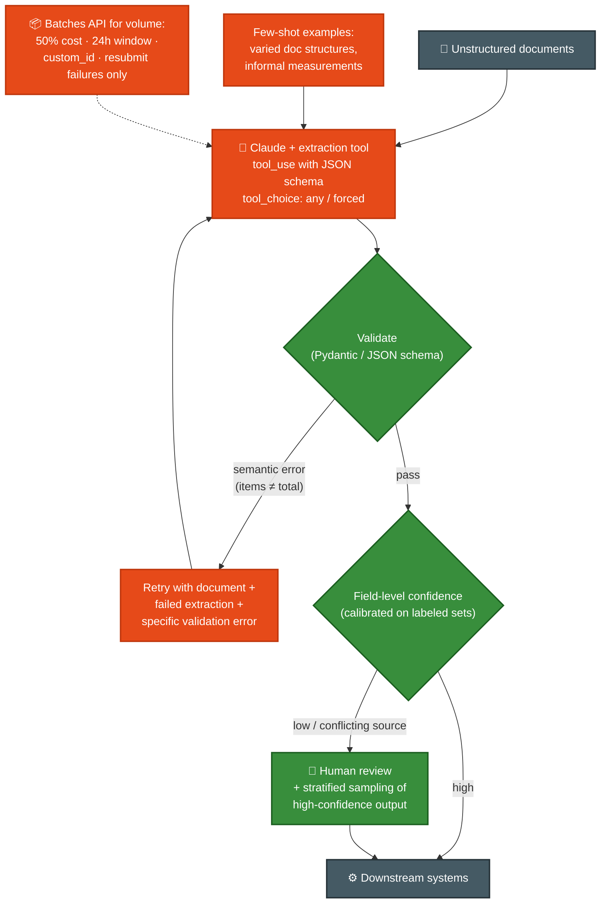
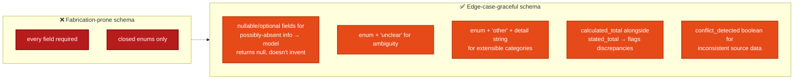

# Scenario ⑥ · Structured Data Extraction

> **Official brief:** You are building a structured data extraction system using Claude. The system extracts information from unstructured documents, validates the output using JSON schemas, and maintains high accuracy. It must **handle edge cases gracefully** and integrate with downstream systems.

**Primary domains:** [D4 Prompt Engineering & Structured Output](../domains/d4-prompting-structured-output.md) · [D5 Context & Reliability](../domains/d5-context-reliability.md)

*No official sample questions exist for this scenario; the exam guide's 12 samples cover scenarios ①②③⑤. Practice questions below are unofficial, written against the official task statements.*

## Reference pipeline

## Schema design the exam expects

## Patterns this scenario tests

| Pattern | Chapter |
|---|---|
| tool_use + JSON schema = no syntax errors; semantic errors remain | [D4 Sec. 4.3](../domains/d4-prompting-structured-output.md) |
| tool_choice: any (unknown doc type) vs forced (specific extraction first) | [D4 Sec. 4.3](../domains/d4-prompting-structured-output.md) |
| Retry-with-error-feedback; when retries can't help (absent info) | [D4 Sec. 4.4](../domains/d4-prompting-structured-output.md) |
| Few-shot for varied formats; empty/null-field handling | [D4 Sec. 4.2](../domains/d4-prompting-structured-output.md) |
| Batch strategy: SLA math, custom_id failure resubmission, sample-first | [D4 Sec. 4.5](../domains/d4-prompting-structured-output.md) |
| Aggregate accuracy masks segment failures; stratified sampling | [D5 Sec. 5.5](../domains/d5-context-reliability.md) |
| Calibrated field-level confidence → review routing | [D5 Sec. 5.5](../domains/d5-context-reliability.md) |

## Practice questions (unofficial)

**P1.** Your invoice extractor sometimes returns line items that don't sum to the extracted total. JSON schema validation passes. What's the best architectural response?

- **A.** Tighten the JSON schema so totals must match.
- **B.** Extract `calculated_total` alongside `stated_total` and flag discrepancies; route flagged docs to a retry-with-feedback loop or human review.
- **C.** Lower temperature to 0.
- **D.** Switch to a larger model.

Answer

**B.** This is a *semantic* error; schema syntax validation can't catch it (task statements 4.3/4.4). Self-correction fields + validation-retry with the specific error is the named pattern. A is impossible in JSON Schema terms for arithmetic; C/D don't address detection.

**P2.** Some source documents simply don't contain a `payment_due_date`. Since that schema field is required, the model fills in plausible dates. What's the fix?

- **A.** Make the field nullable/optional so the model can return null when the info is absent.
- **B.** Add a prompt instruction: "never guess dates."
- **C.** Retry extraction until the date stabilizes across runs.
- **D.** Post-process: reject any date more than 30 days out.

Answer

**A.** Required fields on possibly-absent data push the model to fabricate values; nullable fields are the schema-level fix (task statement 4.3). B is probabilistic; C retries can't conjure absent information (4.4); D masks rather than fixes.

**P3.** A nightly batch of 10,000 documents returns 300 failures with context-length errors. What's the most cost-effective recovery?

- **A.** Resubmit the full batch with a bigger model.
- **B.** Resubmit only the 300 failed documents (identified by custom_id), chunking the oversized ones.
- **C.** Switch the 300 to the real-time API.
- **D.** Truncate the 300 documents to fit and resubmit.

Answer

**B.** Handle batch failures by resubmitting only failed items via custom_id, with appropriate modifications, e.g. chunking documents that exceeded context limits (task statement 4.5). A re-pays 9,700 successes; D silently loses data.

**P4.** Your extraction system reports 97% overall accuracy, so the team wants to drop human review entirely. What should you check first?

- **A.** Whether accuracy holds **per document type and per field segment**, since aggregates can mask a failing segment.
- **B.** Whether a competitor achieves higher accuracy.
- **C.** Whether the model version is current.
- **D.** Whether reviewers agree with each other.

Answer

**A.** Task statement 5.5 verbatim risk: aggregate metrics mask poor performance on specific document types or fields. Validate by segment before automating high-confidence extractions, then keep stratified random sampling running for novel-error detection.

**P5.** You must meet a 30-hour turnaround SLA using the Batches API (24-hour processing window). How often should you submit batches?

- **A.** Once daily.
- **B.** Roughly every 4 hours.
- **C.** Hourly.
- **D.** Continuously, one document per batch.

Answer

**B.** The guide's own example: ~4-hour submission windows guarantee a 30-hour SLA with 24-hour worst-case batch processing (24 + 4 < 30, with margin). Daily submission can breach the SLA; hourly/continuous adds overhead without need.

**More drills:** [avidevelops Q&A bank](https://github.com/avidevelops/claude-architect-exam-prep) (extraction/validation + batch questions) · Exercise 3 in the official guide (build the pipeline end-to-end).
