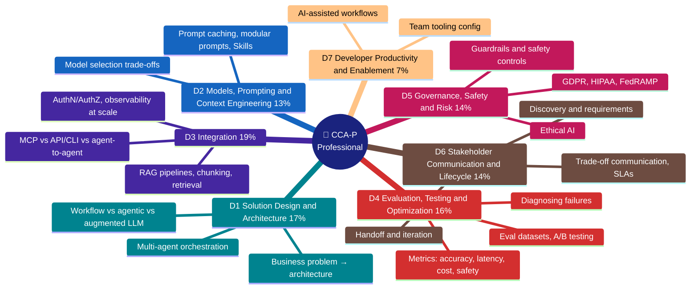

# CCA-P: Claude Certified Architect Professional

## The whole program at a glance

## Domain chapters

| Chapter | Weight | Covers |
|---|---|---|
| [D1 Solution Design & Architecture](domains/d1-solution-design.md) | 17% | Business problem → architecture, workflow vs agentic vs augmented LLM, multi-agent design, value pillars |
| [D2 Models, Prompting & Context Engineering](domains/d2-models-prompting-context.md) | 13% | Model tier trade-offs, prompt architecture, prompt caching, token optimization, reuse (caching/modular/Skills) |
| [D3 Integration](domains/d3-integration.md) | 19% | RAG pipelines & retrieval strategy, MCP vs API/CLI vs agent-to-agent, authN/authZ & least privilege, observability |
| [D4 Evaluation, Testing & Optimization](domains/d4-evaluation-testing-optimization.md) | 16% | Metrics, eval datasets, LLM-as-judge, A/B testing, failure diagnosis, cost/latency levers |
| [D5 Governance, Safety & Risk](domains/d5-governance-safety-risk.md) | 14% | Layered guardrails, failure modes, HITL, GDPR/HIPAA/FedRAMP, ethical AI |
| [D6 Stakeholder Communication & Lifecycle](domains/d6-stakeholder-lifecycle.md) | 14% | Structured discovery, trade-off communication, SLAs, documentation, lifecycle phases |
| [D7 Developer Productivity & Enablement](domains/d7-dev-productivity-enablement.md) | 7% | Team tooling config, AI-assisted workflows, operational support |

Scenarios: **none**. The official guide defines no CCA-P scenario bank ([details](scenarios/README.md)). D1–D4 (65%) decide pass/fail; D5–D7 (35%) are the cheap points for CCA-F-trained candidates.
