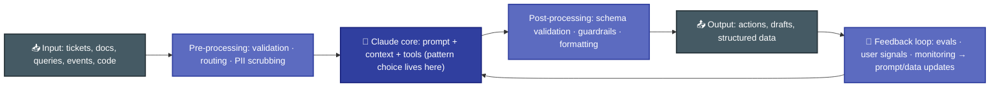
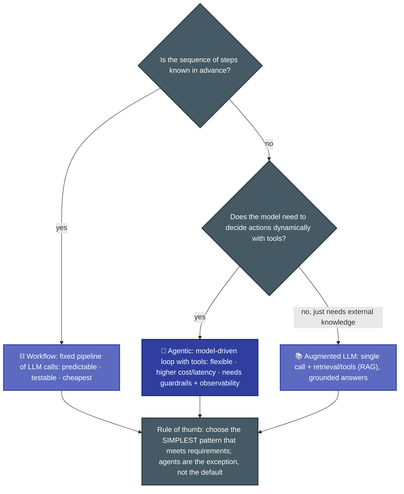
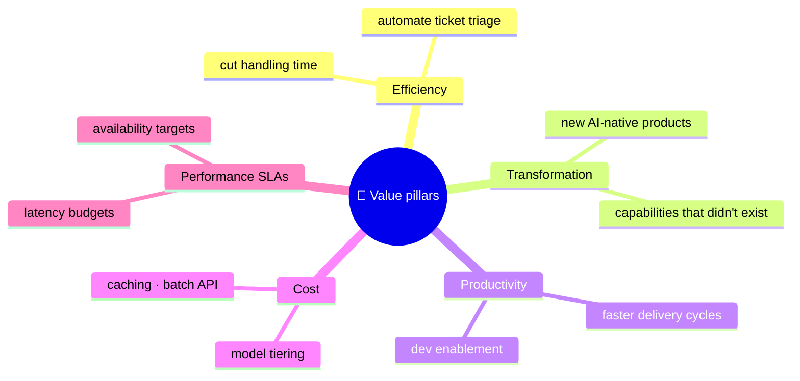

# P-D1 · Solution Design & Architecture (17%)

Turning a business problem into a Claude-based architecture: choosing the right pattern (workflow vs agentic vs augmented LLM), designing the end-to-end flow, and tying it back to business value.

**Builds on CCA-F:** [F-D1 Agentic Architecture](../../CCA-F/domains/d1-agentic-architecture.md) (orchestration mechanics).
**Source:** official [CCA-P Exam Guide](../../official-exam-guides/cca-p-exam-guide.pdf), Domain 1 objectives; prep course "Claude Platform & Solution Design".

---

## End-to-end architecture shape

Every solution the exam asks you to design decomposes into the same skeleton; know where each concern lives:

## Pattern selection (the core P-D1 skill)

**Know cold:**
- **Workflow**: deterministic orchestration, LLM used per-step (classify → extract → draft). Best when auditability and predictable cost matter.
- **Agentic**: the model plans and acts in a loop (see [F-D1 Sec. 1.1](../../CCA-F/domains/d1-agentic-architecture.md)). Justify it with genuine run-time ambiguity, not enthusiasm.
- **Augmented LLM**: one model call enriched with retrieval or tool results; the RAG default for Q&A/knowledge tasks.
- Exam questions often hide the answer in a phrase like "steps are always the same" (→ workflow) or "the set of actions depends on what it finds" (→ agentic).

## Multi-agent orchestration & decomposition

Same principles as CCA-F, elevated to design level:

- Hub-and-spoke coordination, isolated subagent contexts, explicit context passing, parallel delegation ([F-D1 Sec. 1.2–1.3](../../CCA-F/domains/d1-agentic-architecture.md)).
- **When to go multi-agent:** the task has separable specializations (search vs analysis vs synthesis), a single context can't hold the working set, or roles need different tool permissions.
- **When not to:** a single agent with a good prompt and scoped tools meets requirements; multi-agent adds latency, cost, and failure surface.
- Decomposition techniques: split by sub-problem, by document/data partition, or by pipeline stage; fixed chains for predictable flows, dynamic decomposition for open-ended ones ([F-D1 Sec. 1.6](../../CCA-F/domains/d1-agentic-architecture.md)).

## Business value pillars

Architecture recommendations must map to the value pillar the stakeholder cares about:

**Know cold:** a technically elegant design that misses the stated pillar (e.g. optimizing latency when the driver is cost) is a wrong answer. Anchor every trade-off to the business goal given in the stem.

---

## Extra practice (unofficial)

*No official sample questions exist for this domain; the CCA-P Exam Guide's 3 published samples cover Domains 2–4. Practice questions below are unofficial, written against this domain's official objectives.*

**P1.** A team wants a system that drafts a weekly executive summary from a fixed set of five internal reports. The steps are always the same: pull the five reports, extract key metrics, draft the summary, format as slides. Which pattern best fits?

- **A.** Agentic: let the model decide which reports to pull each week.
- **B.** Workflow: a fixed pipeline of LLM calls: extract → draft → format.
- **C.** Augmented LLM: one retrieval-augmented call over the five reports.
- **D.** Multi-agent: one subagent per report, coordinated by a hub agent.

Answer & rationale

**B.** The sequence never varies ("always the same"), which is the textbook workflow case. Agentic (A) and multi-agent (D) add flexibility and cost the task doesn't need; augmented LLM (C) collapses a multi-step extract-then-draft-then-format pipeline into one call, losing the auditability of discrete steps.

**P2.** Stakeholders asked for a solution that minimizes infrastructure cost above all else. Your team proposes adding a verification pass with a larger model at every step, improving accuracy by 4% but roughly doubling per-request cost. Is this the right recommendation?

- **A.** Yes, higher accuracy is always the right trade-off.
- **B.** No, it optimizes a pillar (accuracy) the stakeholder didn't prioritize, at the direct expense of the one they did (cost).
- **C.** Yes, production systems should always maximize quality regardless of stated priorities.
- **D.** No, remove the verification pass and replace it with a single larger model instead.

Answer & rationale

**B.** A technically elegant design that misses the stated pillar is a wrong answer; the stem named cost, not accuracy, as the driver. A and C ignore the stated priority entirely; D still doesn't address the mismatch and introduces another cost-increasing change.

**P3.** A support-ticket summarization task needs to read one ticket, pull the customer's order history, and write a one-paragraph summary. A vendor proposes a 4-agent system (router, ticket-reader, order-history-lookup, and writer) coordinated by a hub agent. What's the most defensible critique?

- **A.** It's correctly decomposed by specialization and should be kept as-is.
- **B.** It's over-engineered: a single agent with two scoped tools would meet requirements at lower latency, cost, and failure surface.
- **C.** It's under-engineered: it needs a fifth agent dedicated to quality review before the summary ships.
- **D.** It's correctly decomposed, but the four agents should run in parallel rather than hub-and-spoke.

Answer & rationale

**B.** A single agent with a good prompt and scoped tools meets requirements when the task has no separable specialization, parallelizable sub-problem, or context-size pressure, and this task has none of those. A endorses the over-engineering; C and D add or rearrange agents instead of questioning whether multi-agent is justified at all.

**P4.** A code-review agent receives raw PR diffs, must strip out generated/vendored files before analysis, and its final output must pass a JSON-schema validator before posting to GitHub. Where do "strip out generated/vendored files" and "JSON-schema validation" belong in the architecture?

- **A.** Both inside the Claude core call itself, via prompt instructions.
- **B.** Pre-processing for the file-stripping step, post-processing for the schema validation.
- **C.** Both in a single post-processing stage, after Claude drafts its findings.
- **D.** Both in the feedback loop, applied only after production monitoring flags an issue.

Answer & rationale

**B.** Input filtering/normalization is pre-processing, before the model call; output structural checks are post-processing, after. Doing both inside the model call (A) relies on probabilistic compliance for concerns that should be deterministic; C wastes tokens feeding the model content that should never have reached it; D confuses ongoing pipeline stages with the separate feedback/monitoring loop.

**P5.** A document-processing pipeline always performs the same four steps in the same order for every document: OCR → classify → extract → validate. A separate research task must explore an open-ended set of sub-questions whose number and order can't be known upfront. How should each be decomposed?

- **A.** Both should use dynamic decomposition, since decomposition always benefits from flexibility.
- **B.** The document pipeline should use a fixed chain (steps known in advance); the research task should use dynamic decomposition (open-ended, discovered at run time).
- **C.** Both should use a fixed chain, for predictability and lower cost.
- **D.** The document pipeline should use dynamic decomposition, since documents vary in content even if the steps don't.

Answer & rationale

**B.** Fixed chains fit predictable flows; dynamic decomposition fits open-ended ones. A ignores that a predictable pipeline doesn't need dynamic overhead; C under-serves the genuinely open-ended research task; D confuses content variability with step-sequence variability; the steps stay fixed even though document content differs.

## Exam focus

| Cue in the question | Likely answer direction |
|---|---|
| "Steps are known and repeatable" | Workflow, not agent |
| "Must decide which systems to query based on the request" | Agentic |
| "Answers must be grounded in company docs" | Augmented LLM / RAG |
| "Simplest solution that meets requirements" | Downgrade the pattern |
| "Which design best supports [pillar]?" | Map features → that pillar only |

**Practice:** [claude-cookbooks `patterns`](https://github.com/anthropics/claude-cookbooks) (workflow vs agent notebooks) · [Tutorials Dojo CCAR-P guide](https://tutorialsdojo.com/ccar-p-claude-certified-architect-professional-study-guide/) (solution architecture section).
