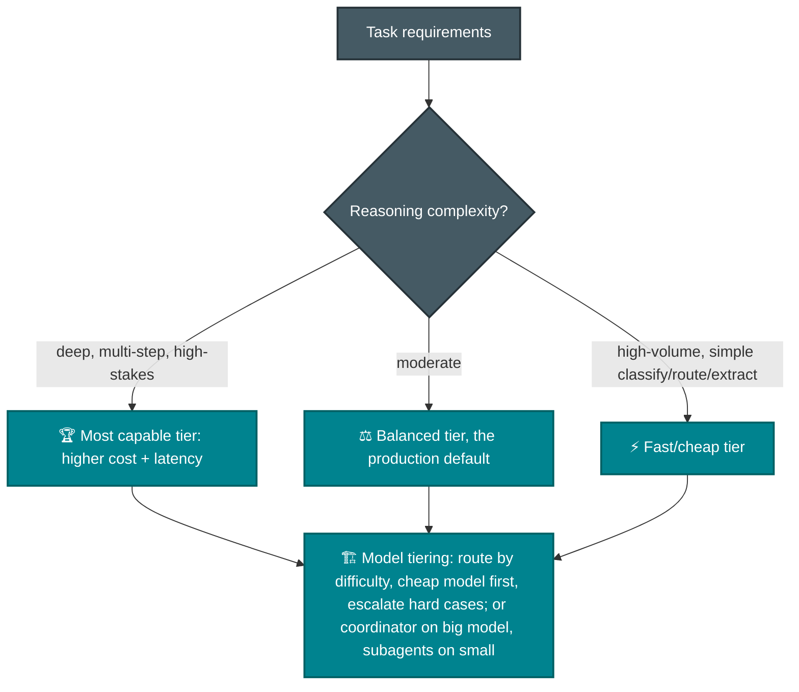
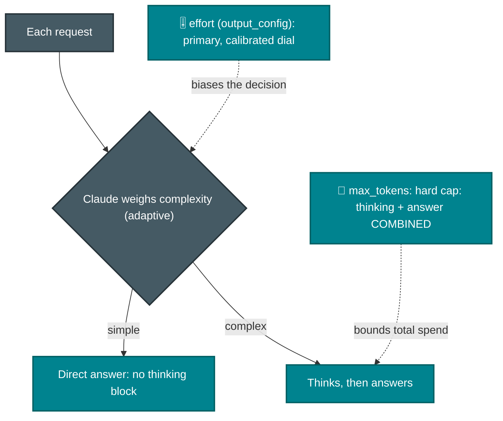
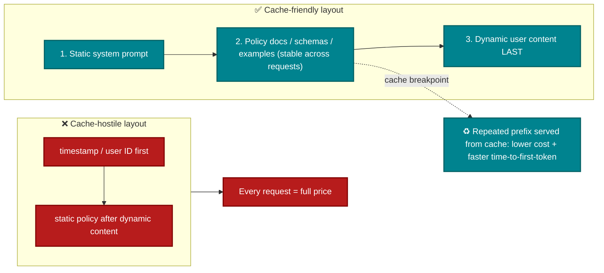

# P-D2 · Claude Models, Prompting & Context Engineering (13%)

Model selection, prompt structure, technique choice, and token and cost control through caching, modular prompts, and Skills.

**Builds on CCA-F:** [F-D4 Prompting & Structured Output](../../CCA-F/domains/d4-prompting-structured-output.md) · [F-D5 Context & Reliability](../../CCA-F/domains/d5-context-reliability.md).
**Source:** official [CCA-P Exam Guide](../../official-exam-guides/cca-p-exam-guide.pdf), Domain 2 objectives.

---

## Model selection trade-offs

**Key point:** Choose by capability, latency, cost, and context size. Do not select the smallest model without testing it on the task.

### How the tiers map to Claude Code

> Source: [model-config](https://code.claude.com/docs/en/model-config). In Claude Code, **aliases** choose the family, **effort** controls reasoning depth within a model, and **extended context** increases the window. Set them with `/model`, the `model` setting, or `--model`.

| Alias | Tier role | Notes |
|---|---|---|
| `haiku` | fast/cheap | high-volume classify/route/extract; the background-task model |
| `sonnet` | balanced default | daily coding; Sonnet 5 has a **native 1M** window |
| `opus` | most capable | complex reasoning/architecture |
| `fable` | hardest/longest | sustained autonomous sessions; **not default**, opt in with `/model fable` |
| `opusplan` | **hybrid** | Opus **while planning**, auto-switches to Sonnet **for execution** |
| `<family>[1m]` | extended context | `sonnet[1m]` / `opus[1m]` → **1M-token** window for long sessions |

> **Beyond the aliases: Mythos.** The table lists selectable aliases. **Mythos** is a separate higher tier with the same underlying model as Fable but fewer guardrails, limited access, and premium pricing. Choose Opus or Fable for general availability. See [Sec. 1](../../claude-stack.md#1-the-map--where-everything-sits).

**Architecture choices:**
- **`opusplan`** tiers models within one session: stronger reasoning for design, lower-cost reasoning for implementation. Each plan-mode toggle changes models and misses the cache. See [F-D5 Sec. 5.8](../../CCA-F/domains/d5-context-reliability.md).
- **Effort level** (`low · medium · high · xhigh · max`, default `high`) is separate from model choice. Raise it for deeper reasoning and lower it to reduce cost and latency. Try more effort before moving to a larger model. See the [thinking subsection](#thinking--effort-at-the-api-level-the-other-side-of-the-same-dial).
- **Extended context (`[1m]`)** increases window size, not model ability. Use it for long sessions. Use multiple passes for attention or quality problems. See [F-D4 Sec. 4.6](../../CCA-F/domains/d4-prompting-structured-output.md).
- **Fallback chains** (`--fallback-model` / `fallbackModel` setting, ≤3) = availability resilience: on overload/unavailable/server error, switch for that turn only. Distinct from **automatic content fallback** (Fable → provider's default Opus when a safety classifier flags a request).

### Thinking & effort at the API level (the other side of the same dial)

> Source: [platform: thinking-steering-and-cost](https://platform.claude.com/docs/en/build-with-claude/thinking-steering-and-cost) + [effort](https://platform.claude.com/docs/en/build-with-claude/effort). The table above covers Claude Code. The **Messages API** uses the same reasoning control with different mechanics.

**Thinking adapts to each request.** With `thinking: {type: "adaptive"}`, the model decides whether to think and how deeply based on complexity. A simple turn may have no thinking block, so application logic must not require one. This works well for mixed simple and complex requests.

**Three steering levers, in order:**
1. **`effort`** at `output_config.effort` is the main calibrated control. It uses the same `low…max` range. On the API, `max` and `xhigh` always think, while `low` may skip thinking on simple turns. Prefer this control over wording-sensitive prompt changes.
2. **System-prompt guidance** changes the threshold for the whole conversation.
3. **Per-message guidance** controls one turn, such as "think hard" or "answer directly". This can vary planning and routine turns without changing request parameters or breaking the prompt cache.

**Cost control:**
- **There is no separate thinking-token budget.** `max_tokens` limits **thinking and response combined**, while `effort` guides how much reasoning to use. Current models no longer use manual `budget_tokens`.
- A limit sized for a direct answer may be too small when Claude thinks, causing `stop_reason: "max_tokens"`. Raise `max_tokens` when the reasoning is needed, or lower `effort` when it is not.
- **All thinking tokens are billed**, even when they are hidden or summarized. Check `usage.output_tokens_details.thinking_tokens` to measure them.
- **Effort is part of the cache key.** Changing effort or thinking settings invalidates the prompt cache, like switching models ([F-D5 Sec. 5.8](../../CCA-F/domains/d5-context-reliability.md)). Keep effort stable within a conversation and guide individual turns through messages. Setting the explicit default is equivalent to omitting it.

## Prompt architecture

- **System prompt** = role, constraints, policies, output contract; **templates** = parameterized reusable prompts; **guardrails** = instructed refusals + output schemas + post-validation (defense in depth with [P-D5](d5-governance-safety-risk.md)).
- Technique ladder: **zero-shot** (capable models, clear tasks) → **few-shot** (format consistency, ambiguous-case judgment, see [F-D4 Sec. 4.2](../../CCA-F/domains/d4-prompting-structured-output.md)) → **chain-of-thought** (multi-step reasoning: "think step by step" / structured reasoning fields).
- Explicit categorical criteria beat vague quality adjectives, the same principle the Foundations exam drills ([F-D4 Sec. 4.1](../../CCA-F/domains/d4-prompting-structured-output.md)).

## Prompt caching: the #1 cost/latency lever

**Key point:** If every request sends the same large prompt and policy document, place stable content first and enable prompt caching. Truncation loses policy details, while few-shot formatting does not create a reusable prefix.

**The API-level numbers** ([platform: prompt-caching](https://platform.claude.com/docs/en/build-with-claude/prompt-caching)) - Claude Code manages caching for you ([F-D5 Sec. 5.8](../../CCA-F/domains/d5-context-reliability.md)), but on the Messages API you place breakpoints yourself, and these are the figures an exam can quote:

| Knob | Value |
|---|---|
| Breakpoint type | `cache_control: {type: "ephemeral"}` - the only type |
| Max explicit breakpoints | **4** per request |
| Default TTL | **5 minutes**; optional **1-hour** at higher write cost |
| Min cacheable prompt | **1,024 tokens** (Opus 4.8 / Sonnet 5); **512** (Fable 5 / Mythos 5); **4,096** (Haiku 4.5) - below the floor, nothing caches |
| **Cache write** price | **1.25×** base input (5-min) · **2×** (1-hour) |
| **Cache read** price | **0.1×** base input (the ~90% saving) |
| What's cacheable | `tools` · `system` · `messages` (text, images, documents, tool calls/results) |

**Important cache mechanics:**
- **Invalidation is hierarchical: `tools` → `system` → `messages`.** A change high in the prefix busts everything after it. Changing **tool definitions** invalidates the entire cache; toggling tools/citations invalidates system + messages; `tool_choice` or image changes invalidate only messages. This is *why* the layout diagram orders static→dynamic: put the most stable content (tools, system, policy) first so the volatile user turn is all that recomputes.
- **The write-to-read ratio determines savings.** A five-minute cache write costs **1.25×**, while each read costs **0.1×**. Caching helps only when the prefix is reused enough. A prefix that changes every request pays the write cost without receiving any reads.
- **`effort` and thinking config are part of the cache key** (see the thinking section above) - hold them steady across a conversation.
- Track it with `cache_creation_input_tokens` (write) vs `cache_read_input_tokens` (read): persistently high creation = something keeps changing your prefix.

## Context window & token optimization

- Trim verbose tool outputs to relevant fields before they enter context; persist key facts in structured blocks ([F-D5 Sec. 5.1](../../CCA-F/domains/d5-context-reliability.md)).
- Position-aware layout: key findings at the start, explicit section headers; the lost-in-the-middle effect is on both exams.
- Budget context deliberately: retrieval brings the *relevant* slice instead of pasting whole corpora; summaries carry long histories.

## Prompt reuse strategies

| Strategy | What it is | Reach for it when |
|---|---|---|
| **Prompt caching** | Reuse of a stable prefix across requests | Same large system prompt/policy on every call |
| **Modular prompts** | Composable template fragments (role + policy + task + format) | Many similar workflows share components |
| **Skills** | Packaged instructions + resources loaded on demand | Task-specific workflows teams reuse; keep always-on context lean |

**Key point:** Skills load only when needed, while CLAUDE.md and system prompts are always present. This supports reuse without filling every context ([F-D3 Sec. 3.2](../../CCA-F/domains/d3-claude-code.md)).

---

## Official sample question

*From the [CCA-P Exam Guide](../../official-exam-guides/cca-p-exam-guide.pdf), Sec. 8, Sample 2.*

An application sends the same 8,000-token system prompt and policy document on every request, followed by a short, varying user message. Latency and cost are both concerns. Which optimization most directly addresses both?

- **A.** Truncate the policy document to the first 1,000 tokens.
- **B.** Switch to the smallest available model regardless of task fit.
- **C.** Place the static system prompt and policy before the dynamic content and enable prompt caching.
- **D.** Move the policy document into a few-shot example block.

Answer & rationale

**C.** Stable-prefix caching reduces both time-to-first-token and request cost without removing required context. A loses policy details, B risks quality without testing, and D does not create a reusable prefix.

## Extra practice (unofficial)

**P1.** A pipeline classifies 2 million support emails per day into 8 categories, then a second stage drafts a full reply only for the ~5% flagged as complex. Which model-tiering approach fits best?

- **A.** Run every email through the most capable tier for both classification and drafting, to maximize accuracy.
- **B.** Use a fast/cheap tier for the high-volume classification step, and reserve the more capable tier for drafting the ~5% complex replies.
- **C.** Use the same balanced/mid tier for both steps, since it's the "production default."
- **D.** Use the most capable tier for classification, since 2M/day is high-stakes at scale, and a fast/cheap tier for drafting replies.

Answer & rationale

**B.** Route by measured difficulty: use the cheaper model first and escalate hard cases. A wastes cost on a simple high-volume task. C ignores the different difficulty of the two stages. D assigns the model tiers in the wrong order.

**P2.** Twelve internal teams each want Claude Code to run their own multi-step deployment checklist, complete with example transcripts. Loading all twelve into every session's system prompt would triple the always-on context. What's the best reuse strategy?

- **A.** Prompt caching: cache all twelve procedures as a stable prefix.
- **B.** One modular prompt template combining all twelve into shared placeholders.
- **C.** Package each team's checklist as a Skill, loaded on demand only when that team's workflow is invoked.
- **D.** Put all twelve procedures into each team's CLAUDE.md file.

Answer & rationale

**C.** Skills load only when needed, which fits team-specific workflows. A keeps all procedures in context. B and D also make the always-loaded context too large.

**P3.** An extraction agent using a highly capable model produces correctly-formatted output on clear-cut documents, but its output format becomes inconsistent on ambiguous edge-case documents (handwritten annotations, non-standard layouts). What's the most targeted fix?

- **A.** Switch to chain-of-thought prompting across all documents.
- **B.** Add few-shot examples specifically demonstrating correct formatting on ambiguous edge cases.
- **C.** Switch to a more capable model tier.
- **D.** Rewrite the system prompt from scratch in a more formal tone.

Answer & rationale

**B.** Few-shot examples directly show the correct format for unclear cases. Chain-of-thought addresses reasoning, not formatting. A larger model or more formal prompt does not target this failure.

**P4.** A multi-turn support agent pastes the full raw JSON response from every tool call into its context, including internal metadata fields never used downstream. After 15 turns, the agent starts losing track of the customer's original request, stated back in turn 1. What would most directly help?

- **A.** Increase the model's context window size.
- **B.** Trim tool outputs to relevant fields only, and keep the customer's original request in a persistent, prominent block rather than relying on it staying findable back in turn 1.
- **C.** Summarize the entire conversation into a single sentence before every turn.
- **D.** Switch to a smaller, faster model to reduce processing time per turn.

Answer & rationale

**B.** Keep only relevant tool fields and place key facts in a clear persistent block. A increases capacity without removing waste. C may remove important details. D does not address context use.

**P5.** A reasoning-heavy agent runs with adaptive thinking at `high` effort. On the hardest requests it returns truncated answers with `stop_reason: "max_tokens"`; those requests genuinely need the deep reasoning. `max_tokens` is set to the size of a typical no-thinking answer. What's the most direct fix?

- **A.** Add a separate `budget_tokens` for thinking so it doesn't eat the answer budget.
- **B.** Raise `max_tokens` so there's room for the thinking **and** the response, since thinking counts toward the same cap.
- **C.** Lower `effort` to `low` to guarantee the answer always fits.
- **D.** Switch to a larger model tier.

Answer & rationale

**B.** `max_tokens` limits thinking and response together. Because these requests need the reasoning, increase the limit rather than lowering effort.

## Exam focus

| Cue | Direction |
|---|---|
| "Latency and cost both" + repeated static content | Prompt caching + stable-prefix ordering |
| "Inconsistent output format" | Few-shot examples |
| "Complex multi-step reasoning failing" | Chain-of-thought / higher tier / raise effort |
| "High volume, simple task, cost pressure" | Smaller tier + measure with evals |
| "Reuse across teams without bloating every prompt" | Skills / modular prompts |
| "Truncated answers, `stop_reason: max_tokens`, thinking on" | Raise `max_tokens` (thinking+answer share it); no separate budget |
| "Reasoning depth without a bigger model" | Raise `effort` - a dial orthogonal to model choice |
| "Cost jumped after tuning thinking per turn" | Changing `effort`/thinking config busts the cache - hold it steady |

**Practice:** [claude-cookbooks `extended_thinking` + `skills`](https://github.com/anthropics/claude-cookbooks) · [anthropics/courses prompt engineering tutorial](https://github.com/anthropics/courses) · [Claude docs: prompt caching](https://platform.claude.com/docs).
