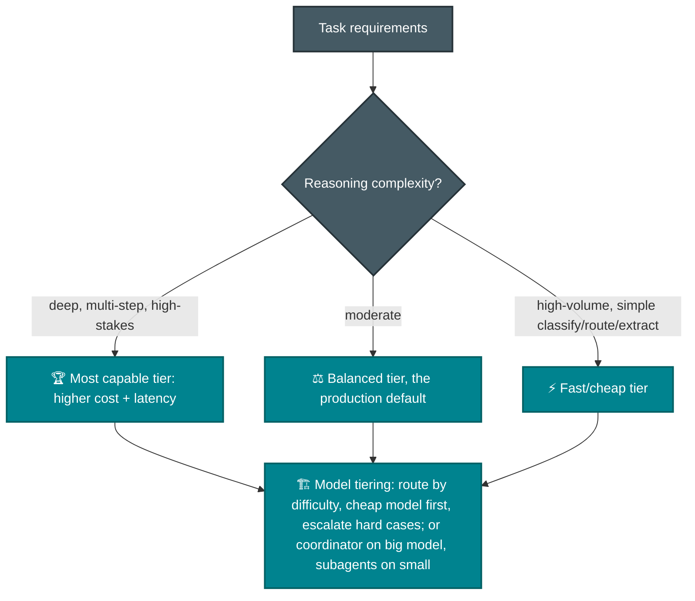
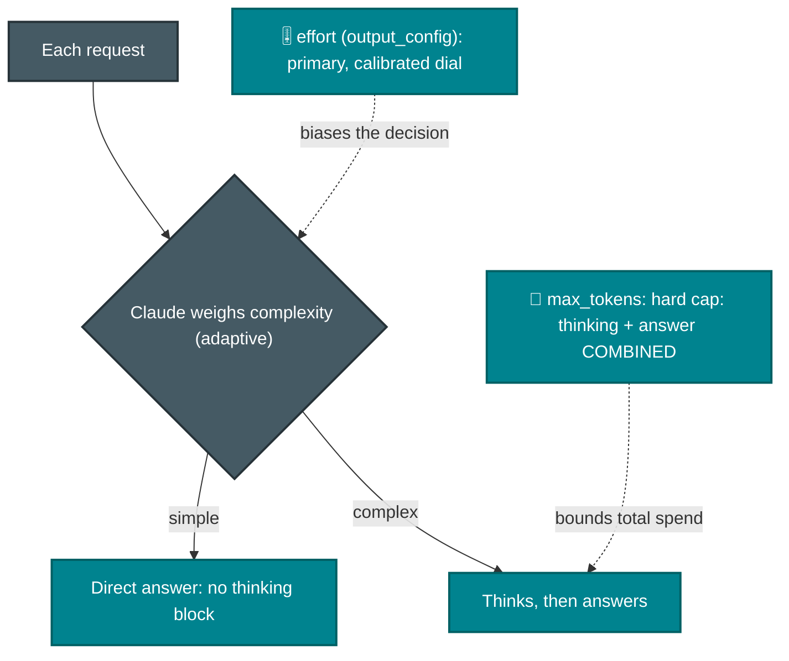
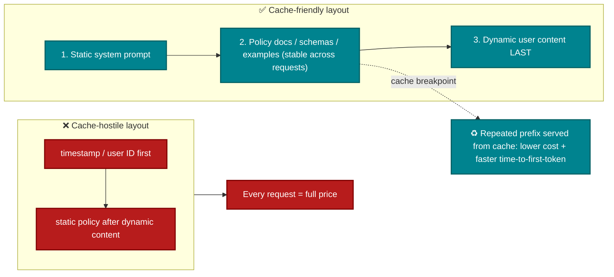

# P-D2 · Claude Models, Prompting & Context Engineering (13%)

Model selection trade-offs, prompt architecture (system prompts, templates, guardrails), technique choice, and token/cost engineering: caching, modular prompts, Skills.

**Builds on CCA-F:** [F-D4 Prompting & Structured Output](../../CCA-F/domains/d4-prompting-structured-output.md) · [F-D5 Context & Reliability](../../CCA-F/domains/d5-context-reliability.md).
**Source:** official [CCA-P Exam Guide](../../official-exam-guides/cca-p-exam-guide.pdf), Domain 2 objectives.

---

## Model selection trade-offs

**Know cold:** selection axes = capability · latency · cost · context size. "Smallest model regardless of task fit" is always a distractor (official sample 2, option B). Justify tier by measured task difficulty, ideally via evals, not vibes.

### How the tiers map to Claude Code

> Source: [model-config](https://code.claude.com/docs/en/model-config). The abstract tiers above have concrete handles in Claude Code: **aliases** pick the family, **effort** dials reasoning depth *within* a model, and **extended context** buys window size. Set via `/model`, the `model` setting, or `--model`.

| Alias | Tier role | Notes |
|---|---|---|
| `haiku` | fast/cheap | high-volume classify/route/extract; the background-task model |
| `sonnet` | balanced default | daily coding; Sonnet 5 has a **native 1M** window |
| `opus` | most capable | complex reasoning/architecture |
| `fable` | hardest/longest | sustained autonomous sessions; **not default**, opt in with `/model fable` |
| `opusplan` | **hybrid** | Opus **while planning**, auto-switches to Sonnet **for execution** |
| `<family>[1m]` | extended context | `sonnet[1m]` / `opus[1m]` → **1M-token** window for long sessions |

> **Beyond the aliases — Mythos.** The aliases above are the models you actually *select*. One tier sits above them but **isn't** an alias: **Mythos**, Anthropic's most capable model (state-of-the-art at cybersecurity and biology). It's the *safeguards-off sibling* of **Fable** — same underlying model, fewer guardrails — so it's **access-gated** (trusted-access programs only) and premium-priced, not something you route to with `/model`. Exam instinct: "most capable **generally available**" = Opus / Fable; Mythos is the gated frontier tier you don't reach for by default. (See orientation [Sec. 1](../../claude-stack.md#1-the-map--where-everything-sits).)

**Know cold — the architecture-judgment bits:**
- **`opusplan`** is model tiering *inside one session*: expensive reasoning where it pays off (design), cheap model where it doesn't (implementation). It's the coordinator-on-big / workers-on-small idea, automated. (Caution — each plan-mode toggle is a **model switch → cache miss**, [F-D5 Sec. 5.8](../../CCA-F/domains/d5-context-reliability.md).)
- **Effort level** (`low · medium · high · xhigh · max`, default `high`) is a *second* dial orthogonal to model choice: raise it for deep reasoning at higher token spend, lower it to cut cost/latency on a capable model. `max` = deepest, session-only. Don't reflexively reach for a bigger *model* when more *effort* on the current one is the cheaper lever. (Its API-side mechanics — adaptive thinking, how `max_tokens` bounds cost, effort as a cache key — are in the [thinking subsection below](#thinking--effort-at-the-api-level-the-other-side-of-the-same-dial).)
- **Extended context (`[1m]`)** addresses *context size*, not capability — reach for it on genuinely long sessions, not as a fix for attention/quality problems (which want a multi-pass architecture, [F-D4 Sec. 4.6](../../CCA-F/domains/d4-prompting-structured-output.md)).
- **Fallback chains** (`--fallback-model` / `fallbackModel` setting, ≤3) = availability resilience: on overload/unavailable/server error, switch for that turn only. Distinct from **automatic content fallback** (Fable → provider's default Opus when a safety classifier flags a request).

### Thinking & effort at the API level (the other side of the same dial)

> Source: [platform: thinking-steering-and-cost](https://platform.claude.com/docs/en/build-with-claude/thinking-steering-and-cost) + [effort](https://platform.claude.com/docs/en/build-with-claude/effort). The `/model` view above is Claude Code's; on the **Messages API** the same reasoning dial has different mechanics worth knowing cold — it's the P-D2 counterpart to the Claude Code effort bullet.

**Thinking is adaptive, per request.** With `thinking: {type: "adaptive"}`, **the model decides — each request — whether to think and how deeply**, weighing input complexity. A trivial turn may carry **no thinking block at all**; don't write app logic assuming every assistant turn starts with one. This makes thinking a fit for workloads that mix trivial and complex requests.

**Three steering levers, in order:**
1. **`effort`** at `output_config.effort` — the *calibrated* primary control. Same `low…max` dial as the model-config note above; on the API it also steers *whether* Claude thinks: `max`/`xhigh` always think, `low` skips it on simple turns. Prefer lowering effort to prompt-based tuning — a dial beats a wording-sensitive instruction.
2. **System-prompt guidance** — shifts the threshold for the whole conversation ("think only when it materially helps; when in doubt, respond directly").
3. **Per-message guidance** — steer a single turn ("think hard before responding" / "answer directly"). An agent harness can encourage thinking on planning steps and suppress it on routine confirmations without changing request params, and without breaking the prompt cache (see below).

**Cost control — know cold (a favorite trap):**
- **You do *not* set a thinking-token budget.** Two controls bound cost: **`max_tokens`** is a hard cap on **thinking + response combined** (Claude never exceeds it), and **`effort`** is soft guidance on how much of that budget goes to thinking. (The legacy manual `budget_tokens` is gone on current models.)
- Because thinking counts toward `max_tokens`, a cap sized for a no-thinking answer is **often too small** once the model thinks — you hit `stop_reason: "max_tokens"` mid-thought. Remedy: **raise `max_tokens`** (if the reasoning was needed) *or* **lower `effort`** (if it over-thought). Which one depends on whether quality on those requests actually needed the reasoning.
- **You're billed for the full thinking tokens even when the visible output is summarized/omitted.** Read `usage.output_tokens_details.thinking_tokens` to see how much of `output_tokens` was reasoning — an observability signal, not a separate billing line.
- **Effort is part of the cache key.** Changing `effort` (or the thinking config) between requests **invalidates prompt caching**, because the resolved effort is rendered into the prompt — same failure class as switching model mid-session ([F-D5 Sec. 5.8](../../CCA-F/domains/d5-context-reliability.md)). **Pick effort per conversation and hold it**; steer individual turns with per-message prompting, which leaves earlier cache breakpoints intact. (Setting `effort` explicitly to the model's default == omitting it; no cache break.)

## Prompt architecture

- **System prompt** = role, constraints, policies, output contract; **templates** = parameterized reusable prompts; **guardrails** = instructed refusals + output schemas + post-validation (defense in depth with [P-D5](d5-governance-safety-risk.md)).
- Technique ladder: **zero-shot** (capable models, clear tasks) → **few-shot** (format consistency, ambiguous-case judgment, see [F-D4 Sec. 4.2](../../CCA-F/domains/d4-prompting-structured-output.md)) → **chain-of-thought** (multi-step reasoning: "think step by step" / structured reasoning fields).
- Explicit categorical criteria beat vague quality adjectives, the same principle the Foundations exam drills ([F-D4 Sec. 4.1](../../CCA-F/domains/d4-prompting-structured-output.md)).

## Prompt caching: the #1 cost/latency lever

**Know cold (official sample 2):** an app resending an 8,000-token static prompt + policy doc per request, latency *and* cost both hurting → **order stable content first + enable prompt caching**. Truncation loses needed policy; moving content into few-shot blocks doesn't create a cacheable prefix.

**The API-level numbers** ([platform: prompt-caching](https://platform.claude.com/docs/en/build-with-claude/prompt-caching)) — Claude Code manages caching for you ([F-D5 Sec. 5.8](../../CCA-F/domains/d5-context-reliability.md)), but on the Messages API you place breakpoints yourself, and these are the figures an exam can quote:

| Knob | Value |
|---|---|
| Breakpoint type | `cache_control: {type: "ephemeral"}` — the only type |
| Max explicit breakpoints | **4** per request |
| Default TTL | **5 minutes**; optional **1-hour** at higher write cost |
| Min cacheable prompt | **1,024 tokens** (Opus 4.8 / Sonnet 5); **512** (Fable 5 / Mythos 5); **4,096** (Haiku 4.5) — below the floor, nothing caches |
| **Cache write** price | **1.25×** base input (5-min) · **2×** (1-hour) |
| **Cache read** price | **0.1×** base input (the ~90% saving) |
| What's cacheable | `tools` · `system` · `messages` (text, images, documents, tool calls/results) |

**Know cold — the mechanics that drive design:**
- **Invalidation is hierarchical: `tools` → `system` → `messages`.** A change high in the prefix busts everything after it. Changing **tool definitions** invalidates the entire cache; toggling tools/citations invalidates system + messages; `tool_choice` or image changes invalidate only messages. This is *why* the layout diagram orders static→dynamic: put the most stable content (tools, system, policy) first so the volatile user turn is all that recomputes.
- **The write→read ratio is the whole economics.** You pay **1.25×** once to write, then **0.1×** on every hit — so caching wins only when the same prefix is reused enough to amortize the write. A prefix that changes every request (timestamp/user-ID first) pays the write penalty for **zero** reads — strictly worse than not caching.
- **`effort` and thinking config are part of the cache key** (see the thinking section above) — hold them steady across a conversation.
- Track it with `cache_creation_input_tokens` (write) vs `cache_read_input_tokens` (read): persistently high creation = something keeps changing your prefix.

## Context window & token optimization

- Trim verbose tool outputs to relevant fields before they enter context; persist key facts in structured blocks ([F-D5 Sec. 5.1](../../CCA-F/domains/d5-context-reliability.md)).
- Position-aware layout: key findings at the start, explicit section headers; the lost-in-the-middle effect is on both exams.
- Budget context deliberately: retrieval brings the *relevant* slice instead of pasting whole corpora; summaries carry long histories.

## Prompt reuse strategies

| Strategy | What it is | Reach for it when |
|---|---|---|
| **Prompt caching** | Reuse of a stable prefix across requests | Same large system prompt/policy on every call |
| **Modular prompts** | Composable template fragments (role + policy + task + format) | Many similar workflows share components |
| **Skills** | Packaged instructions + resources loaded on demand | Task-specific workflows teams reuse; keep always-on context lean |

**Know cold:** Skills load on demand vs CLAUDE.md/system prompts always loaded: reuse *and* token hygiene at once (bridges [F-D3 Sec. 3.2](../../CCA-F/domains/d3-claude-code.md)).

---

## Official sample question

*From the [CCA-P Exam Guide](../../official-exam-guides/cca-p-exam-guide.pdf), Sec. 8, Sample 2.*

An application sends the same 8,000-token system prompt and policy document on every request, followed by a short, varying user message. Latency and cost are both concerns. Which optimization most directly addresses both?

- **A.** Truncate the policy document to the first 1,000 tokens.
- **B.** Switch to the smallest available model regardless of task fit.
- **C.** Place the static system prompt and policy before the dynamic content and enable prompt caching.
- **D.** Move the policy document into a few-shot example block.

Answer & rationale

**C.** Ordering stable content first and enabling prompt caching lets repeated prefixes be reused, reducing both time-to-first-token and per-request cost without discarding required context. A loses needed policy; B risks quality blindly; D does not create a cacheable, reusable prefix.

## Extra practice (unofficial)

**P1.** A pipeline classifies 2 million support emails per day into 8 categories, then a second stage drafts a full reply only for the ~5% flagged as complex. Which model-tiering approach fits best?

- **A.** Run every email through the most capable tier for both classification and drafting, to maximize accuracy.
- **B.** Use a fast/cheap tier for the high-volume classification step, and reserve the more capable tier for drafting the ~5% complex replies.
- **C.** Use the same balanced/mid tier for both steps, since it's the "production default."
- **D.** Use the most capable tier for classification, since 2M/day is high-stakes at scale, and a fast/cheap tier for drafting replies.

Answer & rationale

**B.** This is the tiering pattern in its clearest form: route by measured difficulty, cheap model first, escalate the hard cases. A wastes cost and latency at massive volume on a simple task; C ignores that volume and difficulty differ sharply between the two steps; D inverts the mapping: classification is the simple high-volume step here, not the high-stakes one.

**P2.** Twelve internal teams each want Claude Code to run their own multi-step deployment checklist, complete with example transcripts. Loading all twelve into every session's system prompt would triple the always-on context. What's the best reuse strategy?

- **A.** Prompt caching: cache all twelve procedures as a stable prefix.
- **B.** One modular prompt template combining all twelve into shared placeholders.
- **C.** Package each team's checklist as a Skill, loaded on demand only when that team's workflow is invoked.
- **D.** Put all twelve procedures into each team's CLAUDE.md file.

Answer & rationale

**C.** Skills load on demand instead of sitting always-on like a system prompt or CLAUDE.md, exactly the fit for task-specific workflows that aren't all needed in every session. A still keeps all twelve resident in context (just cheaper per token); B and D both bloat the always-on context exactly as the problem describes.

**P3.** An extraction agent using a highly capable model produces correctly-formatted output on clear-cut documents, but its output format becomes inconsistent on ambiguous edge-case documents (handwritten annotations, non-standard layouts). What's the most targeted fix?

- **A.** Switch to chain-of-thought prompting across all documents.
- **B.** Add few-shot examples specifically demonstrating correct formatting on ambiguous edge cases.
- **C.** Switch to a more capable model tier.
- **D.** Rewrite the system prompt from scratch in a more formal tone.

Answer & rationale

**B.** Few-shot examples target format consistency and ambiguous-case judgment directly, which is exactly this failure pattern. CoT (A) addresses multi-step reasoning failures, not formatting drift; the model is already capable, so C doesn't address a technique gap; D is untargeted and doesn't address the specific ambiguous-case pattern.

**P4.** A multi-turn support agent pastes the full raw JSON response from every tool call into its context, including internal metadata fields never used downstream. After 15 turns, the agent starts losing track of the customer's original request, stated back in turn 1. What would most directly help?

- **A.** Increase the model's context window size.
- **B.** Trim tool outputs to relevant fields only, and keep the customer's original request in a persistent, prominent block rather than relying on it staying findable back in turn 1.
- **C.** Summarize the entire conversation into a single sentence before every turn.
- **D.** Switch to a smaller, faster model to reduce processing time per turn.

Answer & rationale

**B.** Trim verbose tool outputs to relevant fields, and persist key facts in structured, position-aware blocks instead of leaving them to the lost-in-the-middle effect. A treats a symptom without removing the actual token waste or fixing retrievability; C over-compresses and risks losing the specific facts that need to survive; D doesn't address context management at all.

**P5.** A reasoning-heavy agent runs with adaptive thinking at `high` effort. On the hardest requests it returns truncated answers with `stop_reason: "max_tokens"`; those requests genuinely need the deep reasoning. `max_tokens` is set to the size of a typical no-thinking answer. What's the most direct fix?

- **A.** Add a separate `budget_tokens` for thinking so it doesn't eat the answer budget.
- **B.** Raise `max_tokens` so there's room for the thinking **and** the response, since thinking counts toward the same cap.
- **C.** Lower `effort` to `low` to guarantee the answer always fits.
- **D.** Switch to a larger model tier.

Answer & rationale

**B.** There is no separate thinking budget — `max_tokens` is a hard cap on **thinking + response combined**, so a cap sized for a no-thinking answer truncates once the model reasons. Because these requests genuinely need the reasoning, raise the cap. A names a control that doesn't exist on current models (the legacy `budget_tokens` is gone); C would drop the reasoning these hard cases require (the right lever only when the model is *over*-thinking); D changes tier without addressing the token-budget cause. Note: changing `effort` would also break prompt caching mid-conversation.

## Exam focus

| Cue | Direction |
|---|---|
| "Latency and cost both" + repeated static content | Prompt caching + stable-prefix ordering |
| "Inconsistent output format" | Few-shot examples |
| "Complex multi-step reasoning failing" | Chain-of-thought / higher tier / raise effort |
| "High volume, simple task, cost pressure" | Smaller tier + measure with evals |
| "Reuse across teams without bloating every prompt" | Skills / modular prompts |
| "Truncated answers, `stop_reason: max_tokens`, thinking on" | Raise `max_tokens` (thinking+answer share it); no separate budget |
| "Reasoning depth without a bigger model" | Raise `effort` — a dial orthogonal to model choice |
| "Cost jumped after tuning thinking per turn" | Changing `effort`/thinking config busts the cache — hold it steady |

**Practice:** [claude-cookbooks `extended_thinking` + `skills`](https://github.com/anthropics/claude-cookbooks) · [anthropics/courses prompt engineering tutorial](https://github.com/anthropics/courses) · [Claude docs: prompt caching](https://platform.claude.com/docs).
