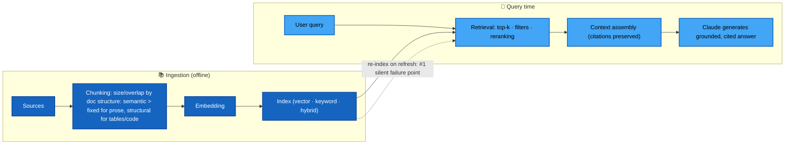
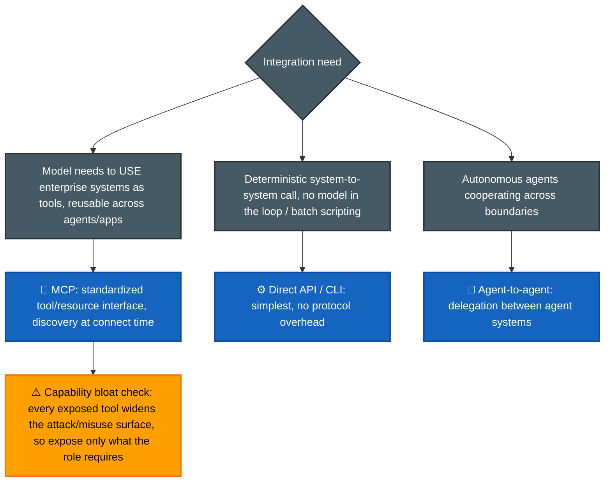
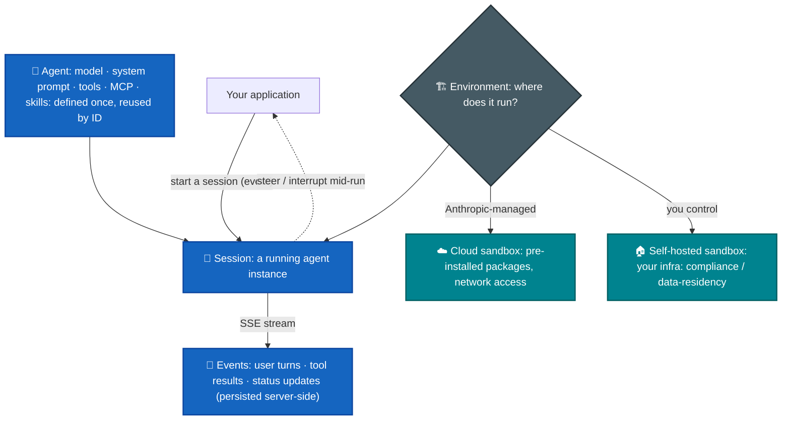
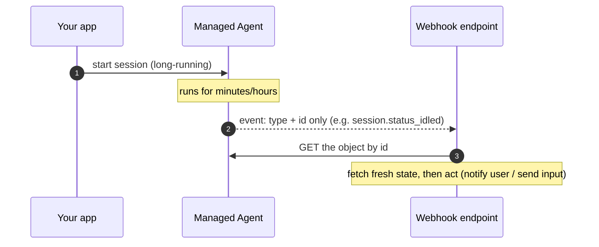
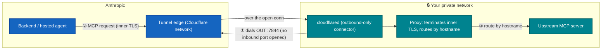

# P-D3 · Integration (19%)

The **biggest CCA-P domain**: RAG pipelines, connection protocols (MCP vs API/CLI vs agent-to-agent), the hosted-harness deployment choice (**Managed Agents**, sandboxes, webhooks) and private-network tool reach (**MCP tunnels**), document handling (**Files API**), authN/authZ, capability hygiene, accuracy–latency trade-offs, and observability at scale. Also the domain with the most **new ground** relative to CCA-F (RAG especially).

**Builds on CCA-F:** [F-D2 Tool Design & MCP](../../CCA-F/domains/d2-tool-design-mcp.md).
**Source:** official [CCA-P Exam Guide](../../official-exam-guides/cca-p-exam-guide.pdf), Domain 3 objectives; prep course "Enterprise Integration & Production".

---

## RAG pipeline design

**Know cold:**
- **Chunking follows data shape:** prose → semantic chunks with overlap; tables/code/structured docs → structure-aware splits; too-small chunks lose context, too-big dilute relevance.
- **Retrieval strategy follows query pattern:** exact identifiers/jargon → keyword/hybrid; conceptual questions → vector; both → hybrid + reranker.
- Document refresh without re-index / embedding mismatch ⇒ **confident-but-wrong answers with unchanged latency**; it's the first place to investigate (official CCA-P sample 3, filed under D4 diagnosis).
- Progressive discovery vs monolithic context: **retrieve/discover what's needed per step** (MCP resources, targeted retrieval) instead of stuffing everything into one giant prompt; cost, latency, and lost-in-the-middle all improve.

> **The embedding box, unpacked** ([platform: embeddings](https://platform.claude.com/docs/en/build-with-claude/embeddings)). **Anthropic ships no first-party embedding model** — the docs point you to **Voyage AI** (a third party). Architect-level implications the exam can probe:
> - **Query vs document embeddings are different calls:** set `input_type="query"` when embedding the user's question and `input_type="document"` when embedding corpus chunks. Omitting it degrades retrieval quality — a subtle, testable RAG bug.
> - **Domain-specific beats general** on in-domain corpora: `voyage-code-3` (code), `voyage-finance-2` (finance), `voyage-law-2` (legal). This is the same "match the tool to the data shape" instinct as chunking — matching the *embedding* to the domain.
> - **Rerankers are a distinct stage** (`rerank-2.5`): retrieve a wide top-k cheaply, then rerank to a precise short list before it hits context — the accuracy/latency lever the diagram's "reranking" node names.
> - **Embedding + generation are separate vendors/models** — a refresh that re-embeds with a *different* model than the index was built on is exactly the "embedding mismatch → confident-but-wrong" failure above.

> **Citations — grounding, not retrieval** ([platform: citations](https://platform.claude.com/docs/en/build-with-claude/citations)). Set `citations: {enabled: true}` on a `document` block and Claude returns each claim with a **verifiable pointer back into the source** (`cited_text` + a location: character range for plain text, `page_location` for PDFs, block index for custom-content). Don't confuse it with RAG: **retrieval decides *which* documents enter context; citations attribute the answer *within* the documents already there** — they compose (retrieve chunks → pass as cited documents → answer carries source pointers). Why it's exam-relevant: it's the mechanism behind the **"source-attributed / verify-before-acting"** pitch for Financial services and Life sciences ([primer Level 4(b)](../../claude-stack.md#b--vertical--domain-specific-one-domain-each)), and a concrete guardrail for hallucination in [P-D5](d5-governance-safety-risk.md). Efficiency note: `cited_text` is **not billed as output tokens** (nor as input on later turns), so API-native citations are cheaper *and* more reliable than prompting "quote your sources." For sentence-level cites, put each RAG chunk in its own plain-text document; for exact control over granularity (bullets, transcripts), use custom-content blocks (no further chunking).

## Connection protocol selection

## Managed Agents — the hosted-harness deployment choice

> Source: [platform: managed-agents/overview](https://platform.claude.com/docs/en/managed-agents/overview). The [primer Section 2](../../claude-stack.md#2-what-a-harness-is--and-why-an-agent-needs-one) framed *build vs. adopt the harness* as a one-line trade; here's the deployment substance a P-D3 integration question can lean on. Managed Agents is the third rung — Anthropic hosts the agent loop **and** a secure sandbox where Claude reads files, runs commands, browses the web, and executes code.

**Know cold — the four concepts:** **Agent** (model + system prompt + tools + MCP + skills, created once and referenced by ID) · **Environment** (*where* sessions run: Anthropic cloud sandbox **or** self-hosted sandbox on your infra) · **Session** (one running agent instance doing a task, with a persistent filesystem + history) · **Events** (the messages streamed both ways over SSE, persisted server-side).

**Reach for Managed Agents when the requirement says:**
- **Long-running / async** — minutes-to-hours tasks with many tool calls (the canonical fit, vs. the Messages API's request/response shape).
- **Minimal infra** — you don't want to build a loop, sandbox, or tool-execution layer.
- **Stateful sessions** — persistent filesystem + conversation history across interactions; sessions **resume cleanly after pauses**.
- **Scheduled execution** — recurring runs on a cron via [scheduled deployments](https://platform.claude.com/docs/en/managed-agents/scheduled-deployments) (the platform-API cousin of Claude Code *Routines* — Anthropic-infra, survives your machine being off; cf. [F-D1 field guide](../../CCA-F/domains/d1-agentic-architecture.md)).
- **Multi-agent** — a coordinator spawning child agent threads is a first-class [orchestration](https://platform.claude.com/docs/en/managed-agents/multiagent-orchestration) feature, not something you wire yourself (the hosted echo of [F-D1 Sec. 1.2](../../CCA-F/domains/d1-agentic-architecture.md)).

**Governance gotchas that make this a [P-D5](d5-governance-safety-risk.md) crossover:**
- **Self-hosted sandbox = the data-residency / compliance answer** — run the sandbox on infrastructure you control when data can't leave your boundary. This is the integration-side lever for the same concern Government/regulated solutions raise.
- **Stateful ⇒ not ZDR / not HIPAA-BAA-eligible.** Because sessions persist history, sandbox state, and outputs server-side, Managed Agents is **not** currently covered by Zero Data Retention or a HIPAA BAA. You can delete sessions and files via API, but if a scenario stipulates ZDR or HIPAA, hosted Managed Agents is the *wrong* pick — drop to the Messages API (or self-host). Classic "sounds convenient but violates the stated constraint" distractor.
- **Permission policies** gate which tools/actions a session may take; **[vaults](https://platform.claude.com/docs/en/managed-agents/vaults)** hold the credentials it authenticates with — least privilege ([below](#security-authnauthz--least-privilege)) applies to a hosted agent exactly as to a self-built one.

## Webhooks — the async notification pattern

> Source: [platform: managed-agents/webhooks](https://platform.claude.com/docs/en/managed-agents/webhooks). Long-running sessions raise a design question the exam likes: *how does my app learn the agent needs input or finished, without hammering the API?* **Poll = waste + latency; webhook = the agent tells you.**

**Know cold:**
- **Events carry `type` + `id`, not the object.** You **fetch the resource by ID** on receipt — this keeps deliveries small and avoids acting on stale data from a retry. "Reconcile by fetching," never "trust the payload's body."
- **Key session events:** `session.status_run_started`, **`session.status_idled`** (awaiting input — e.g. a tool-permission approval or a new user message: the human-in-the-loop signal), `session.status_rescheduled` (transient error, auto-retrying), `session.status_terminated` (done or errored). Multi-agent threads add `session.thread_created/idled/terminated`.
- **Delivery is at-least-once and unordered.** Dedupe on `event.id`; **don't infer state from arrival order** (a `.deleted` can beat its `.archived`). Up to 3 attempts, then dropped — webhooks are **not a durable log**, so if you must observe every transition, reconcile by listing/fetching.
- **Security:** verify the `whsec_`-signed signature (SDK `unwrap()` throws on bad/stale >5-min payloads); endpoints must be **HTTPS on a public host**; a `3xx` or non-public IP **auto-disables** the endpoint.
- **Why it's here:** webhooks are the glue that makes long-running Managed Agents usable in a real integration — the async counterpart to the Messages API's synchronous `stop_reason` loop.

## MCP tunnels — reaching an MCP server behind your firewall

> Source: [platform: mcp-tunnels/concepts](https://platform.claude.com/docs/en/agents-and-tools/mcp-tunnels/concepts) (research preview). "Connection protocol selection" above chose *MCP* as the shape; this answers the follow-up an enterprise scenario raises: *the MCP server sits in a private network — how does an Anthropic-hosted agent reach it without exposing it to the internet?*

**Know cold:**
- **"Outbound-only" describes the *connection*, not the *requests*.** `cloudflared` dials **out** from your network (egress on port 7844); your firewall opens **no inbound port**. Once open, MCP requests flow **inward** (Anthropic → your network) over that same connection. This inversion is the whole point — and a favorite distractor ("you must open a port for Anthropic to reach in" is **wrong**).
- **Inner TLS keeps payloads private from the transport.** A second TLS handshake runs between Anthropic's backend and *your* proxy, signed by a CA **you** registered; Cloudflare's edge sees only ciphertext. The **proxy is the first place inside your network where MCP payloads are readable** — a clean shared-responsibility boundary.
- **Distinguish the three MCP reach mechanisms** (prime distractor territory, extends [F-D2 Sec. 2.4](../../CCA-F/domains/d2-tool-design-mcp.md)):

| Mechanism | What it connects | Use when |
|---|---|---|
| **MCP connector** (`mcp_toolset`) | An Anthropic-hosted agent → a **publicly reachable** remote MCP server | The server is already exposed on the internet |
| **Remote MCP servers** | Standard client → a hosted MCP endpoint | General remote tool access |
| **MCP tunnel** | An Anthropic-hosted agent → an MCP server **in your private network** | The server **can't** be public (firewall / data boundary) |

- Credentials provision two ways: **programmatic** (setup component authenticates via [Workload Identity Federation](https://platform.claude.com/docs/en/manage-claude/workload-identity-federation), no hand-copied secret) or **manual** (copy tunnel token + register a CA yourself). WIF over long-lived secrets is the least-privilege-friendly choice.

## Files API — upload once, reference many

> Source: [platform: files](https://platform.claude.com/docs/en/build-with-claude/files) (beta). A token-economy + document-handling primitive that lands squarely in integration: stop re-sending the same PDF/dataset on every request.

**Know cold:**
- **Create-once, use-many:** upload → get a **`file_id`** → reference it by ID in Messages (`document` / `image` / `container_upload` blocks) instead of re-embedding bytes each call. This pays off most for multi-turn document QA and for feeding datasets to the [code execution tool](https://platform.claude.com/docs/en/agents-and-tools/tool-use/code-execution-tool).
- **Cost model:** file **operations are free** (upload/list/get/delete); **file *content* is billed as input tokens** when a request actually uses it. So the Files API saves **bandwidth and re-upload effort**, not per-token cost — pair it with **prompt caching** ([P-D2](d2-models-prompting-context.md)) to also cut the token cost of a stable document across requests.
- **Limits & lifecycle:** **500 MB/file**, **500 GB/org**; files are immutable (re-upload to change), scoped to the **workspace** (any key in it can reference them), and persist until you `DELETE` them. Uploaded files are **not downloadable** — only files **generated** by skills or code execution have `downloadable: true`.
- **Availability gotcha:** on the Claude API, Claude Platform on AWS, and Microsoft Foundry (Hosted-on-Anthropic) — **not** currently on Amazon Bedrock or Google Vertex. A scenario that mandates Bedrock/Vertex deployment can't assume the Files API.
- **Not everything is a `document` block:** PDFs/plain-text → `document`; images → `image`; datasets for analysis → `container_upload` (code execution). For `.docx`/`.xlsx`, convert to text/PDF first.

## Security: authN/authZ & least privilege

**Know cold:**
- Analyze auth **per integration point**: who is the principal (end user vs service), where do credentials live (env expansion, secret managers, never in committed config), and what scope does each token carry.
- **Least privilege = remove capabilities the role doesn't need**, not logging around them, not confirmation prompts, not "a better model" (official sample 1). Same instinct as scoped tool sets in [F-D2 Sec. 2.3](../../CCA-F/domains/d2-tool-design-mcp.md).
- Common exam gap-findings: agent runs with admin-scope service account; tokens shared across tenants; tool exposes destructive operations to a read-only workflow.

## Accuracy–latency trade-offs & observability

- Every added stage (reranking, verification pass, bigger model) buys accuracy with latency/cost; **justify against the stated SLA**, not in the abstract.
- Levers: model tier per step · caching · parallel retrieval · streaming for perceived latency · batch for offline volume.
- **Observability at scale:** log prompts/completions (PII-scrubbed), tool calls, retrieval hits + scores, token/cost per request, per-stage latency; trace IDs across agent/tool hops; dashboards on quality + cost + latency; sampled human review of production outputs (ties into [P-D4](d4-evaluation-testing-optimization.md)).

---

## Official sample question

*From the [CCA-P Exam Guide](../../official-exam-guides/cca-p-exam-guide.pdf), Sec. 8, Sample 1.*

A team exposes a customer-support agent that can read tickets, draft replies, issue refunds, and delete user accounts. Support staff only ever need to read tickets and draft replies. Applying least-privilege principles, which change best reduces risk?

- **A.** Add logging to the refund and delete tools so misuse can be audited later.
- **B.** Remove the refund and delete tools from the agent's configuration entirely.
- **C.** Keep all tools but add a confirmation prompt before refunds and deletions.
- **D.** Replace the agent with a larger model that follows instructions more reliably.

Answer & rationale

**B.** Least privilege means removing capabilities the role does not require: eliminating the attack surface rather than monitoring (A) or guarding (C) it; model size (D) is unrelated to authorization scope.

## Extra practice (unofficial)

**P1.** Users of an internal parts-lookup tool almost always search by exact SKU or error code (e.g. "ERR-4471"), rarely by natural-language description. Semantic vector search is returning plausible-sounding but wrong parts. What should the team do?

- **A.** Switch to keyword/exact-match retrieval (or hybrid weighted toward keyword) for this query pattern.
- **B.** Fine-tune the embedding model on the parts catalog.
- **C.** Increase top-k so more candidates reach the reranker.
- **D.** Add more few-shot examples showing correct SKU formatting to the generation prompt.

Answer & rationale

**A.** Retrieval strategy follows query pattern: exact identifiers/jargon call for keyword/hybrid, not vector. Vector search is the wrong mechanism for exact-identifier matching regardless of embedding quality (B), candidate count (C), or prompt examples (D); all three leave the retrieval mechanism mismatched to the query type.

**P2.** Three internal agent systems (research, drafting, and compliance-review, each built by a different team on a different stack) need to delegate sub-tasks to each other autonomously depending on what each one finds. What integration mechanism fits best?

- **A.** MCP: expose each team's capabilities as MCP tools.
- **B.** Direct API calls between the three teams' backends.
- **C.** Agent-to-agent delegation: each autonomous agent system hands off work to the others as needed.
- **D.** A shared CLI script that all three teams invoke in sequence.

Answer & rationale

**C.** Autonomous agents cooperating across boundaries is the agent-to-agent case. MCP (A) fits exposing tools/resources to a calling model, not multiple independent agent systems negotiating with each other; direct API (B) and a CLI script (D) both describe deterministic, no-model-in-the-loop calls, which doesn't match delegation "depending on what each finds."

**P3.** An observability review finds that a document-summarization agent's MCP server exposes 40 tools, but 90 days of production traces show only 6 were ever called. What's the most effective next step?

- **A.** Add usage logging to the other 34 tools so future misuse can be audited.
- **B.** Remove the 34 unused tools from the agent's exposed configuration, keeping only the 6 in active use.
- **C.** Leave the configuration as-is, since unused tools carry no runtime cost.
- **D.** Consolidate all 40 tools into a single generic tool with a `mode` parameter.

Answer & rationale

**B.** Capability bloat check: every exposed tool widens the attack/misuse surface whether or not it's ever called; unused capability is exactly what should be removed. A only monitors the risk instead of eliminating it; C is directly contradicted by the bloat principle (an unused destructive tool is still a live risk at zero calls); D still exposes the same capabilities under one name without narrowing what's authorized.

**P4.** A RAG system ingests both narrative policy documents (prose) and large pricing tables, using the same semantic-chunking-with-overlap strategy for both. Retrieval quality is good for policy questions but poor for pricing questions; the model frequently gets partial or misaligned rows. What's the fix?

- **A.** Increase the overlap window uniformly across all document types.
- **B.** Use structure-aware chunking (e.g. row- or table-aware splits) for the pricing tables, while keeping semantic chunking for prose.
- **C.** Convert all documents to prose before chunking.
- **D.** Increase top-k for pricing-related queries only.

Answer & rationale

**B.** Chunking follows data shape: prose gets semantic chunks with overlap, tables/structured docs get structure-aware splits. Using one strategy for both is the root cause here. A only tunes the wrong strategy's parameter; C discards the tabular structure that needs preserving; D retrieves more candidates without fixing that each candidate is already a misaligned chunk.

**P5.** An architect proposes adding a verification pass (a second model call re-checking every answer) to a support agent with a stated 3-second p95 latency SLA. The pass adds 2.5 seconds on average. Leadership hasn't flagged any accuracy problems with the current system. What's the most defensible response?

- **A.** Add the verification pass, since accuracy improvements are always worth the cost.
- **B.** Ask what specific accuracy problem the pass is meant to solve, and whether the latency cost is justified against the stated SLA and business goal; don't add stages without a measured need.
- **C.** Add the verification pass, but only for 10% of requests, chosen at random.
- **D.** Reject the proposal outright without discussion, since any latency increase violates the SLA spirit.

Answer & rationale

**B.** Every added stage buys accuracy with latency/cost; justify it against the stated SLA, not in the abstract. Here there's no stated accuracy problem and the SLA is nearly consumed by the new stage alone, so the trade-off needs evidence, not assumption. A treats accuracy as free; C papers over the missing justification with an arbitrary sampling rate; D forecloses a discussion that might reveal a legitimate need.

**P6.** A healthcare workflow needs an agent that runs long, multi-step analyses over patient records. Requirements: the data must never leave the organization's infrastructure, and the deployment must be HIPAA-BAA-covered. An architect proposes Anthropic-hosted Claude Managed Agents "because it removes all the loop and sandbox plumbing." What's the problem?

- **A.** Nothing — Managed Agents is the best fit for long-running work, so adopt it as proposed.
- **B.** Hosted Managed Agents persists session state server-side and is **not** ZDR- or HIPAA-BAA-eligible; use a self-hosted sandbox (or the Messages API on your own infra) to keep data in-boundary and meet the compliance constraint.
- **C.** Managed Agents can't run multi-step tasks, so it's the wrong tool regardless.
- **D.** Switch to a larger model tier so the agent is more accurate on medical data.

Answer & rationale

**B.** The convenient option violates a stated constraint. Hosted Managed Agents is stateful by design (history, sandbox state, outputs persisted server-side), which is exactly why it isn't currently ZDR/HIPAA-BAA-covered — so the data-residency + BAA requirements rule out the *hosted* variant. A self-hosted sandbox keeps execution on your infra. A ignores the compliance constraint; C is false (long multi-step work is Managed Agents' core fit); D confuses accuracy with authorization/compliance.

**P7.** A retrieval MCP server holding proprietary data runs inside a company's private VPC and cannot be exposed to the public internet. The team wants an Anthropic-hosted agent to query it. A security reviewer insists this requires opening an inbound firewall port so Anthropic can reach in. Using MCP tunnels, what's the accurate picture?

- **A.** Correct — an inbound port must be opened for Anthropic's backend to connect to the private MCP server.
- **B.** No inbound port is needed: the tunnel connector dials **outbound** to the tunnel edge, and MCP requests then flow inward over that already-open connection; inner TLS terminates at your proxy so the transport never sees payloads.
- **C.** The MCP server must be moved to a public host; tunnels only work with internet-reachable servers.
- **D.** Use the MCP connector (`mcp_toolset`) instead — it reaches private servers directly.

Answer & rationale

**B.** "Outbound-only" describes the connection: `cloudflared` egresses on port 7844 and no inbound port is opened, yet requests travel Anthropic→your-network over that connection. A inverts the connection direction (the exact distractor tunnels exist to defeat); C defeats the purpose (the whole point is *not* making it public); D is wrong because the MCP connector is for **publicly reachable** remote servers — the private case is precisely what tunnels handle.

**P8.** An app starts long-running Managed Agent sessions and subscribes to webhooks. On `session.status_idled` it currently reads the agent's status straight from the webhook body and shows it to the user; occasionally it displays stale or out-of-order state. What's the correct pattern?

- **A.** Poll the session status every few seconds instead of using webhooks.
- **B.** Treat the webhook as a signal only — it carries `type` + `id`; **fetch the session object by ID** to get fresh state, dedupe on `event.id`, and drive UI from the fetched resource rather than event arrival order.
- **C.** Trust the webhook body but add a 30-second delay before displaying it.
- **D.** Unsubscribe from `status_idled` and rely solely on the SSE stream.

Answer & rationale

**B.** Webhook events deliver only `type` + `id` precisely so you fetch fresh state and never act on stale retry payloads; delivery is at-least-once and unordered, so dedupe on `event.id` and reconcile from the fetched resource, not arrival order. A reintroduces the polling webhooks exist to avoid; C still trusts a body that may be stale; D discards the out-of-band notification that lets a long async session tell you it needs input.

## Exam focus

| Cue | Direction |
|---|---|
| "Wrong answers after document refresh" | Retrieval/indexing first, not the model |
| "Users search by exact SKU / error code" | Keyword or hybrid retrieval |
| "Agent has tools the workflow never uses" | Remove them (capability bloat / least privilege) |
| "Reusable enterprise tool layer for several agents" | MCP |
| "Giant prompt with every doc pasted in" | Progressive discovery / retrieval |
| "Can't tell why production answers degraded" | Tracing + retrieval-hit logging + eval sampling |
| "Long-running / async agent, minimal infra" | Managed Agents (hosted harness + sandbox) |
| "Data can't leave our infra" + long agent runs | Self-hosted sandbox (not hosted Managed Agents); check ZDR/HIPAA |
| "Private MCP server, no public exposure" | MCP tunnel (outbound-only), not MCP connector |
| "How does my app know the async agent is done / needs input?" | Webhooks (fetch by id), not polling |
| "Stop re-sending the same PDF/dataset every call" | Files API (`file_id`) + prompt caching |
| "Answers must cite verifiable sources" | Citations feature (`citations.enabled`) |
| "Which embedding model?" | No first-party model → Voyage; domain-specific + `input_type` |

**Practice:** [claude-cookbooks RAG recipes + `observability`](https://github.com/anthropics/claude-cookbooks) · [MCP docs](https://modelcontextprotocol.io) · [Tutorials Dojo CCAR-P guide](https://tutorialsdojo.com/ccar-p-claude-certified-architect-professional-study-guide/) (RAG + integration sections).
