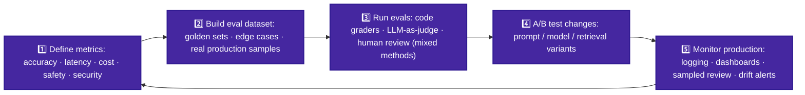
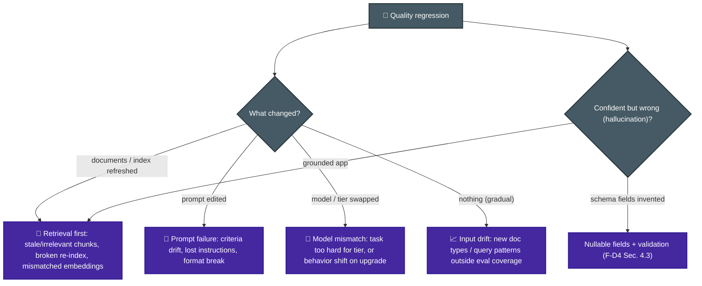

# P-D4 · Evaluation, Testing & Optimization (16%)

Defining metrics, building evaluation sets, testing changes, finding failure causes, and improving token use, latency, and cost.

**Builds on CCA-F:** [F-D4 Sec. 4.4–4.6](../../CCA-F/domains/d4-prompting-structured-output.md) (validation loops, review architectures) · [F-D5 Sec. 5.5](../../CCA-F/domains/d5-context-reliability.md) (confidence calibration).
**Source:** official [CCA-P Exam Guide](../../official-exam-guides/cca-p-exam-guide.pdf), Domain 4 objectives.

---

## The evaluation loop

**Key points:**
- **Define metrics before optimizing.** Choose metrics for the stakeholder's concern: safety for compliance, latency for users, or cost for finance.
- **Use several evaluation methods:** fixed graders for structure and facts, LLM judges with calibrated rubrics for open-ended quality, and human review for high-risk samples.
- Evaluation sets need **edge cases and real production samples**. Refresh them as usage changes. Overall scores can hide failures, so also measure each input type ([F-D5 Sec. 5.5](../../CCA-F/domains/d5-context-reliability.md)).
- A/B changes **one variable at a time**; hold the eval set constant; watch for regression on previously-passing segments.

## Failure diagnosis (the highest-yield skill)

**Key point:** If RAG becomes confidently wrong after a **document refresh** while the model and latency stay unchanged, inspect **retrieval and indexing** first.

## Optimization levers

| Lever | Wins | Watch out |
|---|---|---|
| Prompt caching (stable prefix) | Cost + time-to-first-token | Requires stable ordering ([P-D2](d2-models-prompting-context.md)) |
| Model tiering / routing | Cost at scale | Validate per-tier quality with evals |
| Batch API for offline volume | 50% cost | No latency SLA, never for blocking flows ([F-D4 Sec. 4.5](../../CCA-F/domains/d4-prompting-structured-output.md)) |
| Trim context / retrieval instead of stuffing | Cost + accuracy (lost-in-middle) | Don't trim provenance/citations |
| Streaming | Perceived latency | Doesn't reduce cost |
| Parallel tool/retrieval calls | Wall-clock latency | Rate limits, ordering dependencies |

## Monitoring & observability

- Log the prompt version, model, tokens, cost, stage latency, retrieval results and scores, tool calls, output, and validation result for each request.
- **Trace IDs across multi-agent/tool hops**; alert on drift in cost, latency, refusal rate, validation-failure rate.
- Sampled human review of production output feeds new eval cases, closing the loop.

---

## Official sample question

*From the [CCA-P Exam Guide](../../official-exam-guides/cca-p-exam-guide.pdf), Sec. 8, Sample 3.*

A RAG system suddenly returns confident but incorrect answers after a document refresh, while latency and model version are unchanged. What is the most likely first place to investigate?

- **A.** The model weights have silently changed.
- **B.** The retrieval/indexing step is returning irrelevant or stale chunks.
- **C.** The temperature setting is too low.
- **D.** The context window has shrunk.

Answer & rationale

**B.** The document refresh is the only change, so retrieval may be returning poor context because of a broken index or mismatched embeddings. The other options are not linked to the refresh.

## Extra practice (unofficial)

**P1.** After a routine model upgrade (same prompts, same retrieval pipeline, same infra), an eval suite shows accuracy unchanged, but a new failure pattern appears: the model now occasionally refuses benign requests it used to handle. What's the most likely first place to investigate?

- **A.** The retrieval/indexing pipeline.
- **B.** The new model version's default safety/refusal behavior interacting with the existing system prompt's instructions.
- **C.** The temperature setting.
- **D.** The eval dataset's ground-truth labels, which may be stale.

Answer & rationale

**B.** Only the model changed. New refusals therefore point to its safety behaviour interacting with the existing prompt. Retrieval did not change, temperature does not explain refusals, and stale labels would affect measured accuracy.

**P2.** A team's only eval for a customer-facing drafting agent is automated exact-match string comparison against reference answers. Drafts that are correct but phrased differently are marked as failures, and the team has no way to catch subtly unhelpful (but string-different) responses. What should they add?

- **A.** Increase the size of the exact-match reference set.
- **B.** Add LLM-as-judge scoring against a rubric, plus periodic human review, alongside the existing automated check.
- **C.** Lower the passing threshold on the exact-match eval.
- **D.** Remove the automated eval and rely on human review alone.

Answer & rationale

**B.** Exact matching cannot recognise correct answers written differently. Add an LLM judge and human review while keeping the automated check.

**P3.** A team wants to cut their agent's per-request cost. Logs show 70% of requests are simple FAQ-style questions, currently served by the same large model tier used for complex multi-step troubleshooting. What's the most directly justified optimization?

- **A.** Reduce `max_tokens` across all requests.
- **B.** Route the FAQ-style requests to a smaller/cheaper tier, informed by measured task difficulty, and reserve the large tier for the complex cases.
- **C.** Enable prompt caching on the large tier for all requests.
- **D.** Batch all requests overnight using the Batches API.

Answer & rationale

**B.** Most requests are simple and do not need the expensive model. A may cut off complex answers. C does not fix poor model routing. D would remove the real-time response that live FAQ users need.

**P4.** A team simultaneously changes the system prompt, switches to a new model version, and adjusts retrieval top-k, then reruns their eval suite and sees a 6% accuracy improvement. What's the problem with this result?

- **A.** There is no problem; the eval suite confirmed an improvement.
- **B.** Three variables changed at once, so it's impossible to attribute the 6% gain to any specific change, or to see whether one change is quietly hurting performance while another masks it.
- **C.** The eval suite should have been made harder before rerunning.
- **D.** The model version change alone is definitely responsible, since model upgrades usually help the most.

Answer & rationale

**B.** Change one variable at a time and keep the evaluation set fixed. With three changes, you cannot identify the cause of the gain or see whether one change caused a hidden regression.

**P5.** A team needs to process 50,000 documents overnight with no one waiting on individual results, and separately runs a live chat feature where users watch responses arrive. Both currently use the same real-time API call pattern. What should change?

- **A.** Add streaming to both, to improve perceived responsiveness.
- **B.** Move the overnight job to the Batches API for cost savings (no latency SLA there), and keep or add streaming only on the live chat feature for perceived latency.
- **C.** Move both to the Batches API, since it's cheaper.
- **D.** Add prompt caching to both, since caching always reduces cost regardless of workload shape.

Answer & rationale

**B.** The Batch API fits offline work where no one waits for a result. Streaming helps the live chat feel faster. A adds no value to the overnight job, C breaks live response, and D does not address the wrong API choice.

## Exam focus

| Cue | Direction |
|---|---|
| "How do we know it's good enough to ship?" | Eval dataset + defined metrics first |
| "Confident wrong answers after refresh" | Retrieval/indexing |
| "Judge open-ended quality at scale" | LLM-as-judge + calibration + human spot-checks |
| "Cost exploding at volume" | Caching → tiering → batch (in that order of ease) |
| "Which variant is better?" | A/B on a fixed eval set, one variable |

**Practice:** [claude-cookbooks `evals` + `tool_evaluation` + `observability`](https://github.com/anthropics/claude-cookbooks) · [anthropics/courses prompt evaluations](https://github.com/anthropics/courses).
