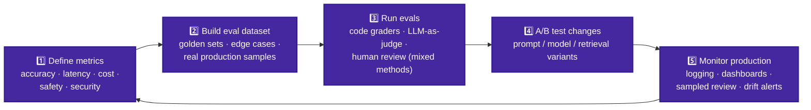
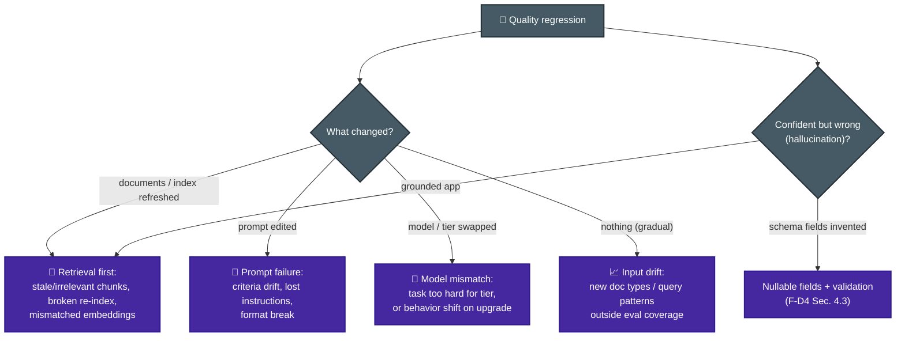

# P-D4 · Evaluation, Testing & Optimization (16%)

Defining metrics, building eval datasets and frameworks, A/B testing, diagnosing failures (prompt vs retrieval vs model), and optimizing token/latency/cost.

**Builds on CCA-F:** [F-D4 Sec. 4.4–4.6](../../CCA-F/domains/d4-prompting-structured-output.md) (validation loops, review architectures) · [F-D5 Sec. 5.5](../../CCA-F/domains/d5-context-reliability.md) (confidence calibration).
**Source:** official [CCA-P Exam Guide](../../official-exam-guides/cca-p-exam-guide.pdf), Domain 4 objectives.

---

## The evaluation loop

**Know cold:**
- **Metrics come before optimization**: you can't tune what you don't measure; pick metrics per stakeholder concern (safety for compliance, latency for UX, cost for finance).
- **Mixed methodologies:** deterministic graders for structure/facts, LLM-as-judge for open-ended quality (with calibrated rubrics + spot-check against humans), human review for high-stakes samples.
- Eval sets need **edge cases and production-distribution samples**, refreshed as usage drifts; aggregate scores mask segment failures, so slice by input type ([F-D5 Sec. 5.5](../../CCA-F/domains/d5-context-reliability.md) again, at system level).
- A/B changes **one variable at a time**; hold the eval set constant; watch for regression on previously-passing segments.

## Failure diagnosis (the highest-yield skill)

**Know cold (official sample 3):** RAG suddenly confident-but-wrong after a **document refresh**, latency/model unchanged → investigate **retrieval/indexing** first. Temperature, context size, "model weights silently changed" are distractors.

## Optimization levers

| Lever | Wins | Watch out |
|---|---|---|
| Prompt caching (stable prefix) | Cost + time-to-first-token | Requires stable ordering ([P-D2](d2-models-prompting-context.md)) |
| Model tiering / routing | Cost at scale | Validate per-tier quality with evals |
| Batch API for offline volume | 50% cost | No latency SLA, never for blocking flows ([F-D4 Sec. 4.5](../../CCA-F/domains/d4-prompting-structured-output.md)) |
| Trim context / retrieval instead of stuffing | Cost + accuracy (lost-in-middle) | Don't trim provenance/citations |
| Streaming | Perceived latency | Doesn't reduce cost |
| Parallel tool/retrieval calls | Wall-clock latency | Rate limits, ordering dependencies |

## Monitoring & observability

- Log per request: prompt version, model, token counts, cost, latency per stage, retrieval hits + scores, tool calls, output + validation result.
- **Trace IDs across multi-agent/tool hops**; alert on drift in cost, latency, refusal rate, validation-failure rate.
- Sampled human review of production output feeds new eval cases, closing the loop.

---

## Official sample question

*From the [CCA-P Exam Guide](../../official-exam-guides/cca-p-exam-guide.pdf), Sec. 8, Sample 3.*

A RAG system suddenly returns confident but incorrect answers after a document refresh, while latency and model version are unchanged. What is the most likely first place to investigate?

- **A.** The model weights have silently changed.
- **B.** The retrieval/indexing step is returning irrelevant or stale chunks.
- **C.** The temperature setting is too low.
- **D.** The context window has shrunk.

Answer & rationale

**B.** Confident-but-wrong answers right after a document refresh, with model and latency unchanged, point to retrieval feeding the model poor context, e.g. a broken re-index or mismatched embeddings. None of the other options are specifically triggered by a document refresh.

## Extra practice (unofficial)

**P1.** After a routine model upgrade (same prompts, same retrieval pipeline, same infra), an eval suite shows accuracy unchanged, but a new failure pattern appears: the model now occasionally refuses benign requests it used to handle. What's the most likely first place to investigate?

- **A.** The retrieval/indexing pipeline.
- **B.** The new model version's default safety/refusal behavior interacting with the existing system prompt's instructions.
- **C.** The temperature setting.
- **D.** The eval dataset's ground-truth labels, which may be stale.

Answer & rationale

**B.** Isolate the variable that changed; here, only the model version. New refusals with unchanged accuracy point at the model's updated behavior/guardrails interacting with existing prompt instructions, not retrieval (A, untouched), temperature (C, unrelated to refusal behavior), or stale labels (D, which would show up as reduced measured accuracy, not new refusals).

**P2.** A team's only eval for a customer-facing drafting agent is automated exact-match string comparison against reference answers. Drafts that are correct but phrased differently are marked as failures, and the team has no way to catch subtly unhelpful (but string-different) responses. What should they add?

- **A.** Increase the size of the exact-match reference set.
- **B.** Add LLM-as-judge scoring against a rubric, plus periodic human review, alongside the existing automated check.
- **C.** Lower the passing threshold on the exact-match eval.
- **D.** Remove the automated eval and rely on human review alone.

Answer & rationale

**B.** Mixed methodologies: exact-match alone can't assess semantically-correct-but-differently-phrased output. LLM-as-judge plus human review is the standard complement, not a replacement. A and C keep the same flawed instrument; D discards a fast, cheap, still-useful automated signal instead of complementing it.

**P3.** A team wants to cut their agent's per-request cost. Logs show 70% of requests are simple FAQ-style questions, currently served by the same large model tier used for complex multi-step troubleshooting. What's the most directly justified optimization?

- **A.** Reduce `max_tokens` across all requests.
- **B.** Route the FAQ-style requests to a smaller/cheaper tier, informed by measured task difficulty, and reserve the large tier for the complex cases.
- **C.** Enable prompt caching on the large tier for all requests.
- **D.** Batch all requests overnight using the Batches API.

Answer & rationale

**B.** Model tiering applied to cost: 70% of volume is simple and doesn't need the expensive tier. A risks truncating needed output uniformly, including for the complex 30%; C helps latency/cost for repeated static prefixes but doesn't fix the wrong-tier-for-simple-tasks problem; D breaks the real-time responsiveness a live FAQ case likely needs.

**P4.** A team simultaneously changes the system prompt, switches to a new model version, and adjusts retrieval top-k, then reruns their eval suite and sees a 6% accuracy improvement. What's the problem with this result?

- **A.** There is no problem; the eval suite confirmed an improvement.
- **B.** Three variables changed at once, so it's impossible to attribute the 6% gain to any specific change, or to see whether one change is quietly hurting performance while another masks it.
- **C.** The eval suite should have been made harder before rerunning.
- **D.** The model version change alone is definitely responsible, since model upgrades usually help the most.

Answer & rationale

**B.** A/B changes one variable at a time and holds the eval set constant; three simultaneous changes make the result uninterpretable and risk masking a regression from one change offset by gains from another. A ignores the confound; C changes the measurement instrument rather than the testing discipline; D assumes an unverified attribution.

**P5.** A team needs to process 50,000 documents overnight with no one waiting on individual results, and separately runs a live chat feature where users watch responses arrive. Both currently use the same real-time API call pattern. What should change?

- **A.** Add streaming to both, to improve perceived responsiveness.
- **B.** Move the overnight job to the Batches API for cost savings (no latency SLA there), and keep or add streaming only on the live chat feature for perceived latency.
- **C.** Move both to the Batches API, since it's cheaper.
- **D.** Add prompt caching to both, since caching always reduces cost regardless of workload shape.

Answer & rationale

**B.** Batch API fits offline volume with no latency SLA (never for blocking flows); streaming improves perceived latency specifically for interactive use. A wastes streaming's benefit on a job nobody is watching; C would break the live chat's real-time requirement; D may help if there's a stable repeated prefix, but doesn't fix that the overnight job is on the wrong pricing/latency model entirely.

## Exam focus

| Cue | Direction |
|---|---|
| "How do we know it's good enough to ship?" | Eval dataset + defined metrics first |
| "Confident wrong answers after refresh" | Retrieval/indexing |
| "Judge open-ended quality at scale" | LLM-as-judge + calibration + human spot-checks |
| "Cost exploding at volume" | Caching → tiering → batch (in that order of ease) |
| "Which variant is better?" | A/B on a fixed eval set, one variable |

**Practice:** [claude-cookbooks `evals` + `tool_evaluation` + `observability`](https://github.com/anthropics/claude-cookbooks) · [anthropics/courses prompt evaluations](https://github.com/anthropics/courses).
