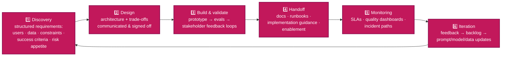
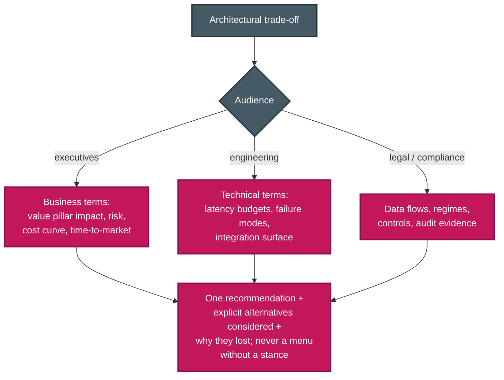

# P-D6 · Stakeholder Communication & Lifecycle Management (14%)

Discovery, trade-off communication, expectation management (including SLAs), documentation, and lifecycle stewardship. Zero overlap with CCA-F: pure architect soft skills, and the cheapest 14% on the exam for anyone who learns the vocabulary.

**Source:** official [CCA-P Exam Guide](../../official-exam-guides/cca-p-exam-guide.pdf), Domain 6 objectives; prep course "Stakeholder Engagement, Lifecycle & GTM".

---

## The solution lifecycle

## Structured discovery

**Know cold:**
- Requirements gathering is **structured**, not ad hoc: business objective → users & volumes → data sources/sensitivity → integration points → latency/cost budgets → compliance constraints → measurable success criteria.
- Define **success metrics with stakeholders before building**; an accuracy target agreed in discovery becomes the eval bar in [P-D4](d4-evaluation-testing-optimization.md).
- Surface unstated constraints early (the interview pattern from [F-D3 Sec. 3.5](../../CCA-F/domains/d3-claude-code.md), aimed at humans).

## Communicating trade-offs

**Know cold:**
- Tailor the *same* decision to each audience; lead with what they care about.
- Present options with a **clear recommendation and rationale**; decision records (ADR-style) document context, options, decision, consequences.
- **Expectation management:** LLMs are probabilistic, so set accuracy expectations as measured ranges with error handling, never "it will always be right." Under-promise on timelines for eval/iteration cycles.

## SLAs & feedback loops

- SLA dimensions for AI systems: **latency** (p50/p95), **availability**, **quality floor** (eval-measured accuracy), **cost ceiling**, plus escalation/response times for incidents.
- Feedback loops: scheduled stakeholder reviews of quality dashboards + sampled outputs; user feedback channels feed the eval set; publish change logs when prompts/models change (behavior shifts are stakeholder-visible events).

## Documentation & handoff

**Know cold:** architecture diagrams + data-flow maps · prompt/config inventory with versioning · runbooks (common failures, escalation paths) · eval baselines and how to re-run them · known limitations stated plainly. Handoff isn't an email; it's docs + enablement + a support window ([P-D7](d7-dev-productivity-enablement.md) covers the enablement half).

---

## Extra practice (unofficial)

*No official sample questions exist for this domain; the CCA-P Exam Guide's 3 published samples cover Domains 2–4. Practice questions below are unofficial, written against this domain's official objectives.*

**P1.** You need to explain why you chose a smaller, cheaper model tier for a high-volume classification step to three audiences: the CFO, the engineering team, and legal/compliance. What's the best approach?

- **A.** Send the same detailed technical write-up to all three audiences to ensure consistency.
- **B.** Tailor the same decision to each audience's concerns (cost/value framing for the CFO, latency/failure-mode detail for engineering, data-flow/compliance framing for legal), each with one clear recommendation.
- **C.** Only inform engineering, since model selection is a technical decision.
- **D.** Present the CFO and legal team with multiple options and no recommendation, to avoid overstepping into their domain.

Answer & rationale

**B.** Tailor the same decision to each audience and lead with what they care about, always with a clear recommendation, never a menu without a stance. A ignores that each audience needs a different framing of the same decision; C skips two stakeholder groups whose buy-in or sign-off likely matters; D violates the no-menu-without-a-stance principle.

**P2.** A stakeholder asks for "a chatbot that answers customer questions using our knowledge base," with no further detail. Before proposing an architecture, what should you do?

- **A.** Immediately propose a RAG architecture, since that's the standard pattern for knowledge-base Q&A.
- **B.** Run structured discovery: clarify users/volumes, data sources and sensitivity, integration points, latency/cost budgets, compliance constraints, and measurable success criteria.
- **C.** Build a quick prototype first, then ask for requirements based on stakeholder reactions to it.
- **D.** Ask only about the technology stack the knowledge base is stored in.

Answer & rationale

**B.** Requirements gathering is structured, not ad hoc; unstated constraints like data sensitivity, compliance, and success criteria change the design even when the pattern seems obvious. A jumps to architecture before establishing requirements; C and D each gather only a narrow slice of what structured discovery requires.

**P3.** A production system's SLA currently states only "the system will respond within 2 seconds." Six months in, stakeholders are blindsided by a week where responses stayed fast but answer quality clearly degraded after a prompt change, with no agreed process to report or escalate it. What's missing from the SLA?

- **A.** Nothing; a 2-second latency target is a complete SLA for an AI system.
- **B.** A quality floor (eval-measured accuracy) and incident escalation/response times, alongside the existing latency target.
- **C.** A stricter latency target, e.g. 1 second instead of 2.
- **D.** A clause stating the system will always be 100% accurate.

Answer & rationale

**B.** SLA dimensions for AI systems include latency, availability, a quality floor, a cost ceiling, and incident escalation/response times; this scenario is a quality regression with no defined reporting path, exactly what a quality floor plus escalation times would catch. A ignores the stated gap; C targets a dimension that wasn't the problem; D is the "100% accuracy" over-promise the domain explicitly says to reset, not something to write into an SLA.

**P4.** A contracting team finishes building a Claude-based system and hands it off to the client's internal team with a single email summarizing what was built. Three weeks later, the client's team can't explain why a specific prompt behaves the way it does, doesn't know how to re-run the evals, and has no idea who to contact for a production incident. What was missing from the handoff?

- **A.** A more detailed email.
- **B.** Architecture diagrams and data-flow maps, a versioned prompt/config inventory, runbooks with escalation paths, eval baselines and how to re-run them, and stated known limitations.
- **C.** A longer support contract.
- **D.** A recorded video walkthrough of the demo.

Answer & rationale

**B.** Handoff isn't an email; it's docs plus enablement plus a support window. The specific gaps described (can't explain prompt behavior, can't re-run evals, no escalation contact) map directly to the named artifacts: config inventory, eval baselines, and runbooks. A and D are still just narrative explanation, not durable reference artifacts; C addresses availability, not the missing documentation itself.

**P5.** Six months after launch, a team notices gradual quality decay as customer queries have shifted toward new product lines the original eval set didn't cover. Stakeholder reviews of quality dashboards are already happening quarterly. What lifecycle phase does this call for next?

- **A.** Discovery: start over with new requirements gathering from scratch.
- **B.** Iteration: feed the observed drift back into updated eval cases and prompt/data updates, looping back toward design only as far as the drift requires.
- **C.** Handoff: re-hand off the system to a different team.
- **D.** Build & validate: re-prototype the system from the ground up.

Answer & rationale

**B.** This is the lifecycle's iteration phase in its clearest form: feedback → backlog → prompt/model/data updates. A, C, and D each treat a normal monitoring-driven iteration as if it required restarting an earlier, heavier phase.

## Exam focus

| Cue | Direction |
|---|---|
| "CEO asks why not the cheaper option" | Value-pillar framing, risk trade-off, recommendation with rationale |
| "Stakeholders expect 100% accuracy" | Reset expectations: measured ranges + error handling + HITL |
| "What goes in the SLA?" | Latency + availability + quality floor + incident response |
| "Team inherits the system" | Runbooks, prompt inventory, eval baselines, limitations |
| "Requirements keep shifting" | Structured discovery artifacts + agreed success criteria |

**Practice:** prep course module ④ (178 min, the longest, matching this domain's breadth) · write one ADR for a real design you've made; it's the exam's mental model.
