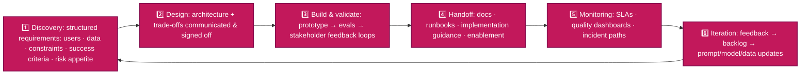
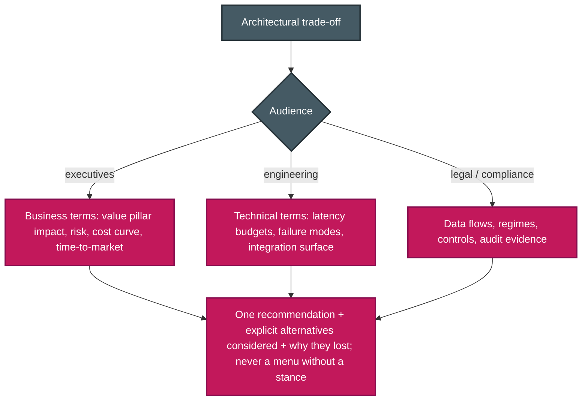

# P-D6 · Stakeholder Communication & Lifecycle Management (14%)

Gathering requirements, explaining trade-offs, setting expectations, documenting decisions, and managing a solution after launch.

**Source:** official [CCA-P Exam Guide](../../official-exam-guides/cca-p-exam-guide.pdf), Domain 6 objectives; prep course "Stakeholder Engagement, Lifecycle & GTM".

---

## The solution lifecycle

## Structured discovery

**Key points:**
- Gather requirements in order: business goal → users and volume → data and sensitivity → integrations → latency and cost limits → compliance → success measures.
- Agree on success measures before building. The accuracy target set during discovery becomes the evaluation target in [P-D4](d4-evaluation-testing-optimization.md).
- Ask about hidden constraints early. See [F-D3 Sec. 3.5](../../CCA-F/domains/d3-claude-code.md).

## Communicating trade-offs

**Key points:**
- Explain the same decision in terms each audience understands.
- Recommend one option and explain why. Record the context, alternatives, decision, and effects in an ADR.
- Use measured accuracy ranges and explain error handling. Do not promise perfect results. Allow time for evaluation and improvement.

## SLAs & feedback loops

- An AI SLA should cover **latency** (p50/p95), **availability**, a measured **quality floor**, a **cost ceiling**, and incident response times.
- Review quality dashboards and sample outputs with stakeholders. Add user feedback to the evaluation set. Publish changes to prompts and models because they can change system behavior.

## Documentation & handoff

**Handoff package:** Architecture and data-flow diagrams · versioned prompt and configuration list · runbooks with common failures and escalation paths · evaluation baselines and rerun instructions · known limits. Include training and a support period, not only an email. See [P-D7](d7-dev-productivity-enablement.md).

---

## Extra practice (unofficial)

*No official sample questions exist for this domain; the CCA-P Exam Guide's 3 published samples cover Domains 2–4. Practice questions below are unofficial, written against this domain's official objectives.*

**P1.** You need to explain why you chose a smaller, cheaper model tier for a high-volume classification step to three audiences: the CFO, the engineering team, and legal/compliance. What's the best approach?

- **A.** Send the same detailed technical write-up to all three audiences to ensure consistency.
- **B.** Tailor the same decision to each audience's concerns (cost/value framing for the CFO, latency/failure-mode detail for engineering, data-flow/compliance framing for legal), each with one clear recommendation.
- **C.** Only inform engineering, since model selection is a technical decision.
- **D.** Present the CFO and legal team with multiple options and no recommendation, to avoid overstepping into their domain.

Answer & rationale

**B.** Each audience needs different details, but all should receive the same recommendation and rationale.

**P2.** A stakeholder asks for "a chatbot that answers customer questions using our knowledge base," with no further detail. Before proposing an architecture, what should you do?

- **A.** Immediately propose a RAG architecture, since that's the standard pattern for knowledge-base Q&A.
- **B.** Run structured discovery: clarify users/volumes, data sources and sensitivity, integration points, latency/cost budgets, compliance constraints, and measurable success criteria.
- **C.** Build a quick prototype first, then ask for requirements based on stakeholder reactions to it.
- **D.** Ask only about the technology stack the knowledge base is stored in.

Answer & rationale

**B.** Data sensitivity, compliance, scale, and success measures can change the design. Confirm them before selecting an architecture.

**P3.** A production system's SLA currently states only "the system will respond within 2 seconds." Six months in, stakeholders are blindsided by a week where responses stayed fast but answer quality clearly degraded after a prompt change, with no agreed process to report or escalate it. What's missing from the SLA?

- **A.** Nothing; a 2-second latency target is a complete SLA for an AI system.
- **B.** A quality floor (eval-measured accuracy) and incident escalation/response times, alongside the existing latency target.
- **C.** A stricter latency target, e.g. 1 second instead of 2.
- **D.** A clause stating the system will always be 100% accurate.

Answer & rationale

**B.** The SLA covers latency but not quality or escalation. A quality floor and response times would make the regression visible and actionable.

**P4.** A contracting team finishes building a Claude-based system and hands it off to the client's internal team with a single email summarizing what was built. Three weeks later, the client's team can't explain why a specific prompt behaves the way it does, doesn't know how to re-run the evals, and has no idea who to contact for a production incident. What was missing from the handoff?

- **A.** A more detailed email.
- **B.** Architecture diagrams and data-flow maps, a versioned prompt/config inventory, runbooks with escalation paths, eval baselines and how to re-run them, and stated known limitations.
- **C.** A longer support contract.
- **D.** A recorded video walkthrough of the demo.

Answer & rationale

**B.** A useful handoff gives the new team durable references: system diagrams, versioned configuration, evaluation instructions, runbooks, and support contacts.

**P5.** Six months after launch, a team notices gradual quality decay as customer queries have shifted toward new product lines the original eval set didn't cover. Stakeholder reviews of quality dashboards are already happening quarterly. What lifecycle phase does this call for next?

- **A.** Discovery: start over with new requirements gathering from scratch.
- **B.** Iteration: feed the observed drift back into updated eval cases and prompt/data updates, looping back toward design only as far as the drift requires.
- **C.** Handoff: re-hand off the system to a different team.
- **D.** Build & validate: re-prototype the system from the ground up.

Answer & rationale

**B.** Monitoring found drift, so the team should update the evaluation set and then adjust prompts, models, or data as needed.

## Exam focus

| Cue | Direction |
|---|---|
| "CEO asks why not the cheaper option" | Value-pillar framing, risk trade-off, recommendation with rationale |
| "Stakeholders expect 100% accuracy" | Reset expectations: measured ranges + error handling + HITL |
| "What goes in the SLA?" | Latency + availability + quality floor + incident response |
| "Team inherits the system" | Runbooks, prompt inventory, eval baselines, limitations |
| "Requirements keep shifting" | Structured discovery artifacts + agreed success criteria |

**Practice:** prep course module ④ (178 min) · write an ADR for one of your own designs.
