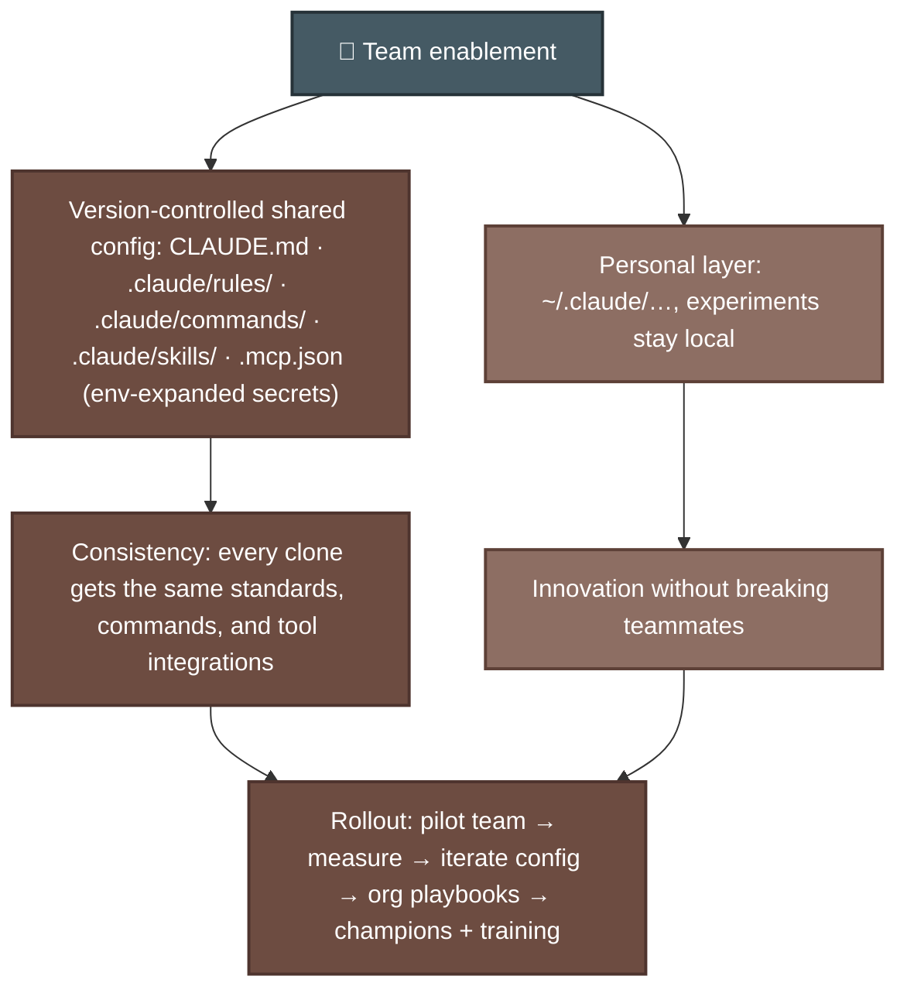
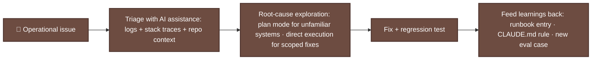

# P-D7 · Developer Productivity & Operational Enablement (7%)

This domain covers shared configuration, AI-assisted development, debugging, and operational support. It builds on [F-D3](../../CCA-F/domains/d3-claude-code.md).

**Source:** official [CCA-P Exam Guide](../../official-exam-guides/cca-p-exam-guide.pdf), Domain 7 objectives; prep course "Team Enablement & Operational Productivity" (45 min).

---

## Team configuration

**Key points:**
- Put team standards in the repository: `CLAUDE.md`, commands, skills, and `.mcp.json`. Keep personal preferences in `~/.claude/`. See [F-D3 Sec. 3.1–3.2](../../CCA-F/domains/d3-claude-code.md).
- Reference secrets through environment variables. Never commit them. See [F-D2 Sec. 2.4](../../CCA-F/domains/d2-tool-design-mcp.md).
- Adoption needs more than configuration. Start with a pilot, measure the results, train the team, and provide playbooks and local champions.

## AI-assisted workflow improvements

| Workflow | AI-assisted pattern |
|---|---|
| Code review | CI-invoked review with explicit criteria, structured JSON findings → PR comments ([F-D3 Sec. 3.6](../../CCA-F/domains/d3-claude-code.md)) |
| Test generation | Existing tests in context; standards in CLAUDE.md; nightly batch runs |
| Onboarding / legacy comprehension | Exploration agents: Grep→Read, scratchpads, Explore subagent ([F-D5 Sec. 5.4](../../CCA-F/domains/d5-context-reliability.md)) |
| Repetitive maintenance | Skills for codified team workflows; slash commands for one-liners |
| Documentation | Generate-then-review drafts from code + conventions |

Measure review time, escaped defects, and onboarding time before and after adoption. Report these results through the [P-D6](d6-stakeholder-lifecycle.md) feedback loop.

## Debugging & operational support

After each incident, update a runbook, coding rule, or evaluation case so the team does not solve the same problem again.

---

## Extra practice (unofficial)

*No official sample questions exist for this domain; the CCA-P Exam Guide's 3 published samples cover Domains 2–4. Practice questions below are unofficial, written against this domain's official objectives.*

**P1.** One engineer adds an experimental slash command to the repo's `.claude/commands/` folder to try out a new personal workflow. A week later, teammates report the command behaves unpredictably and conflicts with their existing setup. What's the most defensible fix?

- **A.** Move the experimental command to the engineer's personal `~/.claude/` directory until it's validated, keeping the repo-level shared config stable for the team.
- **B.** Ask all teammates to adopt the experimental command as the new standard immediately.
- **C.** Delete `.claude/commands/` entirely to avoid future conflicts.
- **D.** Document the experimental command in the README so teammates know to ignore it.

Answer & rationale

**A.** Repository configuration affects everyone. Keep an untested personal command in the user-level directory until the team approves it.

**P2.** A team lead wants to justify continued investment in AI-assisted code review tooling to leadership. What's the strongest evidence to present?

- **A.** A qualitative statement that "developers seem happier."
- **B.** Baseline-vs-current measurements of review turnaround time and defect escape rate, collected before and after rollout.
- **C.** The number of AI-generated comments posted on PRs.
- **D.** A demo of the tool working on a cherry-picked example PR.

Answer & rationale

**B.** Before-and-after metrics show whether the tool improved outcomes. Comment counts and selected demos do not.

**P3.** A team wants to reduce ramp-up time for new engineers joining a large, unfamiliar legacy codebase. Which AI-assisted workflow pattern fits best?

- **A.** CI-invoked code review with structured JSON findings posted to PRs.
- **B.** Exploration agents (Grep→Read patterns, scratchpads, an Explore-style subagent) that help new engineers navigate and understand the codebase.
- **C.** Nightly batch test-generation runs.
- **D.** Slash commands for one-off repetitive maintenance tasks.

Answer & rationale

**B.** Exploration agents help new engineers find relevant code and understand an unfamiliar system. The other options solve different problems.

**P4.** An on-call engineer uses Claude Code to triage and fix a recurring production incident: a specific error pattern that has now happened three times in two months. The fix is deployed and the incident is closed. What should happen next, per the operational-support pattern?

- **A.** Nothing further; the incident is resolved and closed.
- **B.** Feed the learning back into a durable artifact: a runbook entry for this error pattern, a CLAUDE.md rule if a coding convention caused it, and/or a new eval case so regressions are caught automatically next time.
- **C.** Assign a teammate to manually watch for this error pattern going forward.
- **D.** Increase logging verbosity across the entire system in case it happens again.

Answer & rationale

**B.** A repeated incident needs a lasting response. Record the diagnosis and add a rule or evaluation case that can catch it earlier.

## Exam focus

| Cue | Direction |
|---|---|
| "Every developer should have this command/standard" | Repo-scoped `.claude/` config, not per-user |
| "Prove the AI tooling is worth it" | Baseline + measure workflow metrics |
| "One developer's experiment broke the team setup" | Separate personal (~/.claude) from shared scope |
| "Recurring incident type" | Runbook + rule + eval case, AI-assisted triage |

**Practice:** prep course module ⑤ (45 min) · review [F-D3](../../CCA-F/domains/d3-claude-code.md).
