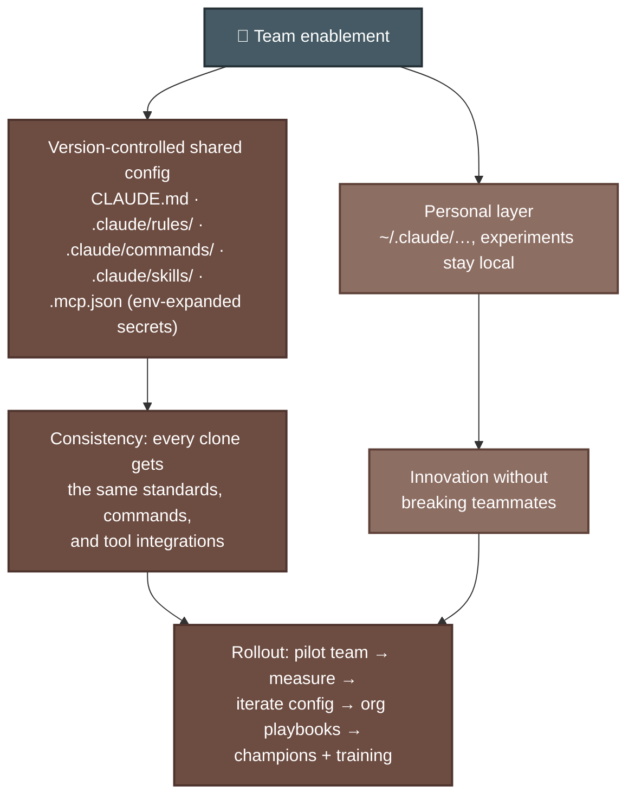
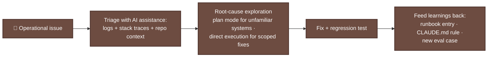

# P-D7 · Developer Productivity & Operational Enablement (7%)

The smallest domain (~4–5 items): configuring Claude tooling for **teams**, improving developer workflows with AI assistance, and supporting debugging/operations. For CCA-F alumni this is nearly free; it's [F-D3](../../CCA-F/domains/d3-claude-code.md) viewed from the enablement angle.

**Source:** official [CCA-P Exam Guide](../../official-exam-guides/cca-p-exam-guide.pdf), Domain 7 objectives; prep course "Team Enablement & Operational Productivity" (45 min).

---

## Team configuration

**Know cold:**
- Project-scope vs user-scope is the recurring decision: **shared standards belong in the repo** (CLAUDE.md, commands, skills, .mcp.json); personal preferences stay in `~/.claude/` ([F-D3 Sec. 3.1–3.2](../../CCA-F/domains/d3-claude-code.md)).
- Secrets in shared MCP config via **environment-variable expansion**, never committed ([F-D2 Sec. 2.4](../../CCA-F/domains/d2-tool-design-mcp.md)).
- Enablement = config + **adoption**: pilot, measure (cycle time, review turnaround), champions, playbooks, training. Not just dropping tools on teams.

## AI-assisted workflow improvements

| Workflow | AI-assisted pattern |
|---|---|
| Code review | CI-invoked review with explicit criteria, structured JSON findings → PR comments ([F-D3 Sec. 3.6](../../CCA-F/domains/d3-claude-code.md)) |
| Test generation | Existing tests in context; standards in CLAUDE.md; nightly batch runs |
| Onboarding / legacy comprehension | Exploration agents: Grep→Read, scratchpads, Explore subagent ([F-D5 Sec. 5.4](../../CCA-F/domains/d5-context-reliability.md)) |
| Repetitive maintenance | Skills for codified team workflows; slash commands for one-liners |
| Documentation | Generate-then-review drafts from code + conventions |

**Measure the improvement:** adoption is justified with metrics (review latency, defect escape rate, onboarding time), then reported through the [P-D6](d6-stakeholder-lifecycle.md) feedback loop.

## Debugging & operational support

**Know cold:** operational support closes the loop: every incident should leave an artifact (runbook entry, convention rule, eval case) so the system and the team both improve.

---

## Extra practice (unofficial)

*No official sample questions exist for this domain; the CCA-P Exam Guide's 3 published samples cover Domains 2–4. Practice questions below are unofficial, written against this domain's official objectives.*

**P1.** One engineer adds an experimental slash command to the repo's `.claude/commands/` folder to try out a new personal workflow. A week later, teammates report the command behaves unpredictably and conflicts with their existing setup. What's the most defensible fix?

- **A.** Move the experimental command to the engineer's personal `~/.claude/` directory until it's validated, keeping the repo-level shared config stable for the team.
- **B.** Ask all teammates to adopt the experimental command as the new standard immediately.
- **C.** Delete `.claude/commands/` entirely to avoid future conflicts.
- **D.** Document the experimental command in the README so teammates know to ignore it.

Answer & rationale

**A.** Shared standards belong in the repo; personal preferences and unvalidated experiments stay in `~/.claude/`; one developer's experiment shouldn't break the team's shared setup. B forces an unvalidated experiment on the whole team; C removes a working, useful mechanism instead of scoping the one problem command; D leaves the conflict in place rather than resolving it.

**P2.** A team lead wants to justify continued investment in AI-assisted code review tooling to leadership. What's the strongest evidence to present?

- **A.** A qualitative statement that "developers seem happier."
- **B.** Baseline-vs-current measurements of review turnaround time and defect escape rate, collected before and after rollout.
- **C.** The number of AI-generated comments posted on PRs.
- **D.** A demo of the tool working on a cherry-picked example PR.

Answer & rationale

**B.** Adoption is justified with measured workflow metrics (review latency, defect escape rate) reported through the stakeholder feedback loop. A is unmeasured anecdote; C measures activity volume rather than outcome; D is a single cherry-picked demo, not a measured before/after result.

**P3.** A team wants to reduce ramp-up time for new engineers joining a large, unfamiliar legacy codebase. Which AI-assisted workflow pattern fits best?

- **A.** CI-invoked code review with structured JSON findings posted to PRs.
- **B.** Exploration agents (Grep→Read patterns, scratchpads, an Explore-style subagent) that help new engineers navigate and understand the codebase.
- **C.** Nightly batch test-generation runs.
- **D.** Slash commands for one-off repetitive maintenance tasks.

Answer & rationale

**B.** This maps directly to the onboarding/legacy-comprehension workflow pattern. A addresses code review quality, not onboarding; C addresses test coverage; D addresses repetitive maintenance. None of them target ramp-up and comprehension the way exploration agents do.

**P4.** An on-call engineer uses Claude Code to triage and fix a recurring production incident: a specific error pattern that has now happened three times in two months. The fix is deployed and the incident is closed. What should happen next, per the operational-support pattern?

- **A.** Nothing further; the incident is resolved and closed.
- **B.** Feed the learning back into a durable artifact: a runbook entry for this error pattern, a CLAUDE.md rule if a coding convention caused it, and/or a new eval case so regressions are caught automatically next time.
- **C.** Assign a teammate to manually watch for this error pattern going forward.
- **D.** Increase logging verbosity across the entire system in case it happens again.

Answer & rationale

**B.** Operational support closes the loop: every incident should leave an artifact so the system and the team both improve. A third occurrence of the same pattern is a clear signal a durable artifact is overdue, not just another one-off fix. A treats a recurring pattern as a one-off; C substitutes manual vigilance for a systematic fix; D adds noise without addressing recurrence.

## Exam focus

| Cue | Direction |
|---|---|
| "Every developer should have this command/standard" | Repo-scoped `.claude/` config, not per-user |
| "Prove the AI tooling is worth it" | Baseline + measure workflow metrics |
| "One developer's experiment broke the team setup" | Separate personal (~/.claude) from shared scope |
| "Recurring incident type" | Runbook + rule + eval case, AI-assisted triage |

**Practice:** prep course module ⑤ (45 min) · you already *live* this domain if you use Claude Code daily; review [F-D3](../../CCA-F/domains/d3-claude-code.md) and you're covered.
