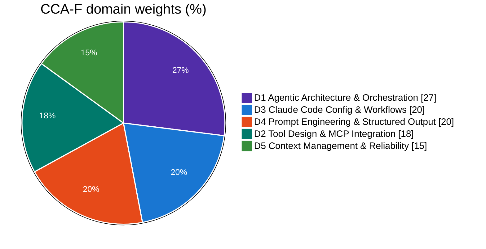
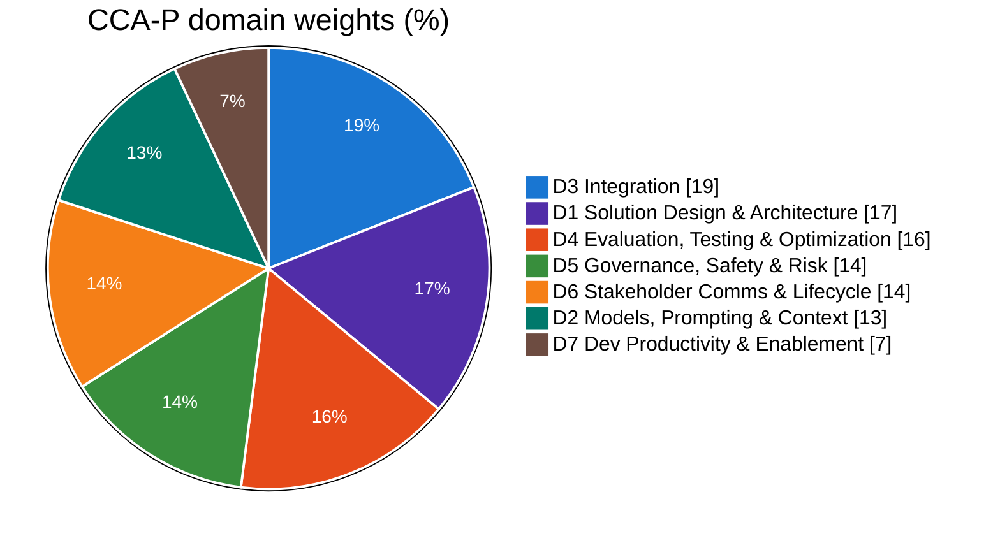
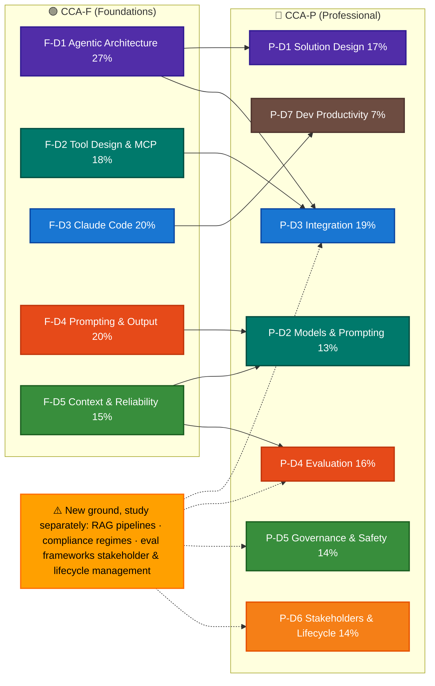
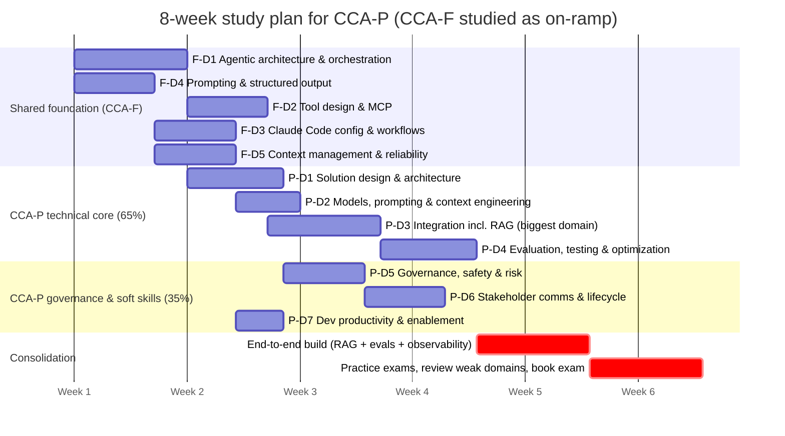

> 👋 **A quick personal note:** This is my personal study notebook for the Claude Certified Architect exams — I'll keep updating it as my prep goes deeper, so expect it to grow and change. You'll find plenty of diagrams throughout, because concepts only really stick for me once I can visualize them. Spotted a mistake or have something to add? PRs are welcome. Good luck with your prep!

---

## 1. Exam at a Glance (from official exam guides, v1.0, effective July 2026)

Two exams, two levels: 
- **CCA-F (Foundations)** tests hands-on building skills: agentic loops, tool/MCP design, Claude Code, prompting. 
- **CCA-P (Professional)** layers architecture judgment on top: solution design, integration, evaluation, governance, and stakeholder management. 

Neither is a prerequisite for the other. Side by side:

| | CCA-F (Foundations) | CCA-P (Professional) |
|---|---|---|
| Exam code | CCAR-F | CCAR-P |
| Items | 60 (MCQ + multiple-response) | 63 (MCQ + multiple-response) |
| Structure | 4 scenarios drawn from a bank of 6 | 7 weighted domains |
| Time | 120 min | 120 min |
| Passing | 720 scaled (100–1,000) | 720 scaled (100–1,000) |
| Fee | $125 USD | $175 USD |
| Delivery | Pearson VUE, proctored (online or test center) | Pearson VUE, proctored (online or test center) |
| Validity | 12 months | 12 months |
| Audience | Solution architects building production apps with Claude Code, Agent SDK, Claude API, MCP (6+ months hands-on) | Mid/senior architects designing, integrating, governing end-to-end Claude systems (3+ yrs architecture, 6+ months Claude/LLM) |
| Prerequisites | None mandatory | None mandatory |

> 🧭 **New here? Start with the orientation primer:** [**From Models to Solutions: The Claude Stack**](claude-stack.md). It draws the map the domain chapters assume you already have — where the **API** (Messages API / Managed Agents) ends and the **Claude Code** product begins, how the **Agent SDK** bridges them, and which side each exam tests. Distilled from the official [platform intro](https://platform.claude.com/docs/en/intro) and [Claude Code overview](https://code.claude.com/docs/en/overview), with diagrams.

---

## 2. Syllabus: What's Tested & How to Prepare

> **Deep-dive here:** the official exam guides *are* the syllabus: [CCA-F Exam Guide (PDF)](official-exam-guides/cca-f-exam-guide.pdf) ([online](https://everpath-course-content.s3-accelerate.amazonaws.com/instructor%2F6nizmqk8tpzpfjvt6qmmav7rh%2Fpublic%2F1783542750%2FClaude+Certified+Architect+%E2%80%93+Foundations+Exam+Guide.pdf)) and [CCA-P Exam Guide (PDF)](official-exam-guides/cca-p-exam-guide.pdf) ([online](https://everpath-course-content.s3-accelerate.amazonaws.com/instructor%2F6nizmqk8tpzpfjvt6qmmav7rh%2Fpublic%2F1783542810%2FClaude+Certified+Architect+%E2%80%93+Professional+Exam+Guide.pdf)). Everything below just summarizes those two documents.

### 2.1 CCA-F domain weights & scenario bank

CCA-F scenario bank (4 of 6 appear per exam sitting):

1. Customer Support Resolution Agent ([link](CCA-F/scenarios/s1-customer-support-agent.md))
2. Code Generation with Claude Code ([link](CCA-F/scenarios/s2-code-generation.md))
3. Multi-Agent Research System ([link](CCA-F/scenarios/s3-multi-agent-research.md))
4. Developer Productivity with Claude ([link](CCA-F/scenarios/s4-developer-productivity.md))
5. Claude Code for CI/CD ([link](CCA-F/scenarios/s5-ci-cd.md))
6. Structured Data Extraction ([link](CCA-F/scenarios/s6-structured-data-extraction.md))

See the whole CCA-F program at a glance ([here](CCA-F/README.md)), and which scenarios test which domains ([here](CCA-F/scenarios/README.md)).

### 2.2 CCA-P domain weights

Worth noting when reading the pie: the technical half (D1+D2+D3+D4 = **65%**) decides pass/fail, but the soft-skill half (D5+D6+D7 = **35%**) is where CCA-F-trained candidates lose easy points, and it's the cheapest score to pick up.

See the whole CCA-P program at a glance ([here](CCA-P/README.md)).

### 2.3 How CCA-F feeds CCA-P (domain dependency map)

**CCA-P is broader, less code-centric:** ~45% of it (Domains 1, 5, 6, 7) is architecture judgment, governance/compliance (GDPR, HIPAA, FedRAMP), stakeholder communication, and enablement. The CCA-F materials barely touch these. 
CCA-F depth (agentic loops, MCP, Claude Code) still feeds CCA-P Domains 2–4 directly, as the map shows:

### 2.4 Suggested study sequence (Gantt with dependencies, CCA-P target)

**Community reviews suggest both exams reward tradeoff reasoning over recall** (sample questions test least-privilege, prompt caching, RAG failure diagnosis) — I haven't sat either exam yet, so take this as secondhand signal rather than firsthand confirmation. Hands-on work with [anthropics/claude-cookbooks](https://github.com/anthropics/claude-cookbooks) plus building one end-to-end solution (RAG + evals + observability, as the guide recommends) beats memorization. The plan below is built around that.

An 8-week pacing built from the dependency map above: master the shared foundation first, then the CCA-P technical core, then the governance & soft-skill domains, finishing with a hands-on build + mock exams (the official guide's own recommendation).

---

<h2>3. Official Anthropic Sources (authoritative, study these first)</h2>

| Link | Areas covered | Remarks |
|---|---|---|
| [CCA-F certification page](https://anthropic-partners.skilljar.com/claude-certified-architect-foundations-certification) | Registration, exam guide, T&Cs, exam policy | Skilljar (Anthropic Partner Academy). $125. Registration portal. |
| [CCA-P certification page](https://anthropic-partners.skilljar.com/claude-certified-architect-professional-certification) | Registration, exam guide, T&Cs, exam policy | $175. Registration portal. |
| [CCA-F Exam Guide (PDF)](https://everpath-course-content.s3-accelerate.amazonaws.com/instructor%2F6nizmqk8tpzpfjvt6qmmav7rh%2Fpublic%2F1783542750%2FClaude+Certified+Architect+%E2%80%93+Foundations+Exam+Guide.pdf) | Full blueprint: 5 domains + weights, 6 scenarios, task statements with "knowledge of / skills in" breakdowns, sample questions | **The authoritative syllabus.** Local copy: [official-exam-guides/cca-f-exam-guide.pdf](official-exam-guides/cca-f-exam-guide.pdf) |
| [CCA-P Exam Guide (PDF)](https://everpath-course-content.s3-accelerate.amazonaws.com/instructor%2F6nizmqk8tpzpfjvt6qmmav7rh%2Fpublic%2F1783542810%2FClaude+Certified+Architect+%E2%80%93+Professional+Exam+Guide.pdf) | Full blueprint: 7 domains + weights, MQC profile, objectives per domain, 3 sample questions with rationale, scoring & registration | **The authoritative syllabus.** Local copy: [official-exam-guides/cca-p-exam-guide.pdf](official-exam-guides/cca-p-exam-guide.pdf) |
| [Partner certifications overview](https://anthropic-partners.skilljar.com/page/partner-certifications) | All 4 Claude certs (Associate-F, Developer-F, Architect-F, Architect-P), fees, exam guide links | Good hub page for guides + policies. |
| [Certification exam prep courses hub](https://anthropic-partners.skilljar.com/page/claude-certification-exam-prep-courses) | Links to prep paths for every cert | Entry point to the two paths below. |
| [CCA-F prep courses page](https://anthropic-partners.skilljar.com/page/claude-certified-architect-foundations-prep-courses) | 7 courses: AI Fluency, Building with the Claude API, Claude w/ Vertex AI, Claude Code in Action, Claude 101, Claude w/ Amazon Bedrock, Intro to MCP | Official CCA-F prep curriculum on Skilljar. |
| [CCA-P prep course path](https://anthropic-partners.skilljar.com/path/claude-certified-architect-professional) | 5 courses (~12.2 hrs total): ① Claude Platform & Solution Design (238 min) ② Enterprise Integration & Production (158 min) ③ Responsible AI, Safety & Risk for Architects (114 min) ④ Stakeholder Engagement, Lifecycle & GTM (178 min) ⑤ Team Enablement & Operational Productivity (45 min) | **Official CCA-P prep curriculum, maps 1:1 to the 7 exam domains.** |
| [anthropics/claude-cookbooks](https://github.com/anthropics/claude-cookbooks) ⭐49.0k | Official notebooks/recipes: `claude_agent_sdk`, `patterns` (agent/workflow patterns), `tool_use`, `tool_evaluation`, `evals`, `observability`, `capabilities`, `extended_thinking`, `multimodal`, `skills`, `managed_agents`, RAG recipes | **Official hands-on companion.** Directly exercises CCA-F Domains 1–5 and CCA-P Domains 2–4. Best source for the "practical judgment" the exams test. |
| [anthropics/courses](https://github.com/anthropics/courses) ⭐22.2k | Anthropic's educational courses: API fundamentals, prompt engineering interactive tutorial, real-world prompting, prompt evaluations, tool use | Official; slightly older (last push 2025-11) but core concepts still exam-relevant. |
| [anthropics/skills](https://github.com/anthropics/skills) ⭐161.6k | Agent Skills public repo | Skills appear in CCA-P Domain 2 ("prompt reuse strategies: caching, modular prompts, Skills") and CCA-F Claude Code domain. |
| [anthropics/claude-agent-sdk-python](https://github.com/anthropics/claude-agent-sdk-python) ⭐7.6k | Agent SDK source: subagents, hooks (PostToolUse etc.), sessions/forking, AgentDefinition | Primary reference for CCA-F Domain 1 (27%, the biggest domain). |
| [Claude docs](https://platform.claude.com/docs) / [MCP docs](https://modelcontextprotocol.io) | Claude API, models, prompt engineering, prompt caching, MCP spec | Exam guides explicitly say: "Review official Anthropic documentation for the Claude API, models, prompt engineering, MCP, and Skills." |

---

<h2>4. GitHub Community Prep Repos</h2>

| Link | ⭐ / last push | Areas covered | Remarks |
|---|---|---|---|
| [paullarionov/claude-certified-architect](https://github.com/paullarionov/claude-certified-architect) | 3,851 / 2026-07 | Full CCA-F study guide | Most popular by far. Guide in 14 languages, PDF/EPUB builds. Also documents access process (partner network, first 5,000 free). |
| [daronyondem/claude-architect-exam-guide](https://github.com/daronyondem/claude-architect-exam-guide) | 988 / 2026-06 | CCA-F: 11 knowledge areas (API fundamentals, tool interfaces, error handling, extraction/validation, context mgmt, system prompts, MCP, agentic patterns, customer-service workflows, Claude Code/SDK, evals & batch) | High-quality single-doc guide with "What to Know" + "Common Pitfalls" per section, cheat sheet, PDF/EPUB releases. Explicitly no question dumps. |
| [avidevelops/claude-architect-exam-prep](https://github.com/avidevelops/claude-architect-exam-prep) | 520 / 2026-06 | CCA-F Q&A bank: agentic architectures, context mgmt, tool/schema design, batch processing & state | Exam-style Q&A with per-option rationale + "exam takeaway" per question. Great for distractor-pattern training. |
| [OlivierAlter/Claude-Certified-Architect-Foundations-Certification-Exam](https://github.com/OlivierAlter/Claude-Certified-Architect-Foundations-Certification-Exam) | 179 / 2026-03 | 77 scenario-based CCA-F practice questions | Unofficial practice exam + interactive Claude Code skill. |
| [sarveshtalele/claude-architect-exam-guide](https://github.com/sarveshtalele/claude-architect-exam-guide) | 118 / 2026-07 | **Both CCAR-F and CCAR-P**: one self-contained guide per exam, blueprints, study skill, prompt packs (Learning/Practice/Mock) | **One of the few repos covering CCA-P.** Author passed the exam (verifiable cert). Designed for non-technical learners and engineers. High priority for your CCA-P goal. |
| [hamzafarooq/claude-certified-architect](https://github.com/hamzafarooq/claude-certified-architect) | 113 / 2026-06 | CCA-F practice exam, domain cheat sheets, sample questions | Community study kit. |
| [aderegil/claude-certified-architect](https://github.com/aderegil/claude-certified-architect) | 82 / 2026-05 | Guided labs: 6 scenarios, 5 domains, 30 tasks | Hands-on lab format mirroring the official task statements. |
| [timothywarner-org/claude-architect](https://github.com/timothywarner-org/claude-architect) | 56 / 2026-07 | All 5 CCA-F domains: study materials, code examples, practice scenarios | By Tim Warner (well-known cert trainer). Actively updated. |
| [dnacenta/claude-certified-architect](https://github.com/dnacenta/claude-certified-architect) | 45 / 2026-07 | CCA-F study guide | Unofficial guide, actively updated. |
| [aakash1999/claude-certified-architect](https://github.com/aakash1999/claude-certified-architect) | 45 / 2026-06 | (no description) | Inspect before relying on it. |
| [maludb/learn-claude](https://github.com/maludb/learn-claude) | 35 / 2026-07 | Claude Code tutor for the CCA exam | Meta-approach: Claude Code teaches you the material. |
| [vkorost/claude-certified-architect-guide](https://github.com/vkorost/claude-certified-architect-guide) | 34 / 2026-06 | Agentic loops, multi-agent, subagents, MCP servers, hooks, tool routing, CLAUDE.md hierarchy, slash commands, plan mode, CI/CD | Good topical coverage of CCA-F Domains 1–3. |
| [Connectry-io/connectrylab-architect-cert-mcp](https://github.com/Connectry-io/connectrylab-architect-cert-mcp) | 28 / 2026-03 | 390 questions, spaced repetition | Delivered as an MCP server ("zero sycophancy" drilling). |
| [SGridworks/claude-certified-architect-training](https://github.com/SGridworks/claude-certified-architect-training) | 26 / 2026-03 | 12-week program, 110 questions, full exam simulations | Gamified (retro RPG, XP progression). |
| [ankitrahejagatech/claude-certified-architect-prep](https://github.com/ankitrahejagatech/claude-certified-architect-prep) | 23 / 2026-06 | Interactive browser practice exam, 5 domain cheat sheets with distractor-recognition cribsheets & mnemonics, all 12 official sample questions with explanations | *(User-suggested.)* PM-oriented framing; includes a hosted [practice exam](https://ankitrahejagatech.github.io/claude-certified-architect-prep/practice-exam.html). Advice: prioritize Domain 1 (27%). |
| [abiodedeyi/cca-f-exam-prep](https://github.com/abiodedeyi/cca-f-exam-prep) | 20 / 2026-06 | Claude Code skill: spaced repetition, Explain/Feynman/Quiz/Notes method, 19-pattern distractor library | Study-method tooling rather than content. |
| [mrKindly/claude-certified-architect](https://github.com/mrKindly/claude-certified-architect) | 17 / 2026-05 | Practice questions + detailed answers; architectural patterns, model capabilities | Only repo whose description mentions "Professional", but content is general CCA. |
| [carolinacherry/claude-certified-architect](https://github.com/carolinacherry/claude-certified-architect) | 16 / 2026-03 | Claude Code plugin covering 5 domains, 30 task statements, 6 scenarios | Same author also has [cca-prep-public](https://github.com/carolinacherry/cca-prep-public) (⭐7, 60 interactive questions). |
| [GovindaPaliwal/Anthropic-Claude-Certified-Architect-Guide](https://github.com/GovindaPaliwal/Anthropic-Claude-Certified-Architect-Guide) | 15 / 2026-04 | Beginner-friendly + exam-focused guide | |
| [veronica-builds/claude-certified-architect-exam](https://github.com/veronica-builds/claude-certified-architect-exam) | 14 / 2026-03 | Study notes, teaching prompts, all 5 domains | Based on @hooeem's breakdown of the official guide. |
| [jamesbuckett/ccaf-exam-tutorial](https://github.com/jamesbuckett/ccaf-exam-tutorial) | 12 / 2026-07 | Hands-on study companion | |
| [hong-chu/claude-certified-architect-foundations-llm-wiki](https://github.com/hong-chu/claude-certified-architect-foundations-llm-wiki) | 11 / 2026-06 | Domain-organized study wiki | Obsidian-friendly. |
| [cyrus-tt/cca-f-complete-guide-cn](https://github.com/cyrus-tt/cca-f-complete-guide-cn) | 10 / 2026-05 | 6 domains, 25 chapters, self-check questions | Chinese-language guide. |
| [vinipx/cca-prep](https://github.com/vinipx/cca-prep) | 9 / 2026-05 | General Claude cert prep | |
| [ranyakhemiri/anthropic-solutions-architect-study-guide](https://github.com/ranyakhemiri/anthropic-solutions-architect-study-guide) | 9 / 2026-03 | Study prep materials | |
| [amitgambhir/claude-certified-architect-guide](https://github.com/amitgambhir/claude-certified-architect-guide) | 8 / 2026-04 | 10 domain pages, interactive quiz, traps & gotchas, cheat sheet | MkDocs Material site. |
| [ravnhq/claude-certified-architect](https://github.com/ravnhq/claude-certified-architect) | 7 / 2026-07 | CCA-F study materials (EN/ES/PT) | Curated fork of paullarionov. |
| [hueanmy/cca-f-roadmap](https://github.com/hueanmy/cca-f-roadmap) | 6 / 2026-05 | 5 domains, **13 working Python examples**, 6 scenarios | Hands-on code-first repo. |
| [G3Ram/customer-support-agent](https://github.com/G3Ram/customer-support-agent) | 6 / 2026-04 | Full build of official Scenario 1 (customer support agent w/ MCP) | Reference implementation, agentic architecture + tool design + reliability. |
| [jg-valdes/claude-architect-prep](https://github.com/jg-valdes/claude-architect-prep) | 5 / 2026-06 | Notes for 5 domains, quizzes, progress tracking via CLAUDE.md | Claude Code as study coach. |
| [jaysevak/ccaf-practice-exam](https://github.com/jaysevak/ccaf-practice-exam) | 5 / 2026-05 | Timed exam, practice mode, domain drill, instant review | Free browser-based simulator. |
| [SpillwaveSolutions/cca-exam-prep-customer-support](https://github.com/SpillwaveSolutions/cca-exam-prep-customer-support) | 3 / 2026-05 | Official Scenario 1 hands-on: escalation, compliance, tool design, caching, context, handoffs; 9 Jupyter notebooks, anti-pattern vs correct-pattern, 234 tests | *(User-suggested.)* Python 3.13 + Anthropic SDK. Sibling repo: [cca-exam-prep-multi-agent-researcher](https://github.com/SpillwaveSolutions/cca-exam-prep-multi-agent-researcher) (⭐4) for Scenario 3. |
| [GMusliaj/claude-certified-architect-practice-exams](https://github.com/GMusliaj/claude-certified-architect-practice-exams) | 4 / 2026-03 | Practice exams | |
| [aviraldua93/architect-ai](https://github.com/aviraldua93/architect-ai) | 4 / 2026-07 | "The codebase IS the curriculum" study tool | |
| [zasmail/cca-prep](https://github.com/zasmail/cca-prep) | 3 / 2026-03 | Hands-on learning system | |
| [0xdeadd/cca-prep](https://github.com/0xdeadd/cca-prep) | 0 / 2026-06 | 155-question bank, timed 60-question mocks, per-domain practice | Next.js app; question count notable despite 0 stars. |
| Smaller/misc repos | ≤2 ⭐ each | Various: [fshot/cca-f-exam-prep](https://github.com/fshot/cca-f-exam-prep), [hkyip/cca-exam-prep](https://github.com/hkyip/cca-exam-prep) (mock exam), [subbasanka/claude-certified-architect-study-guide](https://github.com/subbasanka/claude-certified-architect-study-guide) (pattern-recognition approach), [eugeniawang/claude-architect-exam-prep](https://github.com/eugeniawang/claude-architect-exam-prep) (first-principles course), [majikoushik/CCAR-F](https://github.com/majikoushik/CCAR-F) (free study pack), [jwj-nick/ccar-f](https://github.com/jwj-nick/ccar-f) (Korean), [greg-hms/cca-prep](https://github.com/greg-hms/cca-prep) (French PWA), [Droptops/cca-prep](https://github.com/Droptops/cca-prep) (React app), [ivaibhavshah/cca_preparation_app](https://github.com/ivaibhavshah/cca_preparation_app) (Flutter), [snlemons/cca-prep-tool](https://github.com/snlemons/cca-prep-tool) | Long tail, skim only if a specific format appeals. |

---

<h2>5. Third-Party Courses, Practice Exams & Articles (non-GitHub)</h2>

| Link | Areas covered | Remarks |
|---|---|---|
| [Tutorials Dojo - CCAR-F study guide](https://tutorialsdojo.com/ccar-f-claude-certified-architect-foundations-study-guide/) | CCA-F topics with explanations + reference links | Reputable cert-prep vendor (known from AWS certs). |
| [Tutorials Dojo - CCAR-P study guide](https://tutorialsdojo.com/ccar-p-claude-certified-architect-professional-study-guide/) | CCA-P: solution architecture, model selection, prompt/context engineering, RAG, integration, evaluation, governance, developer enablement | **One of the few structured CCA-P resources.** |
| [Tutorials Dojo - CCAR-P practice exams](https://portal.tutorialsdojo.com/courses/claude-certified-architect-professional-ccar-p-practice-exams/) | Single/multi-choice questions w/ explanations, cheat sheets; randomized, timed, review, section-based modes | Paid; 1-year access. Likely the highest-quality CCA-P practice bank. |
| [Udemy - Claude Certified Architect Masterclass 2026](https://www.udemy.com/course/certified-claude-architect-masterclass-2026/) | CCA-F / CCAR-F prep course | Paid video course. |
| [Udemy - CCA-F practice exams v2](https://www.udemy.com/course/new-claude-certified-architect-foundations-cca-f-exams/) | CCA-F practice tests | Paid. |
| [Udemy - CCA-P practice tests](https://www.udemy.com/course/claude-certified-architect-professional-ccap-practice-test/) | 6 tests, 432 scenario-based questions: architecture, RAG, integration, evaluation & governance | Paid. CCA-P-specific. |
| [certificationpractice.com - CCA-F](https://certificationpractice.com/practice-exams/anthropic-claude-certified-architect-foundations) | 360 questions across 6 practice exams | Free tier available. |
| [certstud.com - Claude Architect](https://certstud.com/certifications/anthropic/claude-architect) | 300+ free practice questions + study guides | Free. |
| [open-exam-prep.com - CCA-F guide](https://open-exam-prep.com/blog/cca-f-claude-certified-architect-foundations-guide-2026) + [practice](https://open-exam-prep.com/practice/anthropic-cca-f) | Study guide + 100+ free practice questions | Free. |
| [claudecertifiedarchitects.com](https://www.claudecertifiedarchitects.com/) | CCA-F prep, [free practice questions](https://www.claudecertifiedarchitects.com/cca-practice-questions/) | Dedicated cert-prep site. |
| [claudecertifications.com](https://claudecertifications.com/claude-certified-architect/practice-questions) | Free study guide + practice questions | |
| [certsafari.com - CCAR-F](https://www.certsafari.com/anthropic/claude-certified-architect) | Exam overview | |
| [aiforanything.io - How to pass the CCA-F (2026)](https://aiforanything.io/blog/claude-certified-architect-cca-exam-guide-2026) | Study strategy walkthrough | Blog. Notes launch date (2026-03-12) and typical prep effort (20–30 hrs over 2–4 weeks for daily Claude users). |
| [dev.to - "The CCA Exam: 5 Domains, 6 Scenarios…"](https://dev.to/aws-builders/the-claude-certified-architect-exam-5-domains-6-scenarios-and-everything-you-need-to-know-4le3) | CCA-F blueprint walkthrough | Good orientation article. |

---

