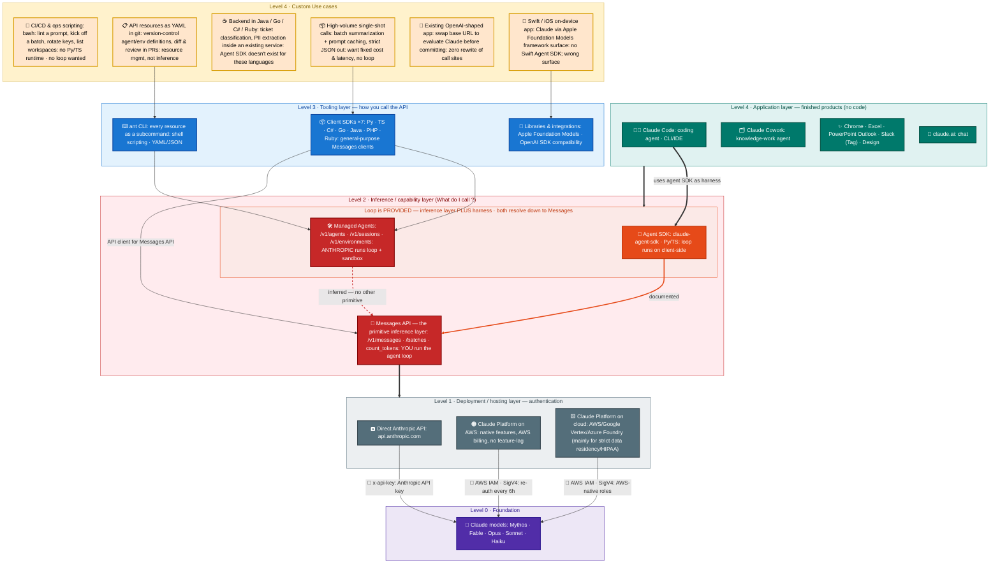
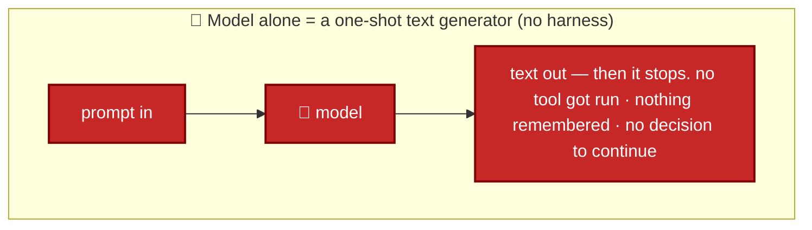
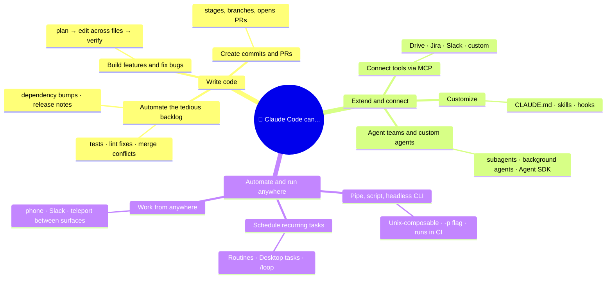
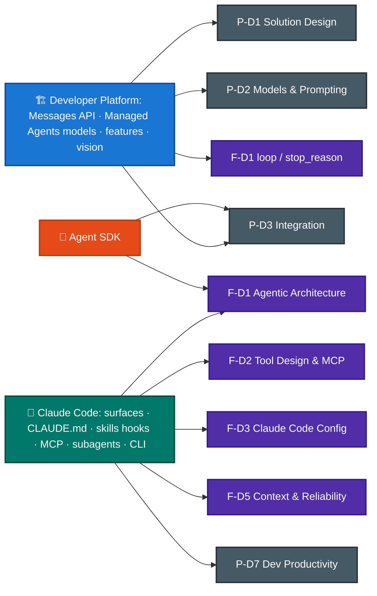

# From Models to Solutions: The Claude Stack


> **Why this file exists.** The domain chapters go deep on individual mechanics, but they assume you already know *where you are* — which product surface a feature belongs to. This primer draws that map once, so the rest of the repo makes sense. It distills two official pages:
> - **[platform.claude.com/docs/en/intro](https://platform.claude.com/docs/en/intro)** — the Claude **Developer Platform** (the API).
> - **[code.claude.com/docs/en/overview](https://code.claude.com/docs/en/overview)** — **Claude Code** (the agentic coding product).
>
> Read this *before* the domain files if you're new.
>  

**📖 Reading path:** [main README](README.md) → **you are here** → next: [F-D1 · Agentic Architecture](CCA-F/domains/d1-agentic-architecture.md). Full pacing lives in the [8-week study plan](README.md#24-suggested-study-sequence-gantt-with-dependencies-cca-p-target).

---

## 1. The map — where everything sits

**Everything rests on one foundation — the Claude models — but two distinct things sit on top: a *developer stack* you build with, and *finished products* you just use.** Read the diagram bottom-up.



**Reading the arrows.** *Solid* = documented "built on." The **orange** arrow is the Agent SDK's own call path to Messages — it only *passes* the Managed Agents box visually; it is **not** Managed Agents calling Messages. The **red dashed** arrow is *inferred, not published*: a Managed Agent must ultimately produce a model call, but Anthropic documents no `/v1/messages` dependency.

> **The one correction most mental models need:** *"the Claude API" ≠ "the Messages API."* The [API overview](https://platform.claude.com/docs/en/api/overview) defines the Claude API as a RESTful API at `api.anthropic.com` providing access to "Claude models **and Claude Managed Agents**." Messages and Managed Agents are **sibling endpoint families**, not two rungs of one ladder — which is exactly why the platform intro frames them as **two ways to build**, side by side ([Level 2 · Inference](#level-2--inference--what-you-call-and-who-runs-the-loop)).

### Level 0 · Foundation — the models

Every arrow above eventually resolves to one model call. **Mythos** shares **Fable**'s capabilities *without the safety classifiers* — limited release via Project Glasswing, so it is never the default answer. **Opus** = complex agentic coding and enterprise work · **Sonnet** = frontier intelligence at scale · **Haiku** = fastest, near-frontier. Choose on **capability vs cost**, never "biggest wins."

### Level 1 · Deployment — which doorway reaches the models

*Columns run left-to-right as in the diagram; the diagram's third box ("on cloud") expands into the last three.*

| | **Direct Anthropic API** | **Claude Platform on AWS** | **Amazon Bedrock** | **Google Cloud Agent Platform** | **Microsoft Foundry** |
|---|---|---|---|---|---|
| **Who operates the inference stack** | Anthropic | **Anthropic** — AWS supplies only auth + billing | **AWS** (partner-operated) | **Google** (partner-operated) | **Anthropic** (partner-operated by nobody; Azure hosts) |
| **Feature parity** ⭐ | Baseline — everything ships here **first** | **At parity**: Messages, Skills, code execution, *and beta features* | **Trails.** Features arrive on the partner's release schedule | **Trails.** Same caveat | Latest models; confirm per-feature on its page |
| **Auth** | `x-api-key` *or* Workload Identity Federation | AWS SigV4 or API key · IAM | AWS IAM / SigV4 | Google Cloud IAM | Azure credentials |
| **Billing** | Anthropic | AWS Marketplace | AWS | Google Cloud | Azure Marketplace, in Claude Consumption Units |
| **Managed Agents?** | ✅ | ✅ | ❌ | ❌ | ❌ |
| **Max request size** | 32 MB | 32 MB (same as direct) | 20 MB | 30 MB | not published |
| **Uniquely solves** | Everything, immediately, with no intermediary | The **full platform** inside an AWS account, against AWS commit | **Zero Anthropic operator access** — inference stays in your AWS security boundary | Claude beside the rest of a GCP stack | Anthropic-operated Claude in Azure; Global Standard **and US Data Zone** |
| **Choose it when** | Default for new builds | AWS commit or IAM is mandated **and** you refuse feature lag | The security boundary *is* the requirement | Already standardized on Google Cloud | Azure commit, or US data-residency binds |


### Level 2 · Inference — what you call, and who runs the loop

| | **Agent SDK** | **Managed Agents** | **Messages API** |
|---|---|---|---|
| **What it is** | Claude Code's harness packaged as a library | A pre-built agent harness Anthropic hosts | **The primitive.** One request → one response |
| **Key Difference: the loop** | You run the loop on your machine/server, using your filesystem, your network, your credentials | Anthropic runs the whole agent loop on their servers | **None.** You write the `stop_reason` loop yourself |
| **Bottoms out in** ⭐ | **Calls messages API `/v1/messages` internally** (documented) | Undocumented. A peer API surface, not a layer on Messages; Anthropic has never published what the harness calls.  | Nothing below it but the model |
| **Interface** | Python / TypeScript library | REST — `/v1/agents` · `/v1/sessions` · `/v1/environments` | REST — `/v1/messages` (+ `/batches`, `count_tokens`) + all 7 client SDKs from Level-3 |
| **Execution context** | **Client-side.** Loop *and* tools run in your process, at your process's privilege level — real filesystem, real network, your credentials already in scope | **Server-side.** Each session gets an Anthropic-managed sandbox (or a self-hosted one); built-in tools execute *there*, against that container's filesystem | **Nowhere.** A stateless HTTP endpoint executes nothing — it hands back a `tool_use` block and the decision is yours |
| **Custom tools** | Register a Python/TS **function**. On `tool_use` the SDK invokes it in-process, so it closes over your DB handles, clients and secrets and never crosses a network boundary | Built-ins (Bash, file ops, web search/fetch, MCP) run **inside the sandbox, no code from you**. Your *own* tools don't: Claude emits the call on the session's SSE stream, **your** service executes it and posts the result back as an event | Declare a **JSON Schema** in `tools`. The model returns a `tool_use` block; you dispatch it and append a `tool_result` block to the next request. Nothing is invoked for you |
| **Uniquely solves** | An AI agent that can can/must work with **your** stuff (your files, your internal services, your secrets) | An AI agent that can outlive your process (long-running, async, no infra you want to babysit): hosted sandbox, resumable sessions. | Total control of every turn: custom logging, conditional execution, etc. OR The work is single-shot or high-volume (Batches = 50% cheaper, async)|
| **Typical use case** | a coding assistant that refactors your local repo, OR internal DevOps bot that SSHs into your servers and restarts services from a Slack command. Needs your real infra/creds. | a "research this topic overnight" agent that runs for 3 hours, browsing the web, and you close your laptop OR nightly cron agent that crawls the web and writes a competitor report while you're offline. Long-running, no infra to babysit. | ticket triage: text in → JSON category out. One-shot, no loop needed OR sentiment tagging on incoming product reviews (positive/negative/neutral). Pure classification, no tools, no memory needed. |

**What "sandbox" means here ?** A Managed Agents *sandbox* is an isolated cloud container provisioned per session: its own filesystem, a shell, pre-installed packages, and network access. That is where the built-in Bash / file / web tools actually run, and Anthropic owns its whole lifecycle. You can mount additional resource to it, such as files, cloud-hosted repos, etc.
The other two columns have **no sandbox at all**, which is the trade rather than an oversight:

- **Agent SDK** executes tools at your process's privilege level, so it gives you is *permission gating*: rules about what the agent is allowed to try. Things like: "you can read files but not delete them," or a hook that says "ask me before running any git push (`allowed_tools` / `disallowed_tools`, permission modes, `PreToolUse` hooks that can block a call, etc).


### Level 3 · Tooling — how you call the API

| | **`ant` CLI** | **Client SDKs ×7** | **Libraries & integrations** |
|---|---|---|---|
| **What it is** | The Claude API as shell commands — **every API resource is a subcommand** | General-purpose **Messages API** clients | Compatibility layers exposing Claude through *another framework's* surface |
| **Install & auth** | `brew install anthropics/tap/ant`, then `ant auth login` — browser OAuth, **no API key to manage** | Each language's package manager; `ANTHROPIC_API_KEY` | The other framework's own install |
| **What a call looks like** | General format: `ant <resource>[:<subresource>] <action> [flags]`<br/>e.g. `ant messages create --model claude-opus-5 --max-tokens 1024 --message '{role: user, content: "Hello"}'` | `client.messages.create(...)` | `LanguageModelSession` (Swift); or your existing OpenAI call sites, unchanged |
| **Languages** | Any — it's a binary | Python · TypeScript · C# · Go · Java · PHP · Ruby | Swift; any OpenAI-SDK language |
| **Uniquely solves** | maintain every Claude resource (messages, files, sessions, agents, batches...) as shell subcommands | easily integrate Claude inside an existing service, (assuming that service is already written in one of the 7 supported languages) | easily integrate Claude with existing OpenAI-compatible endpoints or Apple's Foundation Models framework|
| **Choose it when** | Bash/CI and ops scripting; version-controlling agent & environment definitions | Anything programmatic — **the default build surface** | Swift/on-device, or evaluating Claude in an OpenAI-shaped app |

**What `ant` buys you over `curl`.** Same request, two ways:

```bash
# curl — hand-write the JSON body, set three headers, reach for jq
curl https://api.anthropic.com/v1/messages \
  -H "x-api-key: $ANTHROPIC_API_KEY" \
  -H "anthropic-version: 2023-06-01" \
  -H "content-type: application/json" \
  -d '{"model":"claude-opus-5","max_tokens":1024,
       "messages":[{"role":"user","content":"Summarize this"}]}' \
  | jq -r '.content[0].text'

# ant — typed flags, headers handled, field extraction built in
ant messages create \
  --model claude-opus-5 --max-tokens 1024 \
  --message '{role: user, content: "Summarize this"}' \
  --transform 'content.0.text'
```

**Claude Code already uses `ant` this way, out of the box.** Ask it something about your API resources in plain English, and it shells out to `ant`, parses the structured output, and reasons over the result — no custom integration code needed:

| You ask | Claude Code shells out to |
|---|---|
| "List my recent agent sessions and summarize which ones errored" | `ant sessions list` → filters results where `status: errored` |
| "Upload every PDF in `./reports` to the Files API and print the resulting IDs" | `ant files create --file <path>` per PDF → prints each returned `id` |
| "Pull the events for session `session_01...` and tell me where it got stuck" | `ant sessions:events list --session-id session_01...` → reasons over the returned events |

### Level 4 · Application — finished products, no code

**The one idea to hold onto:** *a solution is a **composition**, not a **component**.* "Claude for Financial Services" and "Customer support" aren't things you `import` — they're the same models, Platform/API, Claude Code, Cowork, MCP, and Skills, arranged for a use case. **The exam tests the blocks; the solutions pages just show you the arrangements.** Everything below is Level 4, cut **four** ways: **(a)** horizontal vs **(b)** vertical (does this cut across every domain, or is it built for one?), **(c)** where edge-case situations land, and **(d)** who built it — Anthropic or a third party. Nothing here is a new architectural layer: every box resolves down to the same models and the same Platform from Sec. 1.

#### (a) ↔ Horizontal — cross-cutting: same product, any domain

The core agents, the surfaces they extend into, the mechanisms that wire them up, and the solutions Anthropic packages **by job** (not by industry).

| Item | What it is | Uniquely solves / made of | Exam |
|---|---|---|---|
| 💬 **claude.ai** | Chat | Conversational drafting and analysis with zero setup — choose it when the output is *text you'll read*, not files or code | F-D3 |
| 👩‍💻 **Claude Code** | Coding agent (terminal · IDE · desktop · web) | A finished harness for codebase work — plan, edit across files, run commands, open PRs; choose it when the work is **software** and you want the agent now rather than to build one | F-D3 |
| 🗂️ **Claude Cowork** | Knowledge-work agent | The same agentic pattern aimed at **files, Slack, and Drive** deliverables; choose it when the deliverable is a doc/deck/spreadsheet, not a diff | F-D3 |
| 💬 **@Claude in Slack** | The core agent, tagged into a thread | Summaries, data queries, code review / draft PRs, digests, bug triage — same agent, reached without leaving Slack. Beta; Enterprise/Team | F-D3 |
| 🌐 **Claude for Chrome** | Surface extension | **Computer-use, productized** — Claude operates the browser itself (navigates, clicks, fills forms); per-site permission + supervision. Beta | P-D5 |
| 📊 **Claude for Microsoft 365** | Surface extension | Context held across Excel · PowerPoint · Word · Outlook; deployable via Foundry / Bedrock / Vertex — the engine behind the Financial-services solution below | P-D3 |
| 🧩 **Skills** | Cross-cutting mechanism | Your procedure packaged once → runs on claude.ai · Claude Code · API · every app in this table | F-D3 · P-D7 |
| 🔌 **MCP + connectors** | Cross-cutting mechanism | One wiring standard behind every app and solution in this table | F-D2 · P-D3 |
| 🤝 **AI agents** *(solution, by job)* | Packaged offering | Platform/API + Agent SDK + Claude Code | F-D1 · P-D1 |
| 🎧 **Customer support** *(solution, by job)* | Packaged offering | Messages API + Workbench + prompt caching | P-D1 · P-D3 |
| 👩‍💻 **Coding** *(solution, by job)* | Packaged offering | Claude Code + IDE integrations + Opus/Fable | F-D3 · P-D7 |
| ♻️ **Code modernization** *(solution, by job)* | Packaged offering | Claude Code (Enterprise) + CI/CD + version control | F-D3 · P-D1 |

#### (b) ↕ Vertical — domain-specific: one domain each

> ## TODO: before this, add somewhere: diff between claude skill vs connector vs plugin, key use cases, which to use when.

Cowork tuned to a single domain, plus the solutions Anthropic packages **by industry**. Adopt these only when a requirement matches the domain **exactly** — "buy, don't build."

| Item | What it is | Uniquely solves / made of | Exam |
|---|---|---|---|
| 🎨 **Design** | Specialized Cowork app | Cowork + a design system pulled from GitHub; `/design-sync` hands off to Claude Code | P-D7 |
| 🧬 **Science** | Specialized Cowork app | Desktop app + persistent Python/R kernels + MCP connectors + Skills, for reproducible research | F-D2 |
| 🛡️ **Security** | Specialized Cowork app | Reasoning-based code security; ships as a **Claude Code plugin**; a human approves every patch | P-D5 |
| 🎓 **Education** *(solution, by industry)* | Packaged offering | Cowork + Microsoft 365 + Science + Chrome — *concern: audience packaging for non-devs* | P-D6 · P-D7 |
| 🏦 **Financial services** *(solution, by industry)* | Packaged offering | Claude for Microsoft 365 + Cowork + Fable — *concern: integration + governance* | P-D3 · P-D5 |
| 🏛️ **Government** *(solution, by industry)* | Packaged offering | Claude Gov models + Bedrock / Vertex + Cowork — *concern: deployment + compliance* | P-D5 · P-D3 |
| 🧬 **Life sciences** *(solution, by industry)* | Packaged offering | Claude Science + MCP connectors + Skills — *concern: grounding + tool wiring* | F-D2 · P-D5 |

> **Exam tie-in (P-D1 / P-D5).** Two traps live here. **(1)** "Claude for \<industry\>" is **not** a distinct product or API — it's the same models + Platform + apps, **pre-composed**. **(2)** Design / Science / Security / Chrome are **not** separate products on their own models — they're Level-4 apps on the *same* models, and when a requirement matches one exactly, **adopting the app beats building it** on the Platform. Chrome's per-site permissions are the live governance angle → [P-D5](CCA-P/domains/d5-governance-safety-risk.md); Skills are [P-D7](CCA-P/domains/d7-dev-productivity-enablement.md). **Moving target:** names, beta status, plan tiers and bundled sub-products change often — hold the **shape**, not the logos.

#### (c) Custom use cases — where each one lands, and why

The yellow boxes exist because the *obvious* answer is wrong in each case.

| Your situation | Why the obvious answer fails | Lands on |
|---|---|---|
| **CI/CD & ops scripting** — lint a prompt, kick off a batch, rotate keys, list workspaces | No Python/TS runtime available, and no loop wanted | **`ant` CLI** |
| **API resources as YAML in git** — diff & review agent/environment definitions in PRs | It's resource management, not inference | **`ant` CLI** |
| **Backend in Java / Go / C# / Ruby** — ticket classification, PII extraction | **The Agent SDK doesn't exist** in those languages | **Client SDK** (+ Tool Runner) |
| **High-volume single-shot calls** — batch summarization, strict JSON out | An agent loop adds cost and latency you're trying to avoid | **Client SDK** → Messages `/batches` + prompt caching |
| **Existing OpenAI-shaped app** — evaluate Claude before committing | A client SDK means rewriting every call site | **OpenAI SDK compatibility** layer |
| **Swift / iOS on-device** | There is no Swift Agent SDK — wrong surface entirely | **Apple Foundation Models** library |

> **The docs cut this differently — and their cut is the one the exam tests.** [CLI, SDKs, and libraries](https://platform.claude.com/docs/en/cli-sdks-libraries/overview) closes: "The CLI, client SDKs, and libraries are for calling the Claude API yourself: you send each request and handle each response. **Claude Code, the Claude Agent SDK, and Claude Managed Agents work at a higher level, providing the agent loop, tool execution, and runtime.**" That groups **Claude Code (L4) with the Agent SDK (L2) and Managed Agents (L2)** — straight across the levels drawn above. Both cuts are valid: *levels* answer **"what kind of thing is it?"**, the docs' cut answers **"who runs the loop?"** ([Section 2](#2-what-a-harness-is--and-why-an-agent-needs-one)).

#### (d) 🧩 Ecosystem — how third parties extend and distribute Claude

Where **(a)–(c)** are Anthropic's own products, **(d) is how outside developers plug into and distribute on top of the same stack.** Anthropic groups these pages under **"Works with Claude"**: Connectors, Plugins, and the Marketplace, all under the **Ecosystem** umbrella. Keep **artifacts** and **channels** apart: third parties *author* **MCP servers and Skills**; Connectors, Plugins and the Marketplace are the *channels* those ship through. This is where **MCP stops being an abstract protocol and becomes a browsable catalog.**

| Thing | What it is | Built on | Where it lives / who it's for | Broader-scheme role |
|---|---|---|---|---|
| **Connectors** (`/connectors`) | A single integration that brings **one external app or data source into Claude** — Slack, Google Workspace, GitHub, Airtable, Sentry, 10x Genomics… (a directory of hundreds, in interactive / read-write / read-only tiers) | **Model Context Protocol** — "built & maintained by third-party developers using MCP" | Used by **Claude, Claude Code, and Skills** | **MCP, productized as a directory** → **[F-D2](CCA-F/domains/d2-tool-design-mcp.md)**, **[P-D3](CCA-P/domains/d3-integration.md)** |
| **Plugins** (`/plugins`) | A **one-click bundle of multiple MCPs + skills + tools** — install a whole workflow at once instead of wiring parts | MCP + Skills, packaged | Mostly **Claude Code** (some Cowork); e.g. Frontend Design, Superpowers, GitHub, Playwright | **Packaging & distribution of extensions** → **[F-D3](CCA-F/domains/d3-claude-code.md)** |
| **Skills** | **Packaged expertise** — a `SKILL.md` + folder. Open format, so third parties author them too (Figma, Superpowers) | Instructions (+ optional scripts) — **no MCP required** | claude.ai · Claude Code · API. Ships **standalone** (repo / `.claude/skills/`), **inside a Plugin**, or **served by an MCP server** | **The second authored artifact** → **[P-D7](CCA-P/domains/d7-dev-productivity-enablement.md)** |
| **Marketplace** (`/platform/marketplace`) | An **enterprise procurement channel**: spend an existing Anthropic commitment to buy partner-built, Claude-powered *solutions* (Harvey, Legora, Snowflake, GitLab, Hebbia, Rogo) | Partner products *on* Claude | **Enterprise buyers** + partners seeking distribution — *not* a developer build tool | **Commercial / procurement** → P-D6 stakeholder & commercial context |
| **Ecosystem** (`/ecosystem`) | The **umbrella** — "bring your apps and data into Claude" so it "meets you where you work" | — | The term that contains the three above | The orientation label for this whole facet |

**Don't confuse the six extension words** — this is prime distractor territory:

| Word | What *kind* of thing it is |
|---|---|
| **MCP** | The open **protocol** — the standard that makes tool/data integration possible |
| **Connector** | **One integration** to a specific external app, built *on* MCP (a directory entry) |
| **Skill** | **Packaged expertise/procedure** (instructions) that runs across claude.ai · Claude Code · API |
| **Plugin** | A **bundle** (MCPs + skills + tools) installed in one click — mostly for Claude Code |
| **Plugin marketplace** | A **git-hosted catalog** of plugins (`/plugin marketplace add <owner/repo>`) — free developer distribution, Claude Code |
| **Anthropic Marketplace** | A **procurement channel** to *buy* finished partner solutions — commercial, not technical |

> **Exam tie-in (F-D2 / P-D3):** Connectors, Plugins, and MCP are the same **tool-wiring** story the [F-D2](CCA-F/domains/d2-tool-design-mcp.md) chapter drills — the ecosystem pages are just the *productized shopfront* for it. Hold the layering straight: **MCP is the protocol → a Connector is one MCP integration → a Plugin bundles several (plus skills/tools) → the Marketplace sells finished solutions built on all of it.** The Marketplace is the odd one out: it's a *commercial* channel (procurement), not a build mechanism.

**The single sentence to memorize:** *Levels 1–3 are how **developers** reach the models — one doorway (L1), one loop-ownership choice (L2), one calling convention (L3) — and Level 4 is what's already built on top, for when you'd rather not build at all.*

One thing this map assumes without defining: what a **harness** actually is — the machinery that turns a one-shot model call into something that can act on a goal, keep going, and stop at the right moment. Section 2 unpacks it.

---

## 2. What a "harness" is — and why an agent needs one

### (a) Raw API — the one-shot limitation

**A raw API call is one-shot:** you send a prompt, the model predicts *one* response, and it stops. That's a text generator, not an agent.



### (b) The harness loop — what actually makes it an agent

A **harness** is all the scaffolding wrapped around the model that turns those one-shot predictions into an agent that can actually *do things* — keep going, use tools, remember, and stop at the right moment.

**What the harness *is*** — the repeatable machinery around the model: the **loop** (feed the model's tool calls back in, execute them, append the results, call the model again), plus **tool wiring, context-window management, memory/state, permission gating, and error recovery**. The model predicts the next step; the harness is what makes those steps *add up to a finished task*.

**Why it's needed — the problem it solves.** A single Messages API call is **stateless and single-shot**. On its own the model cannot execute a tool it "called," cannot remember the previous turn, cannot decide it's done, and cannot recover from a failed step. Something has to run the loop — check `stop_reason`, run the requested tool, put the result back into context, and go again until the work is complete. That "something" is the harness. Without it, every builder would re-implement the same plumbing from scratch, which is exactly why Anthropic ships pre-built ones.

### (c) The two inbuilt harnesses — Tool Runner & Agent SDK

**Agent SDK** is the other inbuilt harness besides Tool Runner — Claude Code's own engine, packaged as a library (`claude-agent-sdk` / `@anthropic-ai/claude-agent-sdk`) so you can run a full agent loop client-side instead of hand-rolling one. Tool Runner is its lighter sibling: same package you already use for Messages API, far less baggage.

**Tool Runner (SDK)**
> The map-stack diagram above omits the [Tool Runner](https://platform.claude.com/docs/en/agents-and-tools/tool-use/tool-runner). It is a helper inside the **client SDKs of Level 3** (in Beta currently).
>
> **Why it's needed:** if you use the plain Messages API with your own tools (no Agent SDK), you'd otherwise have to hand-write the same repetitive loop every time — call the API, check `stop_reason == "tool_use"`, run your function, append `tool_result`, call again, repeat until done. Tool Runner just automates that boilerplate. Nothing more.
>
> **How it differs from the Agent SDK's loop:**
>
> | | Tool Runner | Agent SDK |
> |---|---|---|
> | Package | Same one you already use for Messages API (`anthropic` / `@anthropic-ai/sdk`) | Separate package (`claude-agent-sdk`) |
> | Built-in tools | **None** — 100% your own functions | Read / Write / Edit / Bash / Grep / WebSearch, etc. out of the box |
> | Extras | Just the loop + message history | Hooks, permission modes, subagents, MCP, context compaction |
> | Mental model | "Stop making me write `while stop_reason == tool_use`" | "Give me a whole Claude Code–style agent" |
>
> **In short:** Tool Runner is a thin convenience on top of the API you're already calling — for when you just have a handful of custom business-logic tools (e.g. `book_flight`, `check_inventory`) and don't want Claude Code's baggage. It has tools of its own. No file access, no Bash, no sandbox. Agent SDK is a much bigger, separate product — reach for it when you actually want a general-purpose filesystem/coding agent, not just "please run my loop for me."
> **Two footnotes worth remembering.**
>
> 1. Tool Runner's hooks are **post-execution only** — once Claude requests a tool, it runs instantly and the runner lets you inspect the result/error before it's sent back.
 However, there's no callback that fires *before* a tool executes. So if you need some handle prior to tool execution, such as **human-in-the-loop approval**, **custom logging** (no visibility into the raw request/response cycle), or **conditional execution** (no way to block/redirect a call before it runs), you must switch to the manual loop (or to Agent SDK).
>
> 2. The runner does **not** auto-resume when `stop_reason` is `"pause_turn"`. For context, `pause_turn` happens when a long-running server-side tool (like web search) returns a partial result early on, instead of holding one giant HTTP request open and blocking until the entire multi-step operation finishes — Claude expects you to send that exact same content back unchanged as the next request, so it can pick up where it left off.
>
> Other `stop_reason` values: `end_turn` (fully done), `tool_use` (needs you to run a tool), `max_tokens` (hit the length cap).

### (d) Who provides the harness

| What you want | Who builds/runs the harness | That's… |
|---|---|---|
| Maximum control over every step | **You do** — hand-write the loop | Messages API (manual loop) |
| The loop automated, but *you* still run each tool | **The client SDK writes the loop; your own functions are the tools, and they run in your process** | **Tool Runner** (client-SDK helper, beta) |
| Hosted, hands-off, long-running | **Anthropic** | Managed Agents |
| A coding agent, ready to go | **Anthropic** | Claude Code |
| A knowledge-work agent, ready to go | **Anthropic** | Claude Cowork |
| Your own custom agent on Claude Code's engine | **Anthropic's harness, your config** | Agent SDK |

> **The API side has three rungs of loop-ownership, not two.** The platform intro frames it as "two ways to build" (Messages API vs Managed Agents). Between them sits the **[Tool Runner](https://platform.claude.com/docs/en/agents-and-tools/tool-use/tool-runner)** — a **partial** harness: the SDK owns the loop, you still own the tools. ([F-D1 Sec. 1.1](CCA-F/domains/d1-agentic-architecture.md) drills the manual loop; the [Level 2 · Inference](#level-2--inference--what-you-call-and-who-runs-the-loop) table above covers the two ends the platform intro names.)


> **Exam tie-in (F-D1):** this is *why* [F-D1 Sec. 1.1](CCA-F/domains/d1-agentic-architecture.md) drills the `stop_reason` loop — that loop **is** the minimal harness. When a question says "the agent ran one tool then stopped and never finished," the missing piece is harness logic (feeding the tool result back and looping), not a model limitation. The Tool Runner is that harness logic, packaged.

---

## 3. An overview of Claude Code

Everything below is on **[code.claude.com/docs/en/overview](https://code.claude.com/docs/en/overview)**.

### 3.1 What it is

> "Claude Code is an agentic coding tool that reads your codebase, edits files, runs commands, and integrates with your development tools. Available in your terminal, IDE, desktop app, and browser."

The key word is **agentic**: it's not autocomplete. It understands the *whole* codebase, plans, and works across multiple files and tools to finish a task — build features, fix bugs, automate dev work.

### 3.2 What you can do — the nine capabilities

The overview lists these in an accordion. Grouped so they stick:



### 3.3 Use Claude Code everywhere

Beyond the install surfaces, the same engine reaches into CI, chat, and browser workflows. The exam-relevant ones map straight onto **F-D3**:

| I want to… | Surface |
|---|---|
| Automate PR reviews / issue triage | [GitHub Actions](https://code.claude.com/docs/en/github-actions) · [GitLab CI/CD](https://code.claude.com/docs/en/gitlab-ci-cd) |
| Auto code-review every PR | GitHub Code Review |
| Route Slack bug reports → PRs | Slack integration |
| Continue a session on another device | Remote Control · `claude --teleport` |
| Recurring schedule | Routines (managed) · Desktop scheduled tasks · `/loop` (in-session) |
| Build custom agents | [Agent SDK](https://code.claude.com/docs/en/agent-sdk/overview) |

> **The recurring-task trio is a classic distractor set:** 
> - **Routines** run on Anthropic infra (survive your machine being off, can trigger on API/GitHub events); 
> - **Desktop scheduled tasks** run locally with local file access; 
> - **`/loop`** just repeats a prompt *within* one CLI session for quick polling. Don't swap them.

---

## 4. How this maps onto the two exams

The two products split cleanly across the two certs — which is exactly why this repo has a `CCA-F` and a `CCA-P` tree.



- **The Platform side is your exam.** The Messages-API-vs-Managed-Agents choice, model selection by capability/cost, and features (vision, structured outputs, extended thinking) live in **[P-D1](CCA-P/domains/d1-solution-design.md)**, **[P-D2](CCA-P/domains/d2-models-prompting-context.md)**, and **[P-D3](CCA-P/domains/d3-integration.md)**.
- **The Claude Code side is mostly your on-ramp**, but it resurfaces in **[P-D7](CCA-P/domains/d7-dev-productivity-enablement.md)** (developer productivity & enablement) — so the overview page's "what you can do" list is worth a read even for CCA-P.

---

## 5. Exam traps checklist

| Trap | Correct instinct |
|---|---|
| "Claude Code is Anthropic's API" | No — Claude Code is a *product*; the **Developer Platform** is the API |
| "Use Managed Agents when you need fine-grained loop control" | Reversed — **Messages API** = fine-grained control; Managed Agents = hand it off |
| "Managed Agents are for quick synchronous calls" | They're for **long-running / async** work |
| "Managed Agents is built **on top of** the Messages API" | **Siblings, not a stack** — both are endpoint families of the same Claude API (`/v1/sessions` vs `/v1/messages`). Neither wraps the other ([Level 2 · Inference](#level-2--inference--what-you-call-and-who-runs-the-loop)) |
| "The Claude API *is* the Messages API" | The Claude API is the **umbrella** at `api.anthropic.com` — Messages, Batches, Token Counting, Models, Files, Skills, **and** Managed Agents (Agents/Sessions/Environments) |
| "`ant` and `claude` are the same CLI" | **`ant`** = the Claude API CLI (one request at a time) · **`claude`** = the Claude Code CLI (a full agent) ([Level 3 · Tooling](#level-3--tooling--how-you-call-the-api)) |
| "The OpenAI-compatibility layer is a good way to build a new Claude app" | It's a **migration convenience** — the docs say these libraries are *"not general-purpose Messages API clients."* Use a **client SDK** |
| "Bedrock / Vertex / Foundry calls go through `api.anthropic.com`" | They're **separate doorways** to the same models, with the cloud's own billing/IAM and **varying feature availability** |
| "Managed Agents is fine for our ZDR / HIPAA workload" | It's **stateful by design** (server-side event log + sandbox state), so it's **not eligible** for Zero Data Retention or a HIPAA BAA — a live [P-D5](CCA-P/domains/d5-governance-safety-risk.md) constraint |
| "Each Claude Code surface has its own config" | One **shared engine** — CLAUDE.md, settings, MCP work across all surfaces |
| "Routines, Desktop tasks, and `/loop` are interchangeable" | Managed-infra vs local vs in-session — distinct scopes |
| "Agent SDK is separate from Claude Code" | It builds custom agents **on Claude Code's harness** (the bridge) |
| "Always pick the biggest model" | Platform framing is **capability vs cost** |
| "claude.ai is a build surface" | It's the **chat app**; you build via the Platform or Claude Code |
| "JetBrains extension is standalone" | It **requires the CLI** installed separately |
| "Homebrew Claude Code auto-updates" | Only **native** installs auto-update; brew/winget are manual |
| "Claude for Financial Services / Government is a separate product or API" | It's a **solution** — the same models + Platform + products, *pre-composed* for an industry ([Level 4(b)](#b--vertical--domain-specific-one-domain-each)) |
| "The claude.com/solutions pages introduce new architecture" | They're **packaging** (Level 4), not new layers — every solution composes Levels 0–3 |
| "Design / Science / Security / Chrome are separate products on their own models" | They're the **first-party app family** — Level-4 apps on the *same* models ([Level 4](#level-4--application--finished-products-no-code)) |
| "A Skill written for Claude Code is Claude-Code-only" | The *same* Skill runs across **claude.ai, Claude Code, and the API** — write once, run everywhere |
| "Just pick Mythos — it's the most capable model" | Mythos is **access-gated, premium-priced, and domain-specialized** (cyber/bio); default to Fable/Opus/Sonnet/Haiku on **capability vs cost** |
| "Connectors, Plugins, and MCP are the same thing" | **MCP** = the protocol · **Connector** = one integration built on it · **Plugin** = a bundle of several (+ skills/tools) |
| "The Marketplace is where developers get tools/plugins" | Two different things share the word: the **Anthropic Marketplace** is enterprise *procurement* of partner solutions; a **plugin marketplace** is a git-hosted catalog developers really do install plugins from |
| "Only Anthropic writes MCP servers and Skills" | Both are **open formats** — third parties author them, then ship via Connectors, Plugins, or their own repos |

---

## 6. Glossary of key terms:

| Term | One line |
|---|---|
| **Mythos** | The **most capable** tier — state-of-the-art at cybersecurity, biology, and healthcare. Shares an underlying model with **Fable** but with *fewer safeguards*, so it's **access-gated** (trusted-access programs only) and premium-priced (~$10 / $50 per M input / output tokens). Fable is the safeguarded, generally-available sibling — the one you'll actually build on. |
| **Claude API** | The RESTful **umbrella** at `api.anthropic.com` — programmatic access to the models **and** to Managed Agents. Contains Messages, Message Batches, Token Counting, Models (GA) plus Files, Skills, Agents, Sessions, Environments (beta). **Not** a synonym for the Messages API. |
| **Harness** | The scaffolding around the model (loop, tools, context, memory, permissions, error recovery) that turns one-shot predictions into a working agent. |
| **Developer Platform** | platform.claude.com — the Claude API plus the tooling around it (Console, CLI, SDKs, docs). An *umbrella name*, not a layer sitting above the API. |
| **Messages API** | Direct model access (`POST /v1/messages`); you own the agent loop and `stop_reason` handling. One endpoint family of the Claude API. |
| **Managed Agents** | Anthropic-hosted agent harness for long-running/async work (`/v1/agents` · `/v1/sessions` · `/v1/environments`, beta). A **sibling** of the Messages API, not a layer on it. Stateful by design → **not ZDR/HIPAA-eligible**. |
| **`ant` CLI** | The **Claude API** command-line tool — shell scripting, typed flags, response transforms. Not to be confused with `claude`, the Claude Code CLI. |
| **Client SDKs** | General-purpose Messages API clients in **seven** languages: Python, TypeScript, C#, Go, Java, PHP, Ruby. |
| **Tool Runner** | Beta SDK helper (`client.beta.messages.tool_runner` / `toolRunner()`) that runs the `stop_reason` loop and executes your tools **in your process** — the middle rung between the manual loop and Managed Agents (Section 2). |
| **Libraries & integrations** | Compatibility layers exposing Claude through *another* framework's surface (Apple Foundation Models, OpenAI SDK compat) — explicitly **not** Messages API clients. |
| **Cloud platforms** | Alternative doorways to the same models that bypass `api.anthropic.com`: **Amazon Bedrock**, **Google Agent Platform**, **Claude Platform on AWS**, **Microsoft Foundry**. Feature availability varies. |
| **Claude Code** | code.claude.com — a ready-made agentic **coding** product on many surfaces. |
| **Claude Cowork** | A ready-made **knowledge-work** agent (Claude desktop/web/mobile) that acts across files and apps like Slack/Drive — Claude Code's non-coding sibling. |
| **Surface** | A place Claude Code runs: terminal, VS Code, JetBrains, desktop, web. |
| **Agent SDK** | Build custom agents powered by Claude Code's tools/harness — the bridge. |
| **CLAUDE.md** | Project memory file Claude Code reads at every session start. |
| **MCP** | Model Context Protocol — open standard to connect Claude to external tools/data. |
| **Console / Workbench** | Browser tool to prototype and test prompts. |
| **claude.ai** | The consumer chat app (not a developer build surface). |
| **@Claude** (Claude in Slack) | The Claude agent **tagged into a Slack thread** — summaries, data queries, code review / draft PRs, digests, bug triage. Beta; Enterprise/Team (Level 4(a)). |
| **Claude Apps** | First-party, **domain-specialized** agents: **Design** (drafts + code handoff), **Science** (reproducible research), **Security** (reasoning-based code security). "Buy, don't build" (Level 4(b)). |
| **Claude for Chrome** | Browser-operating agent — navigates / clicks / fills forms; **computer-use productized**; needs per-site permission. Beta (Level 4(a)). |
| **Claude for Microsoft 365** | Claude inside **Excel / PowerPoint / Word / Outlook**; the engine behind the Financial-services solution (Level 4(a)). |
| **Skills** | Packaged, reusable capabilities Claude applies automatically — the *same* Skill runs across claude.ai, Claude Code, and the API. See [F-D3](CCA-F/domains/d3-claude-code.md). |
| **Solution** | A [claude.com/solutions](https://claude.com/solutions) offering — a *packaging* of the existing stack for a **job** (AI agents, Coding, Code modernization, Customer support) or **industry** (Education, Financial services, Government, Life sciences). Not a new product or API — a recipe over Levels 0–3 (Level 4). |
| **Connector** | One MCP-based integration bringing a *single* external app/data source into Claude (Slack, Drive, GitHub…); a browsable directory of them (Level 4(d)). |
| **Plugin** | A one-click **bundle** of multiple MCPs + skills + tools — mostly for Claude Code (Level 4(d)). |
| **Plugin marketplace** | A git-hosted catalog developers add to Claude Code to install plugins — free distribution, *not* the Anthropic Marketplace (Level 4(d)). |
| **Marketplace** | Enterprise **procurement** channel to buy partner-built, Claude-powered solutions against an Anthropic commitment — commercial, not a build tool (Level 4(d)). |
| **Ecosystem** | Umbrella for "Works with Claude" — Connectors + Plugins + Marketplace (Level 4(d)). Third parties *author* MCP servers and Skills; these are the *channels*. |

---

## 7. Field notes from the Anthropic blog (TODO: merge with relevant content.)

Most of **[claude.com/blog](https://claude.com/blog)** is customer case studies — reinforcing, not testable. But a handful of posts encode **reusable frameworks** that map straight onto exam domains. These are worth reading for the *ideas*, not the logos. (Snapshot of mid-July 2026; the blog churns.)

**Three worth reading closely:**

> **① [A CISO's guide to agentic AI](https://claude.com/blog/ciso-guide-to-agentic-ai)** → **[P-D5 Governance/Safety/Risk](CCA-P/domains/d5-governance-safety-risk.md)**. The single best governance mnemonic here — a **four-question risk assessment** for any agent:
> 1. What **untrusted content** does it ingest? (attack surface)
> 2. What **actions** can it take, and **on whose behalf**? (capability + identity)
> 3. What's the **blast radius** if it's misaligned? (impact)
> 4. What **observability** exists? (detection)
>
> Plus: the **Principle of Least Agency** (grant the narrowest capability that does the job), **control layering** (IdP identity → connector allowlists → per-tool approval → sandboxing → egress allowlists → SIEM telemetry → org-wide off-switch), "**design for where models will be in 6 months**," and the framing that a **misaligned agent is operationally indistinguishable from an insider threat** (so containment speed matters).

> **② [Building verification loops in Claude Code with skills](https://claude.com/blog/building-verification-loops-in-claude-code-with-skills)** → **[F-D2](CCA-F/domains/d2-tool-design-mcp.md)** / **[F-D3](CCA-F/domains/d3-claude-code.md)** / **[P-D4 Evaluation & Testing](CCA-P/domains/d4-evaluation-testing-optimization.md)**. The reliability loop: **gather context → act → verify → iterate.** Prefer **deterministic signals** (type checkers, linters, tests) *before* manual review; **proceduralize** any check you keep enforcing by hand into a reusable **skill** (embedded / chained / standalone); "**the more you encode for Claude to follow, the closer the first try lands.**"

> **③ [How Anthropic runs large-scale code migrations with Claude Code](https://claude.com/blog/ai-code-migration)** → **[P-D1 Solution Design](CCA-P/domains/d1-solution-design.md)** / **[P-D7](CCA-P/domains/d7-dev-productivity-enablement.md)** and the Code-modernization solution ([Level 4(a)](#a--horizontal--cross-cutting-same-product-any-domain)). Workflow: **rulebook → stress-test rules → translate → compile → smoke-test → verify.** Key principles: **fix the loop that produced the code, not the file**; split into **independent units for parallel agents**; make work **resumable** (done = output on disk); use **compilers/tests/diffs as objective referees**; **staged model selection** (smaller models for high-volume implementation, larger for review + rule-writing).

**Skim if you have time** (case studies that illustrate a domain):

| Post | Illustrates → domain |
|---|---|
| [How Cognition trusts Fable 5 to work through the night](https://claude.com/blog/working-at-the-frontier-how-cognition-trusts-claude-fable-5-to-work-through-the-night) | Long-horizon autonomy & context management → F-D1 / F-D5 |
| [How Thomson Reuters builds AI for high-stakes professional work](https://claude.com/blog/working-at-the-frontier-how-thomson-reuters-builds-ai-for-high--stakes-professional-work) | Agents in regulated industries → P-D1 / P-D5 |
| [How Hebbia builds AI for financial diligence that can't miss a detail](https://claude.com/blog/working-at-the-frontier-how-hebbia-builds-ai-for-financial-diligence-that-cant-miss-a-detail) | Precision-critical agents & eval → P-D4 |
| [How Cursor knew Fable 5 was ready for the hardest 1%](https://claude.com/blog/working-at-the-frontier-cursor) | Model evaluation & selection → P-D2 / P-D4 |
| [Bringing Claude Code and Cowork to government](https://claude.com/blog/bringing-claude-code-and-claude-cowork-to-government) | Deployment & compliance → P-D5 / P-D3 |

> **How to use this for study:** treat these as *worked examples* of the domain concepts, not new material. The CISO four-question model (①) is the most exam-portable — it's a clean checklist for any P-D5 "is this agent safe to ship?" question.

---

**▶ Read next: [F-D1 · Agentic Architecture & Orchestration](CCA-F/domains/d1-agentic-architecture.md)** — where the `stop_reason` loop (the minimal harness from [Section 2](#2-what-a-harness-is--and-why-an-agent-needs-one)) becomes the exam's single biggest domain.

